#  動的および静的インクルージョンルールの使用{#use-dynamic-and-static-inclusion-rules}

条件とプロモーションのインクルージョンルールを作成する方法と、動的フィルタールールまたは静的フィルタールールを追加して成果を高める方法について説明します。

条件とプロモーションでは、インクルージョンルールを作成、使用する方法は類似しています。使用例やサンプルも同様です。このトピックでは、条件およびプロモーションと、インクルージョンルールの使い方について説明します。

## フィルタールールを条件に追加する {#section_CD0D74B8D3BE4A75A78C36CF24A8C57F}

[条件の作成](../../c-recommendations/c-algorithms/create-new-algorithm.md#task_8A9CB465F28D44899F69F38AD27352FE)時に、**[!UICONTROL インクルージョンルール]**&#x200B;の「**[!UICONTROL フィルタールールを追加]**」をクリックします。 

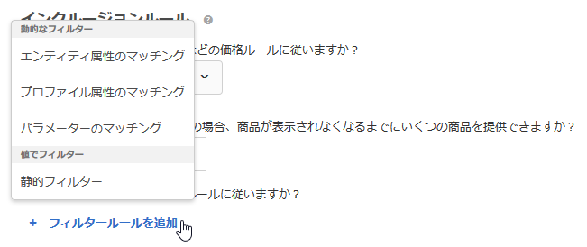

利用できるオプションは、選択した業種とレコメンデーションキーによって変わります。

## フィルタールールをプロモーションに追加する {#section_D59AFB62E2EE423086281CF5D18B1076}

[プロモーションの作成](../../c-recommendations/t-create-recs-activity/adding-promotions.md#task_CC5BD28C364742218C1ACAF0D45E0E14)時に、「**[!UICONTROL 属性別にプロモート]**」、「**[!UICONTROL フィルタールールを追加]**」の順にクリックします。

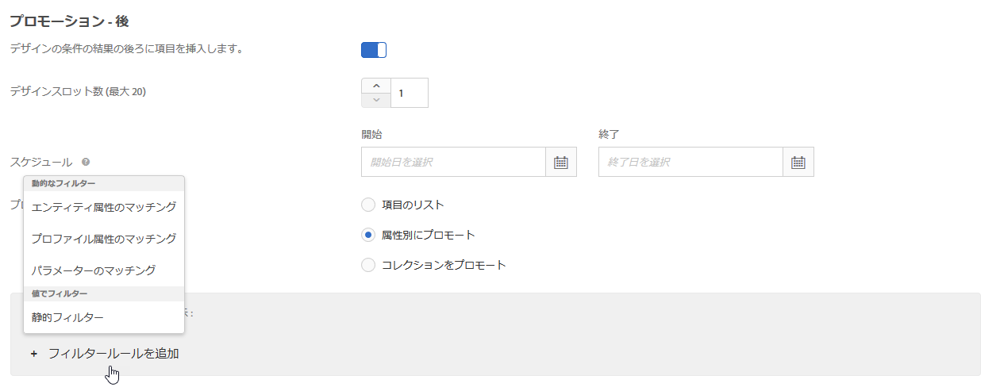

## フィルターのタイプ {#section_0125F1ED10A84C0EB45325122460EBCD}

次の表には、条件とプロモーションで利用できるフィルターオプションのタイプがまとめられています。

| タイプ | オプション | 利用できる演算子 |
|--- |--- |--- |
| **動的フィルター** | **エンティティ属性のマッチング：**&#x200B;レコメンデーション品目の候補のプールと、ユーザーが閲覧した特定の品目を比較することで、動的にフィルタリングします。<br>例えば、現在の品目のブランドと一致する品目のみをレコメンデーションできます。 | 次と等しい<br>次と等しくない<br>次の間である<br>次を含む<br>次を含まない<br>次の語句で始まる<br>次の語句で終わる<br>値が存在する<br>値が存在しない<br>次よりも大きいか等しい<br>次よりも小さいか等しい |
|  | **プロファイル属性のマッチング：**&#x200B;品目（エンティティ）とユーザーのプロファイルの値を比較することで、動的にフィルタリングします。<br>例えば、訪問者が好きなブランドと一致する品目のみをレコメンデーションできます。 | 次と等しい<br>次と等しくない<br>次を含む<br>次を含まない<br>次の語句で始まる<br>次の語句で終わる<br>次よりも大きいか等しい <br>次よりも小さいか等しい<br>次の間である |
|  | **パラメーターのマッチング：**&#x200B;品目（エンティティ）とリクエスト（API または mbox）の値を比較することで、動的にフィルタリングします。<br>例えば、「業種」ページパラメーターに一致するコンテンツのみをレコメンデーションできます。<br>**重要：** 2016 年 11 月 1 日以前に作成されたアクティビティの場合、「パラメーターのマッチング」フィルターを使用すると配信に失敗します。この問題を回避する方法は次のとおりです。<ul><li>新しいアクティビティを作成し、条件を追加します。</li><li>「パラメーターのマッチング」フィルターを含まない条件を使用します。</li><li>条件から「パラメーターのマッチング」フィルターを削除します。</li></ul> | 次と等しい<br>次と等しくない<br>次を含む<br>次を含まない<br>次の語句で始まる<br>次の語句で終わる<br>次よりも大きいか等しい<br>次よりも小さいか等しい<br>次の間である |
| **値でフィルター** | **静的フィルター：**&#x200B;フィルターに使用する静的な値を入力します（複数可）。<br>例えば、MPAA レーティングが「G」または「PG」のコンテンツのみをレコメンデーションできます。 | 次と等しい<br>次と等しくない<br>次を含む<br>次を含まない<br>次の語句で始まる<br>次の語句で終わる<br>値が存在する<br>値が存在しない<br>次よりも大きいか等しい<br>次よりも小さいか等しい |

>[!NOTE]
>
>Target 17.6.1 リリース（2017 年 6 月）以前におけるインクルージョンルールの設定方法に慣れている場合は、一部のオプションや演算子が変わっていることに気付くかもしれません。選択したオプションに適用できる演算子のみが表示されるようになり、いくつかの演算子は、よりわかりやすく一貫性のある名前に変更されています（「一致」が「次に等しい」になるなど）。このリリース以前に作成された既存の除外ルールは、新しい方式に自動的に移行されているので、手動で再設定をおこなう必要はありません。

インクルージョンルールは必要に応じて無制限に作成できます。インクルージョンルールは AND 演算子で結合します。品目がレコメンデーションに含まれるためには、すべてのルールを満たす必要があります。

動的条件と動的プロモーションは、静的条件と静的プロモーションよりもかなり効果的で、成果やエンゲージメントを高めることができます。マーケティング活動で動的プロモーションを使用する際に、参考になる例を次に示します。

**次に等しい：**&#x200B;動的プロモーションで「次に等しい」演算子を使用すると、訪問者が Web サイトで品目（商品、記事、映画など）を閲覧しているときに、以下のような条件に該当する他の品目をプロモーションできます。

* 同じブランド
* 同じカテゴリ
* 同じカテゴリの自社ブランド
* 同じ店舗

**等しくない：**&#x200B;動的プロモーションで「等しくない」演算子を使用すると、訪問者が Web サイトで品目（商品、記事、映画など）を閲覧しているときに、以下のような条件に該当する他の品目をプロモーションできます。

* 別の TV シリーズ
* 別のジャンル
* 別の商品シリーズ
* 別のスタイル ID

**範囲内：**&#x200B;動的プロモーションで「範囲内」演算子を使用すると、訪問者が Web サイトで品目（商品、記事、映画など）を閲覧しているときに、以下のような条件に該当する他の品目をプロモーションできます。

* より高価格
* より低価格
* 価格がプラスマイナス 30％
* 同じシーズンの後続のエピソード
* シリーズの前巻

## エンティティ属性のマッチング、プロファイル属性のマッチング、パラメーターのマッチングでフィルタリングする際に空の値を処理する {#section_7D30E04116DB47BEA6FF840A3424A4C8}

終了条件またはプロモーションでエンティティ属性のマッチング、プロファイル属性のマッチング、パラメーターのマッチングによってフィルタリングしたときに、値が空だった場合は、複数の方法で処理することができます。

以前は、値が空の場合は何も結果が返されませんでした。次の図のように、「*x* が空の場合」ドロップダウンリストを使用することで、条件に空の値があった場合に実行する処理を選択できます。

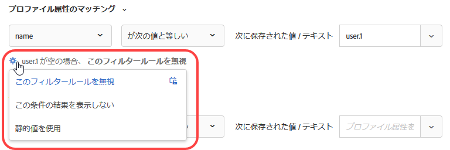

処理を選択するには、歯車アイコン（）にカーソルを合わせてから、目的の処理を選択します。

| アクション | 利用できるマッチング | 詳細 |
|--- |--- |--- |
| このフィルタールールを無視 | プロファイル属性のマッチング<br>パラメーターのマッチング | プロファイル属性のマッチングとパラメーターのマッチングのデフォルトの処理です。<br>このオプションではルールを無視するよう指定します。例えば、3 つのフィルタールールがあり、3 つ目のルールでは何も値が返されなかった場合は、何も結果を返さないのではなく、値が空だった 3 つ目のルールのみを無視できます。 |
| この条件の結果を表示しない | エンティティ属性のマッチング<br>プロファイル属性のマッチング<br>パラメーターのマッチング | エンティティ属性のマッチングのデフォルトの処理です。<br>Target にこのオプションが追加される前の処理方法です。この条件の結果を表示しません。 |
| 静的値を使用 | エンティティ属性のマッチング<br>プロファイル属性のマッチング<br>パラメーターのマッチング | 値が空だった場合に静的値を使用するよう設定できます。 |

空の値の処理方法の例については、以下の[使用例 9](../../c-recommendations/c-algorithms/use-dynamic-and-static-inclusion-rules.md#section_9873E2F22E094E479569D05AD5BB1D40) を参照してください。

## 動的フィルターの使用例 {#section_9873E2F22E094E479569D05AD5BB1D40}

**使用例 1：**&#x200B;動的フィルターを使用すると、静的値を使用してカタログ内の品目をカタログ内の別の品目に一致させる代わりに、カタログ内の品目を訪問者のプロファイルの属性に一致させることができます。

例えば、「[!UICONTROL プロファイル属性のマッチング]」オプションを使用して、ブランドが `profile.favoritebrand` に保存されている値やテキストと等しい品目のみをレコメンデーションするルールを作成できます。このようなルールでは、ある訪問者が特定のブランドのランニングショーツを閲覧している場合は、その訪問者のお気に入りのブランド（その訪問者のプロファイルの `profile.favoritebrand` に保存されている値）と一致する品目のみがレコメンデーションされます。

**使用例 2：**&#x200B;求人情報を探している訪問者のうち、特定の地域にいて、特定の学位を取得している人のみに求人情報を表示するよう設定したいとします。訪問者のプロファイルの属性情報を使用できる機能が Target に追加される前は、このような場合には、多数のオーディエンス（1 つの都市と 1 つの学位ごとにオーディエンス）を作成して多数のアクティビティを設定する必要がありました。多数の都市の求人情報がある場合、このタスクには非常に手間がかかります。

しかし、次の例のように、求人情報を探している訪問者の所在地と学位をプロファイルから取得し、求人情報に一致させるインクルージョンルールを使用できるようになりました。

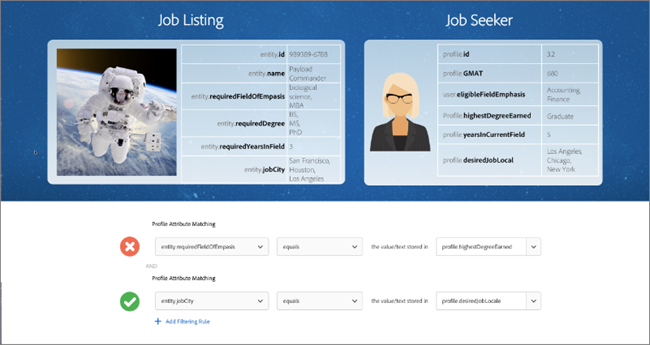

左側の求人情報は、所在地がサンフランシスコ、ニューヨークまたはロサンゼルス（`entity.jobCity`）で、BSCS または MBA を取得（`entity.requiredDegree`）している訪問者にしか表示されません。

求人情報を探している右側のこの訪問者は、所在地がロサンゼルス（`profile.usersCity`）で、MBA を取得（`profile.degree`）しています。

プロファイル属性のマッチングによる動的フィルターを使用することで、上の画像の下部に表示されているフィルターを作成できます。このフィルターでは、この訪問者の所在地と学位に応じた求人情報のみがレコメンデーションされます。

このフィルターの条件は次のようになります。

```
entity.jobCity - equals - the value/text stored in - profile.usersCity
```

および

```
entity.requiredDegree - equals - the value/text stored in - profile.degree
```

プロファイル属性のマッチングによる動的フィルターを使用すれば、次のように、多数のアクティビティを設定しなくても様々なフィルタリングが可能です。


上の図の一番上のダイアグラムは、プロファイル属性による動的フィルターの仕組みを表したものです。条件（前述の例では所在地と学位）を使用して 1 つのオーディエンスを作成し、訪問者の条件に合った求人情報を表示できます。このフィルターなら、対応できる所在地と学位の数はほぼ無限です。

上の図の下の 2 つのダイアグラムは、プロファイル属性による動的フィルターを使用して条件またはプロモーションを設定しなかった場合に、作成する必要があるオーディエンスの例を示しています。この 2 つ以外にも、多数のオーディエンスを作成しなければなりません。都市と学位ごとに 1 つずつオーディエンスを作成する必要があります。特に様々な都市の求人情報を大量に扱っている場合は、すぐに、必要なオーディエンスの数が管理しきれないほど増えてしまいます。

プロファイル属性を使用しない場合は、オーディエンスとエクスペリエンスは次の図の上半分のようになります。想定されるシナリオごとにオーディエンスとエクスペリエンスのペアを追加することになります。


一方、プロファイル属性による動的フィルターを使用してエンティティ属性とユーザー属性を一致させる方法では、上の図の下半分のように、1 つのオーディエンスを作成するだけで臨機応変に適切なエクスペリエンスを配信することができます。

求人情報の中に必要な情報を含め、その必要な情報をユーザーのプロファイルから取得するように設定すれば、オーディエンスとエクスペリエンスの作成、管理を大幅に簡略化できます。

**使用例 3：**&#x200B;スポーツ関連の Web サイトで、ユーザーが好きなチームに関する記事を表示したいとします。各記事に `entity.featuredTeams` フィールドを設定し、このフィールドに記事で取り上げているチームをすべて含めます。各プロファイル属性には、ユーザーが「購読」しているお気に入りのチームのリストを含めます。

インクルージョンルールの例は次のようになります。

`entity.featuredTeam` の値が `profile.favoriteTeams` に一致する場合にのみ含めます。

次の例では、少なくとも 1 つの文字列全体が完全に一致する必要がある点に留意してください。一致する文字列がない場合は一致なしとなります。一致ルールでのエンティティ属性の分離に着目してください。これにより、異なるメタデータ間でのマッチングが可能になります。

例／説明

`"entity.featuredTeam" - "Athletics,Red Sox" equals "profile.favoriteTeams" - "Athletics"`

「Red Sox」は等しくありませんが、「Athletics」が等しいので一致と見なされます。

`"entity.featuredTeam" - "Athletics,Red Sox" equals "profile.favoriteTeams" - "Athletics,Red Sox"`

「Athletics」と「Red Sox」の両方が等しいので一致と見なされます。ただし、両方のチームが一致する必要はありません。

`"entity.featuredTeam" - "Athletics" equals "profile.favoriteTeams" - "Athletics,Red Sox"`

「Red Sox」は等しくありませんが、「Athletics」が等しいので一致と見なされます。

`"entity.featuredTeam" - "Athletics" equals "profile.favoriteTeams" - "Athletic"`

「Athletics」（複数形）は「Athletic」（単数形）と等しくないので、一致とは見なされません。

「次に等しい」ではなく「次を含む」を使用すると、一致と見なされるようになります。

`"entity.featuredTeam" - "Athletic" equals "profile.favoriteTeams" - "Athletics"`

「Athletic」（単数形）は「Athletics」（複数形）に等しくないので、一致とは見なされません。

「次に等しい」ではなく「次の語句で始まる」を使用すると、一致と見なされるようになります。

**使用例 4：**&#x200B;以下の図は、同じカテゴリ、同じブランドのより高額な品目をプロモーションするために、「次に等しい」および「範囲内」演算子を使用する方法を示しています。例えば、スポーツアパレル企業は、ランニングシューズを探している訪問者に対するアップセルを目的として、より高額なランニングシューズをプロモーションできます。

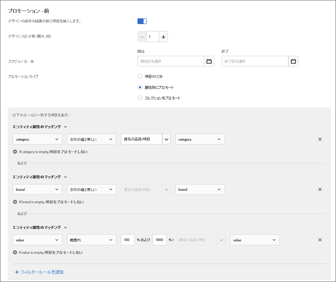

この例では、以下のルールが使用されます。

```
category - equals - current item's - category 
And 
brand - equals - current item's - brand 
And 
value - is between - 100% and 1000% of - current item's - value
```

>[!NOTE]
>
>複数のルールで動的なプロモーションのキーを変更することはできません（図で「Current Item's」というラベルの最初の 2 つのルールの 3 番目のドロップダウンリスト）。

**使用例 5：** 2 番目の図は、同じカテゴリ、同じブランド、自社ブランドで、より高額な品目をプロモーションするために、「次に等しい」と「範囲内」演算子を使用する方法を示しています。例えば、オフィス用品会社は、プリンターを探している訪問者に対するアップセルを目的として、同じブランドと自社ブランドの、より高額なトナーカートリッジをプロモーションできます。

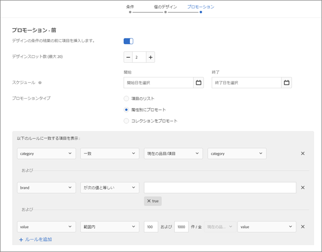

この例では、以下のルールが使用されます。

```
category - equals - current item's - category 
And 
IsHouseBrand - equals - true 
And 
value - is between - 100% and 1000% of - current item's - value
```

この例では、2 つの動的ルールと 1 つの静的ルールを使用していることに注意してください。

**使用例 6：** 3 番目の図は、訪問者が現在表示しているシリーズとは違うシリーズをプロモーションするために、「等しくない」演算子を使用する方法を示しています。例えば、メディア Web サイトは、訪問者が現在表示しているシリーズとは別のテレビシリーズをプロモーションできます。

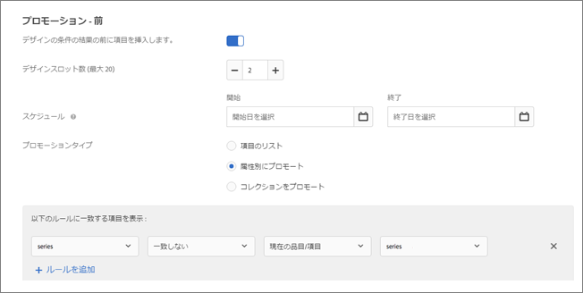

この例では、以下のルールが使用されます。

```
series - does not equal - current item's - series
```

**使用例 7：** 4 番目の図は、訪問者が最後に購入した品目と互換性のあるアクセサリ品目をプロモーションする方法を示しています。例えば、新しい TV を購入した人に対して、HDMI ケーブルを動的にプロモーションできます。

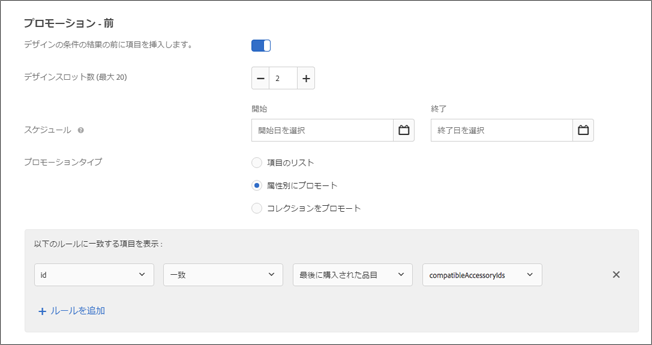

この例では、以下のルールが使用されます。

```
id - equals - last purchased item's - compatibleAccessoryids
```

**使用例 8：**&#x200B;次の図は、訪問者が現在表示している品目の 90～110％の価格で販売されている品目をプロモーションする方法を示しています。例えば、TV を探している人に対して、ほぼ同じ価格帯で販売されている同様の TV を動的にプロモーションできます。

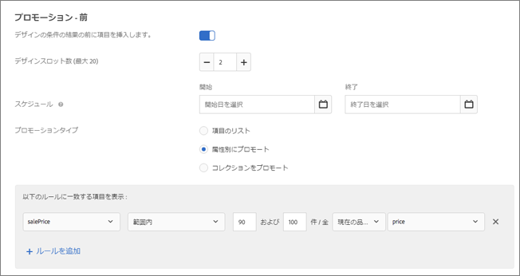

この例では、以下のルールが使用されます。

```
salesPrice - is between - 90% and 110% of - current item's - price
```

**使用例 9：**&#x200B;次のスポーツメディアサイトの例では、上記の[エンティティ属性のマッチング、プロファイル属性のマッチング、パラメーターのマッチングでフィルタリングする際に空の値を処理する](../../c-recommendations/c-algorithms/use-dynamic-and-static-inclusion-rules.md#section_7D30E04116DB47BEA6FF840A3424A4C8)で説明した空の値の処理方法を使用します。

あるスポーツメディアサイトのコンテンツチームが、ユーザーが好きなチームのコンテンツを表示したいと考えているとします。好きなチームを指定しているユーザーに対しては、そのチームのメディア情報を表示します。好きなチームを指定していないユーザーに対しては、「*x* が空の場合」ドロップダウンリストを使用して、次のいずれかの方法で処理します。

* チームのフィルターを完全に無視する場合は、次の図のように、「[!UICONTROL このフィルタールールを無視]」オプションを使用します。

   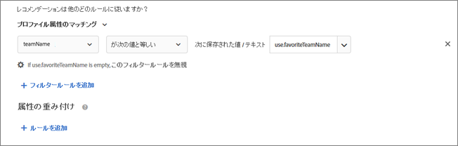

* この条件ではメディア情報を表示しないようにするには、次の図のように、「[!UICONTROL この条件の結果を表示しない]」オプションを使用します。

   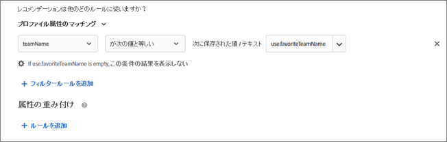

* 特定のチーム（49ers など）のメディア情報を表示するには、次の図のように、「[!UICONTROL 静的値を使用]」オプションを使用します。

   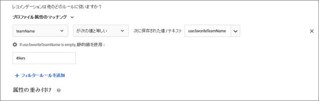

## 注意事項 {#section_A889FAF794B7458CA074DEE06DD0E345}

>[!IMPORTANT]
>
>データタイプが異なる属性に対して「次に等しい」および「等しくない」演算子を使用した動的な条件またはプロモーションでは、実行時に互換性がない可能性があります。左側に事前定義された属性またはカスタム属性がある場合、右側で値、利益、在庫および環境の値を賢く使用する必要があります。

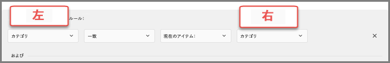

以下の表に、効果的なルールと実行時に互換性のない可能性のあるルールを示します。

| 互換性のあるルール | 互換性のない可能性のあるルール |
|--- |--- |
| value - is between - 90% and 110% of current item's - salesValue | salesValue - is between - 90% and 110% of current item's - value |
| value - is between - 90% and 110% of current item's - value | clearancePrice - is between - 90% and 110% of current item's - margin |
| margin - is between - 90% and 110% of current item's - margin | storeInventory - equals - current item's - inventory |
| inventory - equals - current item's - inventory |  |