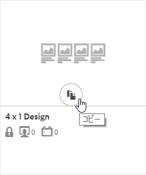
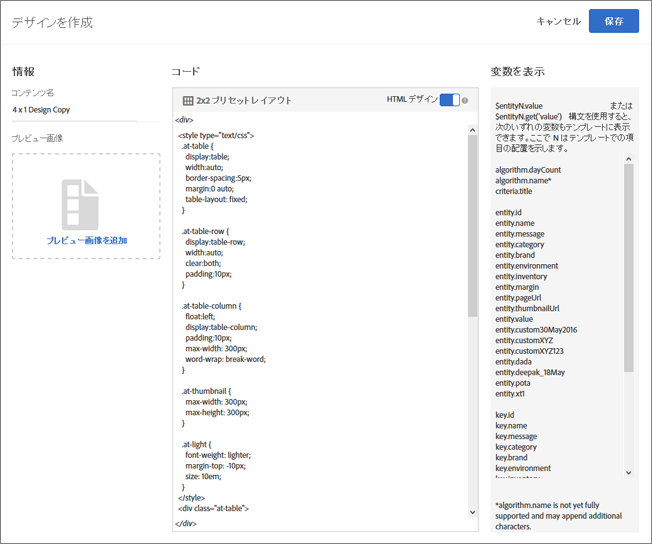

#  デザインの作成{#create-a-design}

デザインによって、レコメンデーションがページに表示される方法が定義されます。

[!UICONTROL Recommendations] のデザイン作成には、デフォルトのデザインを使用するか、カスタムデザインを作成することができます。**[!UICONTROL レコメンデーション／デザイン]スクリーンには、デフォルトデザインカードと過去に作成したすべてのデザインが表示されます。**&#x200B;デフォルトのデザインの編集や削除はできません。

1. **[!UICONTROL レコメンデーション／デザイン]**&#x200B;画面で、作成するデザインのカードの上にマウスを移動します。

   

1. 既存のデザインをコピーおよび編集する場合は、**[!UICONTROL コピー]**&#x200B;アイコンをクリックします。

   または

   カスタムデザインを作成するには、****&#x200B;レコメンデーション／デザイン]スクリーン上で「**[!UICONTROL デザインを作成]」をクリックします。[!UICONTROL **

   

1. 「**[!UICONTROL コンテンツ名]**」を追加します。

   デフォルトデザインを使用した場合には、デザイン名と「コピー」が「**[!UICONTROL コンテンツ名]」フィールドに表示されます。**&#x200B;名前は編集できます。1.（オプション）デザインカード上に表示する画像をクリックして選択します。
1. デザインの&#x200B;**[!UICONTROL コード]**&#x200B;を編集します。

   レコメンデーションデザインには、オープンソースの Velocity デザイン言語が使用されています。Velocity について詳しくは、https://velocity.apache.org を参照してください。

   デザインは HTML または HTML 以外にすることができます。デフォルトで、HTML デザインは 
 タグでラップされ、Web 環境でのクリック追跡が可能です。HTML 以外のデザインは、Web 環境ではない環境用のもので、クリック追跡ができません。

   >[!NOTE]
   >
   >デザインで参照できるエンティティの最大数は、ハードコーディングでもループ経由でも 99 です。

1. 「**[!UICONTROL 保存]**」をクリックします。

## トレーニングビデオ:Recommendationsでのカスタムデザインの作成（3:20）

このビデオには、次の情報が含まれています。

* カスタムデザインの作成
* デザインでの表示変数の参照方法の理解

>[!VIDEO](https://video.tv.adobe.com/v/27687?captions=jpn)
