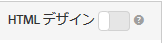

#  デザインの作成{#create-a-design}

デザインによって、レコメンデーションがページに表示される方法が定義されます。

[!UICONTROL Recommendations] のデザイン作成には、デフォルトのデザインを使用するか、カスタムデザインを作成することができます。**[!UICONTROL レコメンデーション／デザイン]**&#x200B;スクリーンには、デフォルトデザインカードと過去に作成したすべてのデザインが表示されます。デフォルトのデザインの編集や削除はできません。

1. **[!UICONTROL レコメンデーション／デザイン]**&#x200B;画面で、作成するデザインのカードの上にマウスを移動します。

   

1. 既存のデザインをコピーおよび編集する場合は、**[!UICONTROL コピー]**&#x200B;アイコンをクリックします。

   または

   カスタムデザインを作成するには、**[!UICONTROL レコメンデーション／デザイン]**&#x200B;スクリーン上で「**[!UICONTROL デザインを作成]**」をクリックします。

   

1. 「**[!UICONTROL コンテンツ名]**」を追加します。

   デフォルトデザインを使用した場合には、デザイン名と「コピー」が「**[!UICONTROL コンテンツ名]**」フィールドに表示されます。名前は編集できます。1.（オプション）デザインカード上に表示する画像をクリックして選択します。
1. デザインの&#x200B;**[!UICONTROL コード]**&#x200B;を編集します。

   レコメンデーションデザインには、オープンソースの Velocity デザイン言語が使用されています。Velocity について詳しくは、[](https://velocity.apache.org)https://velocity.apache.org を参照してください。

   デザインは HTML または HTML 以外にすることができます。デフォルトで、HTML デザインは <div> タグでラップされ、Web 環境でのクリック追跡が可能です。HTML 以外のデザインは、Web 環境ではない環境用のもので、クリック追跡ができません。

   >[!NOTE]
   >
   >デザインで参照できるエンティティの最大数は、ハードコーディングでもループ経由でも 99 です。

1. 「**[!UICONTROL 保存]**」をクリックします。

## JSON の例 {#section_75BFB2537CFF4FBD9B560F59EB32C8DD}

以下の例は、フォームベースのエディターを使用してアクティビティを設定するときに JSON 応答を返す方法を示しています。

1. デザインライブラリまたはフォームベースのワークフロー内でデザインを作成します。Visual Experience Composer（VEC）のワークフロー内でこの作業をおこなう場合、作成できるのは、`<div>`クリック追跡のためにラッピングされた HTML デザインのみです。
1. 「HTML デザイン」オプションがオフになっていることを確認します。

   

1. デザインに貼り付けるコードの例は次のとおりです。

   ```
       #* 
       * "Return a simple list of recommended entity ids"   
       *#
   
       {   
         "notes":{   
         "purpose": "Return a simple list of recommended entity ids",   
         "use-case": "Use this approach if you prefer to do a real-time lookup of entity attribute details (such as inventory, price, rating) from another system (such as a CMS, PIM or ecommerce platform)",   
         "version": "01"   
         },   
         "recommendedItems": {   
           "key": "$key.id",   
           "slot-01": "$entity1.id",   
           "slot-02": "$entity2.id",   
           "slot-03": "$entity3.id",   
           "slot-04": "$entity4.id",   
           "slot-05": "$entity5.id",   
           "slot-06": "$entity6.id",   
           "slot-07": "$entity7.id",   
           "slot-08": "$entity8.id",   
           "slot-09": "$entity9.id",   
           "slot-10": "$entity10.id"   
         }   
       }  
   ```

1. このデザインを使用するフォームベースの Recommendations アクティビティを設定します。

   1. アクティビティページに移動します。
   1. 「**[!UICONTROL アクティビティを作成]**」をクリックします。
   1. 「**[!UICONTROL Recommendations]**」を選択します。
   1. 「**[!UICONTROL Experience Composer を選択]**」で、「**[!UICONTROL フォーム]**」を選択します。

   1. 「場所」で &quot;Sample_Recs_Response&quot; というテキストを入力します。
   1. 「**[!UICONTROL デフォルトコンテンツ]**」で、下矢印、「**[!UICONTROL レコメンデーションの追加]**」の順にクリックします。
   1. 「ページタイプ」を選択します。これにより、次の画面の最初のフィルタリングが決まります。
   1. 条件カードを選択し、「**[!UICONTROL 次へ]**」をクリックします。
   1. 前のステップで作成したデザインを選択し、「**[!UICONTROL 保存]**」をクリックします。
   1. 設定プロセスを完了します。
   1. 「**[!UICONTROL 非アクティブ]**」の横にある右矢印をクリックし、「**[!UICONTROL アクティブ化]**」を選択します。

1. アクティビティを設定してアクティブ化したら、クリーンな JSON 応答を返すサンプルのリクエストを設定できます。

   アクティビティを保存したら、Target では、選択した条件設定に対応するモデルを構築する必要があります。要素の数によっては、構築に時間がかかる場合もあります。モデルの構築が完了すると結果が表示されます。

   次に例を示します。

   ```
   https://[YOUR_CLIENT_CODE].tt.omtrdc.net/m2/YOUR_CLIENT_CODE/ubox/raw?mbox=[YOUR_MBOX_NAME]&mboxContentType=text/html&mboxXDomain=disabled&entity.id=[ENTITY_ID]&mboxHost=rawbox_sample&at_property=[AT_PROPERTY_TOKEN]&mboxNoRedirect=true&mboxPC=1234-4321&mboxSession=9876-7000
   ```

   where

| パラメーター | 値 |
|--- |--- |
| `[YOUR_CLIENT_CODE]` | Target クライアントコードです（../target/products.html#recsSettings／Recommendation API トークン／クライアントコードから入手できます）。 |
| `[YOUR_MBOX_NAME]` | フォームベースのRecommendationsの「場所」セクションで選択した名前（この場合はSample_Recs_Response）。 |
| `[ENTITY_ID`] | カタログ内の項目の `entity.id` です。 |
| `[AT_PROPERTY_TOKEN]` | （オプション）アクティビティの設定時にプロパティ（Enterprise 権限の一部）を選択した場合は追加します。 |

アルゴリズムを実行して結果が得られたら、応答は次のようになります。

{width=&quot;575px&quot;}

## JSON オブジェクトに関するその他のヒントとテクニック {#section_C305673C68944749969DB239E3221DC2}

次の構文でデザインを設定することで、シンプルなコンマ区切りの項目リストを返すこともできます。

```
entity1.id, $entity2.id, $entity3.id, $entity4.id, $entity5.id, 
```

応答でその他の情報を送信することもできます。次のコードファイルはより複雑なサンプルで、エンティティ ID と関連するスロット（順序）以外に様々な情報を返します。このデザインの例の場合は、アクティビティの詳細、Target プロファイルの詳細（該当する場合）、対象の項目に関連するその他の `entity.attributes` も返されます。

```
    {   
     "adobeRecommendations": {   
      "notes": {   
       "purpose": "Return a list of entity ids with their associated entity.attributes",   
       "use-case": "Use this approach to avoid looking up attribute details after receiving a response from Target",   
       "version": "01"   
      },   
      "recommendedItems": {   
       "slot-01": "$entity1.id",   
       "slot-02": "$entity2.id",   
       "slot-03": "$entity3.id",   
       "slot-04": "$entity4.id",   
       "slot-05": "$entity5.id",   
       "slot-06": "$entity6.id",   
       "slot-07": "$entity7.id",   
       "slot-08": "$entity8.id",   
       "slot-09": "$entity9.id",   
       "slot-10": "$entity10.id"   
      },   
      "activityDetails": {   
       "mbox.name": "email-mbox",   
       "campaign.name": "\${campaign.name}",   
       "campaign.id": "\${campaign.id}",   
       "campaign.recipe.name": "\${campaign.recipe.name}",   
       "campaign.recipe.id": "\${campaign.recipe.id}",   
       "offer.name": "\${offer.name}",   
       "offer.id": "\${offer.id}",   
       "criteria.title": "$criteria.title",   
       "algorithm.name": "$algorithm.name",   
       "algorithm.dayCount": "$algorithm.dayCount"   
      },   
      "visitorProfile": {   
       "profile.favorite-category": "\${profile.favorite-category}",   
       "profile.test": "\${profile.test}",   
       "user.endpoint.lastPurchasedEntity": "\${user.endpoint.lastPurchasedEntity}",   
       "user.endpoint.lastViewedEntity": "\${user.endpoint.lastViewedEntity}",   
       "user.endpoint.mostViewedEntity": "\${user.endpoint.mostViewedEntity}",   
       "user.endpoint.categoryAffinity": "\${user.endpoint.categoryAffinity}",   
       "profile.geolocation.city": "\${profile.geolocation.city}",   
       "profile.geolocation.dma": "\${profile.geolocation.dma}",   
       "profile.geolocation.state": "\${profile.geolocation.state}",   
       "profile.geolocation.country": "\${profile.geolocation.country}",   
       "profile.sessionCount": "\${profile.sessionCount}",   
       "profile.averageDaysBetweenVisits": "\${profile.averageDaysBetweenVisits}",   
       "profile.browserTime": "\${profile.browserTime}",   
       "user.activeActivities": "\${user.activeActivities}",   
       "user.pcId": "\${user.pcId}",   
       "user.isFirstSession": "\${user.isFirstSession}",   
       "user.isNewSession": "\${user.isNewSession}",   
       "user.header": "\${user.header}",   
       "user.parameter": "\${user.parameter}"   
      },   
      "recKey": {   
       "recKeyDetails": {   
        "id": "$key.id",   
        "name": "$key.name",   
        "category": "$key.category",   
        "pageUrl": "$key.pageUrl",   
        "thumbnailUrl": "$key.thumbnailUrl"   
       }   
      },   
      "recDetailedResults": {   
       "recEntity1Details": {   
        "id": "$entity1.id",   
        "name": "$entity1.name",   
        "category": "$entity1.category",   
        "pageUrl": "$entity1.pageUrl",   
        "thumbnailUrl": "$entity1.thumbnailUrl"   
       },   
       "recEntity2Details": {   
        "id": "$entity2.id",   
        "name": "$entity2.name",   
        "category": "$entity2.category",   
        "pageUrl": "$entity2.pageUrl",   
        "thumbnailUrl": "$entity2.thumbnailUrl"   
       },   
       "recEntity3Details": {   
        "id": "$entity3.id",   
        "name": "$entity3.name",   
        "category": "$entity3.category",   
        "pageUrl": "$entity3.pageUrl",   
        "thumbnailUrl": "$entity3.thumbnailUrl"   
       },   
       "recEntity4Details": {   
        "id": "$entity4.id",   
        "name": "$entity4.name",   
        "category": "$entity4.category",   
        "pageUrl": "$entity4.pageUrl",   
        "thumbnailUrl": "$entity4.thumbnailUrl"   
       },   
       "recEntity5Details": {   
        "id": "$entity5.id",   
        "name": "$entity5.name",   
        "category": "$entity5.category",   
        "pageUrl": "$entity5.pageUrl",   
        "thumbnailUrl": "$entity5.thumbnailUrl"   
       },   
       "recEntity6Details": {   
        "id": "$entity6.id",   
        "name": "$entity6.name",   
        "category": "$entity6.category",   
        "pageUrl": "$entity6.pageUrl",   
        "thumbnailUrl": "$entity6.thumbnailUrl"   
       },   
       "recEntity7Details": {   
        "id": "$entity7.id",   
        "name": "$entity7.name",   
        "category": "$entity7.category",   
        "pageUrl": "$entity7.pageUrl",   
        "thumbnailUrl": "$entity7.thumbnailUrl"   
       },   
       "recEntity8Details": {   
        "id": "$entity8.id",   
        "name": "$entity8.name",   
        "category": "$entity8.category",   
        "pageUrl": "$entity8.pageUrl",   
        "thumbnailUrl": "$entity8.thumbnailUrl"   
       },   
       "recEntity9Details": {   
        "id": "$entity9.id",   
        "name": "$entity9.name",   
        "category": "$entity9.category",   
        "pageUrl": "$entity9.pageUrl",   
        "thumbnailUrl": "$entity9.thumbnailUrl"   
       },   
       "recEntity10Details": {   
        "id": "$entity10.id",   
        "name": "$entity10.name",   
        "category": "$entity10.category",   
        "pageUrl": "$entity10.pageUrl",   
        "thumbnailUrl": "$entity10.thumbnailUrl"   
       }   
      }   
     }   
    }  
```

## Training video: Create custom designs in Recommendations (3:20) 

このビデオには、次の情報が含まれています。

* カスタムデザインの作成
* デザインでの表示変数の参照方法の説明

>[!VIDEO](https://video.tv.adobe.com/v/27687)
