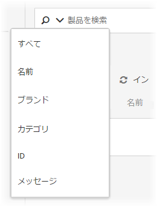

#  カタログ検索 {#catalog-search}

カタログ検索を使用すると、カタログ内の製品やコンテンツを探すことができます。

カタログ検索にアクセスするには、 **[!UICONTROL レコメンデーション]** / **[!UICONTROL カタログ検索]**&#x200B;をクリックします。

検索フィールドで下矢印をクリックすると、オプションメニューが表示されます。そこから検索オプションを選択すると、詳細検索が可能です。

検索オプションには、次のものがあります。

* ALL
* 名前
* ブランド
* カテゴリ
* ID
* メッセージ

**[!UICONTROL 「すべて]**」は、すべての他の検索条件の OR 条件を使用して検索します。

検索結果で「**[!UICONTROL 環境]**」フィルターをクリックし、カタログを表示している実稼動ホストグループ環境を指定します。検索結果で品目をスクロールして、サムネールなどの製品情報を表示することもできます。

「製品」のとなりに表示されている数字は、指定された環境での有効数の中で検索語句に一致した製品の数です。

フィードファイル、APIまたはmboxの更新を使用して更新を受信すると、カタログが自動的に更新されます。通常、アップデートは1時間で完了します。更新が進行中の場合、最新のアップデートが開始された時間が表示されます。更新が進行中でない場合、最新のアップデートが開始および終了した時間が表示されます。

## アドバンス検索に基づくコレクションまたは除外の作成

You can create [collections](/help/c-recommendations/c-products/collections.md) or [exclusions](/help/c-recommendations/c-products/exclusions.md) using Advanced Search on the Catalog Search page ([!UICONTROL Recommendations] &gt; [!UICONTROL Catalog Search] &gt; [!UICONTROL Advanced Search]).

「ID／次を含む」などを使用した検索を作成したら、[!UICONTROL 名前を付けて保存]／[!UICONTROL コレクションまたは除外]をクリックします。

>[!IMPORTANT]
>
>詳細検索機能では大文字と小文字は区別されません。ただし、配信時に返される商品は、大文字と小文字が区別される検索に基づきます。この違いが混乱を招くこともあります。詳細検索機能による結果を基にしてコレクションまたは除外を作成する際は、大文字と小文字の区別を考慮してください。例えば、最初に「Holiday」と検索すると、「Holiday」または「holiday」を含む結果が返されます。その後、「holiday」を含む商品を返すことを目的としたカタログを作成すると、「holiday」を含む商品のみが返されます。「Holiday」を含む商品は返されません。除外も同様に処理されます。
