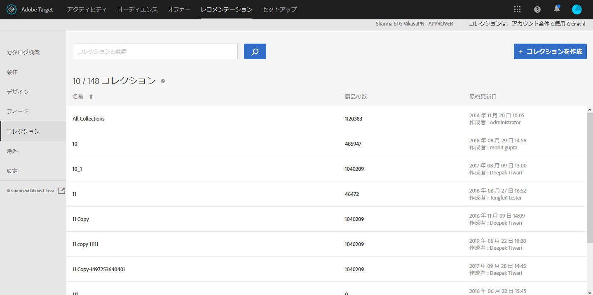

#  コレクション {#collections}

コレクションは、レコメンデーションに使用できる商品または品目のセットです。

一般的に、コレクションは、単一の製品コレクションなどの同一または関連する品目のセットです。しかし、どのような品目でも、ビジネス上で適切なカテゴリグループ分けすることができます。例えば、ある価格帯や色の製品、ある地域で特に興味がもたれそうな品目などです。

コレクションは、製品や論理的な格納場所を整理するために使用できます。例えば、ある品目が一部の地域のみで利用可能な場合、訪問者の地域で利用できない品目を除いたコレクションを作成することができます。また、コレクションを使用すると、季節的な品目やビジネスに適した任意の整理パラメーターによる整理をおこなえます。

The [backup recommendations](/help/c-recommendations/c-algorithms/backup-recs.md) generated for each criteria within the recommendation also uses this collection, so only items in the collection are included in the backup recommendation. コレクションを使用すると、ある位置での表示に適切な商品だけを、確実に表示させることができます。

コレクションは、各条件が実行されるたびに、再構築または更新されます。

品目をコレクションにグループ分けし、各カタログに個別のレコメンデーションを作成できます。

包含条件を使用するとコレクションと同様のことができますが、包含条件はアクティビティを作成する都度設定する必要があります。コレクションを使用すると、品目のセットを一度で作成でき、再度設定する必要なく使用したいときに使用できます。

[!DNL Recommendations] アクティビティを作成または編集しているときに、アクティビティ図の「[!UICONTROL 条件]」ラベルの横にコレクション名が表示されます。

>[!NOTE]
>
>[!UICONTROL 最近表示された項目]レコメンデーションキーを使用する際に、コレクションは適用されません。

## コレクションの作成 {#task_1256DFF6842141FCAADD9E1428EF7F08}

レコメンデーションに表示したい製品を整理するために、コレクションを作成します。

1. **[!UICONTROL Recommendations]**／**[!UICONTROL ｌコレクション]**&#x200B;をクリックして、既存のコレクションのリストを表示します。

   

   [!UICONTROL コレクション]リストビューで各コレクションについて報告される「項目数」は、現在設定されているデフォルトの Recommendations[ ホストグループ](/help/administrating-target/hosts.md)（環境）内でそのコレクションのルールに一致する製品の数です。デフォルトのホストグループを変更するには、[設定](../../c-recommendations/plan-implement.md#concept_C1E1E2351413468692D6C21145EF0B84)を参照してください。

1. 「**[!UICONTROL コレクションを作成]**」をクリックします。

1. （条件付き）コレクションの作成（または更新）時に、環境を&#x200B;**[!UICONTROL 環境]**&#x200B;フィルターから選択して、その環境のコレクションのコンテンツをプレビューします。デフォルトでは、デフォルトのホストグループの結果が表示されます。

   

1. コレクションの&#x200B;**[!UICONTROL 名前]**&#x200B;を入力します。

   オプションで&#x200B;**[!UICONTROL 説明]**&#x200B;を入力することもできます。

1. コレクションの構築に使用するルールを設定します。

   例えば、リスト内の product ID、category、margin などのパラメーターに関するコレクションを作成できます。

   ルールを追加し、複数のパラメーターを使用して、コレクションを定義することができます。複数のルールを、AND で結合することができます。コレクションが適用されるには、指定したすべてのルールに合致する必要があります。

1. 「**[!UICONTROL 保存]**」をクリックします。

## アドバンス検索を使用したコレクションの作成

[また、カタログ検索](/help/c-recommendations/c-products/catalog-search.md) ページでアドバンス検索を使用してコレクションを作成することもできます（[!UICONTROL レコメンデーション] / [!UICONTROL カタログ検索] / [!UICONTROL アドバンス検索]）。

「ID／次を含む」などを使用した検索を作成したら、[!UICONTROL 名前を付けて保存]／[!UICONTROL コレクション]をクリックします。

>[!IMPORTANT]
>
>詳細検索機能では大文字と小文字は区別されません。ただし、配信時に返される商品は、大文字と小文字が区別される検索に基づきます。この違いが混乱を招くこともあります。詳細検索機能による結果を基にしてコレクションを作成する際は、大文字と小文字の区別を考慮してください。例えば、最初に「Holiday」と検索すると、「Holiday」または「holiday」を含む結果が返されます。その後、「holiday」を含む商品を返すことを目的としたカタログを作成すると、「holiday」を含む商品のみが返されます。「Holiday」を含む商品は返されません。

## トレーニングビデオ:Recommendationsでのコレクションと除外の作成（7:05）

このビデオには、次の情報が含まれています。

* コレクションの作成
* 除外の作成

>[!VIDEO](https://video.tv.adobe.com/v/27689?captions=jpn)