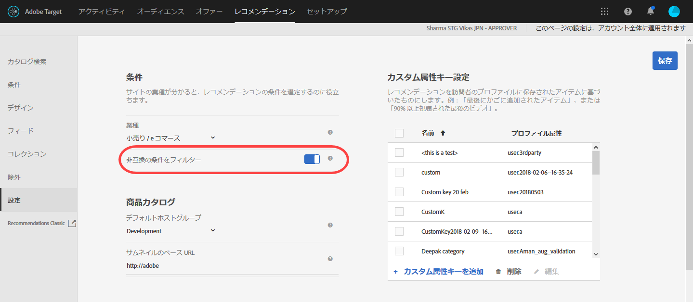
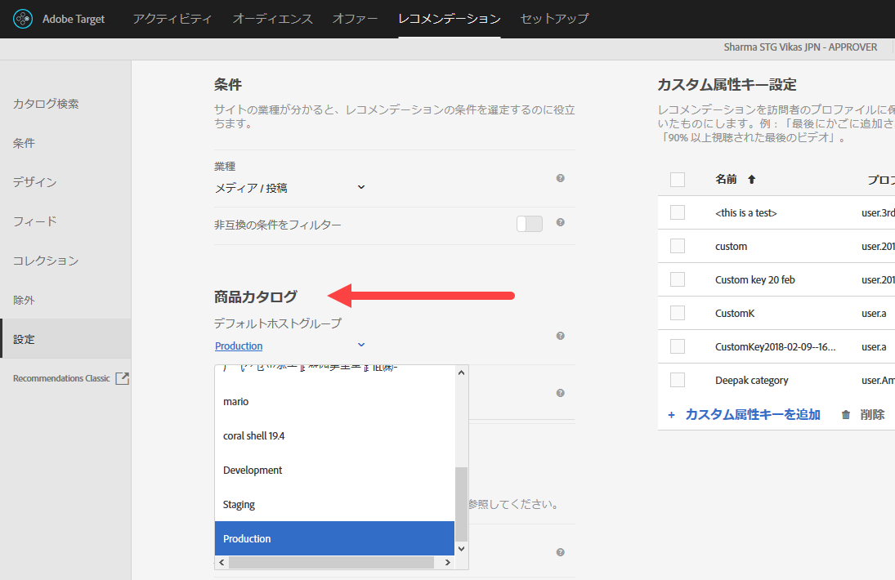
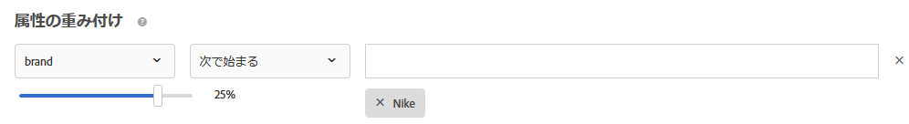

#  Recommendations FAQ{#recommendations-faq}

Recommendations アクティビティに関するよくある質問（FAQ）のリストです。

## カタログの項目を更新してサイトに反映されるまで、どれくらいかかりますか？

フィードファイルを読み込んだ後、または API や mbox でのエンティティの更新を受け取った後、以下の変更が 60 分以内に反映されます。

* デザインテンプレートに返された項目属性。
* 返されたレコメンデーションに項目が含まれるのを防ぐグローバル除外ルールで使用される項目属性。
* 返されたレコメンデーションに項目が含まれているか除外されているかに影響する条件内のインクルージョンルールで使用される項目属性。

以下の変更は、次のアルゴリズムの実行が発生するまで反映されません（12 ～ 24 時間以内）。

* アクティビティに使用される収集ルールで使用される項目属性。
* アクティビティに関連付けられた属性またはコレクションに基づいたプロモーションで使用される項目属性。
* トップセラーまたは最も多く閲覧されたアルゴリズムの「現在のカテゴリ」または「お気に入りのカテゴリ」に項目が表示される項目カテゴリ。
* 変更された属性がアルゴリズムのカスタムキーとして使用されるカスタム属性である場合の、推奨項目のランキング。
* レコメンデーションロジックが、「類似の属性を持つ品目」の場合、「コンテンツの類似性」重み付け係数が使用されている場合、または「属性の重み付け」係数が使用されている場合の、変更された属性に基づいた推奨項目のランキング。

>[!NOTE]
>
>フィードファイルは、そのステータスが「項目の読み込み」から「検索インデックスの更新を準備中」に変更される際に読み込まれるとみなされます。更新は、カタログ検索ユーザー インターフェイスで反映されるまで 60 分以上かかることがあります。フィードステータスが「更新完了日時」に変更されると、カタログ検索は最新です。カタログ検索がまだ最新でなくても、サイトは前述のタイムフレームで更新を反映します。最新のカタログ検索インデックスの更新時間は、カタログ検索ページに表示されます。

## 特殊文字によって配列が壊れてしまう場合はどうすればよいですか？{#section_D27214116EE443638A60887C7D1C534E}

JavaScript のエスケープ値を使用してください。引用符（"）を使用すると、配列が壊れる恐れがあります。エスケープ値を使用したコードスニペットの例を次に示します。

```
#set($String='') 
#set($escaper=$String.class.forName('org.apache.commons.lang.StringEscapeUtils')) 
<script type="text/javascript"> 
console.log("$escaper.escapeJavaScript($entity1.name)") 
console.log("$escaper.escapeJavaScript($entity2.name)") 
console.log('$escaper.escapeJavaScript($entity3.name)') 
names.push("$escaper.escapeJavaScript($entity4.name)") 
</script>
```

## Recommendations アクティビティの作成時に、カスタム条件を含むすべての条件を選択できないのはなぜですか？ {#section_B2265AC8B8A94E0298D495A05C5D817F}

選択できる条件は現在のカテゴリに基づきます。レコメンデーションオファーを作成している場合、アルゴリズムピッカーにはカテゴリ ID に基づく条件が表示されます。

この条件を適用する場所にカテゴリ ID が含まれていない場合、一部の条件がアルゴリズムピッカーに表示されません。

mbox にカテゴリ ID が存在する場所を使用する場合は、適用可能なすべての条件が条件ピッカーに表示されます。

Target では、[非互換の条件をフィルター](../../c-recommendations/plan-implement.md#concept_C1E1E2351413468692D6C21145EF0B84)設定を使用して、アルゴリズムピッカーのインテリジェントフィルタリングを管理できます。

>[!NOTE]
>
>この設定は、Visual Experience Composer（VEC）で作成されたアクティビティのみに適用されます。フォームベースの Experience Composer で作成されたアクティビティには適用されません（Target には場所のコンテキストがありません）。

[!UICONTROL 非互換の条件をフィルター]設定にアクセスするには、[!UICONTROL Recommendations]／[!UICONTROL 設定]をクリックします。



[!UICONTROL 非互換の条件をフィルター]設定が有効になっていない場合、Target では、アルゴリズムピッカーに表示されるアルゴリズムのフィルタリングはおこなわれず、すべてのアルゴリズムが表示されます。

[!UICONTROL 非互換の条件をフィルター]設定が有効になっている場合、VEC アクティビティでは、Target によって entityId とカテゴリ ID が選択した場所から読み取られ、`currentItem|currentCategory` に基づいてアルゴリズムが表示されます（それぞれの値が該当の場所に存在している場合）。そのためデフォルトでは、選択した場所で互換性のあるアルゴリズムのみがアルゴリズムピッカーに表示されます。

[!UICONTROL 非互換の条件をフィルター]設定が有効になっている場合でも、条件の選択時に「[!UICONTROL 互換性あり]」チェックボックスをオフにすると、互換性のないアルゴリズムを表示できます。


Target で「[!UICONTROL 互換性あり]」チェックボックスが表示されない特殊なケースは次のとおりです。

* entityId とカテゴリ ID の両方が場所に存在しており、フィルタリング対象がない。
* [!DNL mbox.js] のバージョン 55 以前を使用している。
* ページで mbox 呼び出しが実行されていない（!config.isAutoCreateGlobalMbox &amp;&amp; !config.isRegionalMbox）。
* Target のパラメーターが定義されていない。

## Recommendations のコレクションがゼロ（0）になった場合はどうすればよいですか？ {#section_E2DB2FE67CF24EEC81412BFF3FA6385D}

以前はゼロではなかったコレクションがゼロになった場合の対処法は次のとおりです。

* コレクションを再保存し、数値が変わるか確認します。再保存すると、そのコレクションを使用するすべてのアルゴリズムが再実行されます。
* 適切な環境にいるか確認します。確認のため、[!DNL /target/products.html#recsSettings] に移動してください（以下を参照）。

   

* インデックスが最新か確認します。[!DNL /target/products.html#productSearch] に移動し、何時間前にインデックスが作成されたかチェックしてください（例：「3 時間前にインデックス作成」）。必要に応じてインデックスを更新できます。
* エンティティがコレクションのルールに一致しなくなる変更をフィードまたはデータレイヤーに加えていないか確認します。大文字と小文字が一致しているかチェックしてください（大文字と小文字は区別されます）。
* フィードが適切に実行されているか確認します。FTP ディレクトリやパスワードなどが変更されていないかチェックしてください。
* Target は、（顧客のページやアプリに）配信の更新をできる限り早く反映します。一方で、マーケティング担当者のために UI にデータを表示する必要もあります。配信の更新が遅れるのは、必ずしも UI の更新が同期されるのを待っているためではありません。[mboxTrace](/help/c-activities/c-troubleshooting-activities/content-trouble.md) を使用すると、リクエスト受信時のシステムの状況を確認できます。

## 一般的な属性の重み付けと、コンテンツの類似性用の属性の重み付けには、どのような違いがありますか？{#section_FCD96598CBB44B16A4C6C084649928FF}

属性の重み付けには、「標準の属性の重み付け」と「コンテンツの類似性用の属性の重み付け」の 2 種類があります。

「標準の属性の重み付け」は、コンテンツの類似性を含むほぼすべての条件タイプに適用されます。このタイプの重み付けでは、特定の属性値により多くの重みが適用されます。次の例では、出力されたレコメンデーションで、Nike 製品の重みが大きくなります。



「コンテンツの類似性用の属性の重み付け」は、コンテンツの類似性の条件のみに適用されます。

このタイプの重み付けはより動的で、現在の「レコメンデーションキー」（現在表示されている品目）に基づきます。次の例（ブランド x 16）では、Nike のスニーカーを閲覧していた訪問者には、Nike の競合他社のスニーカーよりも、Nike の他の製品がレコメンデーションされる可能性が高くなります。Adidas のスニーカーを閲覧していた訪問者には、Adidas の製品がレコメンデーションされる可能性が高くなります。


## Target でレコメンデーションを表示できないことがあるのはなぜですか？ {#section_DB3F40673AED42228E407C05437D99E9}

Target では、利用できるレコメンデーションが少ないことが原因で、レコメンデーションを表示できないことがあります。

条件ごとに生成される値の数は、デザインで指定したエンティティ数の 5 倍になります。ランタイムフィルタリング（在庫、mbox 属性のマッチングなど）が、5 倍の値が生成された後に適用されるので、値の数が提供時に 5 倍未満になることもあります。これを軽減するためには、追加のエンティティを非表示にして、デザインのエンティティ数を増やします。

次の JavaScript は、デザインの始めで利用可能で、リクエストされるエンティティの数を増やすことができます。この例では、リクエストされたエンティティの数は 50（5 x 10）になります。

```
#foreach($entity in $entities) 
 #if( $foreach.count > 10 ) 
  #break 
 #end 
 #set ($foo = $entity.id) 
#end 
```

## 商品を挿入／更新する API の呼び出しのサイズ制限は何ですか？フィードではなく API を 1 回呼び出すことで、5 万件の商品の更新をおこなうことは可能ですか？ {#section_434FE1F187B7436AA39B7C14C7895168}

Target にはアプリケーションレベルで 50 MB のポスト制限があります。ただしこれは、`application/x-www-form-urlencoded` コンテンツタイプヘッダをパスするときのみです。

1 回の呼び出しで 5 万件の商品の送信を試みることは可能です。失敗した場合には、いくつかのバッチに分けてください。システム負荷のためにタイムアウトとなってしまう可能性を抑えるため、通常、呼び出しは 5 千から 1 万の商品のバッチに分けることをお勧めします。

## Recommendations の条件、プロモーション、またはテンプレートテストルールを作成する際に、mbox 名を指定する必要がありますか？ {#section_FFA42ABCC5954B48A46526E32A3A88A2}

mbox パラメーターに基づいて Recommendations の条件、プロモーション、またはテンプレートテストルールを作成する際に、`mboxParameter` で `mboxName` の入力が求められなくなりました。mbox 名はオプションになりました。この変更により、複数の mbox のパラメーターを使用することや、まだエッジで記録されていないパラメーターを参照することができます。

目的のパラメーターを選択するには：

* 新しい条件、プロモーションまたはテンプレートテストルールを作成する場合は、リストからパラメーター名を選択するか、目的のパラメーター名の先頭文字を入力するか、目的のパラメーター名の完全な名前を入力します。
* mbox 名は覚えているが、パラメーター名は覚えていないという場合は、チェックボックスを使用して、目的のパラメーターを渡す既知の mbox に関してフィルタリングをおこないます。

いずれの方法でも、mbox とパラメーターの間にリンクはありません。条件、プロモーション、またはテンプレートのテストルールは、そのパラメータを渡すすべての mbox でパラメーターに基づいて機能します。

既存の条件、プロモーション、またはテンプレートテストルールを編集する場合は、作成時に指定された mbox 名と共にフィルタリング条件が表示されます。

## 新しいオーディエンスを定義した後に従来の Recommendations アクティビティを保存できないのはなぜですか？ {#section_1E47C40B1FE7479BAC3EE0F50CE7C2C4}

オーディエンスに一意の名前が付けられていることを確認してください。オーディエンスに既存のオーディエンスと同じ名前を付けた場合、従来の Recommendations アクティビティ（2016 年 10 月より前に作成された Recommendations アクティビティ）を保存することはできません。

## フィードのアップロードに使用する CSV ファイルのサイズ上限を教えてください。 {#section_20F1AF4839A447B9889B246D6E873538}

フィードのアップロードに使用する CSV ファイルの行数とサイズに上限はありません。ただし、ベストプラクティスとして、ファイルのアップロード中にエラーが発生しないよう、CSV ファイルのサイズは 1 GB までに制限することをお勧めします。ファイルサイズが 1 GB を超える場合は、複数のフィードファイルに分割することをお勧めします。カスタム属性列の最大数は 100 で、カスタム属性は 4,096 文字までに制限されています。必須の列の長さに関するその他の制限については、[Target の制限に関するページ](../../r-troubleshooting-target/target-limits.md#reference_BEFE60C3AAA442FF94D4EBFB9D3CC9B1)を参照してください。

## エンティティを動的に除外できますか。

クエリ文字列で、レコメンデーションから除外したいエンティティのエンティティ ID を渡すことができます。例えば、既に買い物かごにある品目は除外した方がいいでしょう。

除外機能を有効にするには、`excludedIds` mbox パラメーターを使用します。このパラメーターは、コンマ区切りのエンティティ ID のリストを指定します。例： `mboxCreate(..., "excludedIds=1,2,3,4,5")`値は、レコメンデーションのリクエスト時に送信されます。

除外は、現在のTarget呼び出しに対してのみ実行されます。値が再び渡されない限り、以降のTarget呼び出しで項目が除 `excludedIds` 外されることはありません。 各ページのレコメンデーションから買い物かご内の品目を除外するには、引き続き各ページで値 `excludedIds` を渡す必要があります。

>[!NOTE]
>
>除外されるエンティティが多すぎる場合、レコメンデーションテンプレートを満たすのに十分なエンティティがないかのような動作になります。

To exclude `entityIds`, append the `&excludes=${mbox.excludedIds}` token to the offer content url. コンテンツ URL が除外されると、必要なパラメーターが、現在の mbox リクエストパラメーターを使用して代用されます。

デフォルトでは、この機能は新しく作成されたレコメンデーションで有効になります。既存のレコメンデーションで、エンティティの動的な除外をサポートするには、保存する必要があります。
