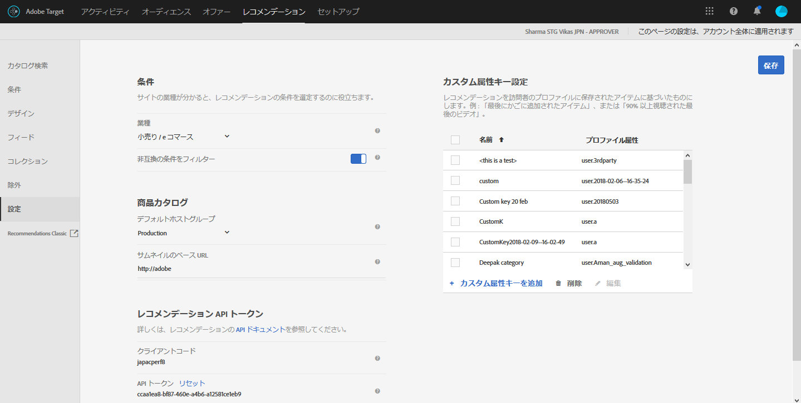

#  Recommendations の計画と実装{#plan-and-implement-recommendations}

Recommendations アクティビティを作成する前に知っておくべきこと。

## Recommendations の計画と実装 {#concept_02AA644A4C7D4D5CB1D9CADA208CF8D1}

[!DNL Recommendations] アクティビティを作成する前に知っておくべきこと。

[!DNL Recommendations] では、次の情報の階層が設定されている必要があります。

| 手順 | 情報 | 詳細 |
|--- |--- |--- |
|  | JavaScript ライブラリ | 各ページには、at.js バージョン 0.9.1（またはそれ以降）か mbox.js バージョン 55（またはそれ以降）への参照が必要です。この実装の手順は、Target アクティビティを使用するすべてのページで必要です。商品 ID やカテゴリ ID などのキーを含めることができます。<BR>at.js について詳しくは、[at.js の実装](/help/c-implementing-target/c-implementing-target-for-client-side-web/t-mbox-download/c-target-atjs-implementation/target-atjs-implementation.md)を参照してください。<br>mbox.js について詳しくは、[Mbox.js の実装](/help/c-implementing-target/c-implementing-target-for-client-side-web/t-mbox-download/mbox-download.md)を参照してください。 |
|  | キー | キーは、レコメンデーションに表示される製品やコンテンツのタイプを決定します。例えば、製品カテゴリをキーにできます。[レコメンデーションキーに基づくレコメンデーションの設定](/help/c-recommendations/c-algorithms/create-new-algorithm.md#task_2B0ED54AFBF64C56916B6E1F4DC0DC3B)を参照してください。 |
|  | 属性 | 属性を使用すると、表示したい製品についてさらに細かい情報を提供できます。例えば、ある価格帯の製品や、在庫のしきい値を満たしている品目を表示することができます。属性は、mbox 内または[フィード](/help/c-recommendations/c-products/feeds.md).<br>[インクルージョンルール](/help/c-recommendations/c-algorithms/create-new-algorithm.md#task_28DB20F968B1451481D8E51BAF947079)と[エンティティの属性](/help/c-recommendations/c-products/entity-attributes.md)を参照してください。 |
|  | 除外 | 除外によって、レコメンデーションに表示しない特定の品目を決めることができます。<br>[除外](/help/c-recommendations/c-products/exclusions.md)を参照してください。 |
|  | 購入の詳細 | 購入の詳細は、購入した品目や購入が完了した際の注文についての情報を提供します。 |

## ベースとなる実装 {#concept_D1154A3FB0FB4467A29AD2BDD21C82D5}

ベースとなる実装では、どの商品やサービスがレコメンデーションに表示されるかを決定するパラメーターをページに渡す必要があります。

[!DNL Recommendations] アクティビティの設定を開始する前に、商品データが [!DNL Recommendations] に提供される方法を理解し、どの方法が要件に最適かを判断する必要があります。

[!DNL Recommendations] に商品やサービスの情報を提供する方法は 2 とおりあります。

| メソッド | 説明 |
|--- |--- |
| 直接ページにパラメーターを渡す | この方法は、頻繁に変更される品目に適しています。しかし、ページを直接変更する必要があるため、多くの組織では IT 部門やページを実装する人が関与することが求められます。 |
| Google フィードまたは CSV フィードによってパラメーターを渡す | この方法は、頻繁に変更されないコレクションに適しています。フィードを経由して商品情報を提供する場合、通常は の実装や他のページのコードを変更する必要はありません。ただし、商品リストは静的なままなので、すばやい変更は難しくなります。詳しくは、[フィード](/help/c-recommendations/c-products/feeds.md)を参照してください。 |

上記の方法は、次の例のように個別に使用することも、組み合わせて使用することもできます。

## 例 1：ページとフィードの組み合わせ {#section_DF6BAE4BF11548BD9C44D0A426BCF5A7}

ある一般的な [!DNL Recommendations] の実装オプションでは、ページパラメーターとフィードの両方が使用されています。

この方法は、相対的に設定された商品カタログがあるものの、特定の季節の品目や特価の品目を強調したい小売店などに好まれます。ほとんどの顧客は主にフィードを経由して情報を提供し、特定の場合のみページの調整をおこないます。

フィードを使用して、頻繁に変更されない情報を提供します。CSV ファイルと Google フィードのどちらを使用する場合でも、次のパラメーターを使用します。

* 必須パラメーター

   * `entity.id`

* 便利なパラメーター

   * `entity.name`
   * `entity.categoryId`
   * `entity.brand`
   * `entity.pageUrl`
   * `entity.thumbnailUrl`
   * `entity.message`
   * すべてのカスタム属性

Once the feed is set up and passed to [!DNL Recommendations], pass parameters on the page for attributes that change frequently, i.e. more often than daily.

* 必須パラメーター

   * `entity.id`
   * `entity.categoryId`

* 便利なパラメーター

   * `entity.inventory`
   * `entity.value`

最後に実行されたデータセットが優先されます。フィードを渡してからページパラメーターを更新すると、フィードで渡された情報は上書きされ、ページパラメーターの変更事項が表示されます。

## 例 2：商品（内容）詳細ページのすべてのパラメーターを渡す {#section_D5A4F69457604CA7AACFD7BFF79B58A9}

ページのすべてのパラメーターを渡すと、ページの更新によってすばやく更新することができます。組織によっては、IT 部門や Web デザインチームの関与が必要になります。

この例は、とりわけ内容が常に変化するメディア企業にとって有用です。

* 必須パラメーター

   * `entity.id`
   * `entity.categoryId`
   * その他の全属性

## サンプルコード {#section_6E8A73376F30468BB549F337C4C220B1}

例えば、商品またはコンテンツページのヘッダーセクションで以下のコードを使用できます。

```
function targetPageParams() {
 return {
    "entity": {
       "id": "32323",
       "categoryId": "My Category",
       "value": 105.56,
       "inventory": 329
    }
 }
}
```

様々なタイプのページで使用できるコードの例については、[ページタイプに従った実装](../c-recommendations/plan-implement.md#reference_DE38BB07BD3C4511B176CDAB45E126FC).

## ページタイプに従った実装 {#reference_DE38BB07BD3C4511B176CDAB45E126FC}

ページのタイプは [!DNL Recommendations] の実装に影響します。

例えば、製品ページ上で表示したいレコメンデーションのタイプと、カテゴリのページまたはホームページで表示したいレコメンデーションのタイプとは異なる場合があります。各ページで、mbox 呼び出しの前に特有の関数を実行すると、適切なレコメンデーションを表示することができます。

この例で使用されている属性について詳しくは、[エンティティの属性](../c-recommendations/c-products/entity-attributes.md#reference_3BCC1383FB3F44F4A2120BB36270387F)を参照してください。

有効な JSON 形式である必要があります。

後述の `targetPageParams` 関数は、ページの実装にタグ管理ソリューションを使用している場合に特に便利です。[!DNL Adobe Launch] または [!DNL Adobe Dynamic Tag Manager]（DTM）は、at.js／mbox.js への参照と `targetPageParams` 関数をページに配置し、値を設定できるようにします。この関数は、at.js／mbox.js 呼び出しの前に置くか、at.js／mbox.js の Extra JavaScript セクションに置く必要があります。

## すべてのページ {#section_A22061788BAB42BB82BA087DEC3AA4AD}

レコメンデーションを含むすべてのページ上で、[!DNL at.js] または [!DNL mbox.js] への参照が必要です。レコメンデーションのあるすべてのページに以下のうちいずれかの参照を追加してください。

```
<script src="../at.js /></script>
```

```
<script src="../mbox.js /></script>
```

この実装は、以下を満たしている必要があります。

* [!DNL at.js] バージョン 0.9.2（またはそれ以降）か [!DNL mbox.js] バージョン 55（またはそれ以降）

* [!DNL mbox.js] は [!DNL target.js] への参照を含む（[!DNL at.js] は [!DNL target.js] への参照を必要としません）

[!DNL at.js] の実装について詳しくは、[at.js のデプロイ方法](../c-implementing-target/c-implementing-target-for-client-side-web/how-to-deployatjs/how-to-deployatjs.md#topic_ECF2D3D1F3384E2386593A582A978556)を参照してください。

[!DNL mbox.js] の実装について詳しくは、[Mbox.js の実装](../c-implementing-target/c-implementing-target-for-client-side-web/t-mbox-download/mbox-download.md#task_4EAE26BB84FD4E1D858F411AEDF4B420)を参照してください。

For more information about the differences between the two Target Javascript libraries, see [Benefits of at.js](/help/c-implementing-target/c-implementing-target-for-client-side-web/t-mbox-download/c-target-atjs-implementation/target-atjs-implementation.md#benefits).

## カテゴリページ {#section_F51A1AAEAC0E4B788582BBE1FEC3ABDC}

カテゴリページでは、製品やコンテンツのレコメンデーションをそのカテゴリ内に制限したい場合が多いでしょう。カテゴリページの設定には、ページで使用するキーの設定が必要です。キーについて詳しくは、[レコメンデーションキーに基づくレコメンデーションの設定](../c-recommendations/c-algorithms/create-new-algorithm.md#task_2B0ED54AFBF64C56916B6E1F4DC0DC3B)を参照してください。

```
function targetPageParams() { 
   return { 
      "entity": { 
         "categoryId": "My Category" 
      } 
   } 
}
```

## 製品紹介ページ {#section_205B3953C9664125A17CA8574FA6B2A3}

製品紹介ページでは、ある品目や、特定の価格や在庫レベルの品目をレコメンデーションしたい場合があります。また、カテゴリページに必要なキーの他に頻繁に変更される属性（価値や在庫など）を設定することもできます。

```
function targetPageParams() { 
   return { 
      "entity": { 
         "id": "32323", 
         "categoryId": "My Category", 
         "value": 105.56, 
         "inventory": 329 
      } 
   } 
}
```

## 買い物かごページ {#section_D37E48700F074556B925D0CA0291405E}

買い物かごページでは、例えば既に買い物かごにある品目など、レコメンデーションからいくつかの品目を除外したい場合があるでしょう。

```
<script type="text/javascript">
function targetPageParams() {
   return {
      "excludedIds": [352, 223, 23432, 432, 553]
      }
}
</script>
```

## 「ありがとうございます」ページ {#section_C6126A4517A1478693AB7EC2A1D4ACCA}

「ありがとうございます」ページでは、別の品目のレコメンデーションをおこなわずに、注文の合計、注文 ID、購入した製品を表示することができます。2 つ目の mbox を実装し、注文情報を取得できます。

* at.js を使用している場合は、[コンバージョンの追跡](../c-implementing-target/c-implementing-target-for-client-side-web/how-to-deployatjs/implementing-target-without-a-tag-manager.md#task_E85D2F64FEB84201A594F2288FABF053).
* mbox.js を使用している場合、[注文の確認 mbox の作成 - mbox.js](../c-implementing-target/c-implementing-target-for-client-side-web/t-mbox-download/orderconfirm-create.md#task_0036D5F6C062442788BB55E872816D82) を参照してください。

## 設定 {#concept_C1E1E2351413468692D6C21145EF0B84}

設定を使用して [!DNL Recommendations] の実装を管理します。

[!UICONTROL Recommendations 設定]オプションにアクセスするには、[!DNL Target] を [!DNL Adobe Experience Cloud] で開き、**[!UICONTROL レコメンデーション]** ／**[!UICONTROL 設定]** をクリックします。



以下のオプションがあります。

| 設定 | 説明 |
|--- |--- |
| カスタムグローバル mbox | （オプション）[!DNL Target] アクティビティを提供するために使用するカスタムグローバル mbox を指定します。デフォルトでは、[!DNL Target} によって使用されるグローバル mbox が [!DNL Recommendations] に使用されます。<br>注意：このオプションは、[!DNL Target][!UICONTROL  設定]ページで設定されます。[!DNL Target] を開いて、「[!UICONTROL セットアップ]」をクリックします。 |
| 業種 | 業種は、レコメンデーション条件の分類に使用されます。これによって、買い物かごページやメディアページに最適な条件など、特定のページにふさわしい条件を見つけやすくなります。 |
| 非互換の条件をフィルター | このオプションを選択すると、選択されたページが必要なデータを渡す条件のみが表示されます。すべてのページですべての条件が正しく実行されるわけではありません。現在の品目／現在のカテゴリのレコメンデーションと互換性を持たせるために、ページや mbox には `entity.id` か `entity.categoryId` を渡す必要があります。通常は、互換性のある条件のみを表示するようにします。ただし、アクティビティで互換性のない条件を有効にしたい場合は、このオプションのチェックを外します。<br>タグ管理ソリューションを使用している場合は、このオプションを無効にすることをお勧めします。<br>このオプションについて詳しくは、[Recommendations FAQ](/help/c-recommendations/c-recommendations-faq/recommendations-faq.md) を参照してください。 |
| デフォルトホストグループ | デフォルトホストグループを選択します。「なし」は、[!DNL Target Classic] のレポート設定のデフォルトホストグループが、デフォルトホストグループに使用されることを意味します。<br>ホストグループを使用して、カタログの利用可能な項目をさまざまな用途に分割できます。例えば、ホストグループは開発環境と実稼動環境、さまざまなブランド、またはさまざまな地域に使用できます。デフォルトでは、カタログ検索、コレクションおよび除外のプレビュー結果はデフォルトのホストグループに基づいています。（環境フィルターを使用して、結果をプレビューする別のホストグループを選択することもできます）デフォルトでは、項目の作成または更新時に環境 ID が指定されている場合を除き、新しく追加された項目はすべてのホストグループで使用できます。配信される Recommendations は、リクエストで指定したホストグループによって異なります。<br>商品が表示されていない場合は、適切なホストグループが使用されていることを確認してください。例えば、ステージング環境を使用するようにレコメンデーションを設定し、ホストグループをステージングに設定した場合、商品を表示するために、ステージング環境のコレクションを再作成する必要がある可能性があります。各環境でどの商品が利用できるかを確認するには、各環境でカタログ検索を利用します。選択した環境（ホストグループ）の Recommendations コレクションと除外のコンテンツをプレビューすることもできます。<br>**注意：** 選択した環境を変更した後、 「検索」をクリックして返された結果を更新する必要があります。<br>[!UICONTROL 環境]フィルターは [!DNL Target] UI の次の場所で利用できます。<ul><li>カタログ検索（[!UICONTROL Recommendations／カタログ検索）</li><li>「コレクションを作成」ダイアログボックス（[!UICONTROL Recommendations／コレクション／新規作成]）</li><li>「コレクションを更新」ダイアログボックス（[!UICONTROL Recommendations／コレクション／編集]）</li><li>「除外を作成」ダイアログボックス（[!UICONTROL Recommendations／除外／新規作成]）</li><li>「除外を更新」ダイアログボックス（[!UICONTROL Recommendations／除外／編集]）</li></ul>詳しくは、[ホスト](/help/administrating-target/hosts.md)を参照してください。 |
| サムネールのベース URL | 商品カタログのベース URL を設定すると、商品のサムネールの指定でサムネール URL を渡す場合に、相対 URL を使用できます。<br>例：<br>`"entity.thumbnailURL=/Images/Homepage/product1.jpg"`<br> はサムネールのベース URL に対する相対 URL を設定します。 |
| Recommendations API トークン | Download API などの Recommendations API 呼び出しで、このトークンを使用します。 |
