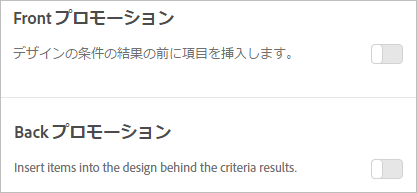

#  プロモーションの追加{#add-promotions}

プロモーション項目を追加して、Recommendations デザインでの配置を制御します。静的なプロモーションおよび動的なプロモーションを追加できます。

>[!IMPORTANT]
>
>静的および動的な除外ルールは、マーケティングに役立つ便利な機能です。詳細な情報、例、および使用例については、[動的および静的インクルージョンルールの使用](../../c-recommendations/c-algorithms/use-dynamic-and-static-inclusion-rules.md#concept_4CB5C0FA705D4E449BD0B37B3D987F9F)を参照してください。

[!DNL Recommendations] アクティビティを作成するときは、[!DNL Recommendations] デザインにプロモーション項目を含めることができます。プロモーションは、デザインの使用可能なスロットを使用し、条件の結果およびバックアップレコメンデーションよりも優先されます。例えば、デザインに 6 つのスロットがあり、そのうち 2 つをプロモーションに使用した場合、条件に基づいてレコメンデーションされる項目に 4 つのスロットを使用できます。

プロモーションは、アクティビティの条件により推奨される品目に対して重複排除されるので、1つのレコメンデーショントレイには特定の品目が2回表示されません。

特定の項目をプロモーションしたり、動的に項目をプロモーションしたり、属性に基づいて項目をプロモーションすることができます。また、コレクションをプロモーションすることもできます。

>[!NOTE]
>
>プロモーションを使用すると、CSV の構造と出力が変更されます。この変更により、電子メールなど、CSV に関連する外部プロセスが影響を受ける可能性があります。

1. **[!UICONTROL [オプション]** ]ページで[ **[!UICONTROL プロモーション]]** または[プロモーション **[!UICONTROL の戻る]** ]切り替えをクリックします。

   The following illustration shows the [!UICONTROL Front Promotion] toggle in the "On" position.

   

   条件の結果の前と&#x200B;**&#x200B;後のどちらにもプロモーションを挿入できます。
1. プロモーション項目に使用するデザインスロットの数を設定します。

   [!DNL Recommendations] デザインによりますが、最大で 20 個のスロットを使用できます。使用した各スロットは、条件に基づいて返されたレコメンデーションには使用できません。

1. プロモーション項目の開始日と終了日を設定します。

   開始日を設定しない場合、プロモーションはすぐに開始されます。終了日を設定しない場合、プロモーションは無期限に実行されます。

1. **[!UICONTROL プロモーションタイプを選択]**&#x200B;します。

   * 「**[!UICONTROL 項目のリスト]**」を選択し、プロモーションする特定の項目の `entity.id` 値をコンマで区切って入力します。

      プロモーションに設定したスロット数より多くの項目がリストに含まれている場合は、「**[!UICONTROL 項目の順序をランダム化]」チェックボックスをオンにして、デザインに表示されるプロモーション項目が変わるようにすることができます。**&#x200B;このオプションを選択すると、各訪問のプロモーションセット全体から、テンプレート内のプロモーションに対して有効になっている項目数がランダムに選択されます。

   * 「**[!UICONTROL 属性別にプロモート]」を選択し、プロモーションする項目の属性を定義するルールを追加します。**

      「属性別にプロモート」を選択すると、動的な一致を作成できます。詳しくは、[動的および静的インクルージョンルールの使用](../../c-recommendations/c-algorithms/use-dynamic-and-static-inclusion-rules.md#concept_4CB5C0FA705D4E449BD0B37B3D987F9F)を参照してください。

   * 「**[!UICONTROL コレクションをプロモート]」を選択し、プロモーションする項目のコレクションを選択します。**&#x200B;プロモーションに使用する新しいコレクションを作成できます。詳しくは、[コレクションの作成](../../c-recommendations/c-products/collections.md#task_1256DFF6842141FCAADD9E1428EF7F08)を参照してください。

1. 「**[!UICONTROL 保存]**」をクリックします。

プロモーションはアクティビティのすべてのエクスペリエンスに適用されます。
