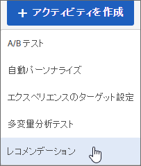
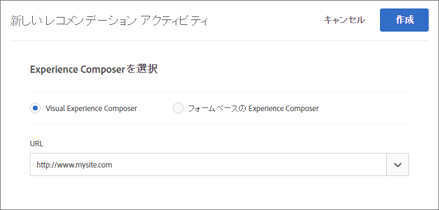
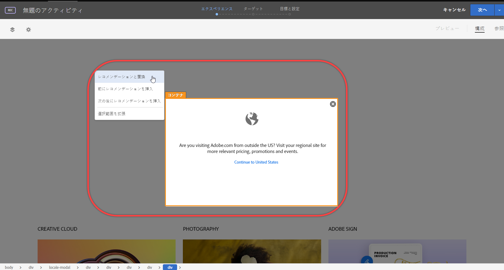
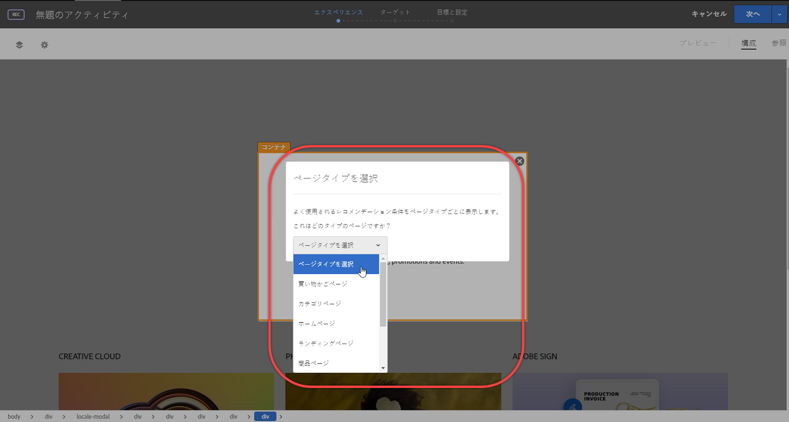
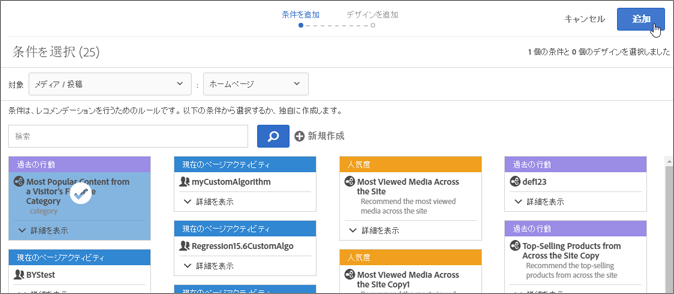
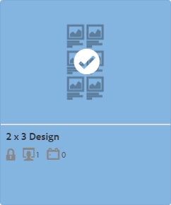
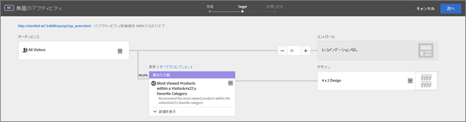

#  Recommendations アクティビティの作成{#create-a-recommendations-activity}

Target の Visual Experience Composer（VEC）を使用すると、Target を有効にしたページ上に Recommendations アクティビティを作成し、Target 内でページの一部を変更することができます。

1. **[!UICONTROL アクティビティを作成]**／**[!UICONTROL レコメンデーション]** をクリックします。

   

1. アクティビティ URL を指定し、「**[!UICONTROL 次へ]**」をクリックします。

   >[!NOTE]
   >
   >[!DNL Target] は URL プロトコル（[!DNL https] および [!DNL http]）を区別しません。その結果、[!DNL `http://www.adobe.com`] と [!DNL `https://wwww.adobe.com`] の両方が一致します。

   アクティビティ URL は、レコメンデーションが表示されるページです。

   

   フォームベースの Experience Composer を使用したい場合は、そちらのオプションを選択します。詳しくは、[フォームベースの Experience Composer](https://marketing.adobe.com/resources/help/en_US/target/target/t_form_experience_composer.html) を参照してください。

   「[!UICONTROL 次へ]」をクリックすると、VEC が開き、ページが表示されます。現在の要素をレコメンデーションで置き換えたり、レコメンデーションを挿入したりすることができます。

   問題がある VEC のトラブルシューティング情報については、[Visual Experience Composer のトラブルシューティング](../../c-experiences/c-visual-experience-composer/r-troubleshoot-composer/troubleshoot-composer.md#reference_77743144F10143A3A89D56E116D296E4)を参照してください。
1. ページの要素をクリックします。要素がある位置でレコメンデーションを使用できる場合は、選択した要素の前か後で 「**[!UICONTROL レコメンデーションと置換]**」または「**[!UICONTROL レコメンデーションを挿入]**」をクリックします。

   

   要素をレコメンデーションと置換すると、現在の内容が削除されてレコメンデーションに置き換わります。
1. ページタイプを選択します。

   

1. 1 つ以上の条件を選択します。

   条件が、それぞれの情報を表示するカードとして表示されます。デフォルトでは、[!UICONTROL 条件を選択]画面には、選択した業種およびページタイプと互換性のある条件が表示されます。これらのオプションを変更すると、他の条件を表示できます。

   >[!NOTE]
   >
   >すべてのページですべての条件が正しく実行されるわけではありません。現在の品目／現在のカテゴリーのレコメンデーションと互換性を持たせるために、ページや mbox には `entity.id` か `entity.categoryId` を渡す必要があります。通常は、互換性のある条件のみを表示するようにします。ただし、アクティビティで互換性のない条件を有効にしたい場合は、「**[!UICONTROL 互換性あり]」チェックボックスのチェックを外します。** お使いの Recommendations の設定（**[!UICONTROL Recommendations]**／**[!UICONTROL 設定]**／**[!UICONTROL 非互換の条件をフィルター]**）によっては、[!UICONTROL 互換性]オプションが表示されない場合があります。詳しくは、[設定](../../c-recommendations/plan-implement.md#concept_C1E1E2351413468692D6C21145EF0B84)を参照してください。

   

   複数の条件を選択すると、トラフィックは選択した条件間で等しく分割されます。例えば、2 つの条件が選択されており、アクティビティ参加者の 20％にデフォルトコンテンツを表示するようにアクティビティがデザインされている場合、各条件によって制御されるレコメンデーションがアクティビティ参加者の 40％に表示されます。各条件の割合を変更するオプションはありません。

* （例えば、多くの条件カードが表示されている場合に）既存の条件を検索するには、必要な条件が表示されるまで検索フィールドに入力し、条件を選択して「**[!UICONTROL 完了]**」をクリックします。

   [!DNL Recommendations] によって提供される条件もあります。カスタムの条件を作成することも可能です。

* 新しい条件を作成するには、**[!UICONTROL 新規作成]**／**[!UICONTROL 条件を作成]** をクリックし、新しい条件についての情報を入力します。新しい条件の作成について詳しくは、[条件の作成](../../c-recommendations/c-algorithms/create-new-algorithm.md#task_8A9CB465F28D44899F69F38AD27352FE)を参照してください。
* また、条件をシーケンスにグループ化することもできます。新しい条件のシーケンスを作成するには、**[!UICONTROL 新規作成]**／**[!UICONTROL 条件のシーケンスを作成]** をクリックします。詳しくは、[条件のシーケンスの作成](../../c-recommendations/c-algorithms/create-criteria-sequence.md#task_8A9CB465F28D44899F69F38AD27352FE)を参照してください。

1. 「**[!UICONTROL 次へ]**」をクリックします。
1. デザインを選択します。

   デザインとは、ページ上の場所の表示方法を決めるテンプレートです。[!DNL Target] には、いくつかの事前に定義されたデザインが含まれています。カスタムのデザインを作成することも可能です。詳しくは、[デザインの作成](../../c-recommendations/c-design-overview/create-design.md#task_CC5BD28C364742218C1ACAF0D45E0E14)と[デザインのカスタマイズ](../../c-recommendations/c-design-overview/customizing-a-template.md#concept_94F1554C3F2E4CDB9A2C3D78F10EDA59)を参照してください。

   

   各デザインには、見え方のグラフィカル表示と、現在そのデザインで使用されているライブアクティビティおよび非アクティブなアクティビティの数を示すアイコンが表示されます。

* 1 つ以上の既存のデザインを選択するには、デザインをクリックしてから「**[!UICONTROL 完了]**」をクリックします。

   複数の条件を選択した場合は、選択できるデザインは 1 つだけです。

* カスタムデザインを作成するには、「**[!UICONTROL 新規作成]**」をクリックして新しいデザインの名前とコードを入力します。「**[!UICONTROL 次へ]**」をクリックし、画像を選択またはアップロードして、**[!UICONTROL 完了]**／**[!UICONTROL 完了]** をクリックします。新しいデザインの作成について詳しくは、[デザインの作成](../../c-recommendations/c-design-overview/create-design.md#task_CC5BD28C364742218C1ACAF0D45E0E14)を参照してください。

1. 「**[!UICONTROL 次へ]**」をクリックします。

   レコメンデーションにプロモーションを追加することもできます。プロモーション - 前とプロモーション - 後の追加について詳しくは、[プロモーションの追加](../../c-recommendations/t-create-recs-activity/adding-promotions.md#task_CC5BD28C364742218C1ACAF0D45E0E14).
1. 「**[!UICONTROL 保存]**」をクリックします。

   VEC 画面に、ページのレコメンデーションデザインが表示されます。
1. （オプション）「**[!UICONTROL プレビュー]**」をクリックして、アクティビティが訪問者にどのように表示されるかを確認します。

[!UICONTROL プレビュー]モードを使用すると、訪問者と同様にレコメンデーションを操作できます。

レコメンデーションのプレビューを完了したら、「**[!UICONTROL 作成]**」をクリックします。
1. VEC でレコメンデーションを確認し、「**[!UICONTROL 次へ]**」をクリックします。

   フロー図が表示されます。1. フロー図で [!DNL Recommendations] アクティビティを確認し、必要に応じて変更します。

   

   フロー図を使用すると、アクティビティに対するオーディエンスの選択、エクスペリエンスの設定、成功指標の指定の手順を順に実行できます。フロー図から、次のことを実行できます。

* レコメンデーションが表示されるオーディエンスを変更する

   >[!NOTE]
   >
   >既存のオーディエンスの選択に加え、新規のオーディエンスを作成する代わりに、[アクティビティのみのオーディエンスを作成](../../c-target/creating-activity-only-audience.md#concept_A6BADCF530ED4AE1852E677FEBE68483)したり、[複数のオーディエンスを結合](../../c-target/combining-multiple-audiences.md#concept_A7386F1EA4394BD2AB72399C225981E5)してアドホックな結合オーディエンスを作成することができます。

   デフォルトでは、すべてのユーザーにレコメンデーションが表示されますが、レコメンデーションの対象を特定のオーディエンスのみにすることもできます。

   [!DNL Recommendations] アクティビティでは、制御グループはレコメンデーションなしでページが表示されます。

* 条件を表示します。
* コレクションを変更します（「[!UICONTROL 条件]」ラベルの横）。
* コントロールエクスペリエンスを表示する参加者の割合を変更します。
* デザインコードを表示します。
* デザインを変更または削除します。

1. 終了したら「**[!UICONTROL 次へ]」をクリックします。**
1. アクティビティを設定します。

   例えば、アクティビティの名前（必須）および目標（任意）を入力します。設定について詳しくは、[Recommendations アクティビティの設定](../../c-recommendations/t-create-recs-activity/recs-activity-settings.md#reference_3FDA8388CEEC4159949151C1829E2FBB).

   >[!NOTE]
   >
   >[!DNL Recommendations Classic] の別のアクティビティとして既に存在する [!DNL Recommendation] アクティビティ名を指定すると、新しいアクティビティは、新しい名前で再同期されます。新しい名前は、一意なものにするために、元の名前にタイムスタンプが追加されたものになります。この新しい名前は、[!DNL Target Standard/Premium] と [!DNL Recommendations Classic] の両方で表示されます。

1. 終了したら「**[!UICONTROL 保存]**」をクリックします。

   アクティビティの概要が表示されます。[!UICONTROL 概要]ページから、次のことを実行できます。

* アクティビティをアクティブ化します。
* アクティビティを編集します。
* アクティビティを Experience Cloud ボードにピン止めします。
* エクスペリエンスの URL を表示します。
* データをダウンロードします。
* コントロールエクスペリエンスを表示するアクティビティ参加者の割合を変更します。
* キャンペーンの詳細情報の表示や非表示をおこないます。
* デザインのコードを表示します。

1. （オプション）[!UICONTROL レポート]ページを開いて、[!DNL Recommendations] アクティビティのパフォーマンスのレポートを表示します。
1. （オプション）[!UICONTROL 衝突]ページを開いて、発生した可能性がある[アクティビティの衝突](https://marketing.adobe.com/resources/help/en_US/target/target/c_activity_collisions.html)を表示します。

   複数のアクティビティから同一のページにコンテンツが配信されるように設定されている場合に、アクティビティの衝突が発生します。その場合、予期しないコンテンツが表示されることがあります。
