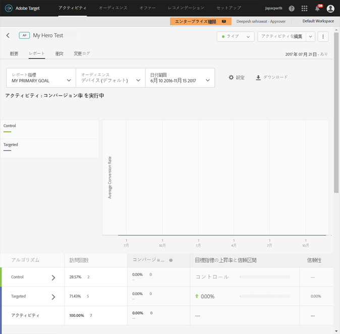

# 自動ターゲット概要レポート{#auto-target-summary-report}

自動ターゲット概要レポートの解釈方法に関する情報。

以下の図に、自動ターゲットを使用した場合の標準的な概要レポートを示します。

自動ターゲットのレポートを見るときのヒントやポイントは次のとおりです。

* 表の様々な行は、アクティビティのパフォーマンスを把握するのに役立ちます。

   * レポートページ上の表の最初の 2 行には、コントロール（ランダムに提供されるエクスペリエンス）に配分された訪問者と、パーソナライゼーションアルゴリズムに配分された訪問者を比較する A/B テストの結果が表示されます。このデータを見れば、ランダムに提供されるコントロールと比較して、パーソナライゼーションアルゴリズムがどの程度のパフォーマンスを発揮しているかを把握できます。
   * その他の行には、エクスペリエンス単位の結果が表示されます。各エクスペリエンスで、ランダム提供のコントロールとしてそのエクスペリエンスが提供された訪問者の平均反応率と、パーソナライゼーションアルゴリズムを使用してエクスペリエンスが提供された訪問者の平均反応率を比較できます。

* レポートの各エクスペリエンスの横にある緑のチェックアイコンは、対象のエクスペリエンス用にパーソナライズされた機械学習モデルが作成されたことを意味します。時計アイコンは、トラフィックの量が不十分でモデルがまだ作成されていないことを意味します。

   * モデルはエクスペリエンスごとに構築されるので、緑のチェックアイコンが表示されているエクスペリエンスと、時計アイコンが表示されているエクスペリエンスが混在する場合もあります。
   * このケースでは、アクティビティのすべてのエクスペリエンスのモデル構築を高速化するために、まだモデルが構築されていないエクスペリエンスに追加トラフィックを送るようになっています。
   * パーソナライゼーションを開始するためには、モデルが構築されたエクスペリエンス（緑のチェックマーク）が少なくとも 2 つ必要です。

* エクスペリエンス A とエクスペリエンス B のコンバージョン率の比較は、自動ターゲットでは適切な比較ではありません。この機能の要点は、エクスペリエンス A がインテリジェントな方法で提供された場合に、ランダムで提供された場合よりもパフォーマンスが高まるのかどうかということです。マーケティング担当者は、個々のエクスペリエンスの上昇率を見るときに注意する必要があります。パーソナライゼーションアルゴリズムでは、個々のエクスペリエンス単位ではなく、アクティビティ全体での成功指標を重視して最適化をおこなうためです。
* 最も高い上昇率を示すエクスペリエンスは、母集団内で最も高い差別化要因を持つと考えることができます。これは、特定のエクスペリエンスを最も好むセグメントをアルゴリズムが見つけたということです。

