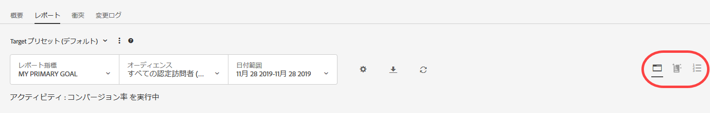
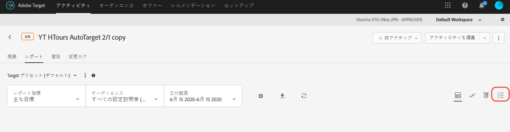
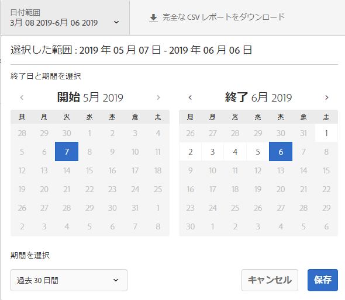
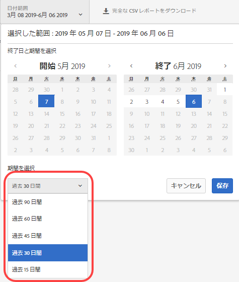
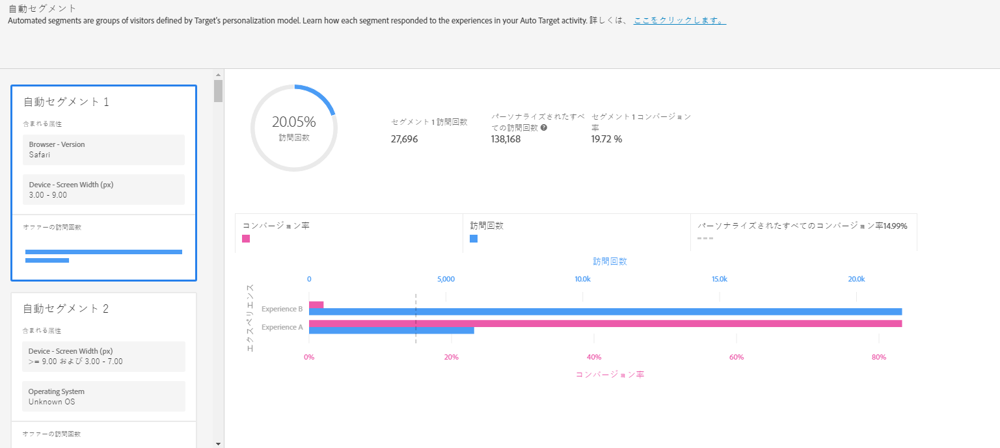
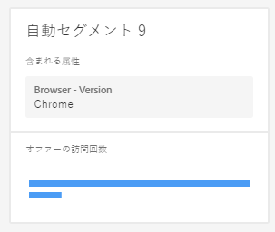
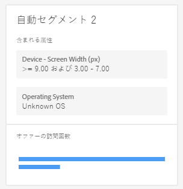

#  自動セグメントレポート{#automated-segments-report}

Automated Personalization（AP）および自動ターゲット（AT）アクティビティのユーザーが利用できる 2 つの特殊なレポートの 1 つである自動セグメントレポートについて説明します。

>[!NOTE]
>AP および AT アクティビティは、Target Premium ソリューションの一部です。これらは、Target Premium ライセンスのない Target Standard には付属していません。
>
>パーソナライゼーションインサイトレポートは、コンバージョン最適化目標を使用する AP および AT アクティビティについてのみ使用できます。アクティビティがライブになった後で最適化目標が売上高からコンバージョンに変更されたアクティビティもサポートされません。|

AP／AT アクティビティでのオファーやエクスペリエンスへの反応は、訪問者によって異なります。このレポートは、Target のパーソナライゼーションモデルで定義された様々な自動セグメントがアクティビティのオファー／エクスペリエンスにどう反応しているかを示します。

## 自動セグメントレポートへのアクセス {#section_8E8F997AAAF44A1B9EE06EB6FB652801}

1. 「**[!UICONTROL アクティビティ]**」をクリックしてから、希望する [AP](../../c-activities/t-automated-personalization/automated-personalization.md#task_8AAF837796D74CF893CA2F88BA1491C9) または [AT](../../c-activities/auto-target-to-optimize.md#concept_67779E5B7F67427A97D7EA2A6FB919B3) アクティビティをリストからクリックします。

   多数のアクティビティが表示される場合は、「[!UICONTROL 種類]」、「[!UICONTROL ステータス]」、「[!UICONTROL レポートソース]」、「[!UICONTROL Experience Composer]」、「[!UICONTROL 指標のタイプ]」、「[!UICONTROL アクティビティソース]」のドロップダウンリストからオプションを選択して、リストにフィルターを適用できます。

1. 「**[!UICONTROL レポート]**」をクリックします。

   最初の画面アイコンで表される[!UICONTROL 概要]レポートが開かれ、アクティビティのパフォーマンスに関する情報が表示されます。2 つの追加アイコンは、自動セグメントと重要な属性の 2 つのパーソナライゼーションインサイトレポートを表しています。自動ターゲットには、さらに[!UICONTROL 概要]レポートのグラフィック表示用のグラフアイコンがあることに注意してください。

   

   >[!IMPORTANT]
   >
   >[!UICONTROL 自動セグメント]レポートは、アクティビティを有効にしてから 15 日以上経過するまでは使用できません。この初期期間中は、このレポートにアクセスできません。また、[!UICONTROL 自動セグメント]アイコンをクリックすることもできません。15 日が経過したら、パーソナライズされた十分なトラフィックがアクティビティにあると仮定して、[!UICONTROL 自動セグメント]レポートを使用できるようになります。

1. アクティビティをアクティブ化してから 15 日経ったら、**[!UICONTROL 自動セグメント]アイコンをクリックできます。**

   

1. 目的の日付範囲を選択します。

   [!UICONTROL 概要]レポート（パフォーマンスレポート）とは異なり、[!UICONTROL 自動セグメント]などの[!UICONTROL パーソナライゼーションインサイト]レポートは、15 日、30 日、45 日、60 日、90 日の固定日付範囲でのみ使用できます。これらの固定日付範囲を使用すると、[!UICONTROL パーソナライゼーションインサイト]で十分に広い範囲のデータを使用して、アクティビティにおける短期的なパターンからインサイトを得る危険性を減らすことができます。日付範囲について決定できるのは、「終了日」と「期間」の 2 つです。「開始日」はグレー表示になっています。開始日は、選択した終了日と期間に基づいて自動的に変わります。

   

   使用可能な固定日付範囲には、「[!UICONTROL 期間の選択]」ドロップダウンリストからアクセスできます。

   

1. [!UICONTROL 自動セグメント]レポートデータを確認します。

   

1. （オプション）[CSV 形式のレポートをダウンロード](../../c-reports/c-report-settings/report-settings.md#section_77E65C50BAAF4AB79242DB3A8778ADEF)して、Excel や他のツールで分析をおこないます。

   >[!NOTE]
   >
   >パーソナライゼーションインサイトの UI レポートには、限定された情報のみ含まれています。自動セグメントレポートの CSV ダウンロードには、さらに詳細な情報が含まれています。自動セグメントレポートのダウンロードには、UI に含まれている上位セグメント以外のセグメントのほか、オファーやエクスペリエンスに対するこれらのセグメントのパフォーマンスが含まれています。

## 自動セグメントレポートの解釈

レポートの要素と解釈方法について、次の表で説明します。

| 要素 | 詳細 |
|--- |--- |
| 左側パネル | 左側パネルには、Target のパーソナライゼーションモデルで特定された、このアクティビティの大規模な「自動セグメント」の上位 20 個が一覧表示されます。「自動セグメント」はオーディエンスに似ていますが、マーケティング担当者ではなく Target のパーソナライゼーションモデルで定義されます。それぞれの自動セグメントは特定の属性の特定の値（または値の範囲）で構成されます。 自動セグメントは重複することがある点に注意してください。自動セグメントは、1 つ、2 つ、3 つまたは 4 つの属性で定義することができます。詳しくは、以下の例を参照してください。 Target のパーソナライゼーションモデルについて詳しくは、[ランダムフォレストアルゴリズム](/help/c-activities/t-automated-personalization/algo-random-forest.md)を参照してください。Target のパーソナライゼーションモデルで自動セグメントの作成に使用する属性について詳しくは、[Target のパーソナライゼーションアルゴリズムのデータ収集](/help/c-activities/t-automated-personalization/ap-data.md)を参照してください。 |
| 中央グラフ | 中央グラフには、ハイライト表示された自動セグメントに対してアクティビティのコンテンツがどのように機能したかが表示されます。左側パネルで異なるセグメントをクリックすると、中央グラフが更新されます。 |
| 円グラフ | 中央パネルの上部にある円グラフには、自動セグメントのサイズのほか、アクティビティにおけるパーソナライズされた訪問の合計数が表示されます（このような訪問には、例えば、パーソナライゼーションモデルで提供された、このアクティビティへのトラフィックなどが含まれます。制御トラフィックや、勝者モデル全体で提供されるトラフィックは含まれません）。セグメントのサイズは、パーソナライズされた訪問にのみ基づいている点に注意してください。  |
| 2 軸棒グラフ | 2 軸棒グラフには、その特定の自動セグメントのオファーまたはエクスペリエンス別に、訪問およびコンバージョンの情報が表示されます。 |
| ピンクのバー | ピンクのバーはコンバージョン率を表し、グラフの下部の軸を使用します。バーにマウスポインターを合わせると、詳細が表示されます |
| 青のバー | 青のバーは訪問数を表し、グラフの上部の軸を使用します。バーにマウスポインターを合わせると、詳細が表示されます。 |
| グレーの点線 | グレーの点線は、アクティビティのすべてのオファー／エクスペリエンスおよび自動セグメントにわたる、パーソナライズされたすべての訪問のコンバージョン率を表します。 |

**自動セグメントの例 1**

この自動セグメントは、1 つの属性にのみ基づいて定義されています。この自動セグメントに含まれている訪問者には、平日の勤務時間外や週末に、この AP アクティビティが発生しました。

**自動セグメントの例 2**

この自動セグメントは 2 つの属性に基づいて定義されています。この自動セグメントに含まれていてこの AP アクティビティを経験した訪問者は、現在の訪問のページビュー数が 3 未満で、緯度 42.57°から 47.29°までの範囲（米国を拠点とする企業の場合は、ほぼニューハンプシャー／オレゴン州とワシントン／メイン州の間）に位置していました。

## 自動セグメントに関する FAQ {#section_740910A52FA646B4AC9452F98C2F5719}

**自分のアクティビティにまだパーソナライゼーションインサイトレポートを使用できません。これはなぜですか？**

お客様のアクティビティにまだ[!UICONTROL パーソナライゼーションインサイト]レポートを使用できない場合は、次のように、いくつかの理由があります。

* アクティビティをアクティブ化してからまだ 15 日経過していません。アクティビティを開始してから 15 日以上経過するまで、自動セグメントレポートと重要な属性レポートは使用できません。この初期期間中は、これらのレポートにアクセスできません。また、自動セグメントアイコンと重要な属性アイコンをクリックすることもできません。
* 指定した期間中、アクティビティに十分なトラフィックがありませんでした。15 日が経過したら、パーソナライゼーションモデルを構築できるだけのパーソナライズされた十分なトラフィックがアクティビティにあると仮定して、自動セグメントレポートと重要な属性レポートを使用できるようになります。
* お客様のアクティビティに売上高最適化目標があります。現時点では、[!UICONTROL パーソナライゼーションインサイト]は、コンバージョン最適化目標のアクティビティにのみ使用できます。今後のリリースで、売上高最適化目標のアクティビティもサポートする予定です。

**属性とは何ですか？**

属性は、訪問者または訪問者の特定の訪問に関する情報で、トラフィックのパーソナライズ方法を知るためにパーソナライゼーションアルゴリズムで使用されます。例えば、ブラウザータイプ、場所、訪問時刻などが属性になります。

[!DNL Target] でパーソナライゼーションモデルで使用される属性について詳しくは、[Target のパーソナライゼーションアルゴリズムのデータ収集](../../c-activities/t-automated-personalization/ap-data.md#reference_255BD3DE7AD04DC9B766E0BC78961058)を参照してください。新しい属性を Target にアップロードして Target のパーソナライゼーションモデルで使用する方法について詳しくは、[データを Target に送信する方法](../../c-implementing-target/c-considerations-before-you-implement-target/c-methods-to-get-data-into-target/methods-to-get-data-into-target.md#concept_0069C0EFB56C4700BB33F2F35C2B9B17)を参照してください。

**自動セグメントとは何ですか？**

「自動セグメント」はオーディエンスに似ていますが、マーケティング担当者ではなく Target のパーソナライゼーションモデルで定義されます。

自動セグメントは特定の属性の特定の値（または値の範囲）で構成されます。自動セグメントの例については、上記の手順 5 を参照してください。セグメントは重複することがある点に注意してください。

Target のパーソナライゼーションモデルの基礎となるランダムフォレストパーソナライゼーションアルゴリズムについて詳しくは、[ランダムフォレストアルゴリズム](../../c-activities/t-automated-personalization/algo-random-forest.md#concept_48F3CDAA16A848D2A84CDCD19DAAE3AA)を参照してください。

**自動セグメントの順序は何で決まりますか？**

セグメントのサイズと、アクティビティのコンテンツに対するセグメントのパフォーマンスに基づいて、セグメントごとにスコアが計算されます。これらの入力の組み合わせによって、自動セグメントの順序が決まります。異なるコンテンツへの反応の違いが大きい大規模なセグメントほど、セグメントリストの上位に表示されるようになります。

**自動セグメントレポートにオファー／エクスペリエンスの一部しか表示されないのはなぜですか？**

AP および AT アクティビティでは、オファーごとに 1 つのモデル（AP の場合）およびエクスペリエンスごとに 1 つのモデル（AT の場合）を構築します。これらのアクティビティでは、パーソナライズされたトラフィックの提供を開始し、構築された 2 つのモデルで[!UICONTROL パーソナライゼーションインサイト]を作成します。[!UICONTROL パーソナライゼーションインサイト]で一部のオファー／エクスペリエンスが表示されない場合は、それら特定のオファー／エクスペリエンスに対してモデルが構築されていない可能性があります。アクティビティの[!UICONTROL 概要]レポートを調べ、問題のオファー／エクスペリエンスの横に時計のアイコンがあるかどうかを確認します。このアイコンは、そのオファー／エクスペリエンスに対してまだモデルが構築されていないことを示します。

**コンバージョン率の低いオファー／エクスペリエンスでも、特定の自動セグメントの他のオファー／エクスペリエンスより多くのトラフィックを獲得することがあるのはなぜですか？**

自動セグメント内のコンバージョン率の低いオファーやエクスペリエンスの方が訪問数が多い場合、考えられる理由は次のようにいくつかあります。

* 特定の自動セグメントのオファー／エクスペリエンスの一部またはすべてについて、ビュー数が少ない。
* 小規模のアクティビティで、特定のオファー／エクスペリエンスにモデルが構築されていなかったり、一部のオファー／エクスペリエンスに他よりも早くモデルが構築されている。
* どの訪問者にどのオファー／エクスペリエンスが表示されるかを制限する特定のオファーにターゲットルールが設定されている。

**[!UICONTROL 自動セグメント]レポートと[!UICONTROL 重要な属性]レポートの情報は、CSV ダウンロードの情報と同じですか？**

いいえ、UI レポートには、限定された情報のみ含まれています。CSV ダウンロードには、追加の詳細情報が含まれています。自動セグメントインサイトレポートのダウンロードには、UI に含まれている上位セグメント以外のセグメントのほか、オファーやエクスペリエンスに対するこれらのセグメントのパフォーマンスが含まれています。重要な属性レポートには、上位 100 個の訪問者属性とそれらの相対的重要度が含まれていますが、UI には上位 10 個の訪問者属性のみ含まれます。

**[!UICONTROL パーソナライゼーションインサイト]をカスタムの日付範囲で表示できますか？**

パーソナライゼーションインサイトレポート（[!UICONTROL 自動セグメント]と[!UICONTROL 重要な属性]の両方）は、15 日、30 日、45 日、60 日、90 日の固定日付範囲でのみ使用できます。これらの固定日付範囲を使用すると、[!UICONTROL パーソナライゼーションインサイト]で十分に広い範囲のデータを使用して、アクティビティにおける短期的なパターンからインサイトを得る危険性を減らすことができます。これらの期間は任意の終了日に対して選択できます（期間を満たすのに十分なデータがアクティビティにある場合）。

**[!UICONTROL パーソナライゼーションインサイト]はどのように作成するのですか？**

[!UICONTROL パーソナライゼーションインサイト]は、MAGIX（Model Agnostic Globally Interpretable Explanations）と呼ばれる、アドビの特許出願中の手法を使用して作成されます。MAGIX について詳しくは、[arXiv.org Web サイト](https://arxiv.org/abs/1706.07160)でアドビの研究部門の公表論文を参照してください。

**[!UICONTROL 自動セグメント]レポートの合計訪問者トラフィックデータが、AP または AT の概要／パフォーマンスレポートに一致しないのはなぜですか？**

[!UICONTROL パーソナライゼーションインサイト]レポートには、Target のパーソナライゼーションモデルで選択されたコンテンツを閲覧した訪問者のみ含まれています（つまり、制御トラフィックや、勝者モデル全体で提供されるトラフィックは考慮されません）。このトラフィックタイプは、「パーソナライズされた」トラフィックと呼ばれます。AP／AT の概要パフォーマンスレポートには、制御トラフィックと「ターゲット」トラフィックが含まれています。ターゲットトラフィックには、パーソナライズされたトラフィックのほか、勝者モデル全体を使用して提供されたトラフィックや、学習の継続に使用されるランダム提供のトラフィックも含まれます。

**自動セグメントは相互排他的ですか？**

いいえ、自動セグメント間には重複があります。

**[!UICONTROL パーソナライゼーションインサイト]は売上高ベースのモデリング目標／主な目標に使用できますか？**

現時点では、[!UICONTROL パーソナライゼーションインサイト]は、コンバージョン最適化目標のアクティビティにのみ使用できます。今後のリリースで、売上高最適化目標のアクティビティもサポートする予定です。

**パーソナライゼーションインサイトの情報を活用するには、他にどのような方法がありますか？**

* ターゲットとなる新しいオーディエンスを発見します。パフォーマンスが特に良い特定の自動セグメントが見つかったら、そのセグメントを他のレポートで再利用できるようにオーディエンスを作成することを検討するとよいでしょう。
* どのようなタイプの訪問者がどのエクスペリエンスに反応するかについての仮説を検証します。
* どのようなコンテンツがどのような種類の訪問者に対して機能したか、どのようなオファーがどの訪問者に効果的であったかについてのインサイトを得ます。
* パフォーマンスの悪いコンテンツを特定します。
* モデルの学習に最も重要であった属性を把握します。
* パーソナライゼーションモデルで使用される属性と、それらの重要度を確認します。
* Target に追加のデータポイントを渡して、パーソナライゼーションに役立つ情報を拡充する機会を特定します。

**セグメントカードでの属性の表示順序は何らかのロジックに基づいているのですか。**

いいえ、カードの順序は上記のランキングにのみ基づいています。カード内の属性の順序は、どのようなロジックにも基づいていません。