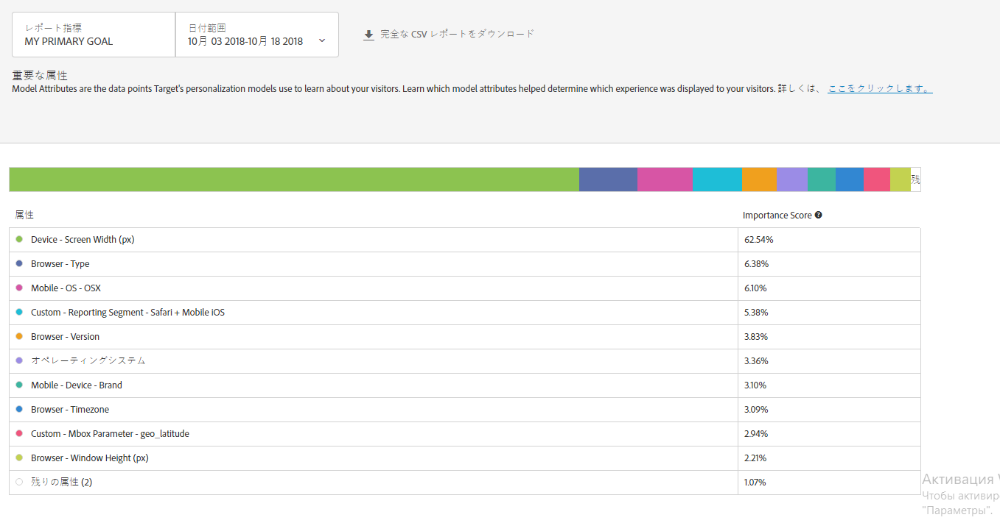

#  重要な属性レポート{#important-attributes-report}

Automated Personalization（AP）および自動ターゲット（AT）アクティビティのユーザーが利用できる 2 つの特殊なレポートの 1 つである重要な属性レポートについて説明します。

>[!NOTE]
>AP および AT アクティビティは、Target Premium ソリューションの一部です。これらは、Target Premium ライセンスのない Target Standard には付属していません。
>
>パーソナライゼーションインサイトレポートは、コンバージョン最適化目標を使用する AP および AT アクティビティについてのみ使用できます。アクティビティがライブになった後で最適化目標が売上高からコンバージョンに変更されたアクティビティもサポートされません。|

異なるアクティビティでは、モデルによるパーソナライゼーションの決定にとって重要な属性も多かれ少なかれ異なります。このレポートは、モデルに影響を及ぼした上位の属性とそれら属性の相対的重要性を示します。

## 重要な属性レポートへのアクセス {#section_8E8F997AAAF44A1B9EE06EB6FB652801}

1. 「**[!UICONTROL アクティビティ]**」をクリックしてから、希望する [AP](../../c-activities/t-automated-personalization/automated-personalization.md#task_8AAF837796D74CF893CA2F88BA1491C9) または [AT](../../c-activities/auto-target-to-optimize.md#concept_67779E5B7F67427A97D7EA2A6FB919B3) アクティビティをリストからクリックします。

   多数のアクティビティが表示される場合は、「[!UICONTROL 種類]」、「[!UICONTROL ステータス]」、「[!UICONTROL レポートソース]」、「[!UICONTROL Experience Composer]」、「[!UICONTROL 指標のタイプ]」、「[!UICONTROL アクティビティソース]」のドロップダウンリストからオプションを選択して、リストにフィルターを適用できます。

1. 「**[!UICONTROL レポート]**」をクリックします。

   最初の画面アイコンで表される[!UICONTROL 概要]レポートが開かれ、アクティビティのパフォーマンスに関する情報が表示されます。2 つの追加アイコンは、自動セグメントと重要な属性の 2 つのパーソナライゼーションインサイトレポートを表しています。自動ターゲットには、さらに[!UICONTROL 概要]レポートのグラフィック表示用のグラフアイコンがあることに注意してください。

   

   >[!IMPORTANT]
   >
   >[!UICONTROL 重要な属性]レポートは、アクティビティを有効にしてから 15 日以上経過するまでは使用できません。この初期期間中は、このレポートにアクセスできません。また、[!UICONTROL 重要な属性]アイコンをクリックすることもできません。15 日が経過したら、パーソナライズされた十分なトラフィックがアクティビティにあると仮定して、[!UICONTROL 重要な属性]レポートを使用できるようになります。

1. アクティビティをアクティブ化してから 15 日経ったら、**[!UICONTROL 重要な属性]アイコンをクリックできます。**

   

1. 目的の日付範囲を選択します。

   [!UICONTROL 概要]レポート（パフォーマンスレポート）とは異なり、[!UICONTROL 重要な属性]などの[!UICONTROL パーソナライゼーションインサイト]レポートは、15 日、30 日、45 日、60 日、90 日の固定日付範囲でのみ使用できます。これらの固定日付範囲を使用すると、[!UICONTROL パーソナライゼーションインサイト]で十分に広い範囲のデータを使用して、アクティビティにおける短期的なパターンからインサイトを得る危険性を減らすことができます。日付範囲について決定できるのは、「終了日」と「期間」の 2 つです。「開始日」はグレー表示になっています。開始日は、選択した終了日と期間に基づいて自動的に変わります。

   

   使用可能な固定日付範囲には、「[!UICONTROL 期間の選択]」ドロップダウンリストからアクセスできます。

   

1. [!UICONTROL 重要な属性]レポートデータを確認します。

   

1. （オプション）[CSV 形式のレポートをダウンロード](../../c-reports/c-report-settings/report-settings.md#section_77E65C50BAAF4AB79242DB3A8778ADEF)して、Excel や他のツールで分析をおこないます。

   >[!NOTE]
   >
   >パーソナライゼーションインサイトの UI レポートには、限定された情報のみ含まれています。重要な属性レポートの CSV ダウンロードには、さらに詳細な情報が含まれています。重要な属性レポートのダウンロードには、上位 100 個の属性の完全なリストが含まれていますが、UI レポートには上位 10 個の属性のみ含まれています。レポートで特定の属性を探しても見つからない場合は、その属性がアクティビティに影響を及ぼさなかったわけではなく、ただ上位 100 個の属性のリストに含まれなかっただけです。

## 重要な属性レポートの解釈

レポートの要素と解釈方法について、次の表で説明します。

| 要素 | 詳細 |
|--- |--- |
| 棒グラフ | 画面上部にある多色の横向き棒グラフでは、これらの相対的重要度スコアを視覚化し、表内の各属性の横にあるドットの色にマッピングさせることができます。棒グラフの特定の色にマウスポインターを合わせると、その色で表される属性が表示されます。上位 100 個の属性の重要度スコアを加算すると 100% になります。Target のパーソナライゼーションモデルで使用できる属性を追加する方法について詳しくは、[Target のパーソナライゼーションアルゴリズムのデータのアップロード](/help/c-activities/t-automated-personalization/uploading-data-for-the-target-personalization-algorithms.md). |
| モデル属性ランキンググラフ | モデル属性ランキングには、各訪問者にどのようなコンテンツを表示するかを Target のパーソナライゼーションモデルで決定するうえで最も重要であった上位 10 個の属性が含まれています。重要度スコアは、このアクティビティにおける Target のパーソナライゼーションモデルにとって特定の属性がどの程度重要であったかを、上位 100 個の属性を基準にして示します。 |

## 重要な属性に関する FAQ {#section_740910A52FA646B4AC9452F98C2F5719}

**自分のアクティビティにまだパーソナライゼーションインサイトレポートを使用できません。これはなぜですか？**

お客様のアクティビティにまだ[!UICONTROL パーソナライゼーションインサイト]レポートを使用できない場合は、次のように、いくつかの理由があります。

* アクティビティをアクティブ化してからまだ 15 日経過していません。アクティビティを開始してから 15 日以上経過するまで、自動セグメントレポートと重要な属性レポートは使用できません。この初期期間中は、これらのレポートにアクセスできません。また、自動セグメントアイコンと重要な属性アイコンをクリックすることもできません。
* 指定した期間中、アクティビティに十分なトラフィックがありませんでした。15 日が経過したら、パーソナライゼーションモデルを構築できるだけの[パーソナライズされた十分なトラフィック](/help/c-activities/auto-target-to-optimize.md#section_BA4D83BE40F14A96BE7CBC7C7CF2A8FB)がアクティビティにあると仮定して、自動セグメントレポートと重要な属性レポートを使用できるようになります。
* お客様のアクティビティに売上高最適化目標があります。現時点では、[!UICONTROL パーソナライゼーションインサイト]は、コンバージョン最適化目標のアクティビティにのみ使用できます。今後のリリースで、売上高最適化目標のアクティビティもサポートする予定です。

**属性とは何ですか？**

属性は、訪問者または訪問者の特定の訪問に関する情報で、トラフィックのパーソナライズ方法を知るためにパーソナライゼーションアルゴリズムで使用されます。例えば、ブラウザータイプ、場所、訪問時刻などが属性になります。

[!DNL Target] でパーソナライゼーションモデルで使用される属性について詳しくは、[Target のパーソナライゼーションアルゴリズムのデータ収集](../../c-activities/t-automated-personalization/ap-data.md#reference_255BD3DE7AD04DC9B766E0BC78961058)を参照してください。新しい属性を Target にアップロードして Target のパーソナライゼーションモデルで使用する方法について詳しくは、[データを Target に送信する方法](../../c-implementing-target/c-considerations-before-you-implement-target/c-methods-to-get-data-into-target/methods-to-get-data-into-target.md#concept_0069C0EFB56C4700BB33F2F35C2B9B17)を参照してください。

**[!UICONTROL 自動セグメント]レポートと[!UICONTROL 重要な属性]レポートの情報は、CSV ダウンロードの情報と同じですか？**

いいえ、UI レポートには、限定された情報のみ含まれています。CSV ダウンロードには、追加の詳細情報が含まれています。自動セグメントインサイトレポートのダウンロードには、UI に含まれている上位セグメント以外のセグメントのほか、オファーやエクスペリエンスに対するこれらのセグメントのパフォーマンスが含まれています。重要な属性レポートには、上位 100 個の訪問者属性とそれらの相対的重要度が含まれていますが、UI には上位 10 個の訪問者属性のみ含まれます。

**パーソナライゼーションインサイトをカスタムの日付範囲で表示できますか？**

パーソナライゼーションインサイトレポート（[!UICONTROL 自動セグメント]と[!UICONTROL 重要な属性]の両方）は、15 日、30 日、45 日、60 日、90 日の固定日付範囲でのみ使用できます。これらの固定日付範囲を使用すると、[!UICONTROL パーソナライゼーションインサイト]で十分に広い範囲のデータを使用して、アクティビティにおける短期的なパターンからインサイトを得る危険性を減らすことができます。これらの期間は任意の終了日に対して選択できます（期間を満たすのに十分なデータがアクティビティにある場合）。

**[!UICONTROL パーソナライゼーションインサイト]はどのように作成するのですか？**

[!UICONTROL パーソナライゼーションインサイト]は、MAGIX（Model Agnostic Globally Interpretable Explanations）と呼ばれる、アドビの特許出願中の手法を使用して作成されます。MAGIX について詳しくは、[arXiv.org Web サイト](https://arxiv.org/abs/1706.07160)でアドビの研究部門の公表論文を参照してください。

**[!UICONTROL パーソナライゼーションインサイト]は売上高ベースのモデリング目標／主な目標に使用できますか？**

現時点では、[!UICONTROL パーソナライゼーションインサイト]は、コンバージョン最適化目標のアクティビティにのみ使用できます。今後のリリースで、売上高最適化目標のアクティビティもサポートする予定です。

**重要な属性レポートの属性重要度スコアとは何ですか？**

レポートの「属性重要度ランキング」の重要度スコアを見れば、すべての訪問者を識別済みのセグメントに分類する方法をアルゴリズムで決定したとき、学習に使用された変数のうち最も重要であったものがわかります。モデルで使用された上位 100 個の属性には、パーセントスコアが割り当てられています。

**コンバージョン率の低いオファー／エクスペリエンスでも、特定の自動セグメントの他のオファー／エクスペリエンスより多くのトラフィックを獲得することがあるのはなぜですか？**

自動セグメント内の低コンバージョンオファーやエクスペリエンスへの訪問回数が、以下のように、より多くの訪問回数に表示される可能性があります。

* 特定の自動セグメントのオファー／エクスペリエンスの一部またはすべてについて、ビュー数が少ない。
* 特定のオファーまたはエクスペリエンスにモデルが構築されていない小規模なアクティビティ。
* 一部のオファー/エクスペリエンスの中でモデルが他のオファーよりも早く構築されていた小規模なアクティビティ。例えば、追加モデルが22日に構築され、10~24日のデータを参照しているとします。
* 特定のオファーのターゲットルールをターゲット設定して、どの訪問者がどのオファー/エクスペリエンスを閲覧できるかを制限します。
* インサイトレポートに信頼区間はありません。ただし、コンバージョン率が十分に近い場合は、モデルがトラフィックを提供してポイント金額の高さが高くなることがありますが、「統計的に異なる」数値ではありません。

トラフィックを提供するモデルがどのように動作するかを把握することが役に立ちます。各個人は、プロフィールの合計に基づいて提供されます。ただし、インサイトレポートでは、この行動を一般化して人間によりより解釈可能になります。その結果、セグメントは相互に排他的ではありません。これによって、同じ人物が複数のセグメントに表示されるので、このタイプの行動が表示される可能性があります。

**パーソナライゼーションインサイトの情報を活用するには、他にどのような方法がありますか？**

* ターゲットとなる新しいオーディエンスを発見します。パフォーマンスが特に良い特定の自動セグメントが見つかったら、そのセグメントを他のレポートで再利用できるようにオーディエンスを作成することを検討するとよいでしょう。
* どのようなタイプの訪問者がどのエクスペリエンスに反応するかについての仮説を検証します。
* どのようなコンテンツがどのような種類の訪問者に対して機能したか、どのようなオファーがどの訪問者に効果的であったかについてのインサイトを得ます。
* パフォーマンスの悪いコンテンツを特定します。
* モデルの学習に最も重要であった属性を把握します。
* パーソナライゼーションモデルで使用される属性と、それらの重要度を確認します。
* Target に追加のデータポイントを渡して、パーソナライゼーションに役立つ情報を拡充する機会を特定します。