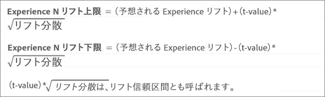
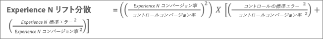
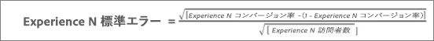
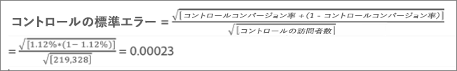
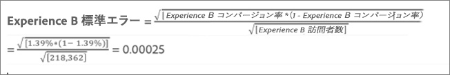
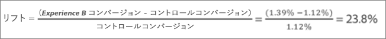
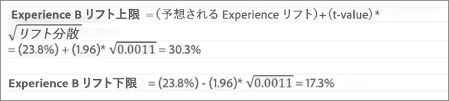

# 平均上昇率、上昇率範囲および信頼区間{#average-lift-lift-bounds-and-confidence-interval}

レポートには様々なデータポイントと視覚表現があり、アクティビティの上昇率範囲や信頼区間を把握する一助になります。こうした情報を参考にすれば、より的確に勝者を見極めることができます。

## 平均上昇率、上昇率範囲および信頼区間 {#topic_AFFDC672A8A34D028B100EF6BE5D8129}

レポートには様々なデータポイントと視覚表現があり、アクティビティの上昇率範囲や信頼区間を把握する一助になります。こうした情報を参考にすれば、より的確に勝者を見極めることができます。

>[!NOTE]
>
>この機能は、テーブル表示でレポートを表示するときにのみ使用できます。この機能は、Analytics をレポートソースに使用する（A4T）[アクティビティでは利用できません。](../../c-integrating-target-with-mac/a4t/a4t.md#concept_7540C8C04259434AB6EE33B09F47A1DE)。

## 概要 {#section_62C0D7E76F3D49A7B3C371C82AEF27D5}

Target のレポート UI には、上昇率関連の次の情報が含まれています。

| 要素 | 詳細 |
|--- |--- |
| 上昇率 | 数値の大きさと矢印が上昇率の推定値を表しています。この数値は上昇率の範囲の中間値です。推定上昇率の矢印は、信頼度が 95％に達するまでは灰色で表示されます。このしきい値を超えると、矢印の色は赤（マイナス）または緑（プラス）になります。 |
| 上昇率範囲 | 上昇率の 95％信頼区間を表します。平均上昇率の下に範囲として表示されます。これらの上昇率の計算方法の例については、以下の計算例を参照してください。 |
| 箱ひげグラフ | Target インターフェイスの箱ひげグラフは、対象の成功指標の推定値と 95％信頼区間を表しています。上昇率と上昇率範囲の情報を視覚的に表したものと言えます。 Target には、信頼度に関する情報を解釈する方法がいくつかありますが、その 1 つが色です。このグラフでは、特定のエクスペリエンスの信頼区間とコントロールの信頼区間の重複が灰色で表示されます。特定のエクスペリエンスの信頼区間の範囲は、コントロールの信頼区間より高い部分は緑、低い部分は赤で表示されます。 箱ひげのバーの長さを見れば、信頼区間の大きさがすぐにわかります。アクティビティのデータが蓄積されていくと、バーが変化していきます。信頼区間は平方偏差とサンプルサイズ（訪問者数）から求められます。平方偏差が小さくサンプルサイズが大きいほど、信頼区間は狭くなります。 |
| 信頼性 | エクスペリエンスまたはオファーの信頼度は、コントロールエクスペリエンス／オファーに対する対象のエクスペリエンス／オファーの上昇率が、偶然ではなく「本物」である確率を表します。一般的には、信頼度が 95％あれば上昇率を有意と判断できます。 |

次の図には、上昇率範囲と信頼水準の情報がまとめられています。

## 上昇率範囲の算出方法 {#section_1D360781D972483693680BE0F07AEAD1}

上昇率範囲は、コントロールエクスペリエンスまたはオファーに対する、特定のエクスペリエンスまたはオファーの上昇率の 95％信頼区間を表します。簡単に言えば、実際の上昇率は 95％の確率でこの範囲内に収まるという意味になります。

上昇率範囲の計算式は次のとおりです。

上昇率範囲の数値の算出には、他にもいくつかの要素が考慮されます。

* **t- value:** 当社95%信頼水準の重要な統計は1.96です。 [t- values](https://en.wikipedia.org/wiki/T-statistic)の詳細については、を参照してください。
* **上昇率の平方偏差：** 上昇率の平方偏差を求めるためには、エクスペリエンス N の成功指標の標準誤差と、コントロールエクスペリエンスの成功指標の標準誤差が必要です。計算式は次のとおりです（成功指標をコンバージョンとした場合の例です）。

   

* **コンバージョン率／成功指標の標準誤差：** 標準誤差の算出方法は、次のように、エクスペリエンス N とコントロールで同じです（成功指標をコンバージョンとした場合の例です）。詳しくは、[標準誤差の詳細](https://en.wikipedia.org/wiki/Standard_error)を参照してください。

   

   >[!NOTE]
   >
   >売上高成功指標アクティビティの標準エラーは、売上高のサンプル分散に基づいています。

## 計算の例 {#section_35BD6FB7AFD346E28BA093147C248471}

2 つのエクスペリエンスで構成されるアクティビティがあり、次のような結果が出たとします。

| エクスペリエンス | 訪問者数 | コンバージョン | コンバージョン率 |
|--- |--- |--- |--- |
| エクスペリエンス A（コントロール） | 219、328 | 2,466 | 1.12％ |
| エクスペリエンス B | 218、362 | 3,040 | 1.39％ |

アドビの計算式を使用し、これらの情報から上昇率範囲を求めることができます。

**エクスペリエンス A の標準誤差（コントロール）**

**エクスペリエンス B の標準誤差**

**エクスペリエンス B の上昇率の平方偏差**

**エクスペリエンス B の上昇率範囲**

エクスペリエンス B の推定上昇率は次のとおりです。

以上の計算から、エクスペリエンス B の上昇率範囲は次のようになります。

>[!NOTE]
>
>上記の数式とレポートに表示される数値を使用して、手動の計算の差異を最小にします。この差の原因は、手動計算で使用されるページビュー数が丸められていることにあります。Target のレポートに表示される上昇率は、合計エンゲージメント数とエンゲージメント数から得られた正確な数値に基づいています。エンゲージメントの数値は、パフォーマンスレポート API を介して取得できます。

## 上昇率範囲が表示されないケース{#section_C5622E1E94684DAD937249B51A9E42CC}

次のように、特定のケースでは Target に上昇率範囲が表示されません。

* アクティビティの訪問数または訪問者数が 30 に達していない。
* 自動配分アクティビティでは、いずれかのエクスペリエンスの信頼度が 60％に達するまでは上昇率範囲が表示されない。

