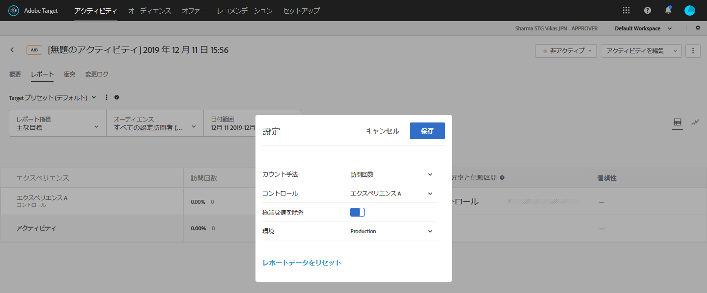

# 極端な値の除外{#exclude-extreme-values}

対象のレポートから極端な注文を除外して、少数の稀な注文がアクティビティの結果に影響を与えないようにすることができます。稀な注文の例には、個人の買い物客が個人のユニフォームを購入するのではなく、コーチがチーム全員分のユニフォームを購入する場合などがあります。

>[!NOTE]
>
>「極端な値 [!UICONTROL を除外] 」フラグは、売上高およびエンゲージメント指標タイプのみを含むアクティビティに適用されます。

極端な値は、後述のルールに基づいて自動的にフラグ付けされます。レポートから極端な値を除外するかどうかを選択できます。アクティビティが 1 時間実施された後、または 15 件の注文を受けた後のいずれか早い方のタイミングで、アクティビティの極端な値が除外されます。

前月のデータ（計算がなされる時点まで）を使用して、標準偏差値が、平均注文額から +/- 3 よりもそれている場合、値は極端なものと見なされます。

例えば、極端な値のフィルターは、多くの場合、RPV を使用する場合に役立ちます。RPV は、コンバージョン率と平均注文額を組み合わせたもので、多くの場合これらの指標の変動率を表します。RPV を使用し、注文が均一に分散していないことがわかった場合、極端な注文のフィルターを適用すると、より通常に近い結果を確認できます。

ある値が極端としてマークされると、その注文値は前月のエクスペリエンスの平均注文額から極端な値を除いたものの平均値で置き換えられます。極端な注文は、注文の詳細レポートや毎日の結果の CSV ダウンロードファイルでも極端な注文値としてマークされます。

**レポートから極端な値を除外するには：**

1. 売上高またはエンゲージメント指標タイプを含むアクティビティを開き、「 **[!UICONTROL レポート]** 」タブをクリックします。
1. 歯車アイコンをクリックします。

   

   [レポー [!UICONTROL ト設定] ]オプションダイアログボックスが表示されます。

   

1. 必要に応じて、「極端な値 **[!UICONTROL を除外」]** オプションのオン/オフを切り替えます。
1. 「**[!UICONTROL 保存]**」をクリックします。
