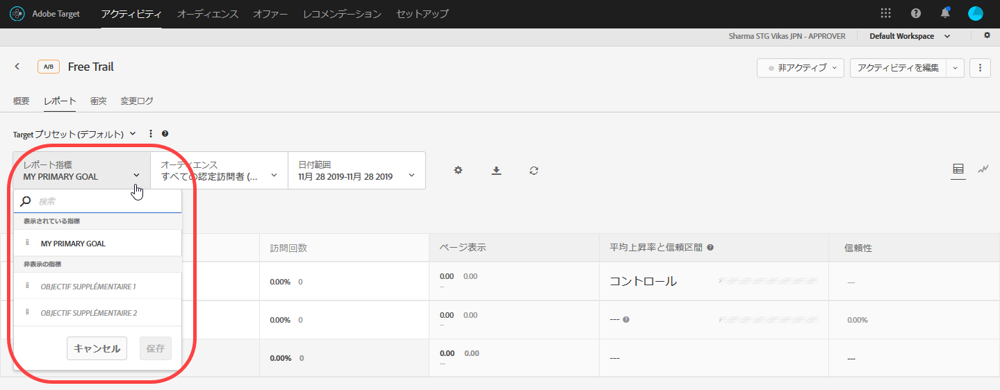
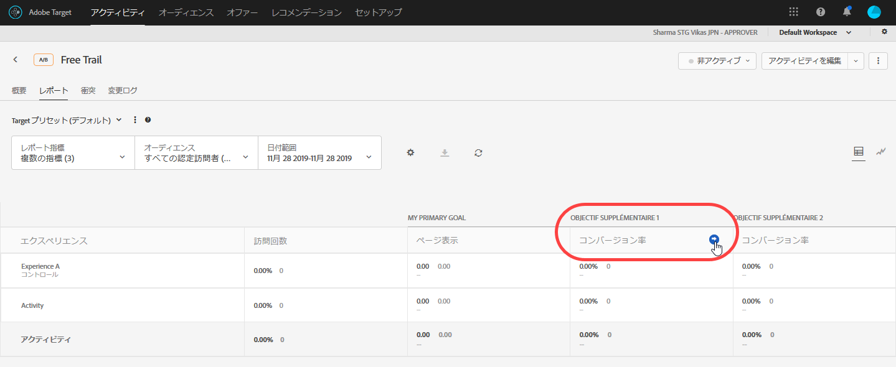
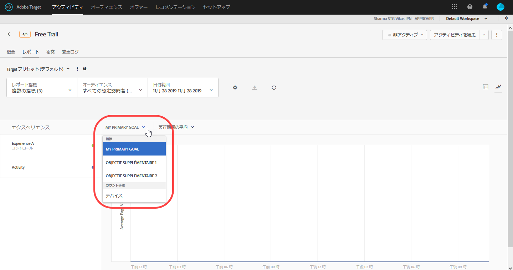

# レポートでの複数の指標の表示{#view-multiple-metrics-in-a-report}

レポートに表示する指標を複数選択できます。

複数の指標をレポートに表示する際は、次の点に注意してください。

* The ability to view multiple metrics is available for [A/B Test](/help/c-activities/t-test-ab/test-ab.md) and [Experience Targeting](/help/c-activities/t-experience-target/experience-target.md) (XT) activities only.
* You cannot add more than 20 metrics to a report for an activity that uses [Analytics for Target](/help/c-integrating-target-with-mac/a4t/a4t.md) (A4T). You can add as many metrics as you have in your activity to reports for activities that do *not* use A4T.
* 複数の指標を選択した場合は、「ダウンロード」オプションを使用して CSV 形式でレポートをダウンロードすることはできません。「[!UICONTROL ダウンロード]」オプションを利用するには、指標を 1 つだけ選択する必要があります。
* 2015 年 7 月 31 日以前の Target のリリースで作成したアクティビティでは、複数の指標を表示することはできません。

**複数の指標を選択してレポートに表示する方法は次のとおりです。**

1. レポートをを表示するには、「**[!UICONTROL アクティビティ]**」をクリックし、リストから目的のアクティビティをクリックして、「**[!UICONTROL レポート]**」タブをクリックします。
1. **[!UICONTROL レポート指標]**&#x200B;ドロップダウンリストをクリックし、「[!UICONTROL 表示されている指標]」と「[!UICONTROL 非表示の指標]」リストを表示します。

   

   [!UICONTROL 検索]ボックスを使用すると、利用できる指標をすばやく検索し、「[!UICONTROL 表示されている指標]」リストに追加できます。

   レポートの[!UICONTROL テーブル表示]と[!UICONTROL グラフ表示]モードの両方で複数の指標を選択できます。

1. 「[!UICONTROL 非表示の指標]」リストの目的の指標にカーソルを合わせて「**[!UICONTROL 選択]**」をクリックすると、「[!UICONTROL 表示されている指標]」リストに移動できます。

   または

   「[!UICONTROL 非表示の指標]」リストの目的の指標を「[!UICONTROL 表示されている指標]」リストにドラッグ＆ドロップします。

   「[!UICONTROL 表示されている指標]」リストには、1 つ以上の指標を選択する必要があります。

   「[!UICONTROL 表示されている指標]」リストでは、ドラッグ＆ドロップで指標の順番を自由に並べ替えることができます。ここで選択した順番は、テーブル表示とグラフ表示に反映されます。「[!UICONTROL 表示されている指標]」リストから指標を削除するには、該当の指標にカーソルを合わせて **X** アイコンをクリックします。

1. 終了したら「**[!UICONTROL 保存]」をクリックします。**
1. （条件付き）レポートをテーブルビューで表示中に、指標の列ヘッダーにマウスポインターを置くと、青い矢印が表示されます。 この矢印をクリックして表を展開すると、対象の指標の「[!UICONTROL 上昇率]」と「[!UICONTROL 信頼性]」が表示されます。

   

   指標と列は、一度に 1 つのみ展開できます。再度矢印をクリックすると、列が折りたたまれます。

1. （条件付き）グラフ表示でレポートを表示中に、ドロップダウンリストから表示する個々の指標を選択できます。

   

