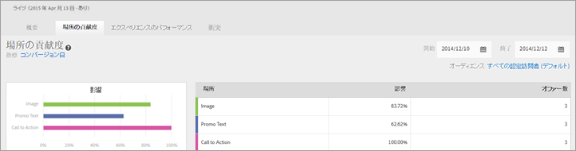
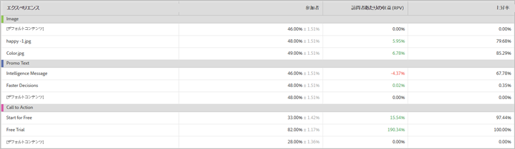

# 場所の貢献度レポート（MVT）{#location-contribution-report-mvt}

場所の貢献度レポートには、各要素および各オファーのパフォーマンスが表示されます。

レポートの上部には、レポートで使用されている指標、開始日、終了日、オーディエンスが表示されます。これらの要素は変更できます。

>[!NOTE]
>
>オーディエンスおよび指標の選択は、Analyticsがレポートソースとして使用されている場合にのみ利用できます。

場所の貢献度レポートには、2 つのテーブルが含まれています。

最初のテーブルには、各要素の相対的な影響度が表示されます。これは、オファーを追加した要素のうち、どの要素が最も高いコンバージョン率を達成しているかを示します。

2 つ目のテーブルには、オファーレベルのレポートが表示されます。このテーブルには、各要素の各オファーのコンバージョン率、上昇率および信頼性が表示されます。これにより、どのオファーが最も効果的かを判断できます。2 番目の列には、オファーで選択した指標（コンバージョン率、RPV、AOV、購入回数またはエンゲージメント指標）および基準となる指標が表示されます。

## トレーニングビデオ: MVTテストの作成

このビデオでは、Target で 3 ステップのガイドによるワークフローを使用して多変量分析テストを作成する方法を説明します。場所の貢献度レポートについては、8:45 から説明しています。

>[!VIDEO](https://video.tv.adobe.com/v/17395)