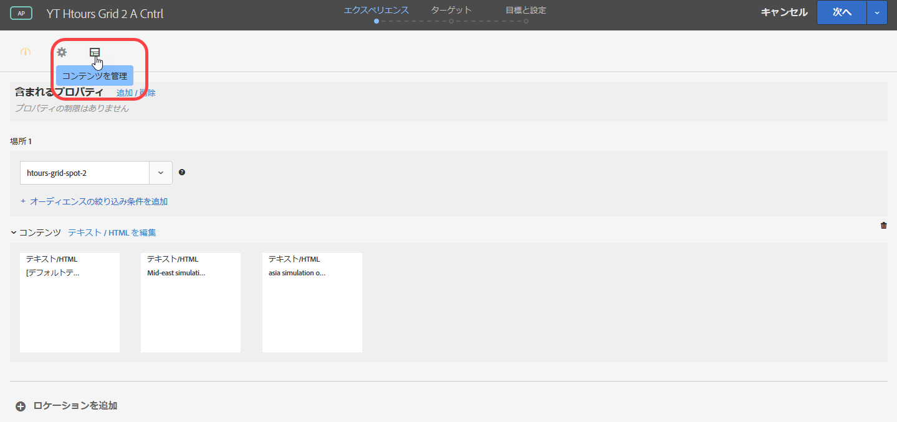
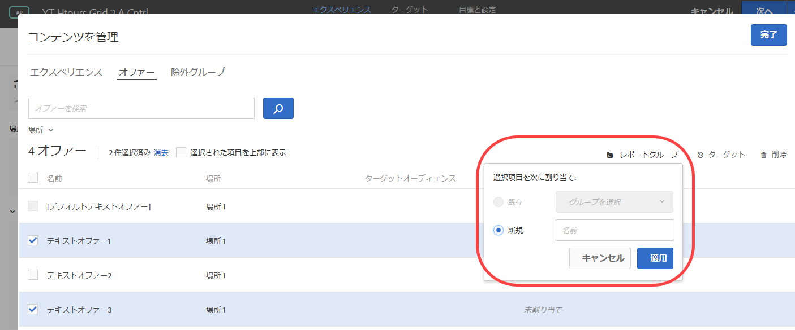
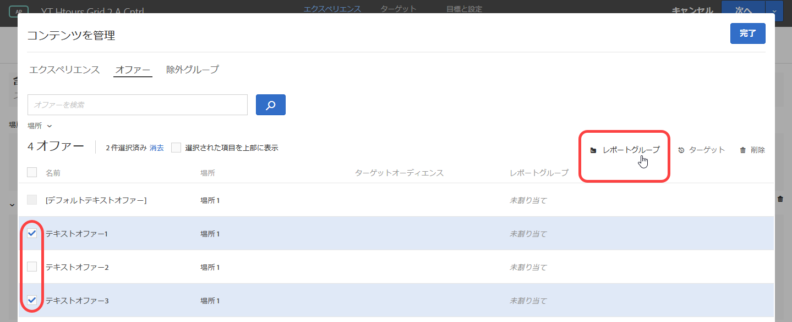

#  オファーレポートグループ{#offer-reporting-groups-in-automated-personalization}

Automated Personalization（AP）アクティビティでのレポートグループの使用に関する情報。

レポートグループは、次の 2 つの主要機能を実行します。

* AP アクティビティレポートでグループ化されたオファーを表示できます。
* Target のパーソナライゼーションモデルの機能において、重要な役割を果たします。

レポートグループを使用する場合、Target は、そのグループ内のすべてのオファーからのデータを使用して、AP アクティビティ内の各オファーではなく、各レポートグループに対して 1 つのパーソナライゼーションモデルのみを作成します。

アクティビティ設定で、オファーごとに作成する必要のあるパーソナライゼーションモデルに十分なデータがない場合、レポートグループは Automated Personalization を使用するためのデータ要件を軽減するのに役立ちます。また、レポートグループは、類似するオファーをグループ化して新しいオファーの「コールドスタート」の問題を解決することもできるので、各モデルはより多くのデータを得ることができます。モデルグループは、新しいオファーが定期的に AP アクティビティに導入されるアクティビティにも使用できます。

この方法は、訪問者がグループ内のすべてのオファーに同じ方法で応答する場合に便利です。ベストプラクティスは、類似する訪問者グループが同様の方法で応答するオファーをグループ化することです。つまり、同様のコンバージョン率を持つオファーをグループ化します。すべてのオファーを 1 つのレポートグループに入れるのは避けてください。すべてのオファーをグループ化したり、コンバージョン率が全く異なるオファーをグループ化すると、Target のパーソナライゼーションモデルの有効性が低下する可能性があります。

>[!NOTE]
>
>オファーが特定のモデリンググループから削除または置換されると、その特定のオファーをモデリンググループからも削除した履歴トラフィックが表示されます。つまり、削除されたオファーは、Target のパーソナライゼーションモデルが学習に使用するデータに影響を与えません。

**レポートグループを設定するには：**

1. AP アクティビティの Experiences ページで、「**[!UICONTROL Manage Content]**」アイコンをクリックします。

   

1. 「[!UICONTROL Manage Content]」ダイアログボックス上部の「**[!UICONTROL Offers]**」タブをクリックします。
1. （条件付き）特定のオファーにカーソルを合わせてから **[!UICONTROL Reporting Group]** のフォルダーアイコンをクリックして、特定のエクスペリエンスをレポートグループに追加します。

   

1. （条件付き）複数のエクスペリエンスのチェックボックスをオンにしてからダイアログボックスの右上隅にある **[!UICONTROL Reporting Group]** のフォルダーアイコンをクリックして、エクスペリエンスを一括でレポートグループに追加します。

   

1. 選択したオファーを既存のレポートグループに割り当てるには、「**[!UICONTROL 既存]**」を選択し、ドロップダウンリストから目的のレポートグループを選択して、「**[!UICONTROL 適用]**」をクリックします。

   または

   選択したオファーをアサインする新しいレポートグループを作成するには、 「**[!UICONTROL 新規]**」を選択し、新しいレポートグループに名前を付けて、「**[!UICONTROL 適用]**」をクリックします。

   

