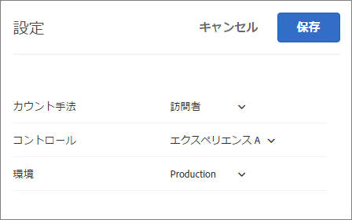

# レポートの FAQ{#reporting-faq}

Target のレポートに関するよくある質問のリストです。

## 他の Experience Cloud ソリューションと比較して Target の訪問数が低いのはなぜでしょうか。{#section_7E626FDB417E41B8B58BBF30FB207409}

[!DNL Target] が報告する訪問などの指標の数値が、他の [!DNL Experience Cloud] ソリューションが報告する数値よりも常に低いのには多数の理由があります。

* [!DNL Target] はアクティビティに該当する訪問者のみの訪問数を数えます。他のソリューションは、訪問者をページに導いたアクティビティが何であったかに関わらず、ページを表示する訪問者の訪問を数えます。
* 異なるアクティビティが同じ場所（相互に排他的）を競い合う場合もあります。その結果、訪問者は Web ページ上で異なるコンテンツを見ることになり、[!DNL Target] が報告する指標の数値に影響します。

## アクティビティのレポートにデータがないのはなぜでしょうか。{#section_E4722F6445884130951DF79981C8289B}

アクティビティの内容がユーザーに配信されたのにそのレポートにデータがない場合は、レポート設定で正しい環境（ホストグループ）を選択するようにしてください。

開発環境が選択されていると、「選択されたレポート設定ではデータがありません」と言うエラーメッセージが表示される場合があります。

アクティビティのレポートの環境を変更するには：

1. 「**[!UICONTROL アクティビティ]**」をクリックし、リストで目的のアクティビティをクリックし、「**レポート[!UICONTROL 」タブをクリックします。]**
1. 歯車アイコンをクリックし、レポート設定を変更します。

   

   >[!NOTE]
   >
   >歯車アイコンはAutomated Personalizationレポートでは使用できません。

1. **[!UICONTROL Environment]** ドロップダウンリストで **[!UICONTROL 、「Production]**」を選択します。

   開発環境を選択していると、レポートのデータが使用できない場合があります。

1. 「設定 **[!UICONTROL を保存」をクリック]** します。

環境について詳しくは [、「ホスト](../administrating-target/hosts.md#concept_516BB01EBFBD4449AB03940D31AEB66E)」を参照してください。
