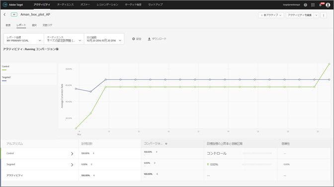
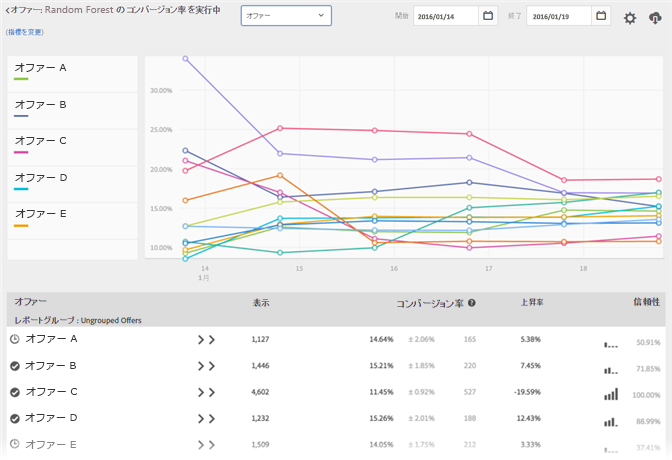

#  Automated Personalization 概要レポート{#automated-personalization-summary-reports}

Automated Personalization のユーザーは特殊なレポートを使用できます。

>[!NOTE]
>
>Automated Personalization は、[!DNL Target Premium] ソリューションの一部として利用できます。[!DNL Target Premium] ライセンスがない場合、[!DNL Target Standard] には含まれません。

1. 「**[!UICONTROL アクティビティ]**」をクリックし、リストで目的の [!UICONTROL Automated Personalization] アクティビティをクリックし、「**レポート[!UICONTROL 」タブをクリックします。]**

   多くのアクティビティがある場合、[!UICONTROL タイプ]ドロップダウンリストから [!UICONTROL Automated Personalization] を選択することで、リストをフィルターできます。

1. （オプション）[!UICONTROL ダウンロード]アイコンをクリックし、概要ビュー（例えば、コントロールとターゲットのトラフィックの比較）を利用可能なすべての成功指標による分類としてダウンロードします。

>[!NOTE]
>
>[!UICONTROL 設定] アイコンは、[!UICONTROL Automated Personalization] レポートでは使用できません。

[!UICONTROL Automated Personalization] では次のレポートを利用できます。

## アクティビティレベルレポート {#section_6F72FC5C790B4492B3DCECBFFA971337}

[!UICONTROL アクティビティレベル]レポートは、[!UICONTROL Automated Personalization] アルゴリズムを使用した場合と、コンテンツがランダムに提供された場合（コントロール）の集計パフォーマンスを比較します。

上昇率、信頼性、トレンド、期間などを含む、A/B テストの結果を解釈する標準ルールは、依然として適用されます。結果の解釈について詳しくは、[コンバージョン率について](../c-reports/conversion-rate.md#concept_2D9FEDE8F94A485DAC86D611BFBDC844)を参照してください。

## オファーレベルレポート {#section_CAA6409879E349C6906E2BE8156D87A1}

ランダムフォレストエクスペリエンスの[!UICONTROL オファーレベル]レポートは、各アルゴリズムが適用されたオファーのパフォーマンスをランダムに提供された同じオファー（コントロール）と比較します。そのため、このビューでオファーを相互に比較しないでください。次の例では、アルゴリズムロジック（ランダムフォレスト）に従って提供した場合、ランダム（コントロール）に対して、オファー D は 12.43％の上昇を示していると言えます

エクスペリエンスアルゴリズム（ランダムフォレストまたはコントロール）をクリックして、オファーレベルレポートを表示します。

オファーは、レポートグループ内に表示できます。これらのレポートグループは、折りたたみと展開が可能です。ドロップダウンリストの「[!UICONTROL レポートグループ]」を選択して、オファー別ではなく、レポートグループ別にロールアップ情報を表示します。

>[!NOTE]
>
>時計アイコンは、アルゴリズムモデルが構築中であることを示します。チェックマークアイコンは、ベースアルゴリズムが確立されたことを示します。

