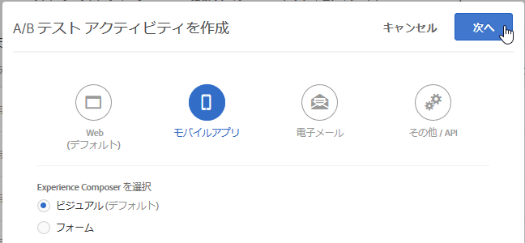

# モバイルアプリケーション Visual Experience Composer{#mobile-app-visual-experience-composer}

ネイティブモバイルアプリ向け Visual Experience Composer（VEC）を使用すると、開発やリリースのサイクルに依存することなく、マーケターが自らアクティビティを作成したりコンテンツをパーソナライズすることができます。

既存の [Visual Experience Composer](../../c-experiences/experiences.md#section_34265986611B4AB8A0E4D6ACC25EF91D) を使用すると、デベロッパーの介入なしにユーザーが自らアクティビティを作成し、エクスペリエンスをパーソナライズして、Target のグローバル mbox を介して Web のプロパティへ動的に配信できるようになります。VEC を活用すれば、ネイティブモバイルアプリケーション向けにも同様のことができるようになりました。[AEP SDK v5](https://aep-sdks.gitbook.io/docs/using-mobile-extensions/adobe-target-vec) で動作するモバイルアプリ VEC を使用して、モバイルアプリ用の [A/B テスト](/help/c-activities/t-test-ab/test-ab.md)アクティビティや[エクスペリエンスターゲット設定（XT）](/help/c-activities/t-experience-target/experience-target.md)アクティビティを作成できます。他のアクティビティタイプは、今後、サポートする予定です。

モバイルアプリ VEC では、[サポートされているブラウザー](../../c-implementing-target/c-considerations-before-you-implement-target/supported-browsers.md#reference_01B4BF99E7D545A7998773202A2F6100)で示したブラウザーをサポートしています。

## ネイティブモバイルアプリケーション用 Visual Experience Composer の使用 {#using-the-mobile-vec}

次のイラストはモバイルアプリ VEC の使用手順を表しています。


| 手順 | 詳細 |
|--- |--- |
| ペアリング | Target と連携できるようにモバイルアプリおよびデバイスを安全に認証します。このステップは、デバイスごとに 1 回だけ必要です。 |
| オーサリング | オーサリングTarget UI で実行されるアクションのリアルタイムのプレビューが可能な [Target アクティビティ](/help/c-activities/activities.md)のオーサリング。 |
| 配信 | Target がネイティブモバイルアプリにアクティビティを自動配信します。 |

**ペアリング:**

モバイルアプリ VEC は、Target アクティビティのオーサリングに使用するマーケティング担当者のモバイルアプリにリアルタイムで接続します。これを有効化するための最初の手順は、モバイルデバイスおよびアプリケーションを Target とセキュアにペアリング（認証）することです。

1. A/B テストアクティビティの作成中に、例えば「**[!UICONTROL モバイルアプリ]**」を選択し、「**[!UICONTROL ビジュアル（デフォルト）]**」を選択して、「**[!UICONTROL 次へ]**」をクリックします。

   

1. アプリのURLを入力し、「**[!UICONTROL ディープリンクを作成]**」をクリックします。

   

ペアリングは次の手順となります。

1. ディープリンクを生成するのに利用できるアプリケーションの URL スキームを入力します。典型的なディープリンクは次のようなものです。

   `mymobileapp://path?params`

1. ディープリンクは QR コードまたは URL として利用できます。ユーザーは電話で QR コードをスキャンするか、URL を自分自身に電子メール／メッセージで送ることができます。ディープリンク URL は認証トークンを持っており、モバイルアプリケーションとデバイスを Target とセキュアにペアリングするために利用されます。
1. モバイルデバイスでディープリンク URL を開きます。これにより、モバイルアプリケーションが起動します。SDK は VEC でペアリングとオーサリングのためにアプリケーションが起動したことを認識します。

   SDK は Target サーバーへリクエストを送って自身を登録します。Target はトークンを認証し、デバイスとのリアルタイム接続を確立します（現在は web ソケットを利用しています）。

   接続が確立されたら、アプリケーションのリアルタイムのビューが Target インターフェイスに表示されます。下のイラストにあるように、アプリケーションには赤い境界のオーバーレイが表示され、アプリケーションが Target に接続されていることを示します。

   

   既にペアリングしたデバイスでは、アプリケーションを起動してオーサリングインターフェイスを開くことで再度接続することができます。

**オーサリング：**

アプリケーションが接続され、VEC 内でリアルタイムのアプリケーションのビューが表示されたら、アクティビティのオーサリングを開始できます。現時点では次のアクションがサポートされています。

| アクション | 詳細 |
|--- |--- |
| 画像をスワップ | 別の画像オファーを選択するか画像の CDN URL を直接設定して、画像を入れ替えます。Target の画像オファーは、[Adobe Scene7](/help/administrating-target/scene7-settings.md) を使用して提供されます。 |
| テキストを変更 | テキスト要素、ボタン、ラベルのテキスト内容、色、フォントサイズなどを変更します。 |
| 背景を変更 | テキスト領域またはボタンのコンテンツまたは要素の背景を変更します。 |

VEC で実施した処理は、リアルタイムでアプリケーション内でも見ることができ、オーサリングの最中にリアルタイムのプレビュー機能を利用することができます。処理は関連のあるモバイル画面やビューと適切に関連付けられます。


**複数のアプリバージョンの管理**

新しいアプリバージョンが検出されると、対象バージョンのリストにアプリのバージョンが追加されたことが通知されます。


複数のモバイルアプリケーションバージョンを手動で追加したり、バージョン [!UICONTROL を管理] ダイアログボックスから削除したりできます。


## Target ビューとモバイルアプリケーション {#target-views}

モバイルアプリ VEC ではビューという新しい概念を活用します。ビューとはビジュアル要素の論理的な集合体で、全体としてモバイルアプリエクスペリエンスを形作ります。

**Target ビューの紹介**

花を売買するアプリケーションを例にしてみましょう。このアプリケーションを使用すると、ユーザーは次のタスクをおこなうことができます。

* 購入できる花や花束を一覧表示
* 詳細を表示
* 花を購入
* 支払いオプションや住所などの設定をコントロール

このアプリケーションでは、モバイルアプリケーションの異なる画面で各タスクをおこなうことができます。ユーザーがアプリケーションを使用すると、次のタスクの 1 つを実施するための画面が表示されます。Android の開発者であれば、おそらく 4 つの異なる Android アクティビティクラスを作成し、各クラスをそれぞれのタスクに関連づけることでしょう。

この場合、これらの各タスクが、モバイルアプリケーションが移行するビューに当たると考えられます。これらを Target ビューと呼びます。ビューはそれぞれ独自の特徴を持っています。Target ビュー（以下、省略して「ビュー」）は、モバイル画面に表示されるビジュアル要素の論理的コンテナです。ビューの例としては、Android の画面やアクティビティクラスがあります。

モバイルアプリケーションは普通、これほど単純には作られていません。もう少し現実的な例を見てみましょう。購入できる花や花束を一覧表示にする最初のタスクに、複数のレイアウトを作成し、異なる画面を作る機能を追加します。例えば、次の 3 つのオプションを持つ「並べ替え」機能を追加してみましょう。

* 人気度別
* 価格の安い順
* 価格の高い順

この例では、ユーザーが「並び替え」オプションを選択するたびに、アクティビティクラスが同じであっても新たな画面が表示されます。このため、これらの各画面は異なる Target ビューとして考えることができます。

マーケティング担当者としては、ローカルな mbox を設定するようデベロッパーに依頼したり、アプリケーションのリリースサイクルを経ることなく、これらの各ビューにおいて異なるエクスペリエンスを創出し、独特のオファーを実行することに関心があります。

## Target モバイルアプリ VEC のセットアップ {#setting-up}

モバイルアプリに対してモバイルアプリ VEC を有効にするには、次の操作をおこなう必要があります。

* Adobe Target VEC 拡張機能の起動時の設定をおこないます。
   * VEC 拡張機能は [Adobe Target 拡張機能](/help/c-implementing-target/c-implementing-target-for-client-side-web/how-to-deployatjs/cmp-implementing-target-using-adobe-launch.md)に基づいています。Adobe Target 拡張機能が既に設定され有効になっていることを確認します。
* Target VEC 拡張機能をアプリに追加します。
   * [Android - モバイルアプリケーションのセットアップ](/help/c-target-mobile-app/c-mobile-visual-experience-composer/mobile-visual-experience-composer-android.md)
   * [iOS - モバイルアプリケーションのセットアップ](/help/c-target-mobile-app/c-mobile-visual-experience-composer/mobile-visual-experience-composer-ios.md)

## Target VEC の実装方法

Target VEC 拡張機能では、アプリに適した Target エクスペリエンスをネットワークリクエストを通じて取得します。オファーはこのネットワーク呼び出しで取得され、ターゲット画面に自動的に適用されます。それ以降、ユーザーがアプリの複数の画面を移動しても、VEC エクスペリエンスを取得するためのネットワークリクエストが実行されることはありません。

拡張機能では、デフォルトの動作として、アプリケーションの起動時に同期ネットワークリクエスト（ブロック呼び出し）をおこないます。Launch を使用すると、アプリケーションの動作に合わせてこのネットワークリクエストの動作を制御できます。

### Target アクティビティの自動取得

これはデフォルトの動作で、Target VEC 拡張機能でワークリクエストが自動的に開始されます。次のオプションのいずれかを使用すると、このリクエストをブロック呼び出しまたは非同期リクエストにすることができます。

* 同期呼び出しで取得（バックグラウンドはオフ）

   これを選択すると、Target VEC 拡張機能はアプリケーションの起動時にブロック呼び出しとしてネットワークリクエストを実行します。オファーは即座に適用され、アプリにちらつきは発生しません。これは、拡張機能のデフォルトの動作です。

* 非同期呼び出しで取得（バックグラウンドはオン）

   これを選択すると、Target VEC 拡張機能はアプリケーションの起動時にバックグラウンドでネットワークリクエストを実行しますが、アプリの読み込みはブロックされません。アプリのホーム画面のエクスペリエンスが作成されている場合、呼び出しが完了する前に画面がレンダリングされると、オファーがホーム画面に適用されない可能性があります。アプリ画面のレンダリングは、通常、ライフサイクルイベント `didFinishLaunchingWithOptions`（iOS の場合）と `onActivityResumed`（Android の場合）を通じて識別されます。オファーは、それ以降のすべての画面に自動的に適用されます。

### プログラムによる Target アクティビティの取得

Target VEC 拡張機能を無効にすると、ネットワークリクエストを自動的に実行し、拡張機能 API をプログラムで呼び出すことができます。これにより、開発者は、アプリで Target VEC オファーを統合する方法を制御できます。Target VEC 拡張機能には 2 つの静的メソッド `prefetchOffers` および `prefetchOffersBackground` があり、Target VEC オファーをプログラムで取得するために使用できます。

* `prefetchOffers` メソッドの場合は、Target VEC オファーが取得されるまで、現在の画面を非表示にします。該当する場合はオファーが現在の画面に自動的に適用され、画面が再び表示されます。
* `prefetchOffersBackground` メソッドの場合は、現在の画面が非表示にならず、関連する Target オファーを取得するための呼び出しがおこなわれます。Target オファーは現在の画面では&#x200B;*適用されず*、ちらつきも発生しません。ユーザーが後続の画面に移動すると、該当する場合はオファーが自動的に適用されます。

### Target ワークスペースの制限事項への対処

Launch インターフェイスを使用して、ワークスペースの `at_property` 値を設定できます。これにより、そのワークスペース内のアクティビティだけがモバイルアプリに配信されます。

## Target API 呼び出しの全般的ガイドライン {#section_C7276795F02540DCA230AEEDF882A833}

Android 用に Target ビューを適切に追加するため、`targetView` 呼び出しを挿入する正しい位置の概要を表す簡単な表を示します。

| 許容される TargetView の位置 | 適切な追加の場合 |
|--- |--- |
| `Activity::onStart`、`Activity::onResume` の終わり | `OnStart` と `OnResume` を同じまたは異なる `targetViews` とするかは開発者の任意です。同じの場合、同じ `viewName` を利用します。異なる場合は、別の `viewNames` を使用します。これらのイベントは SDK が自動的に追加します。 |
| `Activity::SetContent` 呼び出しの直後 | UI が変わらない場合、`targetView` 呼び出しを挿入できます。 |
| `View::willAppear` の内部 | 選択したビューが、ある特定のビュー階層に一意に表示される場合。 |
| `Activity::SetContentView` 呼び出しの直後 | アクティビティがその後コードの中のコンテンツをまったく変更または修正しない場合。 |

以下は、Android で `targetView` 呼び出しを追加するのに不適切な位置の表です。

| 許容されない TargetView の位置 | 理由 |
|--- |--- |
| `Activity::onCreate` 内 | アクティビティは作成されましたが、アクティビティに関連付けられているビューが完全かどうかや、ウィンドウに関連付けられているかどうかは保証されません。この位置だと、オーサリング画面がサンプルされていない、サンプルが完了していない、または非決定的な方法でオファーが適用される可能性があります。 |
| `View::didAppear` の内部 | ビューは既に表示されており、オファーの実行によりちらつきのある質の悪い UI エクスペリエンスとなります。 |
| `View::didLoad` の内部 | ビューはメインのビュー階層に関連付けられず、インスタンス化がおこなわれても、アプリケーションの UI に表示される保証はありません。 |

## 配信 {#delivery}

モバイルアプリ VEC を使用してオーサリングした Target アクティビティは、モバイルアプリに自動的に配信されます。これらのアクティビティは（設定に応じて）アプリケーションの起動時にプリフェッチされ、ユーザーが別の Target ビューに移動するたびに適用され、多くの場合は画面に直接マッピングされます。

`TargetVEC.prefetchOffersBackground()` API メソッドを呼び出すと、Target オファーが Target Edge から取得され、ローカルにキャッシュされます。これにより、Target ビューがネットワーク経由で取得されるのではなく `targetView()` 呼び出しによってトリガーされた場合、Target オファーがキャッシュから即座に適用されるので、より円滑なユーザーエクスペリエンスを実現できます。

柔軟性を高めるために、`TargetVEC.prefetchOffers()` API を呼び出すこともできます。この場合は、Target オファーがプリフェッチされ適用されるまで現在のレイアウトが非表示にされた後、Target ビューが表示されます（ちらつきが発生する可能性があります）。

ユーザーが顧客のアプリをナビゲートして、（現在のユーザーの Target プロファイルに関する最新のアップデートに従って）最も適切なコンテンツでローカルの Target オファーキャッシュを更新する場合は、`TargetVEC.prefetchOffersBackground()` を繰り返し呼び出すことも可能です。

Target オファーがプリフェッチされるたびに、`AdobeTargetMobile.targetView()` で最後にトリガーされた Target ビューのオファーも、可能な場合は適用されます。

## トラブルシューティング {#ts}

**アプリの接続が切断されたという警告がモバイルアプリ VEC に表示されます。**

インターネット接続が切断された可能性があります。インターネットが利用可能になってからアプリケーションを再起動すれば、新たな接続が確立されます。WiFi 接続でモバイルアプリ VEC のアクティビティをオーサリングすることをお勧めします。

**モバイルアプリ VEC がモバイルアプリと同期しません。**

VEC の「[!UICONTROL 更新]」ボタンをクリックして、画面を同期させます。

**"context. application. id"値に禁止されている文字が含まれているというエラーを受け取りました。モバイルアプリケーションIDで使用できる文字は何ですか。**

モバイルアプリIDで使用できる文字には、次のものがあります。

| 許可されている文字 | 説明 |
| --- | --- |
| レター |  |
| 数値 |  |
| `-` | ハイフン |
| `.` | ピリオド |
| `,` | コンマ |
| `:` | コロン |
| `#` | 番号記号 |
| `(` | 始め括弧 |
| `)` | 終わり括弧 |
| `&` | アンパサンド |
| `+` | プラス記号 |

例えば、許可されない文字を使用すると、アポストロフィ（ `'` ）によって次のエラーメッセージが受信されます。

```
Target Response was received : {"status":400,"message":"Errors: field - [context.application.id] - Value contains prohibited chars;"}
```

## 既知の制限事項 {#limitations}

* 現在、モバイルアプリ VEC を使用して、モバイルアプリ用の [A/B テスト](/help/c-activities/t-test-ab/test-ab.md)アクティビティや[エクスペリエンスターゲット設定（XT）](/help/c-activities/t-experience-target/experience-target.md)アクティビティを作成できます。他のアクティビティタイプは、今後、サポートする予定です。
* アプリをモバイルアプリ VEC に再接続する場合は、アプリを完全に終了して再起動する必要があります。

   以下のいずれかのシナリオでモバイルアプリが既に開いている場合は、アプリを閉じてから再度開く必要があります。ただし、アプリを閉じるには、「最近使用したアプリケーション」セクションからモバイルアプリを閉じる&#x200B;*必要があります*。また、「戻る」ボタンを&#x200B;*押さないでください*。「戻る」ボタンを押してアプリケーションを閉じると、断続的な接続の問題が発生する可能性があります。

   アプリが既に開いている場合は、モバイルアプリ VEC に接続するためにアプリの再起動が必要になる状況がいくつかあります。

   * 新しいアクティビティの作成中に、モバイルアプリを選択すると、デバイスリストのダイアログボックスが表示されます。アプリが既に開いている場合は、アプリケーションを閉じてから再起動し、選択可能として表示されているデバイスを取得する必要があります。
   * アクティビティの編集を開始すると、デバイスのダイアログボックスが表示されます。アプリが既に開いている場合は、アプリケーションを閉じてから再起動し、選択可能として表示されているデバイスを取得する必要があります。
   * 「目標と設定」から「オーサリング」手順（手順 1）に戻ると、デバイスのダイアログボックスが表示されます。アプリが既に開いている場合は、アプリを閉じてから再起動し、モバイルアプリ VEC に再接続する必要があります。
   アプリを閉じるには、「最近使用したアプリケーション」セクションからモバイルアプリを閉じる必要があります。また、「[!UICONTROL 戻る]」ボタンを押さないでください。

## トレーニングビデオ:Adobe Target Mobile App Visual Experience Composer（3:33） {#video}

>[!VIDEO](https://video.tv.adobe.com/v/27528?captions=jpn)