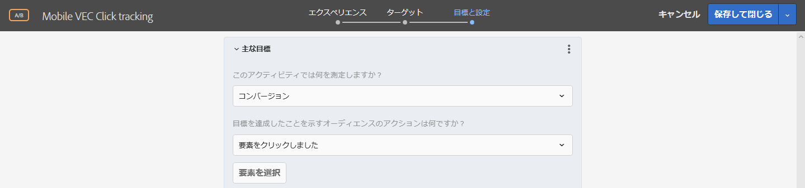
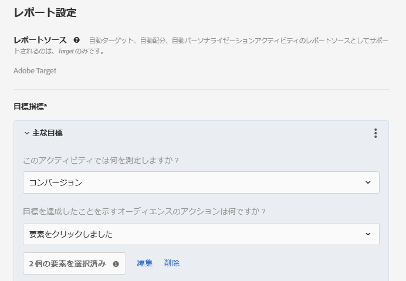

# モバイルアプリ VEC でのクリック追跡のセットアップ{#set-up-click-tracking-in-the-mobile-vec}

モバイルアプリ VEC は、アクティビティの [!DNL Target] クリック追跡目標の設定をサポートしています。

1. アクティビティの目標と設定ページで目標を設定する際に、[!UICONTROL コンバージョン]成功指標を選択します。

   

1. アクションの場合、「**[!UICONTROL 要素をクリック]**」を選択し、「**[!UICONTROL 要素を選択]**」をクリックします。

   Visual Experience Composer（VEC）でモバイルアプリケーションが開きます。

   

1. 追跡する要素を選択します。

   要素の選択に関するヒントについては、次の「[!UICONTROL 注意点]」の節を参照してください。

   

1. 画面上部にあるチェックマークをクリックして、選択を保存します。

クリックの選択を編集または変更することもでき、新しく開始する必要がある場合はクリックの選択を削除することもできます。

選択した要素をアクティビティ参加者がクリックすると、そのクリックはコンバージョンとしてカウントされます。

## 注意点 {#considerations}

要素の選択時にいくつか検討すべき事項があります。

* 複数の要素が選択されていて、訪問者がこれらの要素のいずれかをクリックした場合、クリックはカウントされます。各クリックを個別にカウントするには、各要素に対して個別の成功指標を設定します。
* クリックイベントは、ユーザーが要素をクリックするとすぐに Target に送信されます。
* Mobile App VECでは、クリックハンドラを持つ要素のみを選択できます。
* アプリケーションのセクションはどれでも参照できますが、クリック追跡の対象となる要素を選択するセクションに対して[ビュー](/help/c-target-mobile-app/c-mobile-visual-experience-composer/mobile-visual-experience-composer.md#target-views)が定義されていることを確認してください。
* アクティビティを編集する際、手順 1 で既にデバイスを選択している場合は、デバイスを再度選択する必要はありません。ただし、クリック追跡ページに直接アクセスした場合は、認証されたデバイスを選択するためのデバイス選択ページが表示されます。
* モバイルアプリVECには、クリック追跡用に設定した要素を表示する変更パネルが表示されます。

   