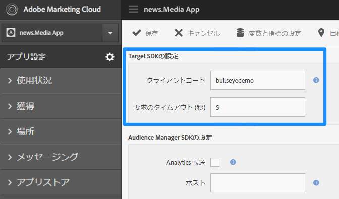
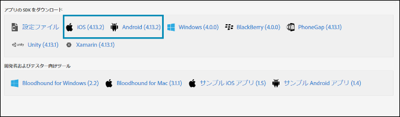

# SDK での Target の有効化{#enable-target-in-the-sdk}

アプリに Adobe Mobile Services SDK を追加します。

1. Adobe Mobile Services SDK をアプリにインストールしていない場合は、Analytics または Experience Cloud の資格情報を使用して、 [Adobe Mobile Services](https://mobilemarketing.adobe.com) の Web サイトから SDK をダウンロードします。

1. アプリに Adobe Mobile Services SDK を追加します。

   [コア実装とライフサイクル](https://marketing.adobe.com/resources/help/en_US/mobile/ios/dev_qs.html)の説明を参照してください。
1. クライアントコードとタイムアウトを追加し、SSL を有効にします。

   Experience Cloud で、Mobile Services を開き、**[!UICONTROL アプリケーション設定 を管理]**／**[!UICONTROL SDK Target オプション]**に移動します。

   Target クライアントコードとタイムアウトを追加します。クライアントコードは、それぞれのアカウントまたは会社で一意になります。タイムアウトは、Target がデフォルトのコンテンツを表示する前に応答を待つ時間を秒数で示したものです。Adobe Mobile Services のアプリ設定ページで「**[!UICONTROL HTTPS を使用]」オプションがチェックされていることを確認します。** HTTPS が有効になっていない場合、Target サーバーをホワイトリストに入れない限り、iOS9 以降のすべての呼び出しがブロックされます。

   

1. アプリを作成、設置した後、アプリ設定を探し、目的の SDK をダウンロードします。

   

>[!IMPORTANT]
>
> モバイルマーケティングインターフェイスにアクセスできない場合、アプリコードの設定ファイルで直接変更できます。ただし、ユーザーインターフェイスの設定ページと同期されません。

