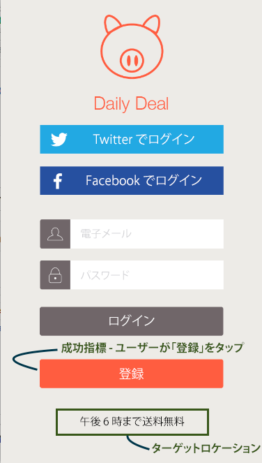
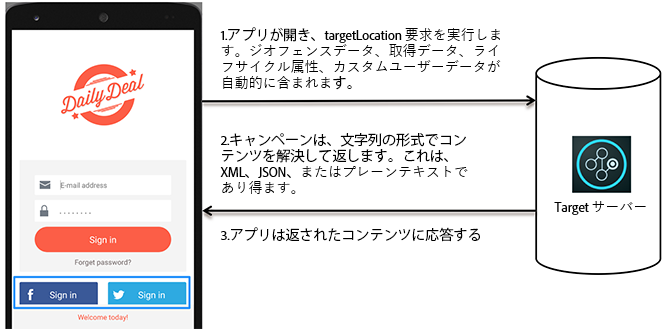

# モバイルアプリにおける Target の仕組み{#how-target-works-in-mobile-apps}

Adobe Mobile SDK は、ユーザーに適切なエクスペリエンスを表示するため、Target サーバーに接続してコンテンツと他のデータポイントを取得します。

## ターゲットの場所と成功指標 {#section_A08AAB0ABA9C4568A5AFD4D27EF1CE74}

*ターゲットの場所* はmboxとも呼ばれます。アプリで識別した場所は、テストとパーソナライゼーション（例えば、ホーム画面のようこそメッセージ）のために有効になります。これらの場所は、テスト作成プロセスの間に識別されます。

*[成功指標](../c-activities/r-success-metrics/success-metrics.md#reference_D011575C85DA48E989A244593D9B9924)*&#x200B;はユーザーが実行するアクションで、特定のアクティビティが成功したかどうか（サインアップ、購入、チケットの予約など）を識別します。

* **Target の場所：**&#x200B;登録ボタンの下に表示されるコンテンツ。

   このユーザーは、18 時まで送料無料の提供を受けています。この場所は、A/B テストとパーソナライゼーションを実行するために、複数の Target アクティビティで再利用することができます。

* **成功指標**：ユーザーが登録ボタンをタップするという、ユーザーによって実行されるアクション。

**SDK における Target の仕組み**

