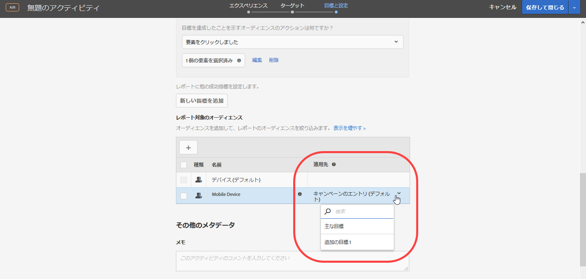
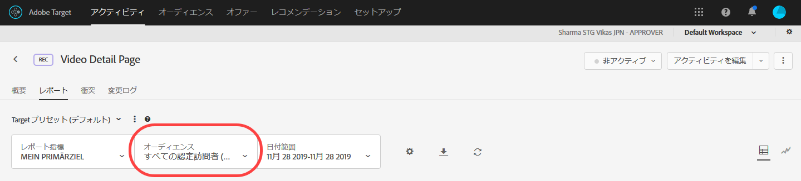

# 成功指標へのレポート用オーディエンスの適用{#apply-a-reporting-audience-to-a-success-metric}

ユーザーがレポート用オーディエンスの条件を満たしていると見なすための成功指標を選択します。

すべてのアクティビティについて、「[!UICONTROL 適用先]」ドロップダウンリストを使用して、オーディエンスを成功指標に適用できます。これにより、指標に達した後および後続のアクションについてのレポート値を表示できます。

例えば、ホームページから入ってコンバージョンページに到達するすべての訪問者に対するアクティビティを作成したとします。さらに、コンバージョンの前に $50 を超える商品をカートに追加した訪問者をドリルダウンするとします。

「適用先」ドロップダウンリストでは、潜在的に、アクティビティへのすべての訪問者、アクティビティの特定のステップに到達した訪問者のみまたはコンバージョンに到達した訪問者のみの 3 つのカテゴリが提供されます。別の言い方をすると、アクティビティのエントリページの mbox、アクティビティの途中にあるポイントを定義する mbox、アクティビティの最後のコンバージョン mbox のどれに訪問者が到達している必要があるかを指定できます。

[成功指標](../c-activities/r-success-metrics/success-metrics.md#reference_D011575C85DA48E989A244593D9B9924)は、アクティビティに設定した場合にのみ使用できます。成功指標を定義していない場合は、ドロップダウンリストに「キャンペーンのエントリ」と「コンバージョン」の 2 つのオプションのみが表示されます。

レポート用オーディエンスを成功指標に適用するときは、次の情報を考慮します。

* 成功指標が適用されたアクションの前のアクションに対して、Target はセグメント化されたオーディエンスを適用しません。
* 成功指標が適用されたアクションの後のアクションに対して、Target はセグメント化されたオーディエンスを適用します。

レポートのセグメント化を表示するには、アクティビティのレポートの「オーディエンス」ドロップダウンリストから目的のオーディエンスを選択します。

