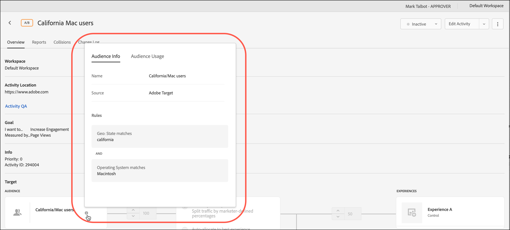

# オーディエンスの作成

[!DNL Adobe Target]のオーディエンスは、誰がターゲットアクティビティでコンテンツやエクスペリエンスを表示するかを決定します。

オーディエンスは、ターゲット設定を利用できるあらゆる場所で使用されます。アクティビティをターゲティングする場合、次のオプションがあります。

* [!UICONTROL オーディエンス]リストから再利用可能なオーディエンスを選択します
* [アクティビティ固有のオーディエンスを作](/help/c-target/creating-activity-only-audience.md) 成し、ターゲットに設定する
* [複数のオーディエ](/help/c-target/combining-multiple-audiences.md#concept_A7386F1EA4394BD2AB72399C225981E5) ンスを組み合わせてアドホックオーディエンスを作成する

[!DNL Adobe Analytics]で収集されたオーディエンスデータは、[!DNL Target]や他の[!DNL Adobe Experience Cloud]アプリケーションでのリアルタイムのターゲティングやパーソナライゼーションにも使用できます。 『*Experience Cloud中央インターフェイスコンポーネント*』ガイドの「[Experience Cloudオーディエンス](https://experienceleague.adobe.com/docs/core-services/interface/audiences/audience-library.html?lang=ja)」を参照してください。

[!DNL Target]には、次の2種類のオーディエンスがあります。

* **ターゲティングオーディエンス：** 異なるタイプの訪問者に異なるコンテンツを配信するために使用します。
* **レポート用オーディエンス：** 同じコンテンツに異なるタイプの訪問者がどのように反応するかを判断し、テスト結果を分析するために使用されます。

   [!DNL Target] では、レポートソースとして [!DNL Target] を使用する場合にのみ、レポート用オーディエンスを設定できます。レポートソースとして [ Adobe Analytics](/help/c-integrating-target-with-mac/a4t/a4t.md)（A4T）を使用する場合は、[!DNL Analytics] 内でレポート用オーディエンスを設定する必要があります。

## [!UICONTROL オーディエンス]リストを使用します

[!UICONTROL オーディエンス]リストにアクセスするには、上部のメニューバーで「**[!UICONTROL オーディエンス]**」をクリックします。

[!UICONTROL オーディエンス]リストには、アクティビティで使用できるオーディエンスが含まれます。 [!UICONTROL オーディエンス]リストを使用して、オーディエンスの作成、編集、複製、コピー、組み合わせが可能です。 リストには、オーディエンスが作成されたソースも表示されます。

* [!DNL Adobe Target]
* [!DNL Adobe Target Classic]
* [!DNL Experience Cloud]
* [!DNL Adobe Experience Platform]

   >[!NOTE]
   >
   >[!DNL Adobe Experience Platform]ソースはベータテストプログラムに含まれていますが、[Adobe Experience Platform Web SDK](/help/c-implementing-target/c-implementing-target-for-client-side-web/aep-web-sdk.md)を使用しているすべての[!DNL Target]ユーザーが利用できます。 [!DNL Adobe Experience Platform]から利用できるオーディエンスは、そのまま使用することも、[既存のオーディエンス](/help/c-target/combining-multiple-audiences.md)と組み合わせて使用することもできます。

「[!UICONTROL 新しい訪問者]」や「[!UICONTROL 再訪問者]」などの事前定義されたオーディエンスは、名前を変更できません。

元々[!DNL Experience Cloud]または[!DNL Adobe Experience Platform]で作成されたオーディエンスを操作する際に、後で[!DNL Experience Cloud]または[!DNL Adobe Experience Platform]で削除された[!DNL Target]アクティビティでオーディエンスを参照すると、[!DNL Target]に警告が表示されます。

* [!DNL Experience Cloud]または[!DNL Adobe Experience Platform]でオーディエンスが削除された場合は、[!UICONTROL オーディエンス]リストとオーディエンスピッカーの両方に警告アイコンが表示されます。 [!DNL Target] UIのツールチップも、[!DNL Experience Cloud]または[!DNL Adobe Experience Platform]でオーディエンスが削除されたことを示します。
* 複数のオーディエンスを削除済みのオーディエンスに結合しようとした場合、または削除済みのオーディエンスを参照しているアクティビティを保存しようとした場合、警告メッセージが表示されます。

カスタムプロファイルパラメーターおよび `user.` パラメーターをターゲット設定することもできます。オーディエンスを作成する際に、アクティビティのターゲット設定に使用したい属性をAudience Builderウィンドウにドラッグします。 目的の属性が表示されない場合、その属性はmboxによって実行されていません。 他のカスタム mbox パラメーターは、[!UICONTROL カスタムパラメーター]ドロップダウンリストに表示されます。

「[!UICONTROL フィルター]」ボタンを使用して、ソースを基準に[!UICONTROL オーディエンス]リストをフィルタリングします。[!DNL Adobe Target]、[!DNL Adobe Target Classic]、[!DNL Experience Cloud]、および[!DNL Adobe Experience Platform]。

「[!UICONTROL オーディエンスを検索]」ボックスを使用して、[!UICONTROL オーディエンス]リストを検索します。 オーディエンス名の一部で検索したり、特定の文字列を引用符で囲んだりすることも可能です。

[!UICONTROL オーディエンス]リストは、オーディエンス名または最終更新日付で並べ替えることができます。名前や日付で並べ替える場合は、列見出しをクリックし、昇順または降順でオーディエンスを表示するよう選択します。

## オーディエンス定義を表示 {#section_11B9C4A777E14D36BA1E925021945780}

オーディエンス定義の詳細は、[!DNL Target] UIの様々な場所で、オーディエンスを開かなくても表示できます。 この機能は、[!DNL Target Standard/Premium]で作成されたオーディエンスと[!DNL Target Classic]からインポートされたオーディエンス、またはAPIを介して作成されたオーディエンスに適用されます。

例えば、次のオーディエンス定義カードは、目的のオーディエンスの[!UICONTROL 詳細を表示]アイコンをクリックすると表示されます。

次のオーディエンス定義カードにアクセスするには、アクティビティの[!UICONTROL 概要]ページにある[!UICONTROL 詳細を表示]アイコンをクリックします。

オーディエンス定義カードには、オーディエンスのタイプ、ソースおよび属性が表示されます。 該当する場合は、「**[!UICONTROL 詳細を表示]**」をクリックして、そのオーディエンスを参照する他のアクティビティを表示します。 アクティビティの[!UICONTROL 概要]ページからオーディエンス定義カードを表示している場合は、「**[!UICONTROL オーディエンスの使用]**」をクリックします。

オーディエンスの使用状況に関する情報は、オーディエンスの編集中に他のアクティビティに予期しない影響が及ぶのを防ぐのに役立ちます。 情報には、[!UICONTROL ライブアクティビティ]、[!UICONTROL 非アクティブなアクティビティ]、[!UICONTROL アーカイブ済みアクティビティ]、[!UICONTROL 同期中アクティビティ]が含まれます。 この機能は、すべてのオーディエンス（ライブラリオーディエンスおよび[アクティビティのみのオーディエンス](/help/c-target/creating-activity-only-audience.md#concept_A6BADCF530ED4AE1852E677FEBE68483)）で使用できます。

オーディエンスが別のオーディエンス](/help/c-target/combining-multiple-audiences.md)と組み合わされて[、組み合わされたオーディエンスを使用してアクティビティが作成された場合、両方のオーディエンスの使用状況情報には、新しく作成されたアクティビティが表示されます。

<!--The following audience definition card is for an audience imported from the Adobe Experience Cloud. In this instance, the audience was imported from Adobe Audience Manager (AAM).

The following details are available for these imported audience types:

| Audience Type | Details |
|--- |--- |
|Mobile audience|Marketing Name, Vendor, and Model. The `matches | does not match` operator displays instead of `equals | does not equal` .|
|Visitor-behavior audience|**user.categoryAffinity:** `categoryAffinity` with `FAVORITE` parameter.  **Monitoring:** Monitoring service equals true. **No Monitoring Service:** Monitoring service equals false. |
|Audiences using the NOT operator|**Single Rule:** Target displays the audience in the format `[All Visitor AND [NOT [rule]`. Single NOT rule displays with AND with `AllVisitor` audience. |

Keep the following points in mind as you work with imported audiences:

* Expression target audiences are no longer supported in Target Standard/Premium. 
* Target Standard/Premium does not support some deprecated audiences or has improved operators for ease of use. Because of this, the definition of an imported audience, although working as per definition, does not mean that same is now available for creation in the Standard/Premium interface. For example, Social Audiences are visible with their rules but Target Standard/Premium does not allow social audiences to be created.-->

## トレーニングビデオ：Audiences の使用

このビデオでは、オーディエンスの使用に関する情報が説明されています。

* 用語「オーディエンス」の説明
* 最適化のためにオーディエンスを使用する 2 つの方法の説明
* オーディエンスリストでのオーディエンスの検索
* アクティビティのオーディエンスへのターゲット設定
* アクティビティの受動的なレポート用でのオーディエンスの使用

>[!VIDEO](https://video.tv.adobe.com/v/17398)
