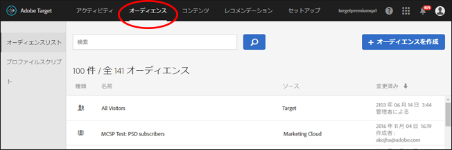
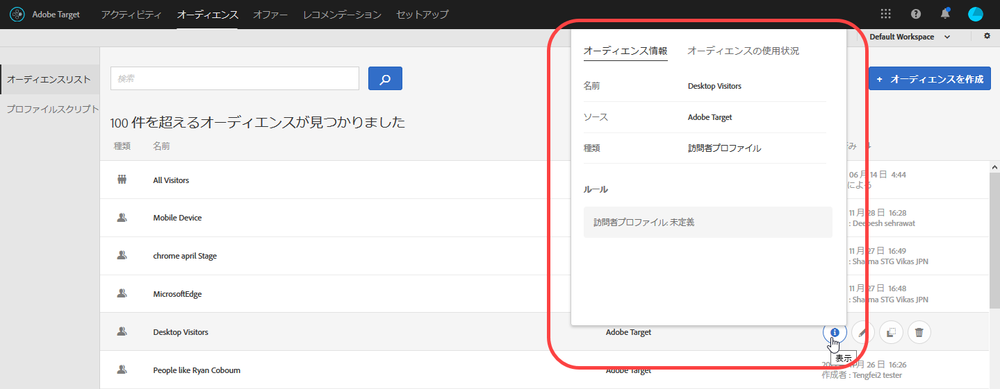
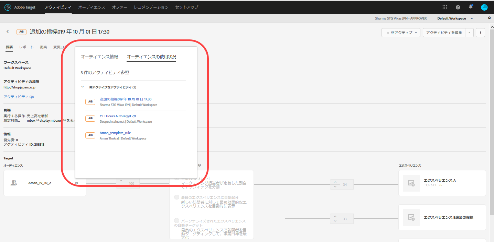
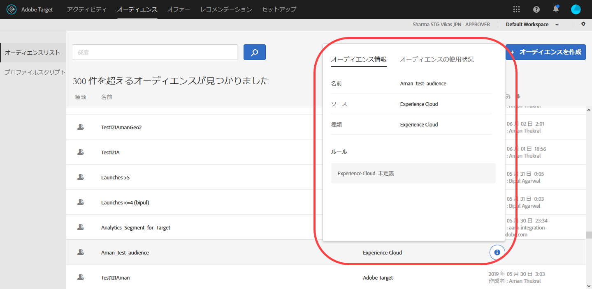

# オーディエンスの作成{#create-audiences}

オーディエンスによって、誰にターゲットアクティビティのコンテンツやエクスペリエンスを表示するのかが決まります。

オーディエンスは、ターゲット設定を利用できるあらゆる場所で使用されます。When targeting an activity, you can either select a reusable audience from the [!UICONTROL Audiences] list, [create an activity-specific audience](/help/c-target/creating-activity-only-audience.md) and target it, or [combine multiple audiences](/help/c-target/combining-multiple-audiences.md#concept_A7386F1EA4394BD2AB72399C225981E5) to create an ad hoc audience.

リアルタイムのターゲティングやパーソナライゼーションの他のソリューションによって [!DNL Analytics] 収集されたオーディエンスデータを [!DNL Adobe Target] 使用 [!DNL Experience Cloud] することもできます。[Experience Cloud 製品ドキュメントのオーディエンス](https://marketing.adobe.com/resources/help/en_US/mcloud/audience_library.html)を参照してください。

[!DNL Target] では、次の 2 種類のオーディエンスが定義されます。

* **ターゲット設定するオーディエンス：**&#x200B;異なる種類の訪問者に異なるコンテンツを配信するために使用します。
* **レポート用オーディエンス：**&#x200B;同じコンテンツに異なる種類の訪問者がどのように反応するかを判断し、テスト結果を分析するために使用します。

   [!DNL Target] では、レポートソースとして [!DNL Target] を使用する場合にのみ、レポート用オーディエンスを設定できます。If you use [DNL Adobe Analytics as your reporting source](/help/c-integrating-target-with-mac/a4t/a4t.md) (A4T), you must configure your reporting audiences within [!DNL Analytics].

## オーディエンスリストの使用

[!UICONTROL オーディエンス]リストにアクセスするには、上部のメニューバーで「**[!UICONTROL オーディエンス]」をクリックします。**

[!UICONTROL オーディエンス]リストには、アクティビティで使用できるすべてのオーディエンスが含まれています。[!UICONTROL オーディエンス]リストを使用して、オーディエンスの作成、編集、削除、コピー、組み合わせが可能です。また、オーディエンスが作成されたソース（ [!DNL Target]、 [!DNL Target Classic] [!DNL Adobe Audience Manager (AAM),] [!DNL Experience Cloud] など）も表示されます。「新しい訪問者」や「再訪問者」などの事前定義されたオーディエンスは、名前を変更できません。

もともと AAM で作成されたオーディエンスを操作する場合、後から AAM で削除された Target アクティビティ内のオーディエンスを参照すると、Target によって警告が表示されます。

* AAM でオーディエンスが削除されている場合、[!UICONTROL オーディエンス]リストとオーディエンスピッカーの両方に警告アイコンが表示されます。また、UI のツールチップにも、AAM でオーディエンスが削除されていることが表示されます。
* 複数のオーディエンスを削除済みのオーディエンスに結合しようとした場合、または削除済みのオーディエンスを参照しているアクティビティを保存しようとした場合、警告メッセージが表示されます。

カスタムプロファイルパラメーターおよび `user.` パラメーターをターゲット設定することもできます。When adding an audience, click **[!UICONTROL Add Rule]** &gt; **[!UICONTROL Visitor Profile]**, then choose the parameter you want to use to target your activity. 必要なパラメーターが表示されない場合、そのパラメーターは mbox で公開されていません。他のカスタム mbox パラメーターは、[!UICONTROL カスタムパラメーター]ドロップダウンリストに表示されます。

[!UICONTROL オーディエンス]リストを検索するには、検索ボックスを使用します。オーディエンス名の一部で検索したり、特定の文字列を引用符で囲んだりすることも可能です。

[!UICONTROL オーディエンス]リストは、オーディエンス名または最終更新日付で並べ替えることができます。名前や日付で並べ替える場合は、列見出しをクリックし、昇順または降順でオーディエンスを表示するよう選択します。

## View audience definitions {#section_11B9C4A777E14D36BA1E925021945780}

オーディエンス定義の詳細は、オーディエンスを開かなくても、Target UI の様々な場所に表示されるポップアップカードで確認できます。この機能は、Target Standard／Premium で作成されたオーディエンス、Target Classic からインポートされたオーディエンス、API を使用して作成されたオーディエンスで利用できます。

例えば、次のオーディエンス定義カードは、オーディエンスリスト上のオーディエンスにカーソルを合わせ、表示アイコンをクリックすると表示されます。

次のオーディエンス定義カードは、アクティビティの概要ページにある表示アイコンをクリックすると表示されます。

「[!UICONTROL オーディエンスの使用状況]」タブをクリックすると、そのオーディエンスを参照している他のアクティビティを確認できます。これにより、オーディエンスの編集中に他のアクティビティに不測の影響が及ぶことを防止できます。ライブアクティビティ、非アクティブなアクティビティ、アーカイブ済みアクティビティ、同期中のアクティビティなどの情報を参照できます。この機能は、すべてのオーディエンス（ライブラリオーディエンスおよび[アクティビティのみのオーディエンス](../../c-target/creating-activity-only-audience.md#concept_A6BADCF530ED4AE1852E677FEBE68483)）で利用できます。

オーディエンスを別のオーディエンスと結合し、その結合したオーディエンスを使用してアクティビティを作成すると、両方のオーディエンスの使用状況情報として、その新規作成されたアクティビティが表示されます。

次のオーディエンス定義カードは、Adobe Experience Cloud からインポートしたオーディエンスのものです。この例では、オーディエンスは Adobe Audience Manager（AAM）からインポートされています。

インポートしたオーディエンスのタイプごとに確認できる詳細情報は次のとおりです。

| オーディエンスのタイプ | 詳細 |
|--- |--- |
| モバイルオーディエンス | マーケティング名、ベンダー、モデル。 「 `matches | does not match` インポートされた `equals | does not equal` 。 |
| 訪問者の行動オーディエンス | **user. categoryAffinity:** `categoryAffinity` `FAVORITE` パラメーターを使用します。  **:** 監視サービスがtrueに等しい。 **監視なし：** Monitoring service equals false.  |
| NOT 演算子を使用するオーディエンス | **単一ルール:** Targetはオーディエンスを形式で表示 `[All Visitor AND [NOT [rule]` します。単一のNOTルールは、ANDと共に `AllVisitor` 表示されます。  |

インポートしたオーディエンスを操作する際は、次の点に注意してください。

* Target Standard／Premium では、エクスプレッションターゲットオーディエンスはサポートされなくなりました。
* Target Standard／Premium では、非推奨のオーディエンスをサポートしていない場合や、使いやすいように演算子が改良されている場合があります。そのため、インポートしたオーディエンスの定義は、定義どおりに機能しますが、Standard／Premium インターフェイスで同じものを作成することはできない場合があります。例えば、ソーシャルオーディエンスはルールとともに表示されますが、Target Standard／Premium で作成することはできません。

## トレーニングビデオ: Audiencesの使用

このビデオでは、オーディエンスの使用に関する情報が説明されています。

* 用語「オーディエンス」の説明
* 最適化のためにオーディエンスを使用する 2 つの方法の説明
* オーディエンスリストでのオーディエンスの検索
* アクティビティのオーディエンスへのターゲット設定
* アクティビティの受動的なレポート用でのオーディエンスの使用

>[!VIDEO](https://video.tv.adobe.com/v/17398?captions=jpn)