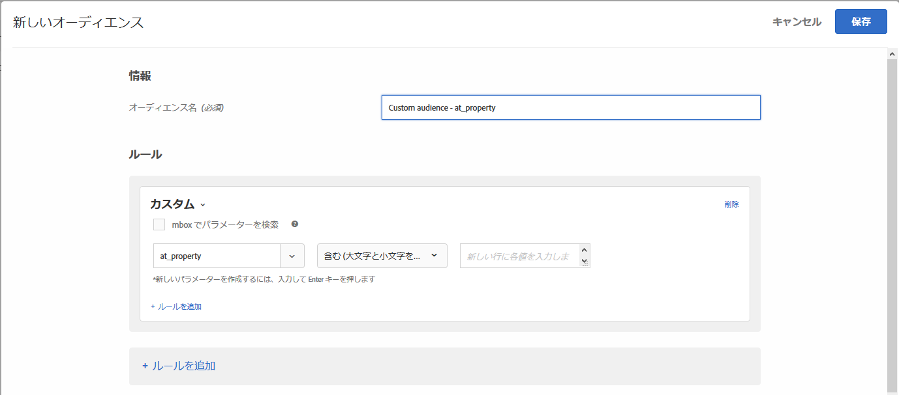

# カスタムパラメーター

カスタムパラメーターは、[!DNL Adobe Target] 内の mbox パラメーターです。 mbox に対して mbox パラメーターを渡す場合、または `targetPageParams` 関数を使用する場合、これらのパラメーターはここに表示され、オーディエンスで使用できます。

詳しくは、「[ グローバル mbox にパラメーターを渡す ](/help/c-implementing-target/c-implementing-target-for-client-side-web/t-mbox-download/c-understanding-global-mbox/pass-parameters-to-global-mbox.md)」を参照してください。

mbox パラメーターに基づいてカスタムオーディエンスを作成しているときに、`mboxParameter` で `mboxName` の入力が求められなくなりました。mbox 名はオプションになりました。この変更により、複数の mbox のパラメーターを使用することや、まだエッジで記録されていないパラメーターを参照することができます。

1. [!DNL Target] インターフェイスで、**[!UICONTROL オーディエンス]**／**[!UICONTROL オーディエンスを作成]**&#x200B;をクリックします。
1. オーディエンスに名前を付け、オプションで説明を追加します。
1. **[!UICONTROL カスタム]** を Audience Builder にドラッグ&amp;ドロップします。

   目的のパラメーターを選択するには：

   * オーディエンスの作成時に、リストからパラメーター名を選択し、目的のパラメーター名の最初の文字を入力するか、目的のパラメーター名の完全名を入力します。
   * mbox 名を覚えているが、パラメーター名を覚えていない場合は、[!UICONTROL 「] でフィルター」ドロップダウンリストを使用して、目的のパラメーターを渡す既知の mbox に対してフィルターを適用します。

   いずれの方法でも、mbox とパラメーターの間にリンクはありません。オーディエンスは、そのパラメーターを渡すすべての mbox のパラメーターに基づいて機能します。

   既存のオーディエンスを編集すると、作成時に指定された mbox 名と共にフィルタリング条件が表示されます。

1. 評価基準を選択します。

   * 次を含む（大文字と小文字を区別しない）
   * 次を含まない（大文字と小文字を区別しない）
   * 次と等しい
   * 次と等しくない
   * 次より大きい
   * 次よりも大きいか等しい
   * 次より小さい
   * 次よりも小さいか等しい
   * パラメータが存在する
   * パラメータが存在しません
   * パラメータ値が存在する
   * パラメータ値が存在しません
   * パラメータまたは値が存在しません
   * 最初に、
   * 次の語句で終わる

   

1. 新しい行に各値を入力します。
1. （オプション）オーディエンス用の追加のルールを設定します。
1. 「 **[!UICONTROL 完了]**」をクリックします。

オーディエンスの[ポップアップカード内の定義の詳細](/help/c-target/c-audiences/audiences.md#section_11B9C4A777E14D36BA1E925021945780)には、「Rules」セクションにパラメーター名が表示されます。****&#x200B;フィルタリングに使用する mbox への参照はありません。

>[!NOTE]
>
>[!DNL Target] 18.5.1 リリース（2018 年 5 月 23 日）より前に作成されたカスタムオーディエンスの場合、mbox 名はオーディエンスの定義ポップアップカードに表示されません。 カスタムオーディエンスを再度保存すると、mbox 名がカードに表示されます。

## 注意点 {#considerations}

* オーディエンスおよびアクティビティは、特定の mbox 用に評価されます。例えば、グローバル mbox が特定のパラメーターを渡すが、リージョナル mbox は渡さない場合、そのパラメーターをターゲットとするアクティビティ/オーディエンスは、リージョナル mbox では認定されません。
* ターゲティングは、mboxPC、mboxSession、mbox3rdPartyId、mboxMCSDID、mboxMCAVID、mboxMCAVID、mboxMCGVID、mboxCount、mboxId、mboxVersion などの内部 mbox パラメーターでは評価されません。

## トレーニングビデオ：オーディエンスの作成 

このビデオでは、オーディエンスのカテゴリの使用について説明しています。

* オーディエンスの作成
* オーディエンスカテゴリの定義

>[!VIDEO](https://video.tv.adobe.com/v/17392)
