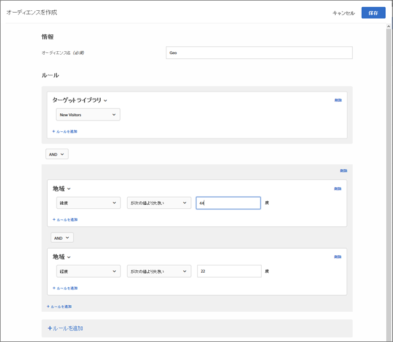

# 地域{#geo}

オーディエンスを使用して、国、都道府県、市区町村、郵便番号、DMA、携帯電話会社など、地理的な場所に基づいてユーザーをターゲット設定します。

地域パラメーターを使用することで、訪問者の地域情報に基づいてアクティビティとエクスペリエンスをターゲット設定することができます。国、都道府県、市区町村、郵便番号、緯度、経度、DMAまたは携帯電話会社に基づいて訪問者を含めたり除外したりできます。このデータは、Targetリクエストと共に送信され、訪問者のIPアドレスに基づいて送信されます。他のターゲット値と同様に、これらのパラメーターを選択します。

## GeoTargeting を使用するオーディエンスの作成 {#section_49CBFFAAC8694C4AAD3DE4B2DB7B05DE}

1. [!DNL Target] インターフェイスで、「**[!UICONTROL オーディエンス]**／**[!UICONTROL オーディエンスを作成]**」をクリックします。
1. オーディエンスに名前を付けます。
1. 「**[!UICONTROL ルールを追加]**／**[!UICONTROL 地域]**」をクリックします。

1. 「**[!UICONTROL 選択]**」をクリックし、次のいずれかのオプションを選択します。

   * 国
   * 都道府県
   * 市区町村
   * 郵便番号
   * 緯度
   * 経度
   * DMA
   * 携帯電話会社
   mbox リクエストによって訪問者の IP アドレスが訪問（セッション）ごとに 1 回渡され、その訪問者の地域ターゲットパラメーターが解決されます。

   携帯電話会社の場合、[!DNL Target] は IP アドレス登録データ（IP アドレスのブロックを所有しているユーザー）により、[モバイル国コード（MCC）およびモバイルネットワークコード（MNC）](https://www.mcc-mnc.com)を使用して適切な携帯電話会社を判断します。

1. 演算子と適切な値を指定します。
1. （オプション）「**[!UICONTROL ルールを追加]**」をクリックして、オーディエンス用の追加のルールを設定します。
1. 「**[!UICONTROL 保存]**」をクリックします。

次の図に、アクティビティにアクセスしたユーザーを、44度より大きい緯度と22度未満の経度からターゲットにするオーディエンスを示します。

## 精度 {#section_D63D5FFCB49C42F9933AFD0BD7C79DF1}

GeoTargeting の精度は、複数の要因に左右されます。WiFi 接続は、携帯電話ネットワークよりも正確です。When the visitor is using a cellular data connection, the accuracy of the geo-lookup can be affected by location, the provider's data relationship with [DeviceAtlas](https://deviceatlas.com/device-data/user-agent-tester), and other factors. 携帯電話基地局ベースのネットワーク接続では、有線または WiFi 接続に正確性で劣る可能性があります。また、訪問者の IP アドレスは、その ISP の場所にマッピングされ、訪問者の実際の場所とは異なる可能性があります。Some mobile geo-location issues can be solved using the [Geolocation API](https://developer.mozilla.org/en-US/docs/Web/API/Geolocation_API).

以下の表に、[DigitalEnvoy](https://www.digitalelement.com/solutions/) が有線または WiFi インターネット接続用に提供する IP ベースの地理情報の精度を示します。DigitalEnvoy は、業界で最も正確なデータを提供します。グローバルな精度は、国レベルで 99.9％を超え、市レベルでは最大 97％の正確性です。精度情報は、携帯電話基地局ベースのネットワークには適用されません。

| 国 | 都道府県 | 市区町村 | 地域 |
|--- |--- |--- |--- |
| 米国 | 99.99％ | 96％ | 94％ |
| カナダ | 99.99％ | 96％ | 94％ |
| ヨーロッパ | 99.99％ |  |  |
| 英国 | 99.99％ |  | 87％ |
| ドイツ | 99.99％ | 95％ | 93％ |
| スカンジナビア | 99％ | 90 ％代前半 | 80 ％代半ば |
| スペイン | 99.99％ | 90％前後 | 90 ％代半ばから後半 |
| アジア | 99％ | 90％代半ば | 90 ％代前半 |
| 日本 | 99.99％ | 90％代半ば | 90 ％代前半 |
| オーストラリア | 99.99％ | 94％ | 91％ |

## プロファイルスクリプトでのジオターゲティングの使用 {#section_92C93138542C4A94997E3F4BE3F5DA28}

プロファイルスクリプトで地域情報を使用できます。

例えば、次のものを使用できます。

* `profile.geolocation.country`
* `profile.geolocation.state`
* `profile.geolocation.city`
* `profile.geolocation.zip`
* `profile.geolocation.dma`
* `profile.geolocation.domainName`
* `profile.geolocation.ispName`
* `profile.geolocation.connectionSpeed`
* `profile.geolocation.mobileCarrier`

次のコードで「From North America」というターゲット式を記述することができます。

`return profile.geolocation.country == 'united states' || profile.geolocation.country == 'canada' || profile.geolocation.country == 'mexico';`

## ジオターゲティング値のトークンとしての使用 {#section_E7F7FDF62C3B4934A6565D04B24655F6}

オファーやプラグインなどで `profile.geolocation` の値をトークンとして直接使用することができるようになりました。

例えば、次のものを使用できます。

* `${profile.geolocation.country}`
* `${profile.geolocation.state}`
* `${profile.geolocation.city}`
* `${profile.geolocation.zip}`
* `${profile.geolocation.dma}`
* `${profile.geolocation.domainName}`
* `${profile.geolocation.ispName}`
* `${profile.geolocation.connectionSpeed}`
* `${profile.geolocation.mobileCarrier}`
* `${profile.geolocation.latitude}`
* `${profile.geolocation.longitude}`

## ジオターゲティング FAQ {#section_DD308A53AF0F48FA8C81423580561FE7}

**緯度と経度を指定するには、どうすればよいですか？**

* 緯度と経度の値には度数を指定する必要があります。
* 緯度と経度の最高精度は小数点第 5 位までです。
* 緯度は -90 から 90 の間の値にする必要があります。
* 経度は -180 から 180 の間の値にする必要があります。

**モバイルデバイスでは GeoTargeting はどのように動作しますか？**

ほとんどのモバイルデバイスユーザーは WiFi 経由でコンテンツにアクセスします。つまり、Target の IP ベースの GeoTargeting はデスクトップと同様に正確です。携帯電話基地局ベースの接続では、信号が補足される基地局に基づいて訪問者の IP アドレスが決まるので、正確性に劣る場合があります。Some mobile geo-location issues can be solved using the [Geolocation API](https://developer.mozilla.org/en-US/docs/Web/API/Geolocation_API).

**AOL 経由の訪問者は地域ターゲット設定ではどのように処理されますか?**

AOL がトラフィックをプロキシする方法が原因で、国レベルのターゲティングしかできません。例えば、フランスをターゲットにするキャンペーンでは、フランス全土の AOL ユーザーをターゲットにすることができます。パリをターゲットにしたキャンペーンでは、パリ市内の AOL ユーザーをターゲットにすることはできません。AOL ユーザーだけをターゲットにする場合は、地域フィールドに「aol」を設定できます。実際、米国内の AOL ユーザーをターゲットにする場合は、国と地域の 2 つのターゲット条件がそれぞれ「米国」と「aol」に正確に一致するように指定します。

**GeoTargeting で提供される場所の精度はどの程度ですか？**

* 国 - グローバル
* 州/県/地域 - グローバル
* 市区町村 - グローバル
* 郵便番号 - 米国、ドイツ、カナダ
* DMA/ITV（英国） - 米国、英国
* 携帯電話会社 - グローバル

**別の場所からのユーザーとしてアクティビティをテストするにはどうしたらよいですか。**

IPアドレスを別の場所のIPアドレスで上書きし、 `mboxOverride.browserIp url` パラメーターを使用することができます。例えば、会社が英国にあり、グローバルキャンペーンがニュージーランドのオークランドの訪問者をターゲットにする場合は、オークランドの IP アドレスを `60.234.0.39` と仮定して、次の形式の URL を使用します。

`https://www.mycompany.com?mboxOverride.browserIp=60.234.0.39`

これをおこなう前に、Cookie をクリアする必要があります。

**プエルトリコや香港などの地域はジオターゲティング構造にどのようにマッピングされますか？**

プエルトリコや香港などの地域は、個別の「国」として扱われます。

## トレーニングビデオ：オーディエンスの作成

このビデオでは、オーディエンスのカテゴリの使用について説明しています。

* オーディエンスの作成
* オーディエンスカテゴリの定義

>[!VIDEO](https://video.tv.adobe.com/v/17392?captions=jpn)
