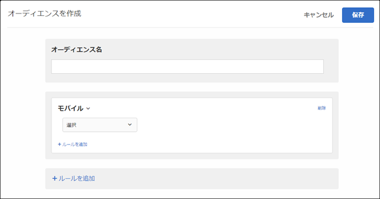

# モバイル{#mobile}

モバイルデバイス、デバイスの種類、デバイスのベンダー、画面の寸法（ピクセル単位）などのパラメーターに基づく Target モバイルデバイスです。

例えば、携帯電話からページに訪問するユーザーに対しては、コンピューターから訪問するユーザーとは別のコンテンツを表示するとします。この場合、モバイルオーディエンスを選択して「**[!UICONTROL 携帯電話]」オプションを選択し、携帯電話の種類や画面のサイズ（ピクセル単位）など重要となる特定の詳細を追加します。**

モバイルターゲットは、DotMobi 社のサービスである [DeviceAtlas](https://deviceatlas.com/device-data/user-agent-tester) から提供されます。DeviceAtlas は、メーカーやネットワーク通信業者を含む非常に多くのソースから収集したデータに基づいて構築された、モバイルデバイスの包括的なデータベースです。このデータには、大規模で正確なモバイルデバイスデータベースを構築するための検証、相互参照、妥当性確認が実施されます。

デバイス検出は、ユーザーエージェント文字列を分析することで実行されます。Apple などの一部のデバイス製造業者は、UA に十分な情報を提供しないことで、この機能を無効にしています。

例えば、Apple デバイスは、デバイスモデル専用のトークンを UA で共有しません。その結果、シンプルなキーワードベースの方法を使用して iPhone のモデル（iPhone 5S、iPhone SE、iPhone 6 など）を検出することはできません。

この問題を解決するために、Target では、次のパラメーターを使用して追加のデータを収集し、iPhone などの Apple デバイスを正確に検出します。

| パラメーター | タイプ | 説明 |
|--- |--- |--- |
| devicePixelRatio | 文字列 | ブラウザー上の物理的なピクセルとデバイスに依存しないピクセル（dips）の比率。例：「1.5」または「2」 |
| screenOrientation | 文字列 | デバイスとブラウザーの JavaScript エンジンは、デバイスオリエンテーションに対応します。横または縦にすることができます。 |
| webGLRenderer | 文字列 | グラフィックドライバーのブラウザーレンダラーです。 |

>[!NOTE]
>
>モバイル SDK を使用しているお客様は、この機能を利用するために必要なことは何もありません。at.jsを使用する顧客は、 [at.jsバージョン1.5.0](../../../c-implementing-target/c-implementing-target-for-client-side-web/target-atjs-versions.md#reference_DBB5EDB79EC44E558F9E08D4774A0F7A) （以降）にアップグレードする必要があります。

複数のモバイルデバイスプロパティを選択できます。OR を使用して複数の選択肢を結合できます。

（at.js または Mobile SDK を使用していない）カスタム統合を使用しているユーザーは、これらのパラメーターを手動で収集して mbox パラメーターとして渡すことができます。

1. [!DNL Target] インターフェイスで **[!UICONTROL 、Audiences]** /Audiences **[!UICONTROL を作成をクリック]** します。
1. オーディエンスに名前を付けます。
1. ルール **[!UICONTROL を追加]** / **[!UICONTROL モバイル]** をクリックします。

   

1. **[!UICONTROL 「選択」をクリック]** し、次のいずれかのオプションを選択します。

   * デバイスのマーケティング名
   * デバイスモデル
   * デバイスのベンダー
   * モバイルデバイス
   * 携帯電話
   * タブレット
   * OS
   * 画面の高さ（px）
   * 画面の幅 (px)
   >[!NOTE]
   >
   >iOS12.2で導入された新しい変更により、デバイスマーケティング名によって定義されたルールを使用してオーディエンスを作成し、iPhoneモデルを指定するデバイスモデルに影響を与えます。iOS12.2をインストールしたiPhoneを搭載したユーザーをターゲットにすることはできません。ただし、これらのユーザーにiOS12.2がない場合は、iPhoneモデルのターゲット設定が引き続き正しく動作します。
   >
   >iOS12.2へのアップグレードはiOS12.2へのアップグレードをサポートしていないので、iOS12.2のアップデートは次のモデルの識別には影響しません。iPhone、iPhone3G、iPhone3GS、iPhone4、iPhone4s、iPad5c、iPad5c、iPad、iPad2、iPad/Retinaディスプレイ、iPad Retina（4th Gen）、iPod Touch4、iPod Touch5。

   >[!NOTE]
   >
   >[地域設定](../../../c-target/c-audiences/c-target-rules/geo.md#concept_5B4D99DE685348FB877929EE0F942670) を使用してモバイルデバイスの通信事業者にターゲット設定できます。

1. （オプション）「**[!UICONTROL ルールを追加]」をクリックして、オーディエンス用の追加のルールを設定します。**
1. 「 **[!UICONTROL 保存]**」をクリックします。

## トレーニングビデオ: Audiencesの作成

このビデオでは、オーディエンスのカテゴリの使用について説明しています。

* オーディエンスの作成
* オーディエンスカテゴリの定義

>[!VIDEO](https://video.tv.adobe.com/v/17392?captions=jpn)
