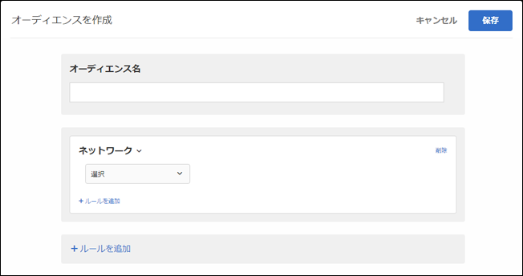

# ネットワーク{#network}

ネットワークの詳細に基づいたオーディエンスを作成できます。

1. [!DNL Target] インターフェイスで **[!UICONTROL 、Audiences]** /Audiences **[!UICONTROL を作成をクリック]** します。
1. オーディエンスに名前を付けます。
1. ルール **[!UICONTROL を追加]** / **[!UICONTROL ネットワーク]** をクリックします。

   

1. **[!UICONTROL 「選択」をクリック]** し、次のいずれかのオプションを選択します。

   * ** ISP: ** ISPは、加入者に対して、通常月額または年額の料金でインターネットアクセスを提供する組織です。多くの ISP は、Web ホスティングや電子メールなどの追加のサービスを提供しています。ISP フィールドには、商用 ISP（Comcast や TimeWarner など）または企業や教育機関などの法人を指定します。

      次に、米国で一般的な ISP の例を示します。

      | 一般名 | ISP 名 | ドメイン名 | サンプルの IP アドレス |
      |---|---|---|---|
      | Cablevision | Cablevision Systems Corp. | *.optonline.net | 68.196.130.239 |
      | CenturyLink | Qwest Communications Company, LLC | *.centurylink.net | 64.40.65.0 |
      | Charter Communications | Charter Communications | *.charter.com | 71.85.225.124 |
      | Comcast | Comcast Cable Communications, Inc. | *.comcast.net | 76.27.24.28 |
      | Cox | Cox Communications Inc. | *cox.net | 68.224.174.22 |
      | Speakeasy | MegaPath Corporation | *.speakeasy.net | 66.93.240.0 |
      | Time Warner | Time Warner Cable Internet LLC | *.res.rr.com | 72.229.28.185 |
      | Verizon FiOS | MCI Communications Services, Inc.（商号：Verizon Business） | *.fios.verizon.net | 173.68.112.34 |
      | Vivint | Smartrove Inc. | *.vivintwireless.net | 170.72.26.105 |
      | AT&amp;T Wireless | AT | *.mycingular.net |  |
      | Sprint mobile | Sprint Personal Communications Systems | IP アドレス |  |
      | T-Mobile | T-Mobile USA, Inc. | IP アドレス | 208.54.86.0 |
      | Verizon Wireless | Cellco Partnership DBA Verizon Wireless | *.myvzw.com | 70.195.74.199 |

      >[!NOTE]
      >
      >ISPに基づいてターゲット設定する場合は、一般名ではなくISP名を使用してください。大文字と小文字を区別するか、すべて小文字の形式を常に使用するようにルールを作成してください。

      ここに示されている以外の ISP を表に追加することをご希望の場合は、カスタマーケアまでご提案ください。

      ISP およびドメイン名の値をテストできます。ターゲット設定については、https://www.whoismyisp.orgを参照してください。上記の表のサンプルの IP アドレスを使用することも、独自の IP アドレスを入力することもできます。その後、`themboxOverride.browserIp= URL` パラメーターを使用して、その IP アドレスを模倣できます。

   * **ドメイン名: **これは、訪問者のIPアドレスのドメイン名です。[!DNL Target] で使用している Web サイトのドメイン名ではありません。このドメイン名は、訪問者の IP アドレスに関連しており、ホスト名とも呼ばれます。通常、この値は ISP 名とよく似ています。ホスト名には、リブランドする前の、会社の古い ISP 名が設定されていることもありますが、ドメイン名ではそのようなことはありません。
   * **接続速度：**これは、訪問者のインターネットへの接続速度です。ブロードバンド、ケーブル、ダイアルアップ、モバイル、oc3、oc12、サテライト、t1、t2、ワイヤレス、xdsl などがあります。

      このフィールドは、実際の速度自体ではなく、接続の種類に基づいています。[!DNL Target] では、接続の正確な速度は判断できません。ブロードバンド接続タイプは、他の接続タイプであると判定できず、特定のタイプを選択できない場合に使用されます。

1. （オプション）「**[!UICONTROL ルールを追加]」をクリックして、オーディエンス用の追加のルールを設定します。**
1. 「 **[!UICONTROL 保存]**」をクリックします。

## トレーニングビデオ: Audiencesの作成

このビデオでは、オーディエンスのカテゴリの使用について説明しています。

* オーディエンスの作成
* オーディエンスカテゴリの定義

>[!VIDEO](https://video.tv.adobe.com/v/17392)