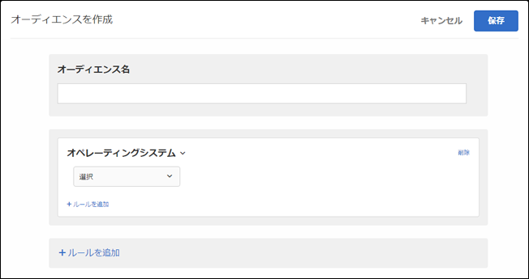

# オペレーティングシステム{#operating-system}

特定のオペレーティングシステムを使用している訪問者をターゲットに設定することができます。

1. [!DNL Target] インターフェイスで **[!UICONTROL 、Audiences]** /Audiences **[!UICONTROL を作成をクリック]**　します。
1. オーディエンスに名前を付けます。
1. ルール **[!UICONTROL を追加]** / **[!UICONTROL オペレーティングシステム]**　をクリックします。

   

1. **[!UICONTROL 「選択」をクリック]**　し、次のいずれかのオプションを選択します。

   * Linux
   * Macintosh
   * Windows

1. （オプション）「**[!UICONTROL ルールを追加]」をクリックして、オーディエンス用の追加のルールを設定します。**
1. 「 **[!UICONTROL 保存]**」をクリックします。

## トレーニングビデオ: Audiencesの作成

このビデオでは、オーディエンスのカテゴリの使用について説明しています。

* オーディエンスの作成
* オーディエンスカテゴリの定義

>[!VIDEO](https://video.tv.adobe.com/v/17392)
