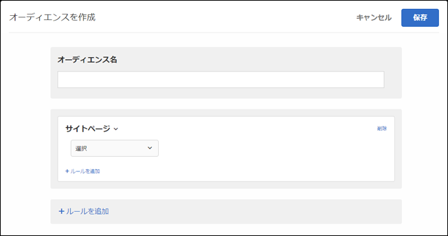
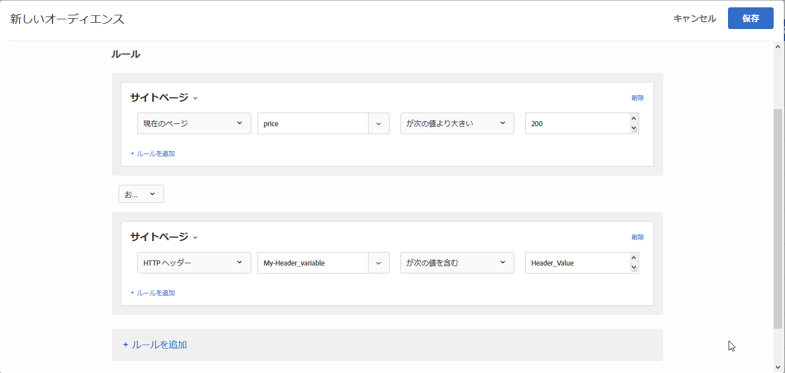

# サイトのページ{#site-pages}

指定したページを閲覧している、または指定した mbox パラメーターが設定されている訪問者をターゲットにします。

>[!NOTE]
>
>オーディエンスのサイトページタイプと比較演算子が、Target Classic のタイプと比較演算子に一致するようになりました。独自の「ユーザー定義のクエリパラメーター」または「ユーザー定義のヘッダー」を使用して、サイトページのオーディエンスを作成することもできます。

1. [!DNL Target] インターフェイスで、「**[!UICONTROL オーディエンス]**／**[!UICONTROL オーディエンスを作成]**」をクリックします。
1. オーディエンスに名前を付けます。
1. 「**[!UICONTROL ルールを追加]**／**[!UICONTROL Site ページ]**」をクリックします。

   

1. 「**[!UICONTROL 選択]**」をクリックし、次のいずれかのオプションを選択します。

   * **現在のページ：** ユーザーが現在閲覧しているページで、アクティビティに mbox を含むページ。アクティビティレベルでターゲット設定する場合、このページは、エントリ条件の定義に使用する mbox を含むページか、コンテンツを表示するページのいずれかになります。エクスペリエンスでターゲット設定する場合は、現在のページは、表示 mbox を含むページになります。成功指標またはコンバージョンをターゲットにしている場合、現在のページはそれらの mbox を含むページです。
   * **前のページ：** クリックして現在のページに移動する前に閲覧していたページ（ユーザーが前のページからクリックして現在のページを開いた場合は、前のページが追跡されますが、ブラウザーで新しく URL を入力した場合は、前のページは追跡されません）。このページの実際のコンテンツはサイトのデザインによって異なります。例えば、現在のページに特定の商品に関する情報が表示されている場合、その直前のページは、訪問者が特定のアイテムを選択するカテゴリページ（あるタイプのカメラが数種類掲載されたページなど）になっているか、最終ページへ案内するホームページになっていることがあります。
   * **ランディングページ：** ランディングページは、サイトにアクセスする訪問者が最初に目にするページです。例えば、訪問者が Google 上のリンクをクリックしてカテゴリページが開いた場合は、そのカテゴリページがランディングページになります。リンクからホームページが表示された場合は、そのホームページがランディングページになります。ランディングページは訪問者のセッション中記憶されます。このセッションで訪問者のランディングページが何であったのかを基に、サイトをより掘り下げてターゲットを定めることができます。

      >[!NOTE]
      >
      >`landing.url` サブドメインの変更またはダイレクトURLの置換時にオブジェクトがリセットされます。

   * **mbox：** ターゲットとしている mbox。例えば、合計 100 ドル以上の注文をカウントする場合、ここで指定したターゲット設定を含む mbox パラメーターとして `orderTotal` を渡します。
   * **ドメイン：** ページの完全ドメイン。ドメインを指定する際には、ベストプラクティスとして、「次を含む」を使用することが推奨されます。例えば、「ドメインがfacebook.comに等しい」は受け入れ `m.facebook.com` られ `www.facebook.com` ません。「facebook.com を含むドメイン」では、facebook.com のあらゆるバリエーションが含まれます。
   * **クエリ：** 最初の疑問符（?）後の URL のコンテンツ。例えば、次のサンプル URL ではクエリが太字で表示されています。

      `foo.html?e0a72cb2a2c7`

1. （オプション）「**[!UICONTROL ルールを追加]**」をクリックして、オーディエンス用の追加のルールを設定します。
1. 「**[!UICONTROL 保存]**」をクリックします。

独自の「ユーザー定義のクエリパラメーター」または「ユーザー定義のヘッダー」を使用して、サイトページのオーディエンスを作成することもできます。

それぞれの使い分けは次のとおりです。

* ユーザーが選択したルールが現在のページ、ランディングページ、前のページの場合はクエリパラメーターを使用します。
* ユーザーが選択したルールが HTTP ヘッダーの場合はヘッダーを使用します。

次の図を参照してください。

## トレーニングビデオ：オーディエンスの作成

このビデオでは、オーディエンスのカテゴリの使用について説明しています。

* オーディエンスの作成
* オーディエンスカテゴリの定義

>[!VIDEO](https://video.tv.adobe.com/v/17392?captions=jpn)
