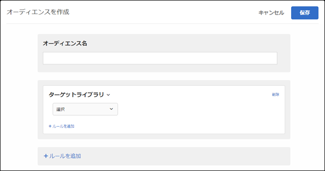

# ターゲットライブラリ{#target-library}

事前設計されたターゲットルールに基づいてユーザーをターゲット設定します。

ターゲットライブラリカテゴリの事前設計されたオーディエンスは、従来のオーディエンスで、他のカテゴリに存在します。その他の情報およびベストプラクティスについては、[ターゲットとオーディエンスに関するよくある質問](../../../c-target/c-troubleshooting-targets-and-audiences/troubleshooting-targets-and-audiences.md#concept_C4EE4B8F4840430CBD798D579A8F208D).

>[!NOTE]
>
>Target Classicを使用して、洗練されたターゲットを一度作成し、異なるアクティビティ、エクスペリエンスなどで繰り返し使用できるようにしました。この機能は、Target Standard/Premium には含まれていません。

1. [!DNL Target] インターフェイスで、「**[!UICONTROL オーディエンス]**／**[!UICONTROL オーディエンスを作成]**」をクリックします。
1. オーディエンスに名前を付けます。
1. 「**[!UICONTROL ルールを追加]**／**[!UICONTROL Target ライブラリ]**」をクリックします。

   

1. 「**[!UICONTROL 選択]**」をクリックして、事前にビルドされたターゲットルールを選択します。

   事前設計されたターゲットルールには、Windows オペレーティングシステム、タブレットデバイス、Safari ブラウザー、再訪問者、Google からの参照などが含まれています。

   事前定義されたオーディエンス「タブレットデバイス」は、ユーザーエージェントに次の文字列のいずれかが含まれている場合に既に資格を得ています（モデル数のデバイス）。このため、ここに挙げたデバイスについてはカスタムターゲットルールを作成する必要はありません。

   Kindle、Silk、iPad、Sony Tablet、TF101、GT-P1000、GT-P1000R、GT-P1000M、SGH-T849、SHW-M180S、GT-I9000T、BNTV250 および Tablet PC。

1. （オプション）「**[!UICONTROL ルールを追加]**」をクリックして、オーディエンス用の追加のルールを設定します。
1. 「**[!UICONTROL 保存]**」をクリックします。

## トレーニングビデオ：オーディエンスの作成

このビデオでは、オーディエンスのカテゴリの使用について説明しています。

* オーディエンスの作成
* オーディエンスカテゴリの定義

>[!VIDEO](https://video.tv.adobe.com/v/17392?captions=jpn)
