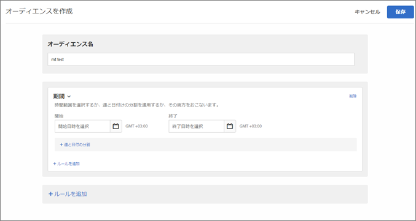
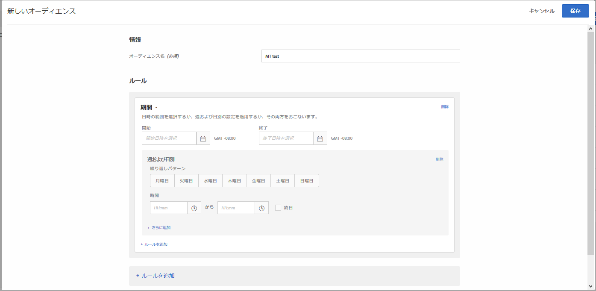

# 時間枠{#time-frame}

開始および終了の日時を追加して、特定の時間枠中にサイトを訪問するユーザーにターゲット設定できます。また、「週と日付の分割」オプションを設定して、オーディエンスのターゲット設定の繰り返しパターンを作成できます。

[例えば、結合されたアドホックオーディエンス機能](../../../c-target/combining-multiple-audiences.md#concept_A7386F1EA4394BD2AB72399C225981E5) を使用すると、ブラックフライデーおよびブラックフライデーの後のその他のコンテンツの3日間に特定のコンテンツを持つ低スパム者をターゲット設定できます。

1. [!DNL Target] インターフェイスで、「**[!UICONTROL オーディエンス]**／**[!UICONTROL オーディエンスを作成]**」をクリックします。
1. オーディエンスに名前を付けます。
1. 「**[!UICONTROL ルールを追加]**／**[!UICONTROL 時間枠]**」をクリックします。

   

1. オーディエンスの新しい開始日時と停止日時を選択します。

   アクティビティのスケジュールによってターゲティングを開始するには、開始日を空欄にしておきます。アクティビティの停止日時までターゲティングを続けるには停止日を空欄にしておきます。

   開始日と終了日を両方とも空欄にしておくこともできます。そうすることで、開始日と終了日をアクティビティレベルで管理しつつ、複数のアクティビティに同じオーディエンスを使用できるようになります（オーディエンスのコピーを作成する必要がなくなります）。

   >[!NOTE]
   >
   >開始日/終了日のタイムゾーンは、GMT+/- NNとして表示されます。NN（ここでNN: NNはGMTからのオフセットであり、訪問者のタイムゾーンではなくアカウントレベルのタイムゾーンを反映しています。例えば、カリフォルニアのタイムゾーンは、GMT -08:00 と表示されます。

1. （条件付き）「**[!UICONTROL 週と日付の分割]**」をクリックして、繰り返しパターンを設定します（曜日と時刻を含む）。

   

   「週と日付の分割」オプションを使用すると、例えば、コールセンターのスタッフがいる曜日および時間の訪問者のみに「今すぐチャット」オプションを表示することができます。

   1 つ以上の曜日を選択して、開始および終了時間を設定します。必要に応じて、「**[!UICONTROL さらに追加]」をクリックして、追加のパターンを指定します。**

   >[!NOTE]
   >
   >週と日の分割の [!UICONTROL タイムゾーンは、GMT+/-] NNとして表示されます。NN（ここでNN: NNはGMTからのオフセットであり、訪問者のタイムゾーンではなくアカウントレベルのタイムゾーンを反映しています。例えば、カリフォルニアのタイムゾーンは、GMT -08:00 と表示されます。

1. （オプション）「**[!UICONTROL ルールを追加]**」をクリックして、オーディエンス用の追加のルールを設定します。

   必要に応じて、各ルールで手順 5 を繰り返すことができます。

1. 「**[!UICONTROL 保存]**」をクリックします。

## トレーニングビデオ：オーディエンスの作成

このビデオでは、オーディエンスのカテゴリの使用について説明しています。

* オーディエンスの作成
* オーディエンスカテゴリの定義

>[!VIDEO](https://video.tv.adobe.com/v/17392?captions=jpn)
