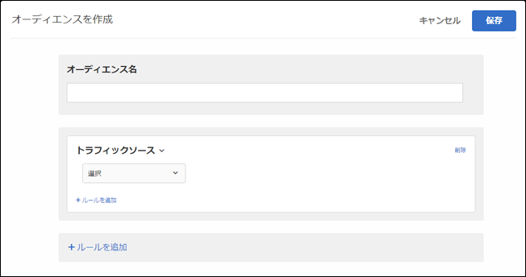

# トラフィックソース{#traffic-sources}

オーディエンスを作成して、サイトに導いた検索エンジンまたはランディングページに基づいて訪問者をターゲット設定します。

例えば、訪問者のブラウザー、検索エンジンまたは参照元ランディングページを基にターゲットを定めることができます。参照ランディングページは、訪問者がこのセッションの対象としてクリックしたページです。（例えば、訪問者がGoogle上の広告をクリックし、その訪問者を `adobe.com` ホームページに誘導した場合、参照ランディングページが表示 `google.com`されます）。

複数のトラフィックソースを組み合わせて複雑なターゲットルールを作成できます。

1. [!DNL Target] インターフェイスで、「**[!UICONTROL オーディエンス]**／**[!UICONTROL オーディエンスを作成]**」をクリックします。
1. オーディエンスに名前を付けます。
1. 「**[!UICONTROL ルールを追加]**／**[!UICONTROL トラフィックソース]**」をクリックします。

   

1. 「**[!UICONTROL 選択]**」をクリックし、次のいずれかのオプションを選択します。

   * Baidu から
   * Bing から
   * Google から
   * Yahoo から
   * 参照ランディングページ：URL
   * 参照ランディングページ：ドメイン
   * 参照ランディングページ：クエリ
   選択によっては、追加情報（評価基準および値）を提供する必要がある場合があります。

1. （オプション）「**[!UICONTROL ルールを追加]**」をクリックして、オーディエンス用の追加のルールを設定します。
1. 「**[!UICONTROL 保存]**」をクリックします。

特定の検索エンジン、または特定のランディングページからサイトに導かれたユーザーをターゲット設定できます。

## トレーニングビデオ：オーディエンスの作成

このビデオでは、オーディエンスのカテゴリの使用について説明しています。

* オーディエンスの作成
* オーディエンスカテゴリの定義

>[!VIDEO](https://video.tv.adobe.com/v/17392?captions=jpn)
