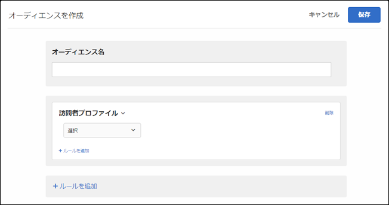

# 訪問者プロファイル{#visitor-profile}

特定のプロファイルパラメーターに一致する訪問者をターゲット設定します。

1. [!DNL Target] インターフェイスで **[!UICONTROL 、Audiences]** /Audiences **[!UICONTROL を作成をクリック]** します。
1. オーディエンスに名前を付けます。
1. ルール **[!UICONTROL を追加]** / **[!UICONTROL 訪問者プロファイル]** をクリックします。

   

1. **[!UICONTROL 「選択」をクリック]** し、次のいずれかのオプションを選択します。

   訪問者プロファイルのパラメーターは mbox（プロファイル）を介して渡されます。新しい訪問者と再訪問者のいずれもターゲットに設定することができます。さらに、すべてのユーザーを含めることも可能です。

   * 新しい訪問者
   * 再訪問者
   * 他のテストに存在
   * 他のテストに存在しない
   * セッションの最初のページ
   * セッションの最初のページ以外
   * カテゴリ親和性
   訪問者プロファイルは、新しい `mboxPC` によって mbox 呼び出しごとにローカルエッジのメモリ内に作成されます。30 分間使用されない状態が続くと、プロファイルは Target データベースに保存され、他のエッジからアクセスできるようになります。

   サイト訪問者がセッション中にログインしてから取得すると、 `3rdpartyId` それらに関連付けられているすべての以前に読み込まれたプロファイル属性 `3rdPartyId` がすぐに使用可能になります。

   カスタムプロファイルパラメーターと `user.` パラメーターをターゲット設定できます。アクティビティのターゲット設定で使用するパラメーターを選択します。必要なパラメーターが表示されない場合、そのパラメーターは mbox で公開されていません。

1. （オプション）「**[!UICONTROL ルールを追加]」をクリックして、オーディエンス用の追加のルールを設定します。**
1. 「 **[!UICONTROL 保存]**」をクリックします。

## トレーニングビデオ: Audiencesの作成

このビデオでは、オーディエンスのカテゴリの使用について説明しています。

* オーディエンスの作成
* オーディエンスカテゴリの定義

>[!VIDEO](https://video.tv.adobe.com/v/17392)
