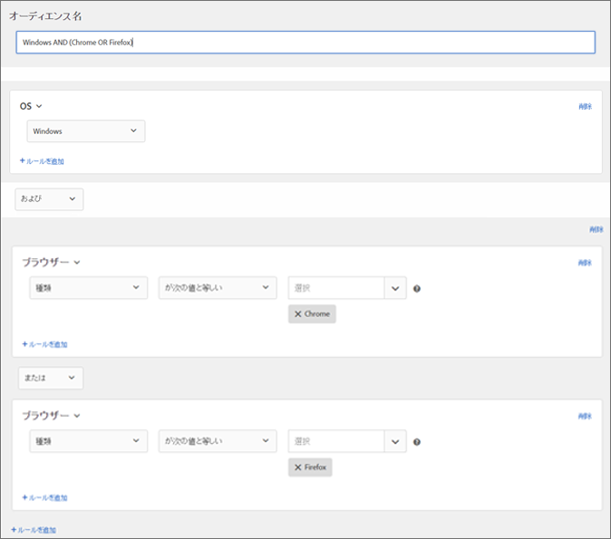

# Target でのオーディエンスの構築{#build-audiences-in-target}

カスタマイズしたオーディエンスを作成し、アクティビティで使用できるように Target ライブラリに保存できます。既存のオーディエンスをコピーすると、それを編集することで類似のオーディエンスを作成したり、複数のオーディエンスを結合したりできます。

## オーディエンスの概要

オーディエンスは、誰が [!DNL Target] アクティビティに含まれるか、または除外されるかを決定するルールによって定義されます。オーディエンス定義には複数のルールを含めることができ、各ルールには複数のパラメーターを含めることができます。複雑なオーディエンス定義は、ブール演算子 AND および OR を使用してルールおよびパラメーターを組み合わせて、どのサイト訪問者がアクティビティ参加者としてカウントされるかを詳細に制御します。

ルールまたはパラメーターを AND で組み合わせる場合、任意の潜在的なオーディエンスメンバーが参加者として含められるためには、定義された条件を&#x200B;*すべて*&#x200B;満たす必要があります。例えば、AND を使用して OS ルールとブラウザールールを定義すると、定義された OS と定義されたブラウザーの&#x200B;*両方*&#x200B;を使用している訪問者のみ、アクティビティに含められます。

ルールまたはパラメーターを OR で組み合わせる場合、任意の潜在的なオーディエンスメンバーが参加者として含められるためには、定義された条件のいずれか 1 つを満たす必要があります。例えば、OR で接続される複数のモバイルルールを定義する場合、定義された条件の&#x200B;*いずれか*&#x200B;を満たす訪問者がアクティビティに含められます。

両方のブール演算子を混在させて複雑なルールを作成できますが、同じルールレベルの演算子は一致している必要があります。ユーザーインターフェイスは自動的に適切な演算子を適用します。

For example, the following rule targets visitors who use either Chrome *or* Firefox on a Windows computer:

>[!NOTE]
>
>すべての潜在的なオーディエンスメンバーを除外するルールを作成しないように注意してください。For example, it is not possible for someone to visit a page using Chrome *and* Firefox simultaneously.

## 新しいオーディエンスの作成

1. 上部のメニューバーで「**[!UICONTROL オーディエンス]**」をクリックします。

   

1. [!UICONTROL オーディエンス]のリストから、「**[!UICONTROL + オーディエンスを作成]**」をクリックします。

   または

   既存のオーディエンスをコピーするには、[!UICONTROL オーディエンス]のリストから目的のオーディエンスにマウスポインターを置き、**[!UICONTROL コピー]アイコンをクリックします。**&#x200B;これにより、そのオーディエンスを編集して類似のオーディエンスを作成することができます。

1. わかりやすい一意のオーディエンスの名前を入力します。
1. 「**[!UICONTROL ルールを追加]**」をクリックします。

   ルールを使用すると、オーディエンスをサイト訪問者の一部に限定することができます。
1. ルールタイプを選択します。

   各ルールタイプには、独自のパラメーターがあります。オーディエンスルールの各タイプの構成について詳しくは、[オーディエンスのカテゴリ](../../c-target/c-audiences/c-target-rules/target-rules.md#concept_E3A77E42F1644503A829B5107B20880D)を参照してください。
1. ルールパラメーターを定義します。
1. 「**[!UICONTROL 保存]**」をクリックします。

   処理遅延の数秒後に、新しく作成したオーディエンスがリストに表示されます。オーディエンスがすぐにリストに表示されない場合は、オーディエンスを検索するか、リストを更新してください。

## トレーニングビデオ：オーディエンスの作成

このビデオでは、オーディエンスの作成について説明します。

* オーディエンスの作成
* オーディエンスカテゴリの定義

>[!VIDEO](https://video.tv.adobe.com/v/17392?captions=jpn)