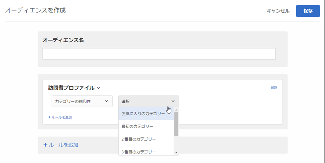

# カテゴリ親和性{#category-affinity}

カテゴリ親和性機能では、ターゲット設定とセグメント化のために、ユーザーが訪問するカテゴリを自動的にキャプチャし、そのカテゴリに対するユーザーの親和性を計算します。これによって、コンテンツをその情報に基づいて行動を起こす可能性が最も高い訪問者にターゲット設定することができます。

## カテゴリ親和性情報のTargetへの引き渡し {#section_B0C8E46EEBAC4549AD90352A47787D04}

ユーザーがサイトを訪問したときには常に、訪問者に固有のプロファイルパラメーターが [!DNL Target] データベースに記録されます。データはユーザーの Cookie に結び付けられます。特に便利なパラメーターとして、製品 `user.categoryId` ページに割り当てられたmboxパラメーターがあります。訪問者が閲覧を続けるか、別のセッションに戻る場合に、特定のユーザーが閲覧する製品のカテゴリを記録することができます。カテゴリ情報の記録は、任意の mbox（ネストされた mbox を含む）の mbox パラメーター `user.categoryId` または URL パラメーター `user.categoryId` として、またはグローバル mbox を使用した Target ページのパラメーターで渡すことによっても実行できます。詳しくはアカウント担当者にお問い合わせください。

カテゴリを複数のカテゴリに含めるには、カテゴリをコンマで区切ります。次に例を示します。

* `user.categoryId=clothing,shoes,nike,running,nike clothing,nike shoes,nike running shoes`

製品カテゴリに対する訪問の頻度とリーセンシーに基づいて、ユーザーのカテゴリ親和性が（存在する場合）記録されます。カテゴリ親和性は、アクティビティに対して訪問者をターゲット設定するために使用できます。

プロファイルスクリプト `user.categoryAffinities[]` では、訪問者が入力した親和性の配列を返すことができます。

>[!IMPORTANT]
>
>Adobe Targetのカテゴリ親和性のアルゴリズムに使用される `user.categoryId` 属性は、Adobe Target Recommendationsの製品およびコンテンツのレコメンデーションに使用される `entity.categoryId` 属性とは異なります。`user.categoryId` は、ユーザーのお気に入りのカテゴリを追跡するために必要です。`entity.categoryId` は、現在のページまたは現在の品目のカテゴリに基づいてレコメンデーションをベースにする必要があります。両方の機能を使用する場合は、両方の値をAdobe Targetに渡します。

## カテゴリ親和性のビジネス事例 {#section_D6FF913E88E6486B8FBCE117CA8B253B}

1 つのセッション内での訪問者のアクティビティ（訪問者がどのカテゴリを最も頻繁に訪問するかなど）は、その後の訪問でのターゲット設定に使用できます。訪問者がセッションの実行中に閲覧したそれぞれのカテゴリページがキャプチャされ、最新性と頻度のモデルに基づいて、その訪問者の「お気に入り」のカテゴリが算出されます。次に、訪問者がホームページに戻るたびに、そのユーザーのお気に入りのカテゴリに関連したコンテンツを表示するように、ヒーロー画像領域をターゲット設定できます。

## カテゴリ親和性の使用例 {#section_A4AC0CA550924CB4875F4F4047554C18}

楽器をオンラインで販売し、過去にギターへの関心を示した訪問者に対して、ベースギターの販売プロモーションをターゲット設定するとします。カテゴリ親和性を使用して、このカテゴリ親和性を持つ訪問者のみに表示するオファーを作成できます。

## カテゴリ親和性のアルゴリズム {#section_8B86C7FF50294208866ABF16F07D5EB9}

カテゴリ親和性のアルゴリズムは以下のように機能します。

* 最初に閲覧されたカテゴリの10 ポイント
* 最初のカテゴリをクリックした後、各カテゴリの5ポイント
* 新しいカテゴリがクリックされると、前にクリックされたすべてのカテゴリから1が減算されます
* カテゴリが既にクリックされていた場合（表示されている場合）、そのカテゴリを他のすべてのカテゴリから1を減算することはありません
* 6番目の新しいカテゴリがクリックされると、最初の5つのカテゴリの最も低いスコアカテゴリが計算から除外されます
* セッションの終了時に、すべての値を2で除算します

### 例：カテゴリ親和性のアルゴリズム

たとえば、セッションで`mens-clothing`カテゴリ、`accessories`、`jewelry`、さらに `accessories`を表示すると次のようになります。

* `accessories`: 9 (+5 – 1 + 5)

* `mens-clothing`: 8 (+10 – 1 – 1)

* `jewelry`: 5 (+5)

セッションが終了し、ユーザーが後でサイトに戻ると、スコアは半分になります。

* `accessories`: 4.5 (9/2)

* `mens-clothing`: 4 (8/2)

* `jewelry`: 2.5 (5/2)

次に、ユーザーが、`jewelry`、`accessories`、`beauty`、`shoes`、および `womens-clothing` を順に表示するとします。

* `accessories`: 6.5 (4.5 + 5 – 1 – 1 - 1)

* `womens-clothing`: 5 (+5)

* `jewelry`: 4.5 (2.5 + 5 – 1 – 1 - 1)

* `shoes`: 4 (+5 – 1)

* `beauty`: 3 (+5 – 1 - 1)

* `womens-clothing`の最後のクリックの後、`mens-clothing`がスコア 1 の最低スコアのカテゴリとしてドロップされます（4 – 1 – 1 - 1）

セッションが終了し、ユーザーが後でサイトに戻ると、スコアは半分になります。

* `accessories`: 3.3 (6.5/2)

* `womens-clothing`: 2.5 (5/2)

* `jewelry`: 2.3 (4.5/2)

* `shoes`: 2 (4/2)

* `beauty`: 1.5 (3/2)

## ターゲティングのためのカテゴリ親和性の使用 {#concept_5750C9E6C97A40F8B062A5C16F2B5FFC}

アクティビティでターゲティングのための[!UICONTROL カテゴリ親和性]オーディエンスを使用するのに役立つ情報を紹介します。

このセクションでは、以下について説明します。

* [カテゴリ親和性を使用するオーディエンスの作成](../../c-target/c-visitor-profile/category-affinity.md#section_A27C600BBA664FE7A74F8FE076B78F40)
* [アクティビティにおけるカテゴリ親和性オーディエンスの使用](../../c-target/c-visitor-profile/category-affinity.md#section_91526B942D1B4AEBB8FCDF4EBFF931CF)

## カテゴリ親和性を使用するオーディエンスの作成 {#section_A27C600BBA664FE7A74F8FE076B78F40}

1. **[!UICONTROL オーディエンス]** のリストから、「**[!UICONTROL + オーディエンスを作成]**」をクリックします。

   または

   既存のオーディエンスをコピーするには、オーディエンスのリストから目的のオーディエンスにマウスポインターを置き、コピーアイコンをクリックします。これにより、そのオーディエンスを編集して類似のオーディエンスを作成することができます。

1. わかりやすいオーディエンスの名前を入力します。
1. **[!UICONTROL ルールを追加]**／**[!UICONTROL 訪問者プロファイル]** をクリックします。
1. **[!UICONTROL 訪問者プロファイル]** ドロップダウンリストから、「**[!UICONTROL カテゴリーの親和性]**」を選択します。

   

1. 目的のカテゴリを選択します。

   

   カテゴリには次のようなものがあります。

   * お気に入りのカテゴリ
   * 最初のカテゴリ
   * 2 番目のカテゴリ
   * 3 番目のカテゴリ
   * 4 番目のカテゴリ
   * 5 番目のカテゴリ

1. 評価基準を選択します。

   * 次を含む（大文字と小文字を区別しない）
   * 次を含まない（大文字と小文字を区別しない）
   * 次と等しい

1. 新しい値はそれぞれ別の行（例えば、「靴」）に指定します。
1. 「**[!UICONTROL 保存]**」をクリックします。

## アクティビティにおけるカテゴリ親和性オーディエンスの使用 {#section_91526B942D1B4AEBB8FCDF4EBFF931CF}

カテゴリ親和性オーディエンスはどのアクティビティでも使用できます。3 ステップのガイドによるワークフローの Target の手順で、目的のオーディエンスを選んでください。
