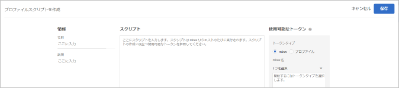
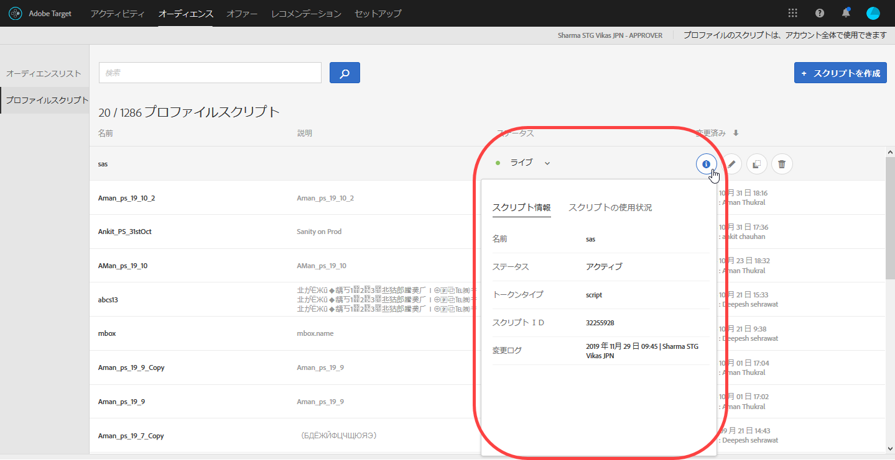
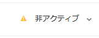

# プロファイル属性{#profile-attributes}

プロファイル属性は、訪問者に固有のパラメーターです。プロファイル属性は訪問者のプロファイルに保存され、キャンペーンで使用可能な訪問者に関する情報を提供します。

## プロファイル属性 {#concept_01A30B4762D64CD5946B3AA38DC8A201}

プロファイル属性は、訪問者に固有のパラメーターです。プロファイル属性は訪問者のプロファイルに保存され、キャンペーンで使用可能な訪問者に関する情報を提供します。

訪問者が閲覧したり、別のセッションに戻ったりするとき、保存されたプロファイル属性を使用してコンテンツをターゲット設定することや、セグメントフィルターの情報を記録することができます。

プロファイル属性を設定するには、 **[!UICONTROL Audiences]** / **[!UICONTROL プロファイルスクリプトをクリックします。]**

以下のタイプのプロファイル属性を利用できます。

| パラメータータイプ | 説明 |
|--- |--- |
| mbox | mbox を作成するときに、ページコードを介して直接渡されます。詳しくは、[グローバルmboxへのパラメーターの引き渡し](/help/c-implementing-target/c-implementing-target-for-client-side-web/t-mbox-download/c-understanding-global-mbox/pass-parameters-to-global-mbox.md) を参照してください。<br>注意： Target には、mbox 呼び出しごとに 50 個の独自のプロファイル属性という制限があります。50 個を超えるプロファイル属性を Target に渡す必要がある場合、Profile Update API メソッドを使用して渡すことができます。詳しくは、Adobe Target APIドキュメントの [プロファイルの更新](http://developers.adobetarget.com/api/#updating-profiles)を参照してください。 |
| script | JavaScript コードスニペットにより直接定義されます。これらのパラメーターは、現在の合計数（顧客が支払った合計金額など）を保存することができ、mbox リクエストごとに実行されます。詳しくは、プロファイルスクリプト属性を参照してください。 |

## プロファイルスクリプト属性 {#concept_8C07AEAB0A144FECA8B4FEB091AED4D2}

関連する JavaScript コードスニペットを使用して、プロファイルスクリプト属性を定義します。

プロファイルスクリプトを使用して、複数の訪問にわたり、訪問者の属性を取得できます。プロファイルスクリプトは、サーバー側の JavaScript の形式を使用して、Target 内で定義するコードスニペットです。例えば、プロファイルスクリプトを使用して、訪問者がサイトを訪問する頻度や前回の訪問日時を取得できます。

プロファイルスクリプトは、プロファイルパラメーターとは異なります。プロファイルパラメーターでは、Target の mbox コード実装を使用して、訪問者に関する情報を取得します。

>[!NOTE]
>
>[!DNL Target] には、アカウントごとに1,000個のプロファイルスクリプトを制限します。

## プロファイルスクリプトの作成 {#section_CB02F8B97CAF407DA84F7591A7504810}

プロファイルスクリプトは、[!UICONTROL  インターフェイスの「]オーディエンス[!DNL Target]」タブで使用できます。

新しいプロファイルスクリプトを追加するには、 **[!UICONTROL 「プロファイルスクリプト]** 」タブをクリックし **[!UICONTROL 、スクリプト]** を作成してスクリプトを作成します。

または

既存のプロファイルスクリプトをコピーするには、 [!UICONTROL プロファイルスクリプト] リストから目的のスクリプトにマウスポインターを置き、 **[!UICONTROL コピー]** アイコンをクリックします。（アセット/icon_ copy. png）

これにより、そのオーディエンスを編集して類似のオーディエンスを作成することができます。



プロファイルスクリプトは、各場所リクエストでプロファイル属性「catchers」を実行します。場所リクエストを受信すると、Target はどのアクティビティを実行するかを決定し、そのアクティビティおよびそのエクスペリエンスに適したコンテンツを表示し、アクティビティの成功を追跡し、関連するプロファイルスクリプトを実行します。これによって、訪問者の場所、時間帯、訪問者がサイトを訪問した回数、購入歴があるかなど、訪問に関する情報を追跡できます。この情報は次に、訪問者のプロファイルに追加され、サイトでの訪問者のアクティビティをより詳細に追跡できます。

プロファイルスクリプト属性では、属性名の前に `user.` タグが挿入されます。次に例を示します。

```
if (mbox.name == 'Track_Interest') { 
    if (profile.get('model') == "A5" &&; profile.get('subcat') == "KS6") { 
        return (user.get('A5KS6') || 0) + 1; 
    } 
}
```

* コード内で、`user.get('parameterName')` &#39;) を使用して、プロファイルスクリプト属性をいくつか参照します（定義中のパラメーター自体も含む）。
* `user.setLocal('variable_name', 'value')` &#39;) を使用すると、スクリプトを次回実行するとき（次の mbox リクエストの発生時）にアクセスされる可能性がある変数を保存できます。変数を参照 `user.getLocal('variable_name')` します。これは、最後のリクエストの日時を参照する場合に便利です。
* パラメーターおよび値の大文字と小文字は区別されます。キャンペーンまたはテストの実行中に受け取るパラメーターおよび値の大文字と小文字を一致させてください。
* より多くのJavaScript構文については、後述の「スクリプトプロファイルパラメーターのJavaScriptリファレンス」を参照してください。

## プロファイルスクリプト情報カードの表示 {#section_18EA3B919A8E49BBB09AA9215E1E3F17}

オファー情報カードに似たプロファイルスクリプト情報ポップアップカードを表示できます。これらのプロファイルスクリプト情報カードでは、選択したプロファイルスクリプトを参照しているアクティビティのリストやその他の有用なメタデータが表示されます。

例えば、次のプロファイルスクリプト情報カードは、プロファイルスクリプトリスト（Audiences／プロファイルスクリプト）のプロファイルスクリプトにカーソルを合わせてから、情報アイコンをクリックしてアクセスします。

「[!UICONTROL スクリプト情報]」タブには、「名前」、「ステータス」、「トークンの種類」、「スクリプト ID」、「変更ログ」、「説明」の各情報が含まれています。



「[!UICONTROL スクリプト使用状況]」タブには、選択したプロファイルスクリプトを参照するアクティビティ（およびワークスペース）が一覧表示されます。


>[!Note]
>
>次の状況では、選択したプロファイルスクリプトを参照するアクティビティは「スクリプトの使用」タブに表示されません。
> * アクティビティのステータスがドラフトの場合。
> * アクティビティで使用されるコンテンツまたはオファーが、スクリプト変数（アクティビティ内のインラインオファーまたはオファーライブラリ内のオファー）を使用する場合。


## Targetは、特定の状況でプロファイルスクリプトを無効にします {#section_C0FCB702E60D4576AD1174D39FBBE1A7}

[!DNL Target] は、実行に時間がかかりすぎる場合や多くの命令がある場合など、特定の状況で、プロファイルスクリプトを自動的に無効化します。

プロファイルスクリプトが無効化されると、次に示すように、Target UI のプロファイルスクリプトの横に黄色の警告アイコンが表示されます。



マウスポインターを重ねると、次のように、エラーの詳細が表示されます。


システムがプロファイルスクリプトを無効にする一般的な理由は次のとおりです。

* 未定義の変数が参照されている。
* 無効な値が参照されている。これは、多くの場合、URL 値およびその他のユーザー入力データを適切な検証なしに参照することが原因です。
* 使用される JavaScript 命令が多すぎる。Target には、スクリプトあたり 2,000 の JavaScript 命令という制限がありますが、これは、手作業で JavaScript を読んで単純に計算することはできません。例えば、Rhino は、すべての関数呼び出しと「新規」呼び出しを 100 個の命令として処理します。また、すべてのエントリデータのサイズ（URL 値など）は、命令数に影響を与える可能性があります。
* 後述の[ベストプラクティス](../../c-target/c-visitor-profile/profile-parameters.md#section_64AFE5D2B0C8408A912FC2A832B3AAE0)の節で取り上げられている項目に従っていない。

## ベストプラクティス {#section_64AFE5D2B0C8408A912FC2A832B3AAE0}

次のガイドラインは、エラーや失敗をできるだけなくした簡潔なプロファイルスクリプトを記述するためのもので、正常に失敗するコードを記述することで、プロファイルスクリプトの処理時にシステムスクリプトの停止が起こらないようにするものです。これらのガイドラインは、効果的に実行されることが証明されたベストプラクティスによるものです。このガイドラインは、Rhino 開発者コミュニティによる原則および推奨事項に従い適用されるものです。

* ユーザースクリプトでは現在のスクリプト値をローカル変数に設定し、フェイルオーバーには空白の文字列を設定します。
* ローカル変数を検証します。ローカル変数値が空白の文字列でないことを確認します。
* 正規表現ではなく、文字列ベースの操作関数を使用します。
* 実行回数を制限しないで for ループや while ループを使用することはせず、有限回数の for ループを使用します。
* 文字列の長さは 1,300 文字、ループ回数は 50 回を超えないようにします。
* JavaScript 命令は 2,000 個を超えないようにします。Target には、スクリプトあたり 2,000 の JavaScript 命令という制限がありますが、これは、手作業で JavaScript を読んで単純に計算することはできません。例えば、Rhino は、すべての関数呼び出しと「新規」呼び出しを 100 個の命令として処理します。また、すべてのエントリデータのサイズ（URL 値など）は、命令数に影響を与える可能性があります。
* スクリプトのパフォーマンスだけでなく、組み合わされたすべてのスクリプトのパフォーマンスにも注意してください。ベストプラクティスとして、命令数の合計が 5,000 未満となるようにすることをお勧めします。命令数がカウントされているかどうかは不明ですが、注意すべき重要な点は、2 KB を超えるスクリプトは自動的に無効になることです。実行できるスクリプト数に制限はありませんが、各スクリプトは mbox 呼び出しごとに実行されます。必要なスクリプトだけを実行します。
* すべてを実行してもうまくいかない場合は、スクリプトを try ～ catch 文で囲みます。
* 詳細については、JS Rhinoエンジンのドキュメントを参照してください。 [https://www.mozilla.org/rhino/doc.html](https://www.mozilla.org/rhino/doc.html).

## 相互に排他的なアクティビティをテストするプロファイルスクリプト {#section_FEFE50ACA6694DE7BF1893F2EFA96C01}

プロファイル属性を使用すると、同じ訪問者を各アクティビティに参加させずに、複数のアクティビティを比較するテストを設定することができます。

相互に排他的なアクティビティのテストを実行すると、1 つのアクティビティの訪問者が他のアクティビティのテスト結果に影響するのを防ぐことができます。訪問者を複数のアクティビティに参加させると、1 つのアクティビティの訪問者のエクスペリエンスから積極的上昇率と消極的上昇率のどちらがもたらされたのか、または複数のアクティビティ間の相互作用がアクティビティの結果に影響しているのかどうかを見極めることが難しくなります。

例えば、e コマースシステムの 2 つの領域をテストするとします。「カートへ追加」ボタンが青色ではなく、赤色に表示されることをテストします。また、手順の数を 5 つから 2 つに減らす新しいチェックアウトプロセスをテストすることもできます。2 つのアクティビティに同じ成功イベント（購入の成立）が発生した場合、赤いボタンによってコンバージョンが向上したのか、またはチェックアウトプロセスの向上もまた、それらの同じコンバージョンの向上の原因となっているのかを見極めるのは困難なことです。相互に排他的なアクティビティにテストを分けることで、個々の変更を個別にテストすることができます。

以下のいずれかのプロファイルスクリプトを使用する際は、次の点にご注意ください。

* プロファイルスクリプトは、アクティビティの開始前に実行する必要があります。また、アクティビティの実行中は変更しないでください。
* この手法ではアクティビティのトラフィック量が減るので、必要なアクティビティ実行期間が長くなる場合があります。アクティビティの期間を推定する際は、この点を考慮に入れてください。

### 2つのアクティビティの設定

異なるアクティビティを閲覧するそれぞれのグループに訪問者を分けるには、プロファイル属性を作成する必要があります。プロファイル属性によって、訪問者を複数のグループのいずれかに分類することができます。「twogroups」というプロファイル属性を設定するには、次のスクリプトを作成します。

```
if (!user.get('twogroups')) { 
    var ran_number = Math.floor(Math.random() * 99); 
    if (ran_number < = 49) { 
        return 'GroupA'; 
    } else { 
        return 'GroupB'; 
    } 
}
```

`if (!user.get('twogroups'))` は、現在の訪問者に対して *twogroups* プロファイル属性を設定するかどうかを指定します。設定されている場合は、それ以上のアクションは必要ありません。

`var ran_number=Math.floor(Math.random() *99)` new変数を宣言し、runran_ numberという値を定義し、その値を0~1の乱数に設定し、その値を99で乗算し、その値を切り捨てて100（0~99）の範囲を作成すると、アクティビティを見た訪問者の割合を指定するのに役立ちます。

`if (ran_number <= 49)` は、訪問者が属するグループを決定するルーチンを開始します。0 から 49 の範囲の数値が返された場合、訪問者は GroupA に割り当てられます。50 から 99 の範囲の数値が返された場合、訪問者は GroupB に割り当てられます。グループは、訪問者がどのアクティビティを閲覧するかを決定します。

プロファイル属性を作成した後、最初のアクティビティについては、ユーザープロファイルパラメーター「user.twogroups」が GroupA に指定した値に一致していることを条件として、目的の訪問者がターゲットになるよう設定します。

>[!NOTE]
>
>ページの最初のmboxを選択します。このコードは訪問者がキャンペーンを体験するかどうかを決めます。ブラウザーで最初に検出される mbox である限り、その mbox を使用して値を設定できます。

ユーザープロファイルパラメーター `user.twogroups` が GroupB に指定した値と一致するように 2 番目のキャンペーンを設定します。

### 3つ以上のアクティビティの設定

相互に排他的なアクティビティを 3 つ以上設定する方法は、2 つのアクティビティの場合と同様ですが、アクティビティごとにグループが作成されるようにプロファイル属性 JavaScript を変更して、各アクティビティを閲覧する訪問者を決める必要があります。乱数の生成は、作成するグループの数が奇数か偶数かによって異なります。

例えば、4 つのグループを作成する場合は、次の JavaScript を使用します。

```
if (!user.get('fourgroups')) { 
    var ran_number = Math.floor​(Math.random() * 99); 
    if (ran_number < = 24) { 
        return 'GroupA'; 
    } else if (ran_number < = 49) { 
        return 'GroupB'; 
    } else if (ran_number < = 74) { 
        return 'GroupC'; 
    } else { 
        return 'GroupD'; 
    } 
}
```

この例では、訪問者をグループに割り当てる乱数の生成に使用する計算は、2 つのグループを作成する場合の計算と同じです。小数の乱数は、生成された後、丸められて整数となります。

奇数のグループまたは 100 を均等に分割できない数のグループを作成する場合は、小数点以下を丸めて整数にはしないでください。小数点以下を丸めなければ、整数以外の範囲も指定することができます。これを行うには、

`var ran_number=Math.floor(Math.random()*99);`

の行を次のように変更します。

`var ran_number=Math.random()*99;`

例えば、訪問者を 3 つのグループに均等に配分するには、次のコードを使用します。

```
if (!user.get('threegroups')) { 
    var ran_number = Math.random() * 99; 
    if (ran_number < = 32.33) { 
        return 'GroupA'; 
    } else if (ran_number < = 65.66) { 
        return 'GroupB'; 
    } else { 
        return 'GroupC'; 
    } 
}
```

## Debugプロファイルスクリプト {#section_E9F933DE47EC4B4E9AF2463B181CE2DA}

プロファイルスクリプトのデバッグには、次のメソッドを使用できます。

>[!NOTE]
>
>プロファイルスクリプト [!DNL console.log] はサーバー側を実行するので、プロファイルスクリプト内でプロファイル値を出力しません。

* **プロファイルスクリプトをレスポンストークンとして追加し、プロファイルスクリプトをデバッグ**

   Target で「**[!UICONTROL セットアップ]**」／「**[!UICONTROL レスポンストークン]**」の順にクリックし、デバッグしたいプロファイルスクリプトを有効にします。

   次に示すように、Target を使用してページをサイトに読み込むたびに、Target からのレスポンスの一部として、指定したプロファイルスクリプトの値が含まれます。

   

* **mboxTrace デバッグツールを使用してプロファイルスクリプトをデバッグ**

   このメソッドでは、**[!UICONTROL Target]**／**[!UICONTROL セットアップ]**／**[!UICONTROL 実装]**／**[!UICONTROL 認証トークン]**を生成をクリックして生成できる認証トークンが必要です。

   その後、2 つのパラメーター `mboxTrace=window&authorization=YOURTOKEN` をページ URL の &quot;?&quot; のうしろに加えます。

   これは、プロファイルの実行前後のスナップショットを取得できるため、レスポンストークンよりもやや詳細な情報を提供します。また、使用可能なすべてのプロファイルも表示されます。

   

## プロファイルスクリプトのFAQ {#section_1389497BB6D84FC38958AE43AAA6E712}

**プロファイルスクリプトを使用してデータレイヤーにあるページから情報を取得できますか？**

プロファイルスクリプトはサーバー側で実行されるので、プロファイルスクリプトを使用してページを直接読み取ることはできません。データを渡すには、mbox リクエストまたは他の[データを Target に送信する方法](../../c-implementing-target/c-considerations-before-you-implement-target/c-methods-to-get-data-into-target/methods-to-get-data-into-target.md#concept_0069C0EFB56C4700BB33F2F35C2B9B17)を使用する必要があります。データを Target に送信した後は、プロファイルスクリプトを使用して、データを mbox パラメーターまたはプロファイルパラメーターとして読み取ることができます。

## スクリプトプロファイルパラメーターのJavaScriptリファレンス

スクリプトプロファイルパラメーターを効率的に使用するには、シンプルなJavaScriptの知識が必要です。ここでは、この機能を使用して生産性を生産できるようにするためのクイックリファレンスについて説明します。

scriptプロファイルパラメーターは、&quot;mbox/プロファイル」タブの下にあります。JavaScriptの種類（文字列、整数、配列など）を返すJavascriptプログラムを作成できます。

### scriptプロファイルパラメーターの例

**名前:***user. recency*

```
var dayInMillis = 3600 * 24 * 1000;
if (mbox.name == 'orderThankyouPage') {
    user.setLocal('lastPurchaseTime', new Date().getTime());
}
var lastPurchaseTime = user.getLocal('lastPurchaseTime');
if (lastPurchaseTime) {
    return ((new Date()).getTime() - lastPurchaseTime) / dayInMillis;
}
```

日の変数をミリ秒単位で作成します。mbox名が指定されている `orderThankyouPage`場合は、現在の日時の値を取るように名前を付け `lastPurchaseTime` たローカル（非表示）のユーザープロファイル属性を設定します。前回の購入時間の値が読み取り、定義されている場合は、前回の購入時間以降に渡された時刻を返します（最終購入からの日数）。

**名前:***user. frequency*

```
var frequency = user.get('frequency') || 0;
if (mbox.name == 'orderThankyouPage') {
    return frequency + 1;
}
```

頻度と呼ばれる変数を作成し、前の値のいずれかに初期化して、以前の値がない場合は0にします。mbox名がある `orderThankyouPage`場合、インクリメント値が返されます。

**名前:***user. morearyValue*

```
var monetaryValue = user.get('monetaryValue') || 0;
if (mbox.name == 'orderThankyouPage') {
    return monetaryValue + parseInt(mbox.param('orderTotal'));
}
```

変数を作成 `monetaryValue`し、特定の訪問者の現在の値を検索します（以前の値がない場合は0に設定します）。mbox名が指定 `orderThankyouPage`されている場合、mboxに渡される `orderTotal` パラメーターの前と値を追加することによって、新しい金額が返されます。

### オブジェクトとメソッド

次のプロパティおよびメソッドはscriptプロファイルパラメーターから参照できます。

| オブジェクトまたはメソッド | 詳細 |
| --- | --- |
| `page.url` | 現在のURL。 |
| `page.protocol` | ページに使用されるプロトコル（httpまたはhttps）。 |
| page.domain | 現在のURLドメイン（最初のスラッシュより前のすべて）。`www.acme.com``http://www.acme.com/categories/men_jeans?color=blu e&size=small`（in. |
| `page.query` | 現在のページのクエリ文字列。&quot;?&quot;の後のすべて&#39;.`blue&size=small``http://www.acme.com/categories/mens_jeans?color=blue&size=small`（in. |
| `page.param(‘<par_name>’)` | で示されるパラメーターの値 `<par_name>`。現在のURLがGoogleの検索ページで、入力済み `page.param('hl')`の場合、URLの&quot;en&quot;を取得 `http://www.google.com/search?hl=en& q=what+is+asdf&btnG=Google+Search`します。 |
| `page.referrer` | リファラーおよびランディングに適用される操作のセットと同じです（referrer. urlはリファラーのURLアドレスになります）。 |
| `landing.url`, `landing.protocol`, `landing.query`, および `landing.param` | ページと同様ですが、ランディングページに似ています。 |
| `mbox.name` | アクティブなmboxの名前。 |
| `mbox.param(‘<par_name>’)` | アクティブなmbox内の指定した名前によるmboxパラメーター。 |
| `profile.get(‘<par_name>’)` | クライアントが作成したユーザープロファイルパラメーター `<par_name>`。例えば、ユーザーが&quot;gender&quot;という名前のプロファイルパラメーターを設定した場合、値は&quot;profile. gender&quot;を使用して抽出できます。現在の訪問者の「`profile.<par_name>`」セットの値を返します。値が設定されていない場合はnullを返します。 |
| `user.get(‘<par_name>’)` | 現在の訪問者の「`user.<par_name>`」セットの値を返します。値が設定されていない場合はnullを返します。 |
| `user.categoryAffinity` | 最適なカテゴリの名前を返します。 |
| `user.categoryAffinities` | 最適なカテゴリを持つ配列を返します。 |
| `user.isFirstSession` | 訪問者の最初のセッションであれば、trueを返します。 |
| `user.browser` | HTTPヘッダーにユーザーエージェントを返します。例えば、Safariユーザーのみを対象とするエクスプレッションターゲットを作成できます。 `if (user.browser != null && user.browser.indexOf('Safari') != -1) { return true; }` |

### 共通演算子


すべての標準JavaScript演算子は、存在し、使用可能です。JavaScript演算子は、文字列および数値（他のデータ型と同様）に使用できます。クイックブリーフィング:

| 演算子 | 説明 |
| --- | --- |
| `==` | 等価を示します。いずれかの辺の演算値が等しい場合にtrueを保持します。 |
| `!=` | 不等価を示します。いずれかの辺の演算値が等しくない場合にtrueを保持します。 |
| `<` | 左側の変数が右側の変数より小さいことを示します。変数が等しい場合はfalseに評価されます。 |
| `>` | 左側の変数が右側の変数より大きいことを示します。変数が等しい場合はfalseに評価されます。 |
| `<=` | 変数が等しいかどうか `<` を除いて、trueに評価されます。 |
| `>=` | 変数が等しいかどうか `>` を除いて、trueに評価されます。 |
| `&&` | 論理的に&quot;AND&quot;を指定した場合、その左側と右側の式はtrueになります（両側がtrueの場合）。 |
| `||` | 論理的に&quot;OR&quot;を指定した場合、その左側と右側の式はtrueになります（つまり、いずれかの辺がtrueの場合はtrue）。 |
| `//` | ソースboolean（Array source、Array target）のすべての要素がソースに含まれているかどうかをチェックします。<br>`//` は、（regexpに対応）ターゲットからサブ文字列を抽出し、デコード `Array/*String*/ decode(String encoding, String regexp, String target)`します。<br>この機能では、定数文字列値、グループ化（`condition1 || condition2) && condition3`および正規表現）の使用もサポート`/[^a-z]$/.test(landing.referring.url)`されています。 |

## トレーニングビデオ: プロファイルスクリプト

このビデオでは、プロファイルスクリプトの使用と作成に関する情報を説明します。

* プロファイルスクリプトの概要説明
* プロファイルスクリプトとプロファイルパラメーターの違いの説明
* シンプルなプロファイルスクリプトの作成
* 利用可能なオプションにアクセスするための利用可能なトークンメニューの使用
* プロファイルスクリプトの有効化と無効化

>[!VIDEO](https://video.tv.adobe.com/v/17394)