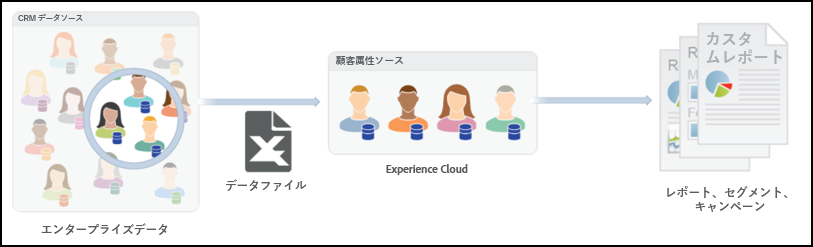
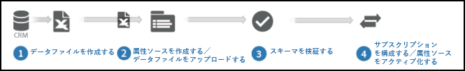
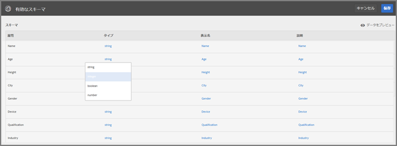
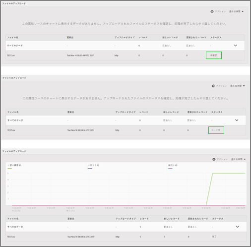
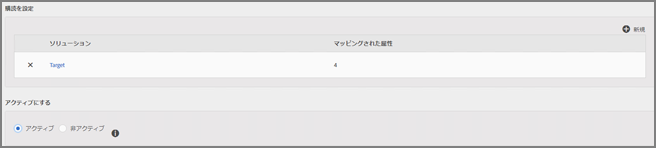

# 顧客属性{#customer-attributes}

アドビのプロファイルおよびオーディエンスコアサービスの顧客属性を使用して、顧客関係管理（CRM）データベースの企業顧客データを Adobe Target でのコンテンツターゲットに活用する方法について説明します。

複数のソースから収集し、CRM データベースに保管されている企業顧客データを [!DNL Target] で使用することで、最も関連性の高いコンテンツを再訪問者に絞って戦略的に配信できます。[!DNL People] コアサービス（以前の Profiles &amp; Audiences）では、データの収集や分析をテストや最適化と組み合わせることで、アクションにつながるデータやインサイトを得ることができます。

## 顧客属性の概要 {#section_B4099971FA4B48598294C56EAE86B45A}

People コアサービスは [!DNL Adobe Experience Cloud] の一部であり、 顧客データを [!DNL Experience Cloud]プラットフォームにプッシュするツールを企業に提供しています。[!DNL Experience Cloud] に転送されたデータは、[!DNL Experience Cloud] のすべてのワークフローで利用できます。[!DNL Adobe Target] では、このデータを利用し、属性に基づいて再訪問者をターゲットに設定します。[!DNL Adobe Analytics] では、これらの属性を分析やセグメント化に使用できます。



顧客属性と Target を使用する際は次の点に注意してください。

* [!UICONTROL  コアサービスの]顧客属性[!DNL People]機能を使用するには、いくつかの前提条件を満たしておく必要があります。For more information, see "Prerequisites for Uploading Customer Attributes" in [Customer attributes](https://docs.adobe.com/content/help/en/core-services/interface/customer-attributes/attributes.html) in the *Core Services User Guide*. [!DNL at.js]（任意のバージョン）または [!DNL mbox.js]（バージョン 58 以降）が必要です。
* 必ずしも、CRM データベースの顧客属性（訪問者プロファイル）データがすべて Experience Cloud に転送され、Taeget でのターゲット設定に利用できるとは限りません。現在の設計では、データのごく一部が転送されない可能性があります。
* Experience Cloud から Target にインポートした顧客属性データの有効期間は、訪問者プロファイルの有効期間（デフォルトでは 14 日間）によって決まります。詳しくは、[訪問者プロファイルの有効期間](../../c-target/c-visitor-profile/visitor-profile-lifetime.md#concept_D9F21B416F1F49159F03036BA2DD54FD).
* `vst.*` がユーザーを特定する唯一のパラメーターである場合は、`authState` が UNAUTHENTICATED (0) である限り、既存の「認証済み」プロファイルが取得されません。認証済みプロファイルは、`authState` が UNAUTHENTICATED（1）に変わったときに取得されます。

   例えば、ユーザーの特定に `vst.myDataSource.id` パラメーター（`myDataSource` はデータソースのエイリアス）を使用しており、MCID もサードパーティ ID も存在しない場合には、パラメーター `vst.myDataSource.authState=0` を使用しても、顧客属性インポートにより作成されるなどした認証済みプロファイルが取得されることはありません。認証済みプロファイルを取得する動作が必要であれば、`vst.myDataSource.authState` の値が 1（AUTHENTICATED）になっている必要があります。

* 送信する `mbox3rdPartyID` には、プラス記号（+）とスラッシュ（/）を含めることはできません。

## Target での顧客属性のワークフロー {#section_00DAE94DA9BA41398B6FD170BC7D38A3}

[!DNL Target] で CRM データを使用する手順は次の図のとおりです。



Detailed instructions for completing each of the following tasks can be found in [Create a customer attribute source and upload the data file](https://docs.adobe.com/content/help/en/core-services/interface/customer-attributes/t-crs-usecase.html) in the *Core Services User Guide*.

1. データファイルを作成します。

   CRM の顧客データを CSV 形式に書き出し、[!DNL .csv] ファイルを作成します。アップロード用に zip ファイルまたは gzip ファイルを作成することもできます。CSV ファイルの最初の行がヘッダーであり、すべての行（顧客データ）に同じ数のエントリが含まれていることを確認します。

   

   

1. 属性ソースを作成し、データファイルをアップロードします。

   データソースの名前と説明、エイリアス ID を指定します。エイリアス ID は、VisitorAPI.js の顧客属性コードで使用する一意の ID です。

   >[!IMPORTANT]
   >
   >データソース名と属性名にピリオドを含めることはできません。

   HTTP メソッドを使用して最大 100 MB のデータファイルをアップロードできます。100 MB を超えるファイルについては、FTP 経由で最大 4 GB までアップロードできます。

   * **HTTPS：**[!DNL .csv]データファイルをドラッグ＆ドロップするか、「[!UICONTROL 参照]」をクリックしてファイルシステムからアップロードします。
   * **FTP：** FTP リンクをクリックして [FTP 経由でファイルをアップロード](https://docs.adobe.com/content/help/en/core-services/interface/customer-attributes/t-upload-attributes-ftp.html)します。まず、アドビが指定した FTP サーバーのパスワードを入力します。パスワードを入力したら、「[!UICONTROL 完了]」をクリックします。

      CSV、ZIP または GZIP ファイルを FTP サーバーに転送します。このファイル転送が正常に完了したら、同じ名前と [!DNL .fin] 拡張子の新しいファイルを作成します。この空のファイルをサーバーに転送します。これにより、転送が完了したことが示され、Experience Cloud がデータファイルの処理を開始します。

1. スキーマを検証します。

   検証プロセスでは、アップロードした属性（文字列、整数、数値など）に表示名と説明を設定できます。各属性を適切なデータタイプ、表示名、説明に対応付けます。

   スキーマの検証が完了したら、「[!UICONTROL 保存]」をクリックします。ファイルのアップロード時間はサイズによって異なります。

   

   

1. 購読を設定し、属性ソースを有効にします。

   「**[!UICONTROL 購読を追加]**」をクリックして、これらの属性を登録するソリューションを選択します。[購読の設定では](https://docs.adobe.com/content/help/en/core-services/interface/customer-attributes/subscription.html) 、Experience cloudとソリューションの間のデータフローを設定します。 属性ソースを有効化すると、購読しているソリューションでデータが利用できるようになります。アップロードした顧客レコードは、Web サイトまたはアプリケーションから入ってくる ID 信号と照合されます。

   

   

   この手順を実行する際は、次の制限事項に注意してください。

   * HTTP を使用する場合、一度にアップロードできる最大ファイルサイズは 100 MB です。
   * FTP を使用する場合、一度にアップロードできる最大ファイルサイズは 4 GB です。
   * 購読できる属性の数は、[!DNL Target Standard] の場合は 5 個、[!DNL Target Premium] の場合は 200 個です。

## Target での顧客属性の使用 {#section_107E3A0F0EC7478E82E6DBD17B30B756}

[!DNL Target] で顧客属性を使用する方法は次のとおりです。

### ターゲットオーディエンスを作成する

[!DNL Target] では、オーディエンスの作成時に「訪問者プロファイル」セクションから顧客属性を選択できます。リスト内の顧客属性はすべて先頭に &lt; data_source_name &gt; が付きます。これらの属性を、必要に応じて他のデータ属性と組み合わせることで、オーディエンスを構築します。


### トークンを使用してプロファイルスクリプトを作成する

顧客属性をプロファイルスクリプトで参照するときは、`crs.get('<Datasource Name>.<Attribute name>')` 形式を使用できます。

このプロファイルスクリプトはオファーで直接使用し、現在の訪問者に属する属性を配信できます。

### 適切な実装して使用するために Web サイトで mbox3rdPartyID を使用する

mbox3rdPartyId をパラメーターとして、`targetPageParams()` () メソッド内のグローバル mbox に渡します。mbox3rdPartyId の値は、CSV データファイルの顧客 ID に設定する必要があります。

```
<script type="text/javascript">
            function targetPageParams() {
               return 'mbox3rdPartyId=2000578';
            }
</script>
```

### Experience Cloud ID サービスの使用

Experience Cloud ID サービスを使用する場合は、ターゲット設定で顧客属性を使用するために、顧客 ID と認証状態を設定する必要があります。For more information, see [Customer IDs and Authentication State](https://docs.adobe.com/content/help/en/id-service/using/reference/authenticated-state.html) in the *Experience Cloud Identity Service Help*.

[!DNL Target] で顧客属性を使用する方法について詳しくは、次のリソースを参照してください。

* 顧客属[性ソースの作成と、コアサービスユーザーガイド](https://docs.adobe.com/content/help/en/core-services/interface/customer-attributes/t-crs-usecase.html) (英語のみ *)でのデータファイルのアップロード*
* *Digital Marketing ブログ*&#x200B;の[顧客属性：情報が増えるほどつながりが強くなる](https://blogs.adobe.com/digitalmarketing/analytics/customer-attributes-know-better-connect/)

## よくある問題 {#section_BE0F70E563F64294B17087DE2BC1E74C}

顧客属性と [!DNL Target] を使用する際に次の問題が発生することがあります。

| 問題 | 詳細 |
|--- |--- |
| プロファイルが大きすぎることが原因で顧客属性が削除される | ユーザープロファイルの 1 つのフィールドごとに文字数制限はありません。ただし、プロファイルが 64,000 文字を超えると、64,000 文字を下回るまで最も古い属性から順に削除されて切り詰められます。 |
| 数日間経っても [!DNL Target] のオーディエンスライブラリに属性が表示されない | その場合は、パイプラインの接続に問題が生じているケースがほとんどです。顧客属性チームにフィードの再発行を依頼してください。 |
| 属性に基づく配信が適切に機能しない | プロファイルがまだエッジで更新されていません。顧客属性チームにフィードの再発行を依頼してください。 |
| 実装に関する問題 | 注意を要する実装に関する問題は次のとおりです。<ul><li>訪問者 ID が適切に渡されなかった。訪問者 ID が `setCustomerId` ではなく、mboxMCGVID で渡された。</li><li>訪問者 ID は適切に渡されたが、認証状態が認証済みに設定されなかった。</li><li>`mbox3rdPartyId` が適切に渡されなかった。</li> |
| `mboxUpdate` が適切に実行されない | mboxUpdate が `mbox3rdPartyId` で適切に実行されませんでした。 |
| 顧客属性が Target にインポートされない | 顧客属性データが Target に見つからない場合は、インポートを過去 x 日以内におこなったかどうかを確認してください（x は Target の[訪問者プロファイルのライフタイム](/help/c-target/c-visitor-profile/visitor-profile-lifetime.md)値です（デフォルトでは 14 日）。 |

この領域の問題の約 60％は、上記の 1 行目と 2 行目が原因です。問題の約 30％は 3 行目が原因、約 5％は 4 行目が原因です。残りの 5％はその他の原因です。

## トレーニングビデオ：顧客属性を使用したオフラインデータのアップロード {#section_9A4E0FA0D0934D06BD8D5BFA673E9BD8}

このビデオでは、CRM、ヘルプデスク、POS などのオフラインのマーケティングデータを Experience Cloud の People サービスにインポートし、既知の ID を使用して訪問者に関連付ける方法を説明します。

>[!VIDEO](https://video.tv.adobe.com/v/17802t1/?captions=jpn)
