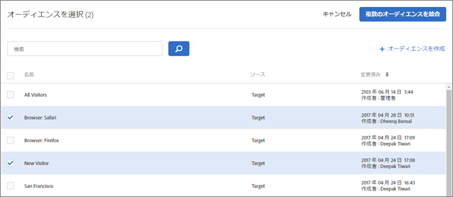
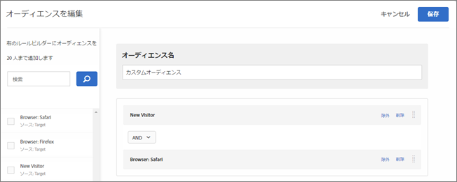
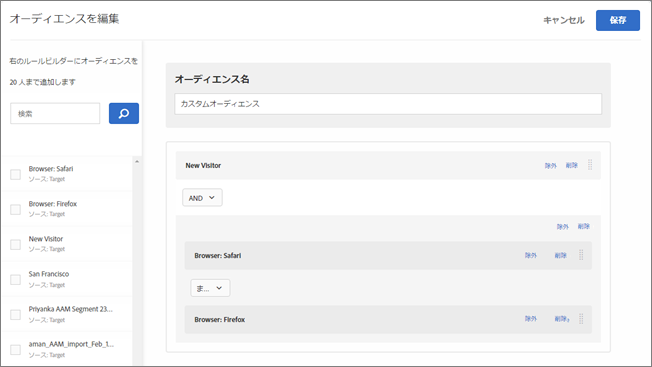
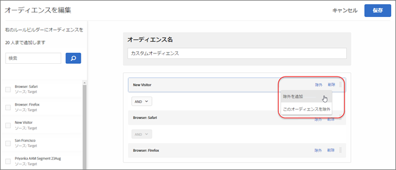
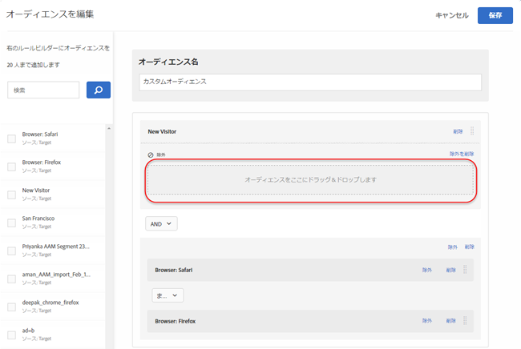
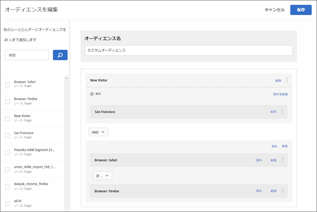
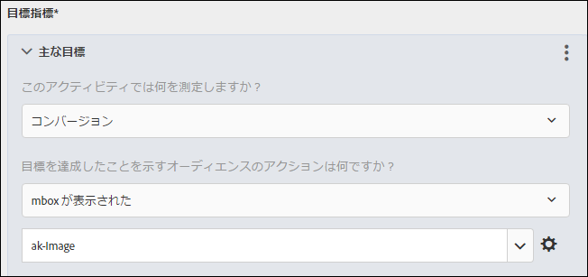
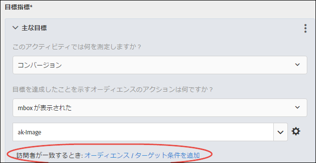
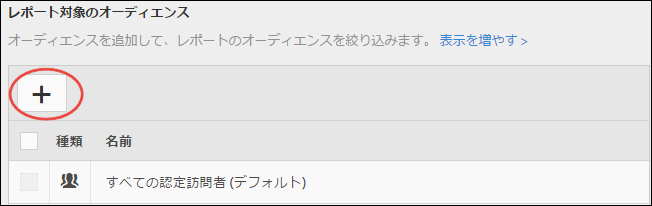

# 複数のオーディエンスの結合{#combine-multiple-audiences}

複数のオーディエンス（Adobe Experience Cloud オーディエンスと Target オーディエンスを含む）をその場で結合し、アドホックなオーディエンスを作成します。また、除外ルールを作成して、ルールからオーディエンスを除外できます。

「新規訪問者」オーディエンスと「Chrome ユーザー」オーディエンスがあるとします。特定のアクティビティについて、これらの既存のオーディエンスを結合して、Chrome ブラウザーを使用する新規訪問者をターゲティングします。第 3 オーディエンスを作成して[!UICONTROL オーディエンス]ライブラリに保存する代わりに、これらの 2 つのオーディエンスをアクティビティの作成時または既存のアクティビティの編集時に結合することができます。

別の例として、第 3 の永続的なオーディエンスを作成するのではなく、忠誠度に関する特定の [!DNL Audience Manager] セグメントを含め、現在のセッション中にロイヤルティプログラムに登録した顧客で構成される [!DNL Target] セグメントと組み合わせることで、忠誠を示したすべての顧客をターゲティングできます。

AND 演算子や OR 演算子を利用して、最大 10 種類のオーディエンスを結合できます。

[!DNL Target] UI 全体の様々な場所で、結合オーディエンスの作成や利用が可能です。

## アクティビティの作成時に結合オーディエンスを作成 {#section_2F1CE9434CC04174B4BA2BFC89B85D77}

3 ステップのガイドによるワークフローを実行する際に、アクティビティの [!UICONTROL Target] ページで結合オーディエンスをアドホックに作成できます。

1. [アクティビティ](../c-activities/activities.md#concept_D317A95A1AB54674BA7AB65C7985BA03)の作成時、**[!UICONTROL Target]** ページで「**[!UICONTROL オーディエンスを編集]**」アイコンをクリックしてから、「**[!UICONTROL オーディエンスを変更]**」をクリックします。

   

1. [!UICONTROL オーディエンスを選択]ページで、結合オーディエンスの構成要素として使用するオーディエンスの横にあるチェックボックスをオンにします。

   

1. 右上の隅にある「**[!UICONTROL 複数のオーディエンスを結合]**」をクリックします。

   

1. （条件付き）必要に応じて新しい結合オーディエンスを編集します。

   [!UICONTROL オーディエンスを編集]ダイアログボックスでは、追加するオーディエンスの構成要素を左側から新しい結合オーディエンスにドラッグ＆ドロップできます。除外ルールを追加したり、オーディエンスを除外したりすることもできます。

   1. ドラッグ＆ドロップ機能を使用して、既存のセクション内にオーディエンスをレベル 2 の構成要素として追加することができます。レベル1の構成要素を追加するには、目的のオーディエンスの横にあるチェックボックスを選択し、「**[!UICONTROL ルールに追加]**」をクリックします。

      例えば、前の例で、Firefox ユーザーを結合オーディエンスに含める場合を考えてみます。以下の例のように、「Browser: Firefox」オーディエンスを検索して、右側の「Browser: Safari」ボックスにドラッグします。

      

      2 つのブラウザータイプオーディエンスの間の演算子は「AND」になっています。AND ドロップダウンリストを選択して「OR」に変更すると、Safari または Firefox を使用する新規訪問者の新しい結合オーディエンスが作成されます。すべての潜在的なオーディエンスメンバーを除外するルールを作成しないように注意してください。例えば、ブラウザー x およびブラウザー y を同時に使用してページに訪問することはできません。

      >[!NOTE]
      >
      >演算子（ANDまたはOR）は、オーディエンスの結合と同じでなければなりません。演算子を組み合わせることはできません。

   1. ルールに除外を追加するには、「**[!UICONTROL 除外]** ／**[!UICONTROL 除外を追加]**」をクリックします。

      

      オーディエンスをボックスにドラッグ＆ドロップします

      

      例えば、新規訪問者から San Francisco 訪問者を除外するには、以下に示すように、San Francisco オーディエンスをボックスにドラッグします。

      

      この結合オーディエンスには、Safari または Firefox を使用するすべてのサイト訪問者が含まれます（San Francisco からの訪問者を除く）。

   1. ルールからオーディエンスを除外するには、「**[!UICONTROL 除外]**／**[!UICONTROL このオーディエンスを除外]**」をクリックします。

      例えば、Firefox を使用する訪問者を除く、すべての新規サイト訪問者を含む結合オーディエンスを作成できます。Firefox を使用する訪問者の除外は、複数のブラウザー（Safari、Chrome、Internet Explorer）を明示的に含み、Firefox を含まない結合オーディエンスを作成するよりも簡単で、すばやくおこなえます。

1. 結合オーディエンスにわかりやすい名前を付け、「**[!UICONTROL 保存]**」をクリックします。

## 指標のターゲティングで使用する結合オーディエンスを作成 {#section_A42E795AFCBD4575809C5942039910F0}

アクティビティの[!UICONTROL 目標と設定]ページで、指標のターゲティングで使用する結合オーディエンスをアドホックに作成できます。例えば、結合オーディエンスによるコンバージョンに基づいてターゲティングを作成するには、以下の手順に従います。

1. [アクティビティ](../c-activities/activities.md#concept_D317A95A1AB54674BA7AB65C7985BA03)を編集または作成中に、**[!UICONTROL 目標と設定]** ページでで、成功指標の **[!UICONTROL コンバージョン]** を選択し、アクションとして「**[!UICONTROL Mbox を表示]**」を選択します。
1. 目的の mbox を「**[!UICONTROL mbox を検索]**」フィールドで選択します。

   

1. ギアアイコンをクリックし、「**[!UICONTROL オーディエンスターゲティングを追加]**」をクリックします。
1. 「**[!UICONTROL オーディエンス／ターゲット条件を追加]**」リンクをクリックして、[!UICONTROL オーディエンスを選択]ダイアログボックスを表示します。

   

1. 「アクティビティの作成時に結合オーディエンスを作成」の[手順 2](../c-target/combining-multiple-audiences.md#section_2F1CE9434CC04174B4BA2BFC89B85D77) を実行して結合オーディエンスを作成します。

## レポートで使用する結合オーディエンスを作成 {#section_4682D342EFBB43C38E54B99B3A1E14CD}

アクティビティの[!UICONTROL 目標と設定]ページで、レポートで使用する結合オーディエンスをアドホックに作成できます。

1. 編集中または[アクティビティ](../c-activities/activities.md#concept_D317A95A1AB54674BA7AB65C7985BA03)の編集時または作成時に、**[!UICONTROL 目標と設定]** ページで、「**[!UICONTROL レポート対象のオーディエンス]**」の下の[!UICONTROL オーディエンスを追加]アイコンをクリックして、[!UICONTROL オーディエンスを選択]ページを表示します。

   

1. 「アクティビティの作成時に結合オーディエンスを作成」の[手順 2](../c-target/combining-multiple-audiences.md#section_2F1CE9434CC04174B4BA2BFC89B85D77) を実行して結合オーディエンスを作成します。

## アクティビティの編集時に結合オーディエンスを作成 {#section_364A12CE96E04B61B7C18113AA586C2C}

既存のアクティビティの編集時に結合オーディエンスをアドホックに作成することができます。

1. [!UICONTROL アクティビティ]ページで、目的のアクティビティの上にカーソルを移動し、**[!UICONTROL 編集]アイコンをクリックします。**

   または

   目的のアクティビティをクリックして開き、「**[!UICONTROL アクティビティ を編集]**」をクリックします。

1. 歯車アイコン／**[!UICONTROL オーディエンス]**／**[!UICONTROL 複数のオーディエンス]** をクリックします。
1. アクティビティの現在のオーディエンスの横にある、その他のオプションアイコン（縦並びの省略記号）をクリックし、「**[!UICONTROL オーディエンスを変更]**」をクリックします。
1. 「[アクティビティの作成時に結合オーディエンスを作成](../c-target/combining-multiple-audiences.md#section_2F1CE9434CC04174B4BA2BFC89B85D77)」の手順 2 を実行して結合オーディエンスを作成します。

