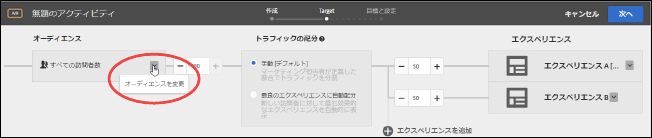
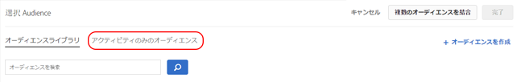

# アクティビティのみのオーディエンスの作成{#create-an-activity-only-audience}

アクティビティのみのオーディエンスは、アクティビティを作成するときに 3 ステップのガイドによるワークフローを使用して作成します。These ad hoc audiences can be used in other places within the same activity, but are not stored in the [!UICONTROL Audiences Library] for use in other activities.

アクティビティのみのオーディエンスには次のようなメリットがあります。

* You can use activity-only audiences to create an audience that you want to use only once and you do not want to store it in the [!UICONTROL Audiences Library]. This prevents the [!UICONTROL Audiences Library] from being cluttered with audiences that you never want to use again.
* Activity-only audiences are not visible in the [!UICONTROL Audiences Library]. このため、アクティビティのみのオーディエンスは、組織内の他のメンバーによる望ましくない変更から保護されます。

1. [アクティビティの作成時](../c-activities/activities.md#concept_D317A95A1AB54674BA7AB65C7985BA03)に **[!UICONTROL 、ターゲット]** ページで3つの垂直の楕円をクリックし、「オーディエンス **[!UICONTROL を置換」をクリック]** します。

   

1. On the [!UICONTROL Choose Audience] page, click **[!UICONTROL Activity Only Audience]**.

   

1. 「**[!UICONTROL オーディエンスを作成]**」をクリックします。
1. わかりやすいオーディエンスの名前を入力します。
1. 「**[!UICONTROL ルールを追加]**」をクリックします。

   ルールを使用すると、オーディエンスをサイト訪問者の一部に限定することができます。

1. ルールタイプを選択します。

   各ルールタイプには、独自のパラメーターがあります。オーディエンスルールの各タイプの構成について詳しくは、[オーディエンスのカテゴリ](../c-target/c-audiences/c-target-rules/target-rules.md#concept_E3A77E42F1644503A829B5107B20880D)を参照してください。

1. ルールパラメーターを定義します。
1. 「**[!UICONTROL 保存]**」をクリックします。

## 注意点

アクティビティのみのオーディエンスを操作する際は、次の情報に注意してください。

* アクティビティのみのオーディエンスは、Visual Experience Composer（VEC）またはフォームベースの Experience Composer で作成できます。この機能は、以前のバージョンの Target の絞り込みルールに代わるものです。
* [!UICONTROL オーディエンスライブラリ] に保存するアクティビティを作成して、他のアクティビティで再利用したり、アクティビティのみのオーディエンスを作成したりできます。オーディエンスを保存した後にオーディエンスタイプを変更することはできません。
* 既存のアクティビティの絞り込みは、アクティビティのみのオーディエンスに移行されます。
* Activity-only audiences have a status of [!UICONTROL Used] or [!UICONTROL Unused]. 未使用のアクティビティのみのオーディエンスは、アクティビティが保存されるまで表示されます。アクティビティのみのオーディエンスを使用しないままアクティビティを保存しようとすると、未使用のアクティビティのみのオーディエンスが削除されることを示す警告メッセージが表示されます。
* オーディエンス定義の詳細は、オーディエンスを開かなくても、オーディエンスピッカーからアクセスできるポップアップカードで確認できます。
* 次のことができます[複数のオーディエンスを組み合わせて](../c-target/combining-multiple-audiences.md#concept_A7386F1EA4394BD2AB72399C225981E5)、アクティビティのみのオーディエンスを作成できます。

