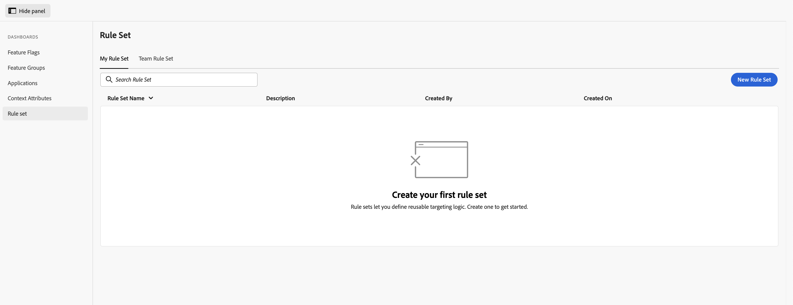
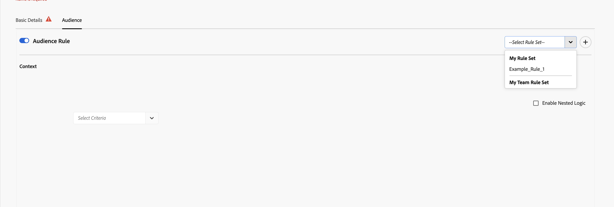

# ルールセットの作成と使用 {#creating-and-using-rule-sets}

ルールセットは、オーディエンスのコンテキスト条件の再利用可能なコレクションです。 複数の機能フラグまたは機能グループに同じオーディエンスが必要な場合は、ルールセットを作成します。 その後、各機能のオーディエンス条件を再作成する代わりに、ルールセットを読み込むことができます。

## ルールセットの要件 {#requirements}

| UI ラベル | 用途 | 必須 |
| --- | --- | --- |
| **ルールセットを入力** | ルールセットの名前を入力します。 | はい |
| **ルールセットの説明** | ルールセットの目的を説明します。 | いいえ |
| **コンテキスト** | オーディエンス基準を少なくとも1つ定義してください。 コンテキスト属性は、サブスクリプション層、アプリケーションバージョン、地域などの名前付きフィールドです。 | はい |

## ルールセットの作成 {#create-rule-set}

### 手順1：新しいルールセットの開始 {#step-1-start}

「フラグ」で、左側のナビゲーションから「**ルールセット**」を選択し、「**新しいルールセット**」を選択します。

「**自分のルールセット**」タブには、作成したルールセットが表示されます。 「**チームルールセット**」タブには、チームで使用可能なルールセットが表示されます。

ルール セットがまだ作成されていない

### 手順2：ルールセットの詳細と条件の追加 {#step-2-details}

1. ルールセットの名前を入力します。
1. 必要に応じて、説明を入力します。
1. **Context**&#x200B;で、再利用するオーディエンス条件を定義します。
1. **And**&#x200B;または&#x200B;**Or**&#x200B;を使用して、複数の条件を組み合わせます。
1. より複雑な式を作成するには、**ネストされたロジックを有効にする**&#x200B;を選択します。

### 手順3：ルールセットの保存 {#step-3-save}

**設定を保存**&#x200B;を選択します。 保存されたルールセットは、**自分のルールセット**&#x200B;の下に表示されます。

## 機能フラグまたは機能グループでのルールセットの使用 {#use-rule-set}

### 手順1：オーディエンス設定を開いて有効にする {#step-1-open}

ルールセットを使用する機能フラグまたは機能グループを開き、「**オーディエンス**」タブを選択し、「**オーディエンスルール**」をオンにしてオーディエンス条件を有効にします。

### 手順2：ルールセットの選択 {#step-2-select}

「**ルールセットを選択**」ドロップダウンを開きます。 **My Rule Set**&#x200B;または&#x200B;**My Team Rule Set**&#x200B;からルールセットを選択します。

### 手順3：読み込んだ基準の確認 {#step-3-review}

選択したルールセットのコンテキスト基準がオーディエンスに読み込まれます。 条件を確認し、機能フラグまたは機能グループを保存します。

読み込まれたルールセット条件を示す

同じオーディエンスを必要とする複数の機能フラグおよび機能グループで、同じルールセットを使用できます。

### 手順4：機能フラグまたは機能グループの保存 {#step-4-save}

読み込んだオーディエンス条件を確認したら、**設定を保存**&#x200B;を選択します。

>[!NOTE]
>
>ルールセットを読み込むと、そのオーディエンス条件がフィーチャーフラグまたはフィーチャーグループにコピーされます。 オーディエンス条件を後で更新する必要がある場合は、ルールセットが読み込まれたすべての機能フラグと機能グループで個別に更新します。 元のルールセットを更新しても、以前に読み込んだオーディエンスは自動的には更新されません。

## 機能フラグまたは機能グループからルールセットを作成する {#create-from-feature}

ルールセットは、フィーチャーフラグまたはフィーチャーグループのオーディエンス画面から直接作成することもできます。

1. 機能フラグまたは機能グループを開き、「**オーディエンス**」タブを選択します。
1. **オーディエンスルール**&#x200B;を有効にします。
1. 再利用するコンテキスト基準を定義します。
1. **ルールセットを選択** ドロップダウンの横にある右上隅の&#x200B;**+** ボタンを選択します。
1. **ルールセットを保存** ダイアログで、ルールセット名を入力します。
1. 「**ルールセットを保存**」を選択します。

## 詳細については、 {#see-also}

* [コンテキスト属性の作成](creating-your-context-attributes.md)
* [オーディエンスルールでのコンテキストの使用](using-context-in-audience-rules.md)
* [機能フラグと機能グループのオーディエンス](audience-in-feature-flags-and-feature-groups.md)

<!-- -->
