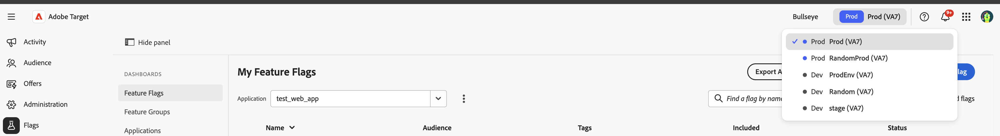

# 環境の概要 {#environments-overview}

FlagsはAdobe Experience Platform上に構築されています。 機能フラグを使用する前に、他のAdobe Experience Platform アプリケーションと同様に、現在の環境に対応するサンドボックスを選択します。

## サンドボックスの選択方法 {#how-to}

フラグコンソールの上部ナビゲーションバーにあるサンドボックススイッチャーを使用して、機能フラグを作成または変更する前に正しいサンドボックスを選択します。

## 詳細については、 {#see-also}

* [コンソールにログインします](log-in-to-the-console.md)
* [利用申請](request-access.md)

<!-- -->
