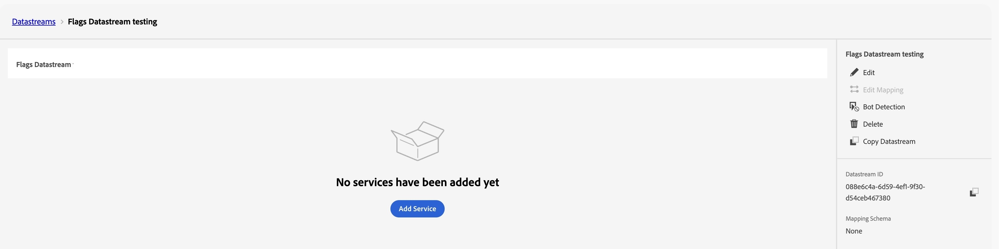

# 機能フラグレポート用にCJAを設定する {#set-up-cja-reporting}

FlagsとAdobe Customer Journey Analytics（CJA）の統合により、機能フラグのバリエーションのビジネスへの影響を測定するための統合方法が提供されます。 CJAの成功指標をいつでもレポートにフラグを付けることができ、[実験パネル &#x200B;](https://experienceleague.adobe.com/ja/docs/analytics-platform/using/cja-workspace/panels/experimentation)などのCustomer Journey Analyticsの機能を活用して、実験のパフォーマンスを評価し、機能のバリエーションが顧客の行動にどのように影響するかを理解することができます。

## 注意点 {#considerations}

Customer Journey Analyticsとフラグの統合を使用する前に、次の点を考慮してください。

* Adobe Customer Journey Analytics（CJA）にアクセスする必要があります。
* **AJO ExD Decision Event データセット**&#x200B;は、フラグ公開イベント用にサンドボックスでプロビジョニングする必要があります。
* 成功指標として使用する成功コンバージョンイベントを含むデータセットを使用できる必要があります。

## データストリームの設定 {#set-up-datastream}

>[!NOTE]
>
>このガイドでは、Commerce Experience Event データセットと`commerce.purchases.value`のみを例として使用します。 ユースケースに適したスキーマとマッピングされた成功指標フィールドを選択します。

1. データ収集で、**データストリーム**&#x200B;に移動し、フラグ露出データストリームを作成または開きます。
1. そのマッピングスキーマを&#x200B;**AJO ExD Decision Event Schema**&#x200B;に設定します。
1. データストリームを開き、**サービスを追加**&#x200B;を選択します。
1. 既存の&#x200B;**AJO ExD Decision Event Dataset**&#x200B;をイベントデータセットとして選択し、保存します。

>[!NOTE]
>
>作成したデータストリーム IDは、データ収集タグのフラグ拡張機能の設定に使用されます。

## Customer Journey Analytics接続の設定 {#set-up-connection}

接続を既に設定している場合は、既存の接続を使用して、以下の手順3にスキップできます。 この接続により、Customer Journey Analyticsはレポート用にデータセットからデータを取得できるようになります。

1. Customer Journey Analyticsの&#x200B;**Connections** ページで、**新しい接続を作成**&#x200B;を選択します。
1. 正しい情報を使用して[接続とデータ設定](https://experienceleague.adobe.com/ja/docs/analytics-platform/using/cja-connections/overview)を構成します。
1. データストリームの設定時に使用したExD イベントデータセットを追加します。
1. コンバージョンイベントとして使用するデータセットを追加し、**次へ**&#x200B;を選択します。
1. **データセットを追加** ダイアログで、選択したデータセット [&#128279;](https://experienceleague.adobe.com/ja/docs/analytics-platform/using/cja-connections/create-connection#dataset-settings)ごとに設定を設定します。

ID マップ設定を表示する

## データビューの設定 {#set-up-data-view}

Customer Journey Analyticsでデータビューを設定する。 データビューにより、接続からのデータが適切に使用できるようになります。

1. データビューを設定し、上記で作成した接続をポイントしていることを確認します。 詳しくは、*Adobe Customer Journey Analytics ガイド*&#x200B;の「[&#x200B; データビューの作成または編集](https://experienceleague.adobe.com/ja/docs/analytics-platform/using/cja-dataviews/create-dataview)」を参照してください。
1. **データ管理** > **データビュー**&#x200B;に移動します。
1. 「**新しいデータビューを作成**」を選択し、フラグ「CJA」接続を選択します。
1. データビュー名と安定した外部IDを入力します。
1. タイムゾーンとカレンダーの設定を確認してから、**コンポーネント**&#x200B;に進みます。

### 実験とバリエーションのディメンションを設定 {#configure-experiment-variant-dimensions}

1. ディメンションに`_experience.decisioning.propositions.scopeDetails.activity.id` （**フラグエンティティ ID**&#x200B;にマッピング）を追加し、「フラグエンティティ ID」またはアナリストに適した別の名前に変更します。
1. コンテキストラベルを「実験の実験」に設定します。
1. ディメンションに`_experience.decisioning.propositions.scopeDetails.experience.id` （機能フラグまたは機能グループのバリアントにマッピング）を追加します。
1. コンテキストラベルを「実験バリアント」に設定します。

>[!WARNING]
>
>実験のコンテキストラベルが両方とも存在しない場合、CJA実験パネルは実験とバリエーションのフラグを識別できません。

### 永続性とアトリビューションの設定 {#configure-persistence-attribution}

ディメンションと指標を設定して、露出が後のコンバージョンに対するクレジットを受け取れるようにします。 適切な永続性またはアトリビューションを使用しない場合、CJAでは、露出と同じイベントで発生した結果のみを関連付けることができます。

1. `commerce.purchases.value`などの必須コンバージョンフィールドを指標の下に追加します。
1. **購入金額**&#x200B;など、指標に明確な名前を付けます。
1. アトリビューションを有効にし、分析に必要なモデル（ラストタッチ、ファーストタッチ、パーティシペーション、または同じタッチ）を選択します。 アトリビューションモデル、コンテナ、ルックバックウィンドウについて詳しくは、[&#x200B; アトリビューションコンポーネント &#x200B;](https://experienceleague.adobe.com/ja/docs/analytics-platform/using/cja-workspace/attribution/models)を参照してください。
1. 実験戦略に一致するコンテナとルックバックウィンドウを選択します。 訪問またはセッションに応じたルックバックを持つ人物コンテナは一般的な出発点ですが、ユースケースに合わせて検証してください。
1. データビューを保存します。

## 詳細については、 {#see-also}

* [レポート](reporting.md)

<!-- -->
