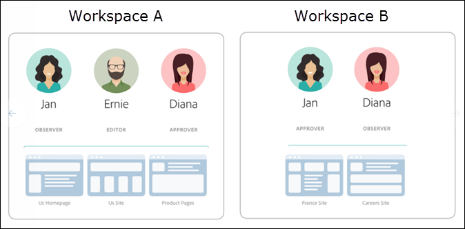
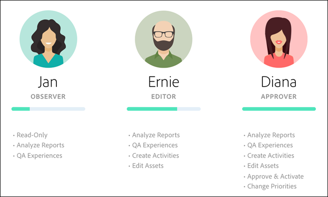
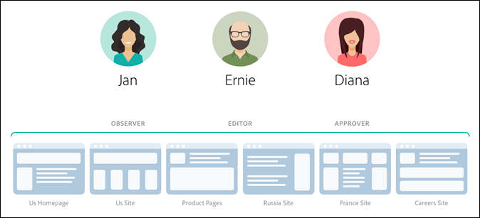
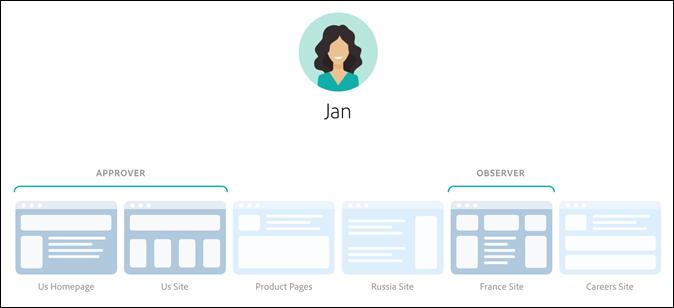
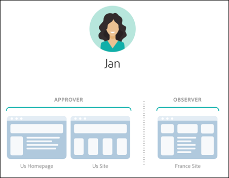

# Enterprise ユーザーの権限

エンタープライズユーザー権限は、[!DNL Adobe Target]へのエンタープライズ全体のユーザーアクセスを正式に管理する手段です。 ユーザーを[!DNL Target]に追加し、役割に基づいて権限を割り当て、異なる部門、グローバルな場所、チャネル、その他の論理グループに基づいてチーム用のワークスペースを作成します。 ユーザーに[!UICONTROL Observer]、[!UICONTROL Editor]、[!UICONTROL Approver]または[!UICONTROL Publisher]の役割を割り当てることができます。

{{permissions-update}}

## エンタープライズユーザー権限へのアクセス権があるかどうかを判断します

>[!NOTE]
>
>[!UICONTROL Properties and Permissions]機能は、[!DNL Target] Premium ソリューションの一部として利用できます。 [!DNL Target] Premium ライセンスのない [!DNL Target] Standard では利用できません。
>
>[!DNL Target]の実装では、任意のバージョンのat.jsまたは[!DNL Adobe Experience Platform Web SDK]を使用できます。

組織が標準ライセンスまたはプレミアムライセンスを持っているかどうかを確認するには、[!DNL Target] UIの上部にある「[!UICONTROL Administration]」リンクをクリックします。

* **[!DNL Target Standard]人のお客様**:「[!UICONTROL Users]」タブ （[!UICONTROL Properties]」タブではなく）が表示されている場合、組織には[!DNL Target Standard] ライセンスがあります。 [!UICONTROL Administration > Users]&#x200B;[!DNL Target Standard]人のお客様は、[&#x200B; ユーザー](/help/main/administrating-target/c-user-management/c-user-management/user-management.md)の指示に従って、ユーザーを追加し、[!DNL Adobe Admin Console]で権限を割り当てる必要があります。

* **[!DNL Target Premium]人のお客様**:「[!UICONTROL Properties]」タブ（[!UICONTROL Administration > Properties]）と「[!UICONTROL Users]」タブが表示されている場合、組織には[!DNL Target Premium] ライセンスがあります。 [!DNL Target Premium] のお客様はこの記事と [Enterprise 権限の設定](/help/main/administrating-target/c-user-management/property-channel/properties-overview.md)の指示に従う必要があります。

## エンタープライズ権限の概要

>[!IMPORTANT]
>
>エンタープライズ権限を続行する前に、以下の[注意事項](/help/main/administrating-target/c-user-management/property-channel/property-channel.md#section_9714311B1CD9497A86F4910F8AE635E2)の節を必ずお読みください。

## このセクションで使用される用語と定義 {#section_F8D229544FEA41C3BC2EFD1F95AA0116}

このセクション全体で次の用語が使用されており、[!DNL Target] Premiumのプロパティと権限の機能を使用したいユーザーにとって新しい用語になる可能性があります。

### プロパティ

プロパティは、一意のコードのスニペットを使用して区別するという点で、[!DNL Adobe Experience Platform]内のプロパティと性質が似ています。

Web プロパティは、Web サイト（群）を意味し、複数のルールと 1 つの埋め込みコードで構成されます。 Web プロパティは、1 つ以上のドメインやサブドメインをグループ化できます。

プロパティは、任意の呼び出し（Target呼び出し、api呼び出しなど）を持つパラメーターとして特定の名前と値のペアを[!DNL Target]に追加することで有効になります。

プロパティは、特定のチャネル（Web、モバイル、電子メールまたは API／その他）に属しています。

### ワークスペース（製品プロファイル） {#workspace}

ワークスペースを使用すると、組織は特定のユーザーのセットを特定のプロパティのセットに割り当てることができます。 多くの点で、ワークスペースは [!DNL Adobe Analytics] のレポートスイートに似ています。

注意：ワークスペースは、[!DNL Adobe Admin Console for Enterprise]では[!UICONTROL Product Profiles]として知られています。

多国籍組織に属している場合、欧州向け Web ページ、プロパティまたはサイトのワークスペースと、米国向け Web ページ、プロパティまたはサイトの別のワークスペースがあるかもしれません。 複数ブランドを取り扱う組織に属している場合、ブランドごとに別のワークスペースがあるかもしれません。

ユーザーは複数のワークスペースに属すことができ、各ワークスペースで異なる役割を持つこともできます。

ユーザーがワークスペース間を移動することで、[!DNL Adobe Target]の異なるビューを持つことができます。これは、[!DNL Analytics]人のユーザーがレポートスイート間を移動することで、[!DNL Analytics]の異なるビューを持つことと同様です。

ワークスペースには、まったく異なるオーディエンス、コードオファー、アクティビティを含めることができます。

新しいエンタープライズ権限モデルの移行前に作成されたすべてのオーディエンスとアクティビティは、以下で説明する「デフォルトのWorkspace」にグループ化されます。

[!DNL Adobe Experience Manager] （AEM）、[!DNL Adobe Mobile Services]および[!DNL Adobe Target Classic]を介して作成されたすべてのアクティビティは、「デフォルトのWorkspace」の一部です。

### デフォルトワークスペース

[!DNL Admin Console]内の既存のすべてのワークスペース（製品プロファイル）は、組織が新しいエンタープライズ権限モデルに移行中に、「デフォルトのWorkspace」と呼ばれる1つのワークスペースに統合されます。

>[!IMPORTANT]
>
>デフォルトのワークスペースは削除しないでください。

すべてのユーザーの役割とすべての[!DNL Target]機能へのアクセスは、新しいエンタープライズ権限モデルへの移行前と同じままです。

### ユーザーグループ

開発者、アナリスト、マーケター、経営陣などのユーザーグループを作成できます。 その後、複数のAdobe製品およびワークスペースに権限を割り当てることができます。 新しいチームメンバーに様々なアドビ製品にわたるすべての適切な権限を割り当てることは、特定のユーザーグループに追加するくらいに簡単です。

### 役割と権限 {#roles-permissions}

役割と権限によって、ユーザーが[!DNL Target]実装でアクティビティを作成および管理するために必要なアクセス レベルが決まります。 [!DNL Target]の役割には、次のものが含まれます。

| 役割 | 説明 |
|--- |--- |
| [!UICONTROL Approver] | アクティビティの作成、編集、アクティブ化、停止ができます。 |
| [!UICONTROL Editor] | アクティビティの作成および編集（アクティブでない場合に限る）はできますが、アクティビティの開始を承認することはできません。 |
| [!UICONTROL Observer] | アクティビティを表示できますが、作成または編集はできません。 |
| [!UICONTROL Publisher] | [!UICONTROL Observer]の役割と同様です（アクティビティを表示できますが、作成または編集することはできません）。 ただし、[!UICONTROL Publisher] の役割には、アクティビティをアクティブ化する追加の権限があります。 |

### チャネル

チャネルとは、web ページ、モバイルアプリ、メールメッセージなど、[!DNL Target]のアクティビティが配信されるコンテンツタイプを指します。

アクティビティを作成すると、現在選択されているワークスペースにアクティビティが作成されます。 最初のダイアログボックスには、Web、モバイルアプリ、電子メール、その他/APIなど、アクティビティに適したチャネルを選択できるチャネル選択オプションが表示されます。

## 権限の概要 {#section_DC2172520DA84605B218A5E9FB6D187A}

次の情報では、以前[!DNL Target]で権限が適用された方法と、[!UICONTROL Properties]および[!UICONTROL Permissions]機能を使用して権限が適用される方法について説明します。

新しい[!UICONTROL Permissions]機能を使用すると、異なるプロジェクト（[!DNL Adobe Admin Console for Enterprise]の「製品プロファイル」と呼ばれる）を作成できます。 プロジェクトを使用すると、1人のユーザーに対して異なる権限を割り当てることができ、各プロジェクトに対するユーザーのアクセス権を決定できます。 これらの各プロジェクトは、[!DNL Adobe Analytics] でのレポートスイートの動作方法と比較できます。 各プロジェクトは、プロパティのセットに適用する特定の役割を持つ特定のユーザーを持つことができます。 その結果、お客様は、次に示すように、地域、環境（開発/ステージ/実稼動）、チャネル、またはその他のカスタム条件に基づいて、ユーザーへの表示、編集、承認アクセスを制限できます。

例えば、ある特定のユーザーが米国の Web サイトでの「承認」アクセス権を持つが、欧州のモバイルアプリでは「表示」アクセス権のみ持っているとします。 この同じユーザーは、APAC 地域の Web およびモバイルプロパティで提供されるアクティビティについては、表示を含め、あらゆるアクセス権がありません。

[!DNL Target] [!UICONTROL Permissions] モデルには、次の権限の役割（Observer、Editor、Approver、およびObserver）があります。 オブザーバーの役割は、この記事の図には示されていません。

各役割には、様々なレベルの権限があります。

| 役割 | 説明 |
|--- |--- |
| 承認者 | アクティビティの作成、編集、アクティブ化、停止ができます。 |
| 編集者 | アクティビティの作成および編集（アクティブでない場合に限る）はできますが、アクティビティの開始を承認することはできません。 |
| 監視者 | アクティビティを表示できますが、作成または編集はできません。 |
| 発行者 | 監視者の役割と同様です（アクティビティを表示できますが、作成または編集はできません）。 ただし、発行者の役割には、アクティビティをアクティブ化する追加の権限があります。 |

各ユーザーの役割は、次に示すように、[!DNL Target] タグを含むアカウントのすべてのページ、プロパティまたはサイトに適用されることに注意する必要があります。

新しい[!DNL Target] [!UICONTROL Permissions] モデルには、同じ3つの権限ロール （Observer、Editor、およびApprover）がありますが、次に示すように、個々のページ、プロパティ、またはサイトに対してユーザーの権限ロールを個別に割り当てることができます。

この例では、Jan は、米国ホームページおよび米国サイトに対する承認者権限を持ち、フランスサイトに対する監視者権限を持ちます。

さらに、Janは、次に示すように、表示する権限のない[!DNL Target]のページ、プロパティ、またはサイトを表示できません。

この例では、Jan は、商品ページ、ロシアサイト、キャリアサイトを表示できません。

## ユースケース事例 {#section_F3CE8576959E4F4CB13BEEED38311DD8}

以下の使用例で、[!DNL Target] を使用してマーケティング目標を達成するのにプロパティ、プロジェクト、役割および権限がどのように役立つかを説明します。

### 多国籍組織

多国籍組織に属している場合、欧州向け Web ページ、プロパティまたはサイトのワークスペースと、米国向け Web ページ、プロパティまたはサイトの別のワークスペースがあるかもしれません。
再編成後、上の図の人物を使用して、以下のようなワークスペースおよび権限を設定してください。

* **Jan**：Jan は、組織の米国 Web ページ、プロパティ、サイトに関する研究センターの最適化部門のトップです。 Jan はおそらく Adobe Experience Cloud のシステム管理者権限を持っています。

  役割として、米国ホームページおよび米国サイトの承認者権限を持っています。 承認者の権限を使用すると、アクティビティを作成、編集、アクティブ化または停止できます。

  また、Jan は、フランスの最適化チームと情報交換をおこなうので、フランスサイトの監視者権限を持ち、アクティビティへの読み取り専用アクセスを付与されています。 Jan は、アクティビティを表示できますが、作成または編集はできません。

  Jan は、商品ページ、ロシアサイトまたはキャリアサイトの確認を必要とする役割を担っていないので、これらのサイトのアクティビティを表示できません。

* **Ernie**：Ernie は、組織のマーケティングマネージャーで、米国のマーケティングを担当しています。

  Ernieは組織の初心者で、Targetの経験が少ないため、米国ホームページ、米国サイト、製品ページの編集者権限があります。 エディター権限を持つErnieは、アクティビティが公開される前にアクティビティを作成および編集できます。 アクティビティの開始を承認できません。Janなどの承認権限を持つユーザーは、アクティビティを本番環境に導入する前に承認する必要があります。

  Ernie は、ロシアサイト、フランスサイトまたはキャリアサイトの確認を必要とする役割を担っていないので、これらのサイトのアクティビティを表示できません。

* **Diana**：Diana は、現在は組織のアナリストで、米国ホームページ、米国サイト、製品ページ、ロシアサイトおよびフランスサイトの監視者権限を持ち、アクティビティへの読み取り専用アクセスを付与されています。 Diana は、アクティビティを表示できますが、作成または編集はできません。

  Diana は、キャリアサイトの確認を必要とする役割を担っていないので、これらのサイトのアクティビティを表示できません。

### 複数ブランドを取り扱う組織

複数ブランドを取り扱う組織に属している場合、各ブランドの Web ページ、プロパティまたはサイトに別のワークスペースがあるかもしれません。

再編成後、上の図の人物を使用して、以下のようなプロジェクトおよび権限を設定してください。

* **Jan**：Jan は、病院向け製品および消費者向け製品の領域で活動する医療組織の研究センターの最適化部門のトップです。 Jan はおそらく Adobe Experience Cloud のシステム管理者権限を持っています。

  役割として、病院向けサイトの承認者権限を持っています。 承認者の権限を使用すると、アクティビティを作成、編集、アクティブ化または停止できます。

  また、Jan は、消費者向け製品の最適化チームと情報交換をおこなうので、サイトの監視者権限を持ち、アクティビティへの読み取り専用アクセスを付与されています。 Jan は、アクティビティを表示できますが、作成または編集はできません。

* **Ernie**：Ernie は、組織のマーケティングマネージャーで、消費者向け製品のマーケティングを担当しています。

  Ernieは組織にとってかなり新しく、Targetの経験が少ないため、コンシューマーサイトのエディター権限があります。 エディター権限を持つErnieは、アクティビティが公開される前にアクティビティを作成および編集できます。 アクティビティの開始を承認できません。コンシューマーサイトの承認権限を持つが、このシナリオではJanではないユーザーは、アクティビティを本番環境に導入する前に承認する必要があります。

  Ernie は、病院向けサイトの確認を必要とする役割を担っていないので、このサイトのアクティビティを表示できません。

* **Diana**：Diana は、現在は組織のアナリストで、病院向けサイトおよび消費者向けサイトの監視者権限を持ち、アクティビティへの読み取り専用アクセスを付与されています。 Diana は、アクティビティを表示できますが、作成または編集はできません。

## Target UI プロパティと権限のタッチポイント {#section_3414371393BB42999A268628B5456EC9}

新しい権限機能は、[!DNL Target] UI の様々な場所に表示できます。

* **Workspace（Product Profile） ドロップダウンリスト：** Workspace ドロップダウンリストは、[!UICONTROL Activities]、[!UICONTROL Audiences]、および[!UICONTROL Offers] ページの上部に表示されます。 目的のワークスペースを選択して、リストをフィルターし、選択したワークスペースのアイテムのみを表示します。

* **アクティビティの作成：** アクティビティを作成すると、現在選択されているワークスペースに作成されます。 最初のダイアログボックスには、Web、モバイルアプリ、電子メール、その他/APIなど、アクティビティに適したチャネルを選択できるチャネル選択オプションが表示されます。

* **オーディエンス作成：** オーディエンスを作成すると、現在選択されているワークスペースに作成されます。
* **オーディエンスリスト：** [!UICONTROL Audiences] ページの[!UICONTROL More Actions] > [!DNL Move] オプションを使用すると、ワークスペース間でオーディエンスを移動できます。
* **オファー作成：** オファーを作成すると、現在選択されているワークスペースに作成されます。
* **プロパティ ページ （管理/プロパティ）:** [!UICONTROL Search] ボックスを使用して、[!UICONTROL Property] リストを検索できます。

## 注意事項 {#section_9714311B1CD9497A86F4910F8AE635E2}

[!DNL Target] Premiumでプロパティと権限を使用または設定する場合は、次の点を考慮してください。

* **重要**：アクティビティを含むワークスペースを削除しないでください。 アクティビティを含むワークスペースを削除する場合は、クライアントケアと連携して、これらのアクティビティを復元します。
* すべてのマイワークスペースビューを使用する場合：

   * アクセスするための適切な役割と権限を持っているすべてのワークスペースのアクティビティ、オーディエンスおよびオファーを確認できます。
   * [!UICONTROL All My Workspaces] ビューを選択すると、新しい列がアクティビティ、オーディエンス、オファーページに追加されます。 この列には、アイテムのワークスペースと、そのアイテムに関連付けられているユーザー権限（オブザーバー、エディター、または承認者）が一覧表示されます。
   * すべてのマイワークスペースビューでアクティビティ、オーディエンスまたはオファーを作成する場合は、アイテムを作成するワークスペースを選択する必要があります。 編集者または承認者の権限を持っているワークスペースのみ選択できます。
   * すべてのマイワークスペースビューでアクティビティ、オーディエンスまたはオファーをコピーする場合は、アイテムをコピーするワークスペースを選択する必要があります。 編集者または承認者の権限を持っているワークスペースのみ選択できます。

* 次の[!UICONTROL Administration] ページの設定は、任意のワークスペースの任意の[!UICONTROL Approver]で制御できます。

   * Visual Experience Composer
   * レポート
   * Scene7 設定
   * 実装
   * プロパティ
   * ホスト
   * 環境
   * レスポンストークン
   * ユーザー

* ユーザーがあるワークスペース（製品プロファイル）から別のワークスペースにリソースを移動することはできません。 ただし、コピーは可能です。
* [!DNL Audiences] ページからオーディエンスを表示する場合、ページは予想よりも遅く読み込まれます。 どのような方法であれ検索バーを使用すると、オーディエンスはより迅速に表示されます。 この問題は既知であり、今後のアップデートで修正される予定です。 この問題は、アクティビティ作成ワークフローでのオーディエンスの選択には影響しません。
* 次のリソースは、新しい Enterprise 権限モデルに含まれます。

   * [!DNL Target Standard/Premium]内で作成されたアクティビティ、オーディエンス、およびコードオファーは、お客様が権限に対して有効にした後で使用できます。 （注意：お客様は[!DNL Target Premium]の使用権限を持っている必要があります）。
   * Default Workspaceの既存のアクティビティにプロパティを追加できますが、この方法は変更される可能性があります。
   * Target Premium内で作成された新しいリソース（アクティビティ、コードオファー、オーディエンスなど）のみが（エンタープライズ権限が有効になった後）権限で制限できます。
   * 外部リソースは、デフォルトのワークスペースのユーザーのみ利用できます。 デフォルトのワークスペースのユーザーの役割はグローバルに適用されます（Target のすべてのリクエストとリソースに適用されます）。

* 次のリソースは、新しい Enterprise 権限モデルに&#x200B;*含まれません*。

   * 画像オファー
   * 条件ライブラリ、デザインライブラリ、カタログ、レコメンデーション設定を含む、レコメンデーションに関するすべてのリソース。
   * エンタープライズ権限を有効にする前にTarget Premium内で作成された既存のリソース（アクティビティ、コードオファー、オーディエンスなど）は、コピーできますが、他のワークスペースに移動することはできません。
   * 以下のソリューションまたはメソッドを使用して作成されたアクティビティ、オーディエンス、コードオファー、画像オファーまたはその他のリソースは、Enterprise Permissions モデルでは制御できませんが、デフォルトのWorkspace（Target Classic、Adobe Experience Manager（AEM）、Adobe Mobile Services、およびAPI経由で作成されたリソース）の一部です。 API を利用して作成されたリソースには、アクティビティ、オーディエンス、コードオファー、画像オファーが含まれます。
   * 画像オファー（`https://[tenantName].marketing.adobe.com/content/mac/[tenantName]/target/offers.html#image-library`に保存されているアセットは、現在、エンタープライズ権限モデルで制御できません。
   * 宛先リンクまたは宛先ページがアクティビティに含まれるプロパティの一部である場合、clickTrackingとリダイレクトが機能します。 また、`targetPageParams()`関数を使用する場合、クリックトラッキングが機能しない可能性があります。 関数には、`targetPageParamsAll()` を使用することをお勧めします。

  [!DNL Target]は現在、`at_property` トークンをトラッキングが発生するすべてのページに存在する必要があります。 トークンが（1）存在しない場合、（2）アクティビティのセットアップ時（VEC内）に検出されない場合、または（3） clickTracking Target呼び出しに`targetPageParamsAll()`関数を介して渡されない場合、指標は増分されず、「0」と表示されます。

  同じことが、リダイレクトを使用するアクティビティにも当てはまります。 リダイレクト先のページには、`at_property` トークンがあり、VEC 内での設定時に認識される必要があります。

  今後のリリースで、`at_property` トークンがないページや、異なる `at_property` トークンがあるページでも、Target が機能するようになります。

* Enterprise User Permissions機能は、Adobe Developer API呼び出しではサポートされていません。

## よくある質問 {#faqs}

企業権限に関する FAQ を次に示します。

### ユーザーに複数の役割と権限がある場合はどうなりますか？ {#multiple-roles}

ユーザーが複数の役割と権限を持っている場合、採用者権限を持つ役割が適用されます。 例えば、ユーザーに[!UICONTROL Observer]と[!UICONTROL Approver]の役割がある場合、[!UICONTROL Approver]の役割が適用されます。

### アクティビティを別のワークスペースに移動させることはできますか？

残念ながら、アクティビティを別のワークスペースに移動させることはできません。 ただし、レポートデータが引き継がれないので、アクティビティを任意のワークスペースにコピーできます。 詳しくは、[ワークスペースを使用している際にアクティビティをコピー／編集する](/help/main/c-activities/edit-activity.md#section_45A92E1DD3934523B07E71EF90C4F8B6)の「ワークスペースを使用している際にアクティビティをコピー／編集する」を参照してください。

移行前に作成したアクティビティは、編集やプロパティの割り当てがおこなわれない限り、これまでと同じくデフォルトのワークスペースで実行されます。 特定のワークスペースのアクティビティは、そのワークスペースに割り当てられたプロパティを尊重するため、移行前と同じ動作が維持されない場合があります。

### オーディエンスを別のワークスペースに移動させることはできますか？ {#move-audience}

はい、[!UICONTROL Audiences] ページの[!UICONTROL More Actions] オプションを使用して、ワークスペース間でオーディエンスを移動できます。

1. **[!UICONTROL More Actions]** ボタン （3つの省略記号）をクリックしてから、**[!UICONTROL Move]**&#x200B;をクリックします。

   

1. **[!UICONTROL Workspace]** ドロップダウンリストから目的のワークスペースを選択し、**[!UICONTROL Move]**&#x200B;をクリックします。

   

>[!NOTE]
>
>オーディエンスを編集するには、適切な権限が必要です。 また、オーディエンスは他のアクティビティで使用しないでください。 オーディエンスが他のアクティビティで使用されていて、引き続きオーディエンスを別のワークスペースに移動する場合は、オーディエンスを使用している他のアクティビティから削除します。

### プロパティが割り当てられているにもかかわらず、プロパティが関連付けられていないことを示すエラーメッセージが表示されるのはなぜですか。

[!DNL Target]を[!DNL Adobe Experience Platform]のタグで実装し、アクティビティに関連付けられているプロパティがないことを示すエラーメッセージが表示された場合は、`at_property` パラメーターを`targetPageParams`関数に渡します。

### リダイレクトされたページとアクティビティ URLが異なるプロパティに属する場合、クリックトラックコンバージョンは記録されますか？

クリックの追跡は、ページおよびアクティビティ URL が異なるプロパティに属しているページには記録されません。

次のシナリオについて検討してください。

* ページ1 はプロパティ1 に属しています。
* ページ2 はプロパティ2 に属しています。
* アクティビティでは、ページ1 はページ2 にリダイレクトされ、クリックの追跡を含みます。

訪問者がブラウザーでPage1を開くと、訪問者はPage2にリダイレクトされます。 ページ2 にはアクティビティを配信する資格がないので、その Target の呼び出しはその応答内にクリックの追跡を含みません。

リダイレクトページとアクティビティ URL が同じプロパティに属している場合、クリックの追跡は期待どおりに機能します。 詳しくは 、[クリックの追跡](/help/main/c-activities/r-success-metrics/click-tracking.md)を参照してください。

## トレーニングビデオ

以下のビデオは、この記事で説明した概念についてさらに詳しく説明しています。

### トレーニングビデオ：エンタープライズ権限トレーニングビデオ 

学習内容：

* Adobe Target ユーザーの 3 つの役割レベル
* プロパティとワークスペースの概念のほか、これらの違いとグループ分けを生かしてユーザーのアクセスレベルを管理する方法
* 組織に役立つ様々なプロパティの例

>[!VIDEO](https://video.tv.adobe.com/v/3421739?captions=jpn)

### オフィス時間：[!DNL Target] プレミアム ワークスペース

このビデオは、「Office Hours」（アドビカスタマーケアチーム主導による取り組みの 1 つ）の録画です。

* Workspace（製品プロファイル）の作成
* プロパティの作成
* ユーザーの追加
* 実装の更新

>[!NOTE]
>
>[!DNL Target] [!UICONTROL Administration] メニューUI （旧称[!UICONTROL Setup]）は、パフォーマンスの向上、新機能のリリース時に必要なメンテナンス時間の短縮、製品全体でのユーザーエクスペリエンスの向上を目的として再設計されました。 次のビデオの情報は正しいですが、オプションは少し異なる場所にある場合があります。

>[!VIDEO](https://video.tv.adobe.com/v/23643/)
