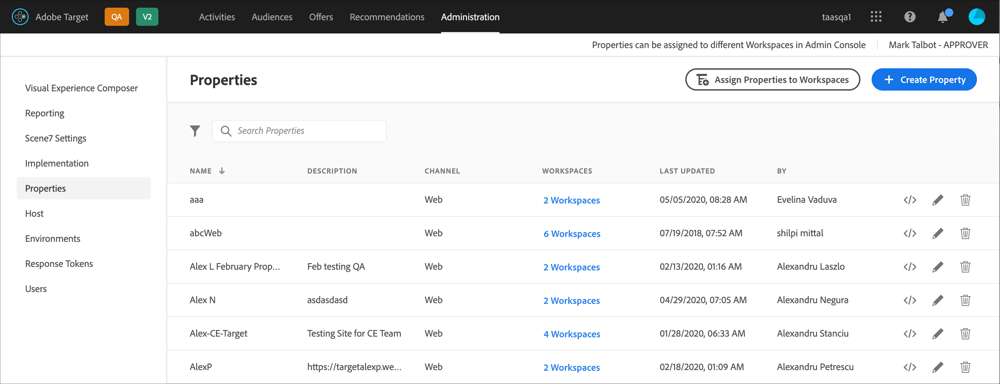

#  Enterprise ユーザーの権限

エンタープライズユーザー権限は、管理する企業全体のユーザーに対するアクセスを正式に行う手段です。 [!DNL Adobe Target]. ユーザーの追加先 [!DNL Target]、役割に基づいて権限を割り当て、様々な部門、グローバルな場所、チャネル、その他の論理グループに基づいてチーム用にワークスペースを作成します。 ユーザーに [!UICONTROL 監視者], [!UICONTROL 編集者]または [!UICONTROL 承認者].

## Enterprise ユーザーの権限へのアクセス権があるかどうかを判断する

>[!NOTE]
>
>プロパティと権限 の機能は [!DNL Target] Premium ソリューションの一部です。[!DNL Target] Premium ライセンスのない [!DNL Target] Standard では利用できません。
>
>お使いの [!DNL Target] 実装では、at.js の任意のバージョンを使用できます。

ライセンスが Standard か Premium かを確認するには、 [!UICONTROL 管理] リンク [!DNL Target] UI

* **[!DNL Target Standard]顧客**:表示された [!UICONTROL ユーザー] タブ ([!UICONTROL 管理/ユーザー])( およびではなく [!UICONTROL プロパティ] 」タブ ) が表示される場合は、 [!DNL Target Standard] ライセンス。 [!DNL Target Standard] のお客様は、 [ユーザー](/help/main/administrating-target/c-user-management/c-user-management/user-management.md) ユーザーを追加し、 [!DNL Adobe Admin Console].

* **[!DNL Target Premium]顧客**:表示された [!UICONTROL プロパティ] タブ ([!UICONTROL 管理/プロパティ]) および [!UICONTROL ユーザー] 」タブに表示される場合、組織には [!DNL Target Premium] ライセンス。 [!DNL Target Premium] のお客様はこの記事と [Enterprise 権限の設定](/help/main/administrating-target/c-user-management/property-channel/properties-overview.md)の指示に従う必要があります。

## Enterprise 権限の使用を開始する前に

>[!IMPORTANT]
>
>必ず [注意事項](/help/main/administrating-target/c-user-management/property-channel/property-channel.md#section_9714311B1CD9497A86F4910F8AE635E2) の節を参照してから、enterprise 権限を使用してください。

## この節で使用される用語と定義 {#section_F8D229544FEA41C3BC2EFD1F95AA0116}

この節では、次の用語を使用します。 [!DNL Target] プレミアム。

### プロパティ

プロパティの特性は、内のプロパティと似ています [!DNL Adobe Experience Platform] を区別するために、一意のコードスニペットを使用します。

Web プロパティは、Web サイト（群）を意味し、複数のルールと 1 つの埋め込みコードで構成されます。Web プロパティは、1 つ以上のドメインやサブドメインをグループ化できます。

プロパティは、特定の名前と値のペアを任意の呼び出し（Target 呼び出し、API 呼び出しなど）を含むパラメーターとしてに追加することで、に対して有効になります。 [!DNL Target].

プロパティは、特定のチャネル（Web、モバイル、電子メールまたは API／その他）に属しています。

### ワークスペース（製品プロファイル）

ワークスペースを使用すると、組織は特定のユーザーのセットを特定のプロパティのセットに割り当てることができます。多くの点で、ワークスペースは [!DNL Adobe Analytics] のレポートスイートに似ています。

注意：ワークスペースは、 [!UICONTROL 製品プロファイル] 内 [!DNL Adobe Admin Console for Enterprise].

多国籍組織に属している場合、欧州向け Web ページ、プロパティまたはサイトのワークスペースと、米国向け Web ページ、プロパティまたはサイトの別のワークスペースがあるかもしれません。複数ブランドを取り扱う組織に属している場合、ブランドごとに別のワークスペースがあるかもしれません。

ユーザーは複数のワークスペースに属すことができ、各ワークスペースで異なる役割を持つこともできます。

ユーザーは、 [!DNL Adobe Target] ワークスペース間を移動する方法 [!DNL Analytics] ユーザーは、 [!DNL Analytics] レポートスイート間を移動することによって。

ワークスペースには、まったく異なるオーディエンス、コードオファー、アクティビティを含めることができます。

新しい Enterprise 権限モデルの移行前に作成されたすべてのオーディエンスとアクティビティは、以下で説明する「デフォルトのワークスペース」にまとめられます。

で作成されたすべてのアクティビティ [!DNL Adobe Experience Manager] (AEM) [!DNL Adobe Mobile Services]、および [!DNL Adobe Target Classic] は、「デフォルトのワークスペース」の一部です。

### デフォルトのワークスペース

内のすべての既存のワークスペース（製品プロファイル） [!DNL Admin Console] は、組織が新しい Enterprise 権限モデルに移行する際に、「デフォルトのワークスペース」と呼ばれる単一のワークスペースに結合されます。

>[!IMPORTANT]
>
>デフォルトのワークスペースは削除しないでください。

すべてのユーザーの役割と、すべての [!DNL Target] の機能は、新しい Enterprise 権限モデルに移行する前と同じです。

### ユーザーグループ

開発者、アナリスト、マーケター、エグゼクティブなどのユーザーグループを作成できます。 その後、複数のAdobe製品およびワークスペースに対する権限を割り当てることができます。 新しいチームメンバーに様々なアドビ製品にわたるすべての適切な権限を割り当てることは、特定のユーザーグループに追加するくらいに簡単です。

### 役割と権限

役割と権限は、[!DNL Target] 実装でユーザーがアクティビティを作成および管理する必要がある場合のアクセスレベルを決定します。[!DNL Target] では、役割には以下が含まれます。

| 役割 | 説明 |
|--- |--- |
| 承認者 | アクティビティの作成、編集、アクティブ化、停止ができます。 |
| 編集者 | アクティビティの作成および編集（アクティブでない場合に限る）はできますが、アクティビティの開始を承認することはできません。 |
| 監視者 | アクティビティを表示できますが、作成または編集はできません。 |
| 発行者 | 監視者の役割と同様です（アクティビティを表示できますが、作成または編集はできません）。 ただし、発行者の役割には、アクティビティをアクティブ化する追加の権限があります。 |

### チャネル

チャネルは、[!DNL Target] アクティビティの配信先のコンテンツタイプを指します（Web ページ、モバイルアプリ、電子メールメッセージなど）。

アクティビティを作成すると、現在選択されているワークスペースに作成されます。 最初のダイアログボックスにチャネル選択オプションが表示され、アクティビティ用の目的のチャネルを選択できます。Web、モバイルアプリ、電子メール、その他/API。

## 権限の概要 {#section_DC2172520DA84605B218A5E9FB6D187A}

以下の情報で、[!DNL Target] での以前の権限の適用方法と、[!UICONTROL プロパティ]および[!UICONTROL 権限]機能を使用した権限の適用方法について説明します。

新しい [!UICONTROL 権限] 機能を使用すると、異なるプロジェクト（「製品プロファイル」と呼ばれる）を [!DNL Adobe Admin Console for Enterprise]) をクリックします。 プロジェクトを使用すると、1 人のユーザーに異なる権限を割り当てて、各プロジェクトに対するユーザーのアクセス権を指定できます。 これらの独特なプロジェクトは、[!DNL Adobe Analytics] でのレポートスイートの動作方法と比較できます。各プロジェクトは、プロパティのセットに適用する特定の役割を持つ特定のユーザーを持つことができます。その結果、次に示すように、顧客は、地域、環境（開発/ステージング/実稼動）、チャネルまたはその他のカスタム条件に基づいて、ユーザーに対する表示、編集および承認アクセスを制限できます。

例えば、ある特定のユーザーが米国の Web サイトでの「承認」アクセス権を持つが、欧州のモバイルアプリでは「表示」アクセス権のみ持っているとします。この同じユーザーは、APAC 地域の Web およびモバイルプロパティで提供されるアクティビティについては、表示を含め、あらゆるアクセス権がありません。

現在の [!DNL Target][!UICONTROL  権限]モデルには、次に示すように、3 つの権限の役割（監視者、編集者、承認者）があります。

各役割には、様々なレベルの権限があります。

| 役割 | 説明 |
|--- |--- |
| 承認者 | アクティビティの作成、編集、アクティブ化、停止ができます。 |
| 編集者 | アクティビティの作成および編集（アクティブでない場合に限る）はできますが、アクティビティの開始を承認することはできません。 |
| 監視者 | アクティビティを表示できますが、作成または編集はできません。 |
| 発行者 | 監視者の役割と同様です（アクティビティを表示できますが、作成または編集はできません）。 ただし、発行者の役割には、アクティビティをアクティブ化する追加の権限があります。 |

各ユーザーの役割は、次に示すように、[!DNL Target] タグを含むアカウントのすべてのページ、プロパティまたはサイトに適用されることに注意する必要があります。

新しい [!DNL Target][!UICONTROL  権限]モデルには、同じ 3 つの権限の役割（監視者、編集者、承認者）があります。ただし、次に示すように、ユーザーの権限の役割を各ページ、プロパティまたはサイトに個別に割り当てることができます。

この例では、Jan は、米国ホームページおよび米国サイトに対する承認者権限を持ち、フランスサイトに対する監視者権限を持ちます。

さらに、Jan は、 [!DNL Target] 次に示すように、Sarah には表示する権限がありません。

この例では、Jan は、商品ページ、ロシアサイト、キャリアサイトを表示できません。

## 使用例のシナリオ {#section_F3CE8576959E4F4CB13BEEED38311DD8}

以下の使用例で、[!DNL Target] を使用してマーケティング目標を達成するのにプロパティ、プロジェクト、役割および権限がどのように役立つかを説明します。

### 多国籍組織

多国籍組織に属している場合、欧州向け Web ページ、プロパティまたはサイトのワークスペースと、米国向け Web ページ、プロパティまたはサイトの別のワークスペースがあるかもしれません。再編成後、上の図の人物を使用して、以下のようなワークスペースおよび権限を設定してください。

* **Jan**：Jan は、組織の米国 Web ページ、プロパティ、サイトに関する研究センターの最適化部門のトップです。Jan はおそらく Adobe Experience Cloud のシステム管理者権限を持っています。

   役割として、米国ホームページおよび米国サイトの承認者権限を持っています。承認者権限により、アクティビティを作成、編集、アクティブ化、停止できます。

   また、Jan は、フランスの最適化チームと情報交換をおこなうので、フランスサイトの監視者権限を持ち、アクティビティへの読み取り専用アクセスを付与されています。Jan は、アクティビティを表示できますが、作成または編集はできません。

   Jan は、商品ページ、ロシアサイトまたはキャリアサイトの確認を必要とする役割を担っていないので、これらのサイトのアクティビティを表示できません。

* **Ernie**：Ernie は、組織のマーケティングマネージャーで、米国のマーケティングを担当しています。

   Ernie は組織に加わったばかりで、Target の経験がないので、米国ホームページ、米国サイトおよび製品ページの編集者権限を持っています。 エディターの権限を持つ Ernie は、アクティビティが有効になる前にアクティビティを作成および編集できます。アクティビティの開始を承認できません。1 月などの承認権限を持つユーザーは、実稼動環境に移行する前にアクティビティを承認する必要があります。

   Ernie は、ロシアサイト、フランスサイトまたはキャリアサイトの確認を必要とする役割を担っていないので、これらのサイトのアクティビティを表示できません。

* **Diana**：Diana は、現在は組織のアナリストで、米国ホームページ、米国サイト、商品ページ、ロシアサイトおよびフランスサイトの監視者権限を持ち、アクティビティへの読み取り専用アクセスを付与されています。Diana は、アクティビティを表示できますが、作成または編集はできません。

   Diana は、キャリアサイトの確認を必要とする役割を担っていないので、これらのサイトのアクティビティを表示できません。

### 複数ブランドを取り扱う組織

複数ブランドを取り扱う組織に属している場合、各ブランドの Web ページ、プロパティまたはサイトに別のワークスペースがあるかもしれません。

再編成後、上の図の人物を使用して、以下のようなプロジェクトおよび権限を設定してください。

* **Jan**：Jan は、病院向け製品および消費者向け製品の領域で活動する医療組織の研究センターの最適化部門のトップです。Jan はおそらく Adobe Experience Cloud のシステム管理者権限を持っています。

   役割として、病院向けサイトの承認者権限を持っています。承認者権限により、アクティビティを作成、編集、アクティブ化、停止できます。

   また、Jan は、消費者向け製品の最適化チームと情報交換をおこなうので、サイトの監視者権限を持ち、アクティビティへの読み取り専用アクセスを付与されています。Jan は、アクティビティを表示できますが、作成または編集はできません。

* **Ernie**：Ernie は、組織のマーケティングマネージャーで、消費者向け製品のマーケティングを担当しています。

   Ernie は組織に加わったばかりで、Target の経験がないので、消費者向けサイトの編集者権限を持っています。 エディターの権限を持つ Ernie は、アクティビティが有効になる前にアクティビティを作成および編集できます。アクティビティの開始を承認できません。このシナリオでは、消費者サイトの承認権限を持ち、1 月ではない人が、実稼動環境に移行する前にアクティビティを承認する必要があります。

   Ernie は、病院向けサイトの確認を必要とする役割を担っていないので、このサイトのアクティビティを表示できません。

* **Diana**：Diana は、現在は組織のアナリストで、病院向けサイトおよび消費者向けサイトの監視者権限を持ち、アクティビティへの読み取り専用アクセスを付与されています。Diana は、アクティビティを表示できますが、作成または編集はできません。

## Target UI のプロパティおよび権限のタッチポイント {#section_3414371393BB42999A268628B5456EC9}

新しい権限機能は、[!DNL Target] UI の様々な場所に表示できます。

* **ワークスペース（製品プロファイル）ドロップダウンリスト：**&#x200B;ワークスペースドロップダウンリストが、[!UICONTROL アクティビティ]、[!UICONTROL オーディエンス]、[!UICONTROL オファー]の各ページの上部に表示されます。目的のワークスペースを選択して、リストをフィルターし、選択したワークスペースのアイテムのみを表示します。

   

* **アクティビティの作成：** アクティビティを作成すると、現在選択されているワークスペースに作成されます。 最初のダイアログボックスにチャネル選択オプションが表示され、アクティビティ用の目的のチャネルを選択できます。Web、モバイルアプリ、電子メール、その他/API。

   

* **オーディエンスの作成：** オーディエンスを作成すると、現在選択されているワークスペースに作成されます。
* **オーディエンスリスト：** ワークスペース間でオーディエンスを移動するには、 [!UICONTROL その他のアクション] > [!DNL Move] オプションを [!UICONTROL オーディエンス] ページ。
* **オファーの作成：** オファーを作成すると、現在選択されているワークスペースに作成されます。
* **プロパティページ（管理/プロパティ）:** 以下を使用して、 [!UICONTROL 検索] 検索ボックス [!UICONTROL プロパティ] リスト。

   

## 注意事項 {#section_9714311B1CD9497A86F4910F8AE635E2}

でプロパティおよび権限を使用または設定する際は、次の点を考慮してください。 [!DNL Target] プレミアム：

* **重要**：アクティビティを含むワークスペースを削除しないでください。アクティビティを含むワークスペースを削除した場合は、ClientCare に依頼して、それらのアクティビティを復元してください。
* すべてのマイワークスペースビューを使用する場合：

   * アクセスするための適切な役割と権限を持っているすべてのワークスペースのアクティビティ、オーディエンスおよびオファーを確認できます。
   * を選択し、 [!UICONTROL すべてのワークスペース] 表示の後に、新しい列がアクティビティ、オーディエンス、オファーの各ページに追加されます。 この列には、項目のワークスペースと、その項目に関連付けられているユーザー権限（監視者、編集者、承認者）が一覧表示されます。
   * すべてのマイワークスペースビューでアクティビティ、オーディエンスまたはオファーを作成する場合は、アイテムを作成するワークスペースを選択する必要があります。編集者または承認者の権限を持っているワークスペースのみ選択できます。
   * すべてのマイワークスペースビューでアクティビティ、オーディエンスまたはオファーをコピーする場合は、アイテムをコピーするワークスペースを選択する必要があります。編集者または承認者の権限を持っているワークスペースのみ選択できます。

* 次の [!UICONTROL 管理] ページは、任意の [!UICONTROL 承認者] 任意のワークスペースで：

   * Visual Experience Composer
   * レポート
   * Scene7 Configuration
   * 実装
   * プロパティ
   * ホスト
   * 環境
   * レスポンストークン
   * ユーザー

* ユーザーがあるワークスペース（製品プロファイル）から別のワークスペースにリソースを移動することはできません。ただし、コピーは可能です。
* [!DNL Audiences] ページからオーディエンスを表示する場合、ページは予想よりも遅く読み込まれます。どのような方法であれ検索バーを使用すると、オーディエンスはより迅速に表示されます。この問題は既知で、今後のアップデートで修正されます。 この問題は、アクティビティ作成ワークフローでのオーディエンスの選択には影響しません。
* 次のリソースは、新しい Enterprise 権限モデルに含まれます。

   * ユーザーが権限を有効にした後に Target Standard/Premium 内で作成されたアクティビティ、オーディエンス、コードオファー（注意：ユーザーには Target Premium の使用資格が必要です）。
   * プロパティは、デフォルトのワークスペースの既存のアクティビティに追加できます。ただし、この方法は変更される場合があります。
   * Enterprise 権限を有効にした後に Target Premium で作成された新しいリソース（アクティビティ、コードオファー、オーディエンスなど）のみ、権限による制限に使用できます。
   * 外部リソースは、デフォルトのワークスペースのユーザーのみ利用できます。デフォルトのワークスペースのユーザーの役割はグローバルに適用されます（Target のすべてのリクエストとリソースに適用されます）。

* 次のリソースは、新しい Enterprise 権限モデルに&#x200B;*含まれません*。

   * 画像オファー
   * 条件ライブラリ、デザインライブラリ、カタログ、Recommendations 設定を含むすべての Recommendations。
   * Enterprise 権限を有効にする前に Target Premium で作成された既存のリソース（アクティビティ、コードオファー、オーディエンスなど）は、コピーは可能ですが、他のワークスペースに移動することはできません。
   * 次のソリューションまたはメソッドを使用して作成されたアクティビティ、オーディエンス、コードオファー、画像オファー、その他のリソースは、Enterprise 権限モデルでは制御できませんが、デフォルトのワークスペースの一部です。Target Classic、Adobe Experience Manager(AEM)、Target Mobile Services および API を使用して作成されたAdobe。 API を利用して作成されたリソースには、アクティビティ、オーディエンス、コードオファー、画像オファーが含まれます。
   * 画像オファー ( アセットは `https://[tenantName].marketing.adobe.com/content/mac/[tenantName]/target/offers.html#image-library` は、現在、Enterprise 権限モデルで制御できません。
   * clickTracking とリダイレクトは、リンク先リンクまたはリダイレクト先ページが、アクティビティに含まれるプロパティの一部になっている場合に機能します。 また、clickTracking は、 `targetPageParams()` 関数に置き換えます。 関数には、`targetPageParamsAll()` を使用することをお勧めします。

   [!DNL Target] は、現在、追跡が発生するすべてのページ上に `at_property` トークンが存在している必要があります。トークンが (1) 存在しない場合、(2)（VEC 内での）アクティビティの設定時に検出されない場合、または (3) `targetPageParamsAll()` 関数の場合、指標は増分されず、「0」と表示されます。

   同じことが、リダイレクトを使用するアクティビティにも当てはまります。リダイレクト先のページには、`at_property` トークンがあり、VEC 内での設定時に認識される必要があります。

   今後のリリースで、`at_property` トークンがないページや、異なる `at_property` トークンがあるページでも、Target が機能するようになります。

* [Adobe I/O の API 呼び出し](https://developers.adobetarget.com)では、Enterprise ユーザーの権限機能がサポートされていません。

## よくある質問 {#faqs}

企業権限に関する FAQ を次に示します。

### アクティビティを別のワークスペースに移動させることはできますか？

残念ながら、アクティビティを別のワークスペースに移動させることはできません。ただし、レポートデータが持ち越されないことを確認して、アクティビティを任意のワークスペースにコピーできます。 詳しくは、[ワークスペースを使用している際にアクティビティをコピー／編集する](/help/main/c-activities/edit-activity.md#section_45A92E1DD3934523B07E71EF90C4F8B6)の「ワークスペースを使用している際にアクティビティをコピー／編集する」を参照してください。

移行前に作成したアクティビティは、編集やプロパティの割り当てがおこなわれない限り、これまでと同じくデフォルトのワークスペースで実行されます。特定のワークスペースの下のアクティビティは、そのワークスペースに割り当てられたプロパティに従うので、移行前とは異なる動作をする場合があります。

### オーディエンスを別のワークスペースに移動させることはできますか？ {#move-audience}

はい、 [!UICONTROL その他のアクション] オプションを [!UICONTROL オーディエンス] ページ。

1. 次をクリック： **[!UICONTROL その他のアクション]** ボタン（三つの省略記号）をクリックし、 **[!UICONTROL 移動]**.

   

1. 目的のワークスペースを **[!UICONTROL Workspace]** ドロップダウンリストから、 **[!UICONTROL 移動]**.

   

>[!NOTE]
>
>オーディエンスを編集するには、適切な権限が必要です。 また、オーディエンスを他のアクティビティで使用しないでください。 オーディエンスが他のアクティビティで使用されていて、オーディエンスを別の職場に移動する場合は、オーディエンスが使用されている他のアクティビティからオーディエンスを削除します。

### プロパティが割り当てられているにもかかわらず、プロパティが関連付けられていないことを示すエラーメッセージが表示されるのはなぜですか。

を実装している場合 [!DNL Target] タグを使用 [!DNL Adobe Experience Platform] を呼び出し、アクティビティに関連付けられたプロパティがないことを示すエラーメッセージが表示されたら、 `at_property` パラメーターに `targetPageParams` 関数に置き換えます。

### リダイレクトページとアクティビティ URL が異なるプロパティに属している場合、成功指標は記録されますか?

クリックの追跡は、ページおよびアクティビティ URL が異なるプロパティに属しているページには記録されません。

次のシナリオについて検討してください。

* ページ1 はプロパティ1 に属しています。
* ページ2 はプロパティ2 に属しています。
* アクティビティでは、ページ1 はページ2 にリダイレクトされ、クリックの追跡を含みます。

訪問者がブラウザーで Page1 を開くと、その訪問者は Page2 にリダイレクトされます。 ページ2 にはアクティビティを配信する資格がないので、その Target の呼び出しはその応答内にクリックの追跡を含みません。

リダイレクトページとアクティビティ URL が同じプロパティに属している場合、クリックの追跡は期待どおりに機能します。詳しくは 、[クリックの追跡](/help/main/c-activities/r-success-metrics/click-tracking.md)を参照してください。

## トレーニングビデオ

以下のビデオは、この記事で説明する概念についてさらに詳しく説明しています。

### トレーニングビデオ：Enterprise 権限のトレーニングビデオ 

学習内容：

* Adobe Target ユーザーの 3 つの役割レベル
* プロパティとワークスペースの概念のほか、これらの違いとグループ分けを生かしてユーザーのアクセスレベルを管理する方法
* 組織に役立つ様々なプロパティの例

>[!VIDEO](https://video.tv.adobe.com/v/19042/)

### 営業時間： [!DNL Target] Premium Workspaces

このビデオは、「Office Hours」（アドビカスタマーケアチーム主導による取り組みの 1 つ）の録画です。

* Workspace（製品プロファイル）の作成
* プロパティの作成
* ユーザーの追加
* 実装の更新

>[!NOTE]
>
>この [!DNL Target] [!UICONTROL 管理] menu UI( 以前の [!UICONTROL 設定]) のデザインが一新され、パフォーマンスが向上し、新機能のリリースに要するメンテナンス時間が短縮され、製品全体でのユーザーエクスペリエンスが向上しました。 次のビデオの情報は正しいです。ただし、オプションの場所が若干異なる場合があります。

>[!VIDEO](https://video.tv.adobe.com/v/23643/)
