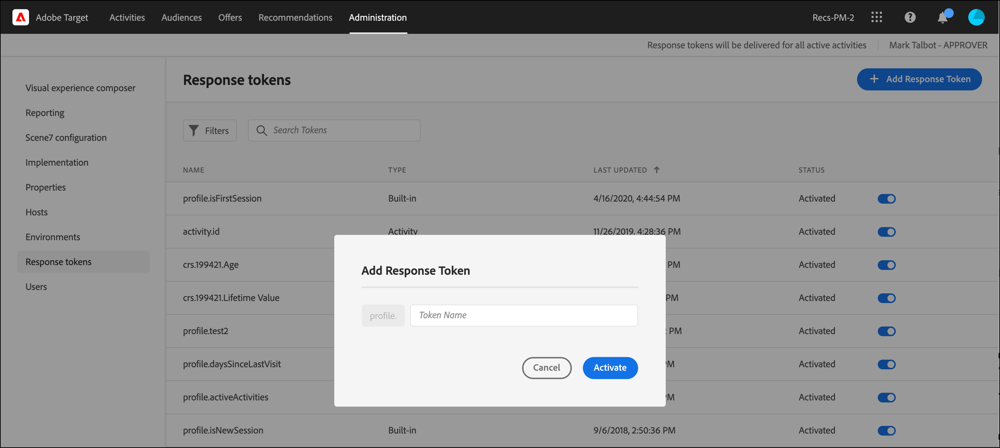

# レスポンストークン

レスポンストークンを使用すると、 [!DNL Adobe Target] をブランドの web ページに追加します。 この情報には、アクティビティ、オファー、エクスペリエンス、ユーザープロファイル、地域情報などに関する詳細が含まれます。 これらの詳細は、内部またはサードパーティのツールと共有したり、デバッグに使用したりするための追加の応答データを提供します。

レスポンストークンを使用すると、使用する変数（キーと値のペア）を選択し、 [!DNL Target] 応答。 変数を有効にするには、スイッチを使用します。この変数は、 [!DNL Target] 応答。ネットワーク呼び出しで検証できます。 レスポンストークンは [!UICONTROL プレビュー] モード。

プラグインとレスポンストークンの主な違いは、プラグインは配信時に実行されるページに JavaScript を配信することです。 ただし、レスポンストークンは、イベントリスナーを使用して読み取り、処理できるオブジェクトを配信します。 レスポンストークンのアプローチはより安全で、サードパーティ統合の開発と保守を容易にします。

>[!NOTE]
>
>レスポンストークンは at.js バージョン 1.1 以降で利用できます。

| Target SDK | 推奨アクション |
|--- |--- |
| [Adobe Experience Platform Web SDK](https://developer.adobe.com/target/implement/client-side/aep-web-sdk/) | Platform Web SDK バージョン 2.6.0 以降を使用していることを確認します。 Platform Web SDK の最新バージョンのダウンロードについて詳しくは、 [SDK のインストール](https://experienceleague.adobe.com/docs/experience-platform/edge/fundamentals/installing-the-sdk.html) 内 *Platform Web SDK の概要* ガイド。 Platform Web SDK の各バージョンでの新機能について詳しくは、 [リリースノート](https://experienceleague.adobe.com/docs/experience-platform/edge/release-notes.html) 内 *Platform Web SDK の概要* ガイド。 |
| [at.js](https://developer.adobe.com/target/implement/client-side/atjs/how-atjs-works/how-atjs-works/) | 必ず at.js バージョン 1.1 以降を使用します。at.js の最新バージョンのダウンロードについて詳しくは、[at.js のダウンロード](https://developer.adobe.com/target/implement/client-side/atjs/how-to-deployatjs/implement-target-without-a-tag-manager/) を参照してください。at.js の各バージョンでの新機能について詳しくは、[at.js のバージョンの詳細](https://developer.adobe.com/target/implement/client-side/atjs/target-atjs-versions/)を参照してください。<br>at.js を使用する場合は、プラグインを廃止しレスポンストークンを使用することをお勧めします。at.js にはなく、mbox.js（現在は非推奨）に存在する内部メソッドを使用するプラグインの中には、配信されても失敗するものもあります。 |

## レスポンストークンの使用 {#section_A9E141DDCBA84308926E68D05FD2AC62}

1. Platform Web SDK バージョン 2.6.0（またはそれ以降）または at.js バージョン 1.1（またはそれ以降）を使用していることを確認します。

   詳しくは、以下を参照してください。

   * **Platform Web SDK**:詳しくは、 [SDK のインストール](https://experienceleague.adobe.com/docs/experience-platform/edge/fundamentals/installing-the-sdk.html) 内 *Platform Web SDK の概要* ガイド。
   * **at.js**:詳しくは、 [at.js のダウンロード](https://developer.adobe.com/target/implement/client-side/atjs/how-to-deployatjs/implement-target-without-a-tag-manager/).

1. In [!DNL Target]をクリックし、 **[!UICONTROL 管理]** > **[!UICONTROL レスポンストークン]**.

   

1. 次のような目的のレスポンストークンをアクティブにします。 `activity.id` および `offer.id`.

   デフォルトでは次のパラメーターを使用できます。

   | タイプ | パラメーター | メモ |
   |--- |--- |--- |
   | ビルトインプロファイル | `profile.activeActivities` | 訪問者が該当する `activityIds` の配列を返します。ユーザーが該当するたびに増分されます。例えば、2 つの [!DNL Target] 2 つの異なるアクティビティを配信するリクエストの場合、2 番目のリクエストには両方のアクティビティが含まれます。 |
   |  | `profile.isFirstSession` | 「true」または「false」を返します。 |
   |  | `profile.isNewSession` | 「true」または「false」を返します。 |
   |  | `profile.daysSinceLastVisit` | 訪問者の最後の訪問からの経過日数を返します。 |
   |  | `profile.tntId` | 訪問者の tntID を返します。 |
   |  | `profile.marketingCloudVisitorId` | 訪問者の Experience Cloud 訪問者 ID を返します。 |
   |  | `profile.thirdPartyId` | 訪問者のサードパーティ ID を返します。 |
   |  | `profile.categoryAffinity` | 訪問者のお気に入りのカテゴリを返します。 |
   |  | `profile.categoryAffinities` | 訪問者の上位 5 カテゴリの配列を文字列として返します。 |
   | アクティビティ | `activity.name`<br>`activity.id`<br>`experience.name`<br>`experience.id`<br>`offer.name`<br>`offer.id` | 現在のアクティビティの詳細です。<br> オファーパラメーターの値は、エクスペリエンスレベルで評価されます。 |
   | 地域 | `geo.country`<br>`geo.state`<br>`geo.city`<br>`geo.zip`<br>`geo.dma`<br>`geo.domainName`<br>`geo.ispName`<br>`geo.connectionSpeed`<br>`geo.mobileCarrier` | アクティビティでの地域ターゲット設定について詳しくは、[地域](/help/main/c-target/c-audiences/c-target-rules/geo.md)を参照してください。 |
   | トラフィック配分方法<br>( 次に適用： [!UICONTROL 自動ターゲット] および [!UICONTROL Automated Personalization] アクティビティのみ ) | `experience.trafficAllocationId` | 訪問者が「コントロール」トラフィックからエクスペリエンスを受け取った場合は 0 を、「ターゲット」トラフィック配分からエクスペリエンスを受け取った場合は 1 を返します。 |
   |  | `experience.trafficAllocationType` | 「control」または「targeted」を返します。 |

   ユーザープロファイル属性と顧客属性もリストに表示されます。

   >[!NOTE]
   >
   >特殊文字を含むパラメーターはリストに表示されません。英数字とアンダースコアのみサポートされます。

1. （条件付き）プロファイルパラメーターをレスポンストークンとして使用するが、パラメーターが [!DNL Target] リクエストを読み込まず、 [!DNL Target] UI では、 [!UICONTROL レスポンストークンを追加] ボタンをクリックして、UI にプロファイルを追加します。

   クリック **[!UICONTROL レスポンストークンを追加]**」、トークン名を入力し、「 **[!UICONTROL 有効化]**.

   

1. アクティビティを作成します。

## 応答をリッスンし、レスポンストークンを読み取ります。

リッスンするプロセス [!DNL Target] の応答と読み取りのレスポンストークンは、 [!DNL Platform Web SDK] または at.js の実装

###  [!DNL Platform Web SDK] Handle オブジェクトクラスの使用 {#platform-web-sdk}

メタデータオブジェクトと、リッスンするデータオブジェクトを持つ Handle オブジェクトクラスを使用します。 [!DNL Target] の応答とレスポンストークンの読み取り。

次の応答の例では、 [!DNL Platform Web SDK] カスタムイベントハンドラーをHTMLページに直接追加します（この表では、コードで使用されるオブジェクトについて説明します）。

| オブジェクト | 情報 |
| --- | --- |
| タイプ — Personalization.decision | 決定が [!DNL Target] またはOffer decisioningプロバイダー。 |
| DecisionProvider - TGT | TGT-[!DNL Target]. [!DNL Target] は、レスポンストークンのメタデータと値をページに提供します。 |
| メタ | ページに渡されるメタデータ。 |
| データ | ページに渡されるメタデータの値。 |

```html
<html>

<head>
 ...
 <script src="alloy.js"></script>
 <script>
  {
   "requestId": "4d0a7cfd-952c-408c-b3b8-438edc38250a",
   "handle": [{
    "type": "personalization:decisions",
    "payload": [{
     "id": "....",
     "scope": "__view__",
     "scopeDetails": {
      "decisionProvider": "TGT",
      "activity": {
       "id": "..."
      },
      "experience": {
       "id": "...."
      }
     },
     "items": [{
      "id": "123",
      "schema": "https://ns.adobe.com/personalization/dom-action",
      "meta": {
       "activity.id": "...",
       "activity.name": "...",
       "profile.foo": "...",
       "profile.bar": "..."
      },
      "data": {
       "id": "123",
       "type": "setHtml",
       "selector": "#foo",
       "prehidingSelector": "#foo",
       "content": "<div>Hello world</div>"
      }
     }]
    }]
   }]
  }
  });
 </script>
</head>

<body>
 ...
</body>

</html>
```

###  カスタムイベントを使用する at.js

[at.js カスタムイベント](https://developer.adobe.com/target/implement/client-side/atjs/atjs-functions/atjs-custom-events/)を使用して の応答をリッスンし、レスポンストークンを読み取ります。[!DNL Target]

以下のコードサンプルは、[!DNL at.js] カスタムイベントハンドラーを HTML ページに直接追加します。

```html
<html> 
  <head> 
    .... 
    <script src="at.js"></script> 
    <script> 
      document.addEventListener(adobe.target.event.REQUEST_SUCCEEDED, function(e) { 
        console.log("Request succeeded", e.detail); 
      }); 
    </script> 
  <head> 
  <body> 
  ... 
  </body> 
</html>
```

## レスポンストークンに関する FAQ {#section_3DD5F32C668246289CDF9B4CDE1F536D}

**レスポンストークンを有効または無効にするには、どの役割が必要ですか？**

レスポンストークンは、 [!DNL Target] [!UICONTROL 管理者] 役割。

**実行中の場合の影響 [!DNL Platform Web SDK] 2.6.0（またはそれ以前）**

レスポンストークンへのアクセス権がありません。

**at.js 1.0（またはそれ以前）を実行している場合はどうなりますか。**

レスポンストークンは見えますが、at.js では使用できません。

**[!DNL Target Classic] プラグインとレスポンストークンの両方を同時に有効にすることはできますか？**

プラグインとレスポンストークンは同時に使用できます。ただし、プラグインは今後非推奨となります。

**すべての [!DNL Target] 応答または唯一の [!DNL Target] アクティビティを配信する応答**

レスポンストークンは [!DNL Target] アクティビティを配信する応答。

**マイ [!DNL Target Classic] プラグインに JavaScript が含まれていました。 レスポンストークンを使用してこの機能を複製するにはどうすればよいですか？**

レスポンストークンに移行する際は、このタイプの JavaScript をコードベースまたはタグ管理ソリューションに保持する必要があります。 このコードをトリガーするには、 [!DNL Platform Web SDK] または [!DNL at.js] カスタムイベントを作成し、レスポンストークンの値を JavaScript 関数に渡します。

**プロファイル／顧客属性パラメーターがレスポンストークンのリストに表示されないのはなぜですか？**

[!DNL Target] 通常、パラメーターは 15 分ごとに更新されます。 この更新は、ユーザーの操作によって異なり、レスポンストークンページを表示した場合にのみデータが更新されます。 パラメーターがレスポンストークンのリストに表示されない場合、 [!DNL Target] はまだデータを更新していません。

また、パラメーターに英数字以外の文字やアンダースコア以外の記号が含まれている場合は、そのパラメーターはリストに表示されません。 現時点では、サポートされるのは英数字とアンダースコアのみです。

**削除されたプロファイルスクリプトまたはプロファイルパラメーターを使用している場合、レスポンストークンは引き続きコンテンツを配信しますか？**

レスポンストークンはユーザープロファイルから情報を抽出し、その情報を配信します。プロファイルスクリプトまたはプロファイルパラメーターを削除しても、ユーザープロファイルから情報が削除されるわけではありません。ユーザープロファイルには、プロファイルスクリプトに対応するデータが引き続き含まれます。 レスポンストークンは引き続きコンテンツを配信します。 その情報をプロファイルに保存していないユーザーや新規訪問者の場合、データがプロファイルに存在しないので、そのトークンは配信されません。

[!DNL Target] では、トークンの自動的な切り替えはおこなわれません。 プロファイルスクリプトを削除し、このトークンの配信が不要になった場合は、手動でトークンを無効にする必要があります。

**プロファイルスクリプトの名前を変更しましたが、そのスクリプトを使用しているトークンが変更前の名前のままで引き続き有効なのはなぜですか？**

前述したように、レスポンストークンはユーザーの保存済みのプロファイル情報を基に機能します。プロファイルスクリプトの名前を変更した場合でも、Web サイトを訪問したユーザーのプロファイルには、古いプロファイルスクリプトの値が保存されます。 トークンは、ユーザープロファイルに既に保存されている古い値を引き続き取得します。 新しい名前でコンテンツを配信したい場合は、以前のトークンを無効にし、新しいトークンを有効にする必要があります。

**属性が変更された場合、いつリストから削除されますか。**

[!DNL Target] では、一定間隔で属性が更新されます。オンに切り替えられていない属性は、次回の更新時に削除されます。 ただし、オンに切り替えられて削除された属性がある場合、そのスクリプトは、オフに切り替えるまで属性リストから削除されません。 例えば、トークンとして使用されたプロファイルスクリプトを削除しました。 [!DNL Target] では、削除または名前変更しても、無効にされている属性しかリストから削除されません。

## データをGoogle Analyticsに送信

次の節では、を送信する方法について説明します [!DNL Target] データからGoogle Analyticsへ レスポンストークンから送信されたデータは、他のサードパーティ統合にも送信できます。

###  Platform Web SDK を使用してGoogle Analyticsにデータを送信する

Google Analyticsは、HTMLページに次のコードを追加することで、Platform Web SDK バージョン 2.6.0（またはそれ以降）を使用してデータを送信できます。

>[!NOTE]
>
>レスポンストークンのキーと値のペアが「 `alloy(“sendEvent”` オブジェクト。

```
<script type="text/javascript"> 
   (function(i, s, o, g, r, a, m) { 
   i['GoogleAnalyticsObject'] = r; 
   i[r] = i[r] || function() { 
   (i[r].q = i[r].q || []).push(arguments) 
   }, i[r].l = 1 * new Date(); 
   
   
   a = s.createElement(o), 
   m = s.getElementsByTagName(o)[0]; 
   a.async = 1; 
   a.src = g; 
   m.parentNode.insertBefore(a, m) 
   })(window, document, 'script', 'https://www.google-analytics.com/analytics.js', 'ga'); 
   ga('create', 'Google Client Id', 'auto'); 
</script> 
<script type="text/javascript">
   alloy("sendEvent", {
   
   
   })
   .then(({ renderedPropositions, nonRenderedPropositions }) => {
   // concatenate all the propositions
   const propositions = [...renderedPropositions, ...nonRenderedPropositions];
   // extractResponseTokens() extract the meta from item -> meta
   const tokens = extractResponseTokens(propositions);
   const activityNames = []; 
   const experienceNames = []; 
   const uniqueTokens = distinct(tokens); 
   
   
   uniqueTokens.forEach(token => { 
   activityNames.push(token["activity.name"]); 
   experienceNames.push(token["experience.name"]); 
   }); 
   
   
   ga('send', 'event', { 
   eventCategory: "target", 
   eventAction: experienceNames, 
   eventLabel: activityNames 
   }); 
   
   
   });
</script>
```

###  at.js を使用したGoogle Analyticsへのデータの送信 {#section_04AA830826D94D4EBEC741B7C4F86156}

次のコードを HTML ページに追加することで、Google Analytics に at.js を介してデータを送信できます。

```javascript
<script type="text/javascript"> 
  (function(i, s, o, g, r, a, m) { 
    i['GoogleAnalyticsObject'] = r; 
    i[r] = i[r] || function() { 
      (i[r].q = i[r].q || []).push(arguments) 
    }, i[r].l = 1 * new Date(); 
    a = s.createElement(o), 
      m = s.getElementsByTagName(o)[0]; 
    a.async = 1; 
    a.src = g; 
    m.parentNode.insertBefore(a, m) 
  })(window, document, 'script', 'https://www.google-analytics.com/analytics.js', 'ga'); 
  ga('create', 'Google Client Id', 'auto'); 
</script> 
 
<script type="text/javascript"> 
  document.addEventListener(adobe.target.event.REQUEST_SUCCEEDED, function(e) { 
    var tokens = e.detail.responseTokens; 
 
    if (isEmpty(tokens)) { 
      return; 
    } 
 
    var activityNames = []; 
    var experienceNames = []; 
    var uniqueTokens = distinct(tokens); 
 
    uniqueTokens.forEach(function(token) { 
      activityNames.push(token["activity.name"]); 
      experienceNames.push(token["experience.name"]); 
    }); 
 
    ga('send', 'event', { 
      eventCategory: "target", 
      eventAction: experienceNames, 
      eventLabel: activityNames 
    }); 
  }); 
 
  function isEmpty(val) { 
    return (val === undefined || val == null || val.length <= 0) ? true : false; 
  } 
 
  function key(obj) { 
     return Object.keys(obj) 
    .map(function(k) { return k + "" + obj[k]; }) 
    .join(""); 
  } 
 
  function distinct(arr) { 
    var result = arr.reduce(function(acc, e) { 
      acc[key(e)] = e; 
      return acc; 
    }, {}); 
   
    return Object.keys(result) 
    .map(function(k) { return result[k]; }); 
  } 
</script>
```

## デバッグ

以下の節では、レスポンストークンのデバッグに関する情報を示します。

###  Google Analyticsとデバッグ

次のコードを使用すると、デバッグにGoogle Analyticsできます。

```javascript
<script type="text/javascript"> 
  (function(i, s, o, g, r, a, m) { 
    i['GoogleAnalyticsObject'] = r; 
    i[r] = i[r] || function() { 
      (i[r].q = i[r].q || []).push(arguments) 
    }, i[r].l = 1 * new Date(); 
    a = s.createElement(o), 
      m = s.getElementsByTagName(o)[0]; 
    a.async = 1; 
    a.src = g; 
    m.parentNode.insertBefore(a, m) 
  })(window, document, 'script', 'https://www.google-analytics.com/analytics.js', 'ga'); 
  ga('create', 'Google Client Id', 'auto'); 
</script> 
 
<script type="text/javascript"> 
  document.addEventListener(adobe.target.event.REQUEST_SUCCEEDED, function(e) { 
    var tokens = e.detail.responseTokens; 
 
    if (isEmpty(tokens)) { 
      return; 
    } 
 
    var activityNames = []; 
    var experienceNames = []; 
    var uniqueTokens = distinct(tokens); 
 
    uniqueTokens.forEach(function(token) { 
      activityNames.push(token["activity.name"]); 
      experienceNames.push(token["experience.name"]); 
    }); 
 
    ga('send', 'event', { 
      eventCategory: "target", 
      eventAction: experienceNames, 
      eventLabel: activityNames 
    }); 
  }); 
 
  function isEmpty(val) { 
    return (val === undefined || val == null || val.length <= 0) ? true : false; 
  } 
 
  function key(obj) { 
     return Object.keys(obj) 
    .map(function(k) { return k + "" + obj[k]; }) 
    .join(""); 
  } 
 
  function distinct(arr) { 
    var result = arr.reduce(function(acc, e) { 
      acc[key(e)] = e; 
      return acc; 
    }, {}); 
   
    return Object.keys(result) 
    .map(function(k) { return result[k]; }); 
  } 
```

### ttMeta プラグインと同等のを使用したデバッグ

ttMeta プラグインと同様のデバッグ機能は、HTML ページに次のコードを追加することで作成できます。

```javascript
<script type="text/javascript" > 
  document.addEventListener(adobe.target.event.REQUEST_SUCCEEDED, function (e) { 
    window.ttMETA= typeof(window.ttMETA)!="undefined" ? window.ttMETA : []; 
 
    var tokens=e.detail.responseTokens; 
 
    if (isEmpty(tokens)) { 
      return; 
    } 
     
    var uniqueTokens = distinct(tokens); 
 
    uniqueTokens.forEach(function(token) { 
      window.ttMETA.push({ 
        'CampaignName': token["activity.name"], 
        'CampaignId' : token["activity.id"], 
        'RecipeName': token["experience.name"], 
        'RecipeId': token["experience.id"], 
        'OfferId': token["offer.id"], 
        'OfferName': token["offer.name"], 
        'MboxName': e.detail.mbox}); 
      console.log(ttMETA); 
    }); 
  }); 
 
  function isEmpty(val){ 
    return (val === undefined || val == null || val.length <= 0) ? true : false; 
  } 
 
  function key(obj) { 
     return Object.keys(obj) 
    .map(function(k) { return k + "" + obj[k]; }) 
    .join(""); 
  } 
 
  function distinct(arr) { 
    var result = arr.reduce(function(acc, e) { 
      acc[key(e)] = e; 
      return acc; 
    }, {}); 
   
    return Object.keys(result) 
    .map(function(k) { return result[k]; }); 
  } 
</script>
```

##  トレーニングビデオ：レスポンストークンと at.js カスタムイベント {#section_3AA0A6C8DBD94A528337A2525E3E05D5}

次のビデオでは、レスポンストークンと at.js カスタムイベントを使用してからプロファイル情報を共有する方法を説明します。 [!DNL Target] をサードパーティ製システムに追加する。

>[!NOTE]
>
>パフォーマンスを向上、新機能のリリースに要するメンテナンス時間を短縮、製品全体でのユーザーエクスペリエンスが向上するため、[!DNL Target] [!UICONTROL 管理]メニュー（以前の[!UICONTROL 設定]）のデザインが一新されました。次のビデオの情報は正しいです。ただし、オプションの場所は若干異なります。
>
>ビデオでのメンション `option.name` および `option.id`（で置き換えられています） `offer.name` および `offer.id`、それぞれ。

>[!VIDEO](https://video.tv.adobe.com/v/23253/)
