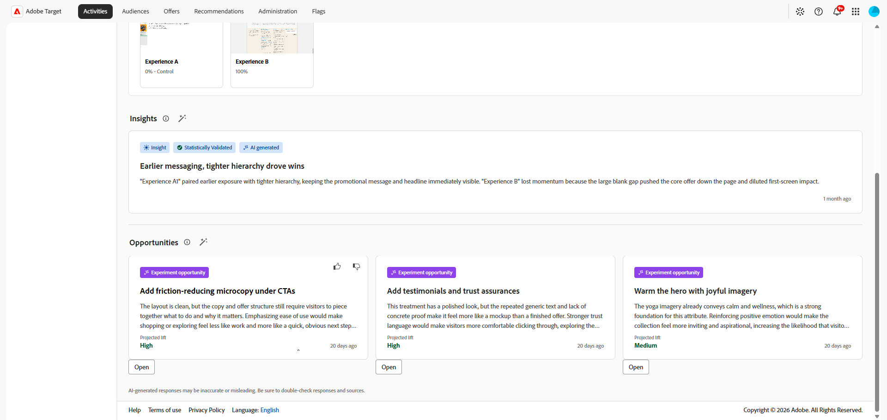

# AI インサイト

>[!AVAILABILITY]
>
>AI インサイト機能は現在、ベータ機能として利用できます。
> 
>「**[!UICONTROL AI インサイト]**」セクションは、**[!UICONTROL 手動]** トラフィック割り当てのある&#x200B;**[!UICONTROL A/B テスト]** アクティビティでのみ使用できます。

**[!UICONTROL アクティビティの概要]**&#x200B;の&#x200B;**[!UICONTROL AI インサイト]** メニューでは、インサイトと最適化の機会にアクセスできます。 このタブは、実験の学習内容を確認したり、処理を比較したり、コンバージョン率を向上させる可能性のある変更を特定したりするために使用します。

## AI インサイトと機会の設定

>[!CONTEXTUALHELP]
>id="target_ai_insights_primary_metric"
>title="プライマリ指標"
>abstract="プライマリ指標は、レポート設定から自動的に取得されます。 変更するには、目標と設定で目標指標を変更します。"

>[!CONTEXTUALHELP]
>id="target_ai_insights_hypothesis"
>title="仮説"
>abstract="仮説は、実験の期待される結果を説明するために定義するステートメントです。 変更する内容と場所の説明と、変更する指標と方法の明記が含まれます。"

>[!CONTEXTUALHELP]
>id="target_ai_insights_treatment_details"
>title="顧客体験の詳細"
>abstract="エクスペリエンスの詳細には、利用者がエクスペリエンスに適格であると判断した場合のエクスペリエンスの画像が表示されます。 すべての実験に対して、これらの画像を確認できます。 一部の実験では、画像の確認や、必要に応じて画像の置換が求められる場合があります。"

AIが生成したインサイトと機会にアクセスする前に、まず、主要な指標、仮説、エクスペリエンスのスクリーンショットを確認して、アクティビティを設定する必要があります。

主な指標は、レポート設定から自動的に取得され、目標と設定の設定方法によって異なります。 AI インサイトパネルで仮説を作成する必要があります。 [詳細情報](../c-activities/t-test-ab/t-test-create-ab/ab-goals-and-settings.md)

1. [!DNL Adobe Target]でアクティビティを開きます。

1. **[!UICONTROL AI インサイト]** メニューを選択して、設定パネルを開きます。

1. をクリックして、実験の仮説を作成します。

   

1. 変更が行われた内容と、それが主要指標にどのような影響を与えるかを記述して、仮説を入力します。

   「**[!UICONTROL Save]**」をクリックします。

1. **[!UICONTROL エクスペリエンスの詳細]**&#x200B;で、カードをクリックしてエクスペリエンスのスクリーンショットを追加します。

   >[!NOTE]
   >一部の画像は既に自動的にキャプチャされている可能性があります。 その場合は、**[!UICONTROL 確認]**&#x200B;をクリックしてスクリーンショットを確認します。

   

1. 「**[!UICONTROL 画像をアップロード]**」を選択して、各エクスペリエンスのローカルファイルから優先スクリーンショットをアップロードします。

   

1. プレビューリンクをコピーするか、直接開いて、エクスペリエンスをプレビューします。

1. 各エクスペリエンスにスクリーンショットが表示されたら、詳細を確認し、**[!UICONTROL 確認]**&#x200B;をクリックして設定を完了します。

設定が完了すると、アクティビティは商談を生成する準備が整います。 実験が統計的検証に十分なデータを持ち、必要な実験の詳細が確認されると、インサイトが利用可能になります。

## インサイト

>[!CONTEXTUALHELP]
>id="target_ai_insights"
>title="インサイト"
>abstract="実験インサイトとは、実験データが統計的優位差を満たした際に、AI が発見した学習内容です。"

実験インサイトは、この実験から得られたAIが生成した学習です。 これらのインサイトは、実験が統計的有意性に達し、その成功に貢献した要因に関するコンテキストを提供すると利用できます。 勝者エクスペリエンスに存在する、コントロールとは異なり結果に影響を与える可能性の高い主要な属性を強調表示します。

1. カードをクリックして、**[!UICONTROL インサイト]** メニューにアクセスします。

   

1. AIが生成したインサイトを参照して実験の学習を確認し、勝者エクスペリエンスと制御可能なエクスペリエンスを比較します。

   

1. **[!UICONTROL このエクスペリエンスが成功した理由]**&#x200B;で、このエクスペリエンスがコントロールを上回った理由を説明する詳細を確認します。

## オポチュニティ

>[!CONTEXTUALHELP]
>id="target_ai_insights_opportunities"
>title="オポチュニティ"
>abstract="実験の機会は、実験のスクリーンショットと結果で見つかったパターン AIに基づいて、AIが提案したエクスペリエンスのアイデアです。"

**[!UICONTROL 商談]** パネルには、テストのパフォーマンスを向上させ、より広範なビジネス目標とKPIに沿うように設計された、AIが生成した推奨事項が表示されます。

1. 提案された商談を参照し、レビューする商談を選択します。

   

1. 「商談詳細」ウィンドウを開く商談を選択します。このウィンドウには、特定のエクスペリエンスまたはバリエーションの概要が表示されます。 このビューには、次が含まれます。

   * 商談の生成に使用された現在のエクスペリエンス画像。

   * 提案されたエクスペリエンスの期待される結果と、パフォーマンスが向上する理由を説明する、AIが生成した仮説。

   * エクスペリエンスにレコメンデーションを実装し、選択した指標への影響を測定する方法に関するガイダンス。

   

