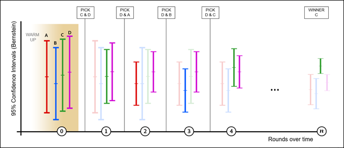

# [!UICONTROL 自動配分]の概要

[!DNL Adobe Target]の[!UICONTROL 自動割り当て] アクティビティは、2つ以上のエクスペリエンスの中から勝者を特定し、テストの実行と学習を続ける間に、勝者に自動的に多くのトラフィックを再割り当てしてコンバージョンを増加させます。

3段階のガイド付きワークフローを使用して[A/B アクティビティを作成する](/help/main/c-activities/t-test-ab/t-test-create-ab/test-create-ab.md)際、**[!UICONTROL ターゲティング]** ページで&#x200B;**[!UICONTROL 自動配分]** オプションを選択します（ステップ 2）。

## 課題 {#section_85D5A03637204BACA75E19646162ACFF}

標準的な A/B テストには、固有のコストがあります。 各エクスペリエンスのパフォーマンスを測定するためにトラフィックを費やす必要があり、分析を通じて勝者エクスペリエンスを見つけ出す必要があります。 トラフィックの配分は、一部のエクスペリエンスが他よりもパフォーマンスに優れているとわかった後でも、固定されたままです。 また、サンプルサイズの計算が複雑で、アクティビティは、勝者に対して働きかけられるようになる前に全コースを実行する必要があります。 特定した勝者が真の勝者でない可能性もあります。

## 解決策：[!UICONTROL 自動割り当て] {#section_98388996F0584E15BF3A99C57EEB7629}

[!UICONTROL 自動割り当て] アクティビティは、勝者エクスペリエンスを決定する際のこのコストとオーバーヘッドを削減します。 [!UICONTROL 自動割り当て]は、すべてのエクスペリエンスの目標指標のパフォーマンスを監視し、パフォーマンスの高いエクスペリエンスに対してより多くの新規参加者を均等に送信します。 他のエクスペリエンスを調査するのに十分なトラフィックが確保されます。 学習と平行してアクティビティの最適化を実行中であっても、結果に対するテストのメリットを確認できます。

[!UICONTROL 自動割り当て]は、アクティビティが終了するまで待って勝者を決定するのではなく、訪問者を徐々に勝者エクスペリエンスに移行させます。 成功していないエクスペリエンスに送られるはずのアクティビティ参加者に、勝者の可能性を持つエクスペリエンスが示されるので、より迅速にメリットが得られます。

[!DNL Target] の通常の A/B テストでは、対抗エクスペリエンスとコントロールエクスペリエンスの一対比較しかできません。 例えば、アクティビティにエクスペリエンス A、B、C、D があり、A がコントロールである場合、通常の [!DNL Target] の A/B テストでは、A 対 B、A 対 C、A 対 D を比較します。

このようなテストでは、[!DNL Target]を含むほとんどの製品で、[&#x200B; ウェルチのt-test](https://en.wikipedia.org/wiki/Welch%27s_t-test){target=_blank}を使用して、p値に基づく信頼性を生成します。 その後、この信頼値を使用して、対抗エクスペリエンスがコントロールエクスペリエンスと十分に異なるかどうかを特定します。 ただし、[!DNL Target] は「最良の」エクスペリエンスを見つけるのに必要な暗黙の比較（B 対 C、B 対 D、C 対 D）を自動的に実行することはありません。 その結果、マーケターは、「最良の」エクスペリエンスを判断する結果を手動で分析する必要があります。

[!UICONTROL 自動割り当て]は、エクスペリエンス間のすべての暗黙的な比較を実行し、「真の」勝者を生成します。 このテストには「コントロール」エクスペリエンスという概念がありません。

[!UICONTROL 自動割り当て]は、最適なエクスペリエンスの信頼区間が他のエクスペリエンスの信頼区間と重ならないまで、新しい訪問者をエクスペリエンスにインテリジェントに割り当てます。 通常、このプロセスでは偽陽性が発生する可能性がありますが、[!UICONTROL 自動配分]では、繰り返し評価を補償する[Bernstein Inequality](https://en.wikipedia.org/wiki/Bernstein_inequalities_%28probability_theory%29){target=_blank}に基づく信頼区間が使用されます。 これによって、真の勝者が判明します。 [!UICONTROL 自動割り当て]が停止した場合、ページに到着した訪問者に実質的な時間依存関係がない場合、[!UICONTROL 自動割り当て]が、勝者エクスペリエンスの真の応答よりも1% （相対）未満の真の応答を返す可能性が少なくとも95%あります。

## [!UICONTROL 自動割り当て]を[!UICONTROL A/B テスト &#x200B;]または[!UICONTROL Automated Personalization] アクティビティと比較して使用するタイミング {#section_3F73B0818A634E4AAAA60A37B502BFF9}

* アクティビティを最初から最適化して、なるべく早く勝者エクスペリエンスを特定したい場合に、**[!UICONTROL 自動配分]**&#x200B;を使用します。 パフォーマンスの高いエクスペリエンスをより頻繁に提供することで、アクティビティ全体のパフォーマンスを向上させます。
* サイトを最適化する前にすべてのエクスペリエンスのパフォーマンスを特徴付ける場合は、標準の **[A/B テスト](/help/main/c-activities/t-test-ab/test-ab.md#task_05E33EB15C4D4459B5EAFF90A94A7977)**&#x200B;を使用します。 A/B テストを実施すると、すべてのエクスペリエンスをランク付けできます。一方、[!UICONTROL 自動配分]では、パフォーマンスが最も高いユーザーが見つかりますが、パフォーマンスが低いユーザー間での差別化は保証されません。
* 個々のプロファイル属性に基づいて予測を行う機械学習モデルのように、複雑な最適化アルゴリズムが必要な場合は、[Automated Personalization](/help/main/c-activities/t-automated-personalization/automated-personalization.md#task_8AAF837796D74CF893CA2F88BA1491C9) を使用します。 [!UICONTROL 自動割り当て]は、（標準のA/B テストと同様に）エクスペリエンスの集計動作を確認し、訪問者を区別しません。

## [!UICONTROL 自動配分]の主な利点 {#section_0913BF06F73C4794862561388BBDDFF0}

* A/B テストの正確性を保持する
* 統計的に有意な勝者を手動の A/B テストよりも早く見つける
* 手動の A/B テストよりも高い平均キャンペーン上昇率を提供する

## 用語 {#section_670F8785BA894745B43B6D4BFF953188}

次の用語は、[!UICONTROL 自動配分]について説明する際に役立ちます。

**マルチアームバンディット：**&#x200B;[マルチアームバンディット](https://en.wikipedia.org/wiki/Multi-armed_bandit){target=_blank}は、調査学習とその学習の活用のバランスを最適化するためのアプローチです。

## アルゴリズムの仕組み {#section_ADB69A1C7352462D98849F2918D4FF7B}

[!UICONTROL 自動配分]の背後にある全体的なロジックには、測定されたパフォーマンス（コンバージョン率など）と累積データの信頼区間の両方が組み込まれます。 トラフィックがエクスペリエンス間で均等に分配される標準的なA/B テストとは異なり、[!UICONTROL 自動配分]は、エクスペリエンス間のトラフィック配分を変更します。

* 訪問者の 80％は、以下に説明するインテリジェントロジックを使用して配分されます。
* 訪問者の 20％は、訪問者行動の変化に対応するように、すべてのエクスペリエンスにランダムに配分されます。

マルチアームバンディットアプローチでは、パフォーマンスの良いエクスペリエンスを活用している間も、一部のエクスペリエンスを自由に調査できるようにしておきます。 変化する状況に対応する能力を維持しながら、より多くの新規訪問者がパフォーマンスのより優れたエクスペリエンスに配置されます。 最新のデータを反映するために、これらのモデルは少なくとも 1 時間に 1 回更新されます。

より多くの訪問者がアクティビティに入るにしたがって、一部のエクスペリエンスの成功率が向上し始め、より多くのトラフィックが成功エクスペリエンスに送られます。 すべてのエクスペリエンスを調査するために、トラフィックの 20％が、引き続きランダムに配分されます。 パフォーマンスの低いエクスペリエンスの 1 つのパフォーマンスが向上し始めると、そのエクスペリエンスに配分されるトラフィックが増えます。 一方、パフォーマンスの高いアクティビティの成功率が低下すると、そのエクスペリエンスに配分されるトラフィックは少なくなります。 例えば、あるイベントが原因で訪問者がサイト上で異なる情報を期待している場合と小売サイトで週末セールを期待している場合で、異なる結果が提供されます。

次の図に、4 つのエクスペリエンスでのテスト中にアルゴリズムがどのように実行されるかを示します（クリックして図を展開します）。

{width="600" zoomable="yes"}

この図は、明確な勝者が決定されるまで、複数ラウンドのアクティビティの有効期間にわたって各エクスペリエンスに配分されるトラフィックがどのように変化するかを示しています。

| 四捨五入 | 説明 |
|--- |--- |
| {width="200" zoomable="yes"} | **ウォームアップラウンド（0）**: ウォームアップラウンドでは、アクティビティの各エクスペリエンスが最低1,000人の訪問者と50個のコンバージョンを持つまで、各エクスペリエンスのトラフィック配分が均等になります。<ul><li>エクスペリエンス A=25 ％</li><li>エクスペリエンス B=25 ％</li><li>エクスペリエンス C=25 ％</li><li>エクスペリエンス D=25 ％</li></ul>各エクスペリエンスで訪問者が 1,000 人、コンバージョンが 50 回に達すると、[!DNL Target] はトラフィックの自動配分を開始します。 ラウンドですべての配分が発生し、ラウンドごとに 2 つのエクスペリエンスが選出されます。 次のラウンドに進むエクスペリエンスは D と C の 2 つのみです。 次のラウンドに進むとは、この 2 つのエクスペリエンスにトラフィックの 80％が均等に配分されることを意味します。 残り 2 つのエクスペリエンスも引き続きラウンドに加えられますが、新しい訪問者がアクティビティに入ってきても、トラフィックの 20％が部分的にランダムに配分されるのみです。 すべての配分は 1 時間ごとに更新されます（上記の x 軸のラウンド数で示されています）。 各ラウンドの後、累積データが比較されます。 |
| {width="200" zoomable="yes"} | **ラウンド1**: このラウンドでは、トラフィックの80%がエクスペリエンスCおよびD（それぞれ40%のエクスペリエンス）に配分されます。 トラフィックの 20％がエクスペリエンス A、B、C および D にランダムに配分されます（5％ずつ）。 このラウンドでは、エクスペリエンス A のパフォーマンスが優れています。<ul><li>アルゴリズムにより、（各アクティビティの垂直スケールが示しているように）コンバージョン率が最も高いという理由で、エクスペリエンス D が選出され、次のラウンドに進みます。</li><li>アルゴリズムにより、残りのエクスペリエンスでベルンシュタインの 95％信頼区間の上限が最も高いという理由で、エクスペリエンス A も選出され、次に進みます。</li></ul>エクスペリエンス D と A が次に進みます。 |
| {width="200" zoomable="yes"} | **ラウンド2**: このラウンドでは、トラフィックの80%がエクスペリエンスAおよびD（それぞれ40%のエクスペリエンス）に配分されます。 トラフィックの 20％がランダムに配分されます。つまり、エクスペリエンス A、B、C および D のそれぞれがトラフィックの 5％を獲得します。 このラウンドでは、エクスペリエンス B のパフォーマンスが優れています。<ul><li>アルゴリズムにより、（各アクティビティの垂直スケールが示しているように）コンバージョン率が最も高いという理由で、エクスペリエンス D が選出され、次のラウンドに進みます。</li><li>アルゴリズムにより、残りのエクスペリエンスでベルンシュタインの 95％信頼区間の上限が最も高いという理由で、エクスペリエンス B も選出され、次に進みます。</li></ul>エクスペリエンス D と B が次に進みます。 |
| {width="200" zoomable="yes"} | **ラウンド3**: このラウンドでは、トラフィックの80%がエクスペリエンスBとD（それぞれ40%のエクスペリエンス）に配分されます。 トラフィックの 20％がランダムに配分されます。つまり、エクスペリエンス A、B、C および D のそれぞれがトラフィックの 5％を獲得します。 このラウンドでは、エクスペリエンス D が引き続きパフォーマンスが優れ、エクスペリエンス C もパフォーマンスが優れています。<ul><li>アルゴリズムにより、（各アクティビティの垂直スケールが示しているように）コンバージョン率が最も高いという理由で、エクスペリエンス D が選出され、次のラウンドに進みます。</li><li>アルゴリズムにより、残りのエクスペリエンスでベルンシュタインの 95％信頼区間の上限が最も高いという理由で、エクスペリエンス C も選出され、次に進みます。</li></ul>エクスペリエンス D と C が次に進みます。 |
| {width="200" zoomable="yes"} | **ラウンド4**: このラウンドでは、トラフィックの80%がエクスペリエンスCおよびD（それぞれ40%のエクスペリエンス）に配分されます。 トラフィックの 20％がランダムに配分されます。つまり、エクスペリエンス A、B、C および D のそれぞれがトラフィックの 5％を獲得します。 このラウンドでは、エクスペリエンス C のパフォーマンスが優れています。<ul><li>アルゴリズムにより、（各アクティビティの垂直スケールが示しているように）コンバージョン率が最も高いという理由で、エクスペリエンス C が選出され、次のラウンドに進みます。</li><li>アルゴリズムにより、残りのエクスペリエンスでベルンシュタインの 95％信頼区間の上限が最も高いという理由で、エクスペリエンス D も選出され、次に進みます。</li></ul>エクスペリエンス C と D が次に進みます。 |
| {width="200" zoomable="yes"} | **ラウンド *n***：アクティビティが進むにつれて、パフォーマンスの高いエクスペリエンスが現れ始め、勝者エクスペリエンスが現れるまでプロセスが継続されます。 最も高いコンバージョン率のエクスペリエンスの信頼区間が他のエクスペリエンスの信頼区間と重複しない場合、そのエクスペリエンスが勝者となります。 [&#x200B; バッジが、勝者アクティビティのページ &#x200B;](/help/main/c-activities/automated-traffic-allocation/determine-winner.md)と[!UICONTROL &#x200B; アクティビティ &#x200B;] リストに表示されます。<ul><li>アルゴリズムにより、エクスペリエンス C が明確な勝者として選定されます。</li></ul>この時点で、アルゴリズムにより、トラフィックの 80％がエクスペリエンス C に配分され、トラフィックの 20％が、引き続きすべてのエクスペリエンス（A、B、C および D）にランダムに配分されます。 後継で、C はトラフィックの 85％を獲得します。 万一、勝者の信頼区間が再び重複し始めた場合、アルゴリズムにより、前述のラウンド 4 の動作に戻されます。
**重要**：プロセスの早い段階で手動によって勝者を選択すると、誤ったエクスペリエンスを選択してしまいやすくなります。 このため、アルゴリズムが勝者エクスペリエンスを決定するまで待つことをお勧めします。 |

>[!NOTE]
>
>アクティビティに 2 つのエクスペリエンスしかない場合は、[!DNL Target] が 75％の信頼性で勝者となるエクスペリエンスを特定するまでは、両方が均等のトラフィックを得ます。 この時点で、トラフィックの 3 分の 2 が勝者に、3 分の 1 が敗者に配分されます。 その後、エクスペリエンスが 95％の信頼性に達したら、トラフィックの 90％が勝者に、10％が敗者に配分されます。 [!DNL Target] は、最終的に偽陽性が発生するのを防ぐため（つまり、調査を続行するため）、ある程度のトラフィックを常に「敗者」エクスペリエンスにも送信します。

[!UICONTROL 自動割り当て] アクティビティがアクティブ化された後、Target UIからの次の操作は許可されません。

* 「トラフィック配分」モードから「手動」への切り替え
* 目標指標タイプの変更
* 「[!UICONTROL 詳細設定]」パネルでのオプションの変更

## 自動割り当ての仕組み

詳しくは、[自動割り当てを使用すると、手動テストよりも迅速にテスト結果を入手し、売上高を増やすことができます](/help/main/c-activities/automated-traffic-allocation/faster-results-higher-revenue.md)を参照してください。

## 注意事項 {#section_5C83F89F85C14FD181930AA420435E1D}

[!UICONTROL 自動配分]を使用する場合は、次の情報を検討してください。

### [!UICONTROL 自動割り当て]機能は、次の1つの高度な指標設定でのみ機能します：[!UICONTROL 増分数とユーザーをアクティビティに保持]

次の高度な指標設定はサポートされていません：[!UICONTROL 増分回数]、[!UICONTROL &#x200B; リリースユーザー]、[!UICONTROL 再入力と増分回数]、および[!UICONTROL 再入力からのユーザーとバーの解放]。

### 頻繁な再訪問者は、エクスペリエンスのコンバージョン率を水増しさせる可能性があります。

エクスペリエンス A を表示した訪問者が頻繁に再訪し、複数回のコンバージョンを行うと、エクスペリエンス A のコンバージョン率（CR）は、人為的に増加します。 この結果を、訪問者がコンバージョンしてもあまり再訪しないエクスペリエンス B と比較します。 結果として、エクスペリエンス A の CR はエクスペリエンス B の CR よりも優れているように見えるので、新しい訪問者は B よりも A に配分されるようになります。参加者あたり 1 回のみカウントすることを選択すると、A の CR と B の CRは同じになる可能性があります。

再訪問者がランダムに配分されると、そのコンバージョン率への影響は、より安定する傾向があります。 この効果を軽減させるには、目標指標のカウント方法を参加者あたり 1 回のみに変更することを検討します。

### パフォーマンスの低いものからではなく、パフォーマンスの高いものから区別します。

[!UICONTROL 自動割り当て]は、パフォーマンスの高いエクスペリエンス（および勝者の特定）を区別するのに適しています。 パフォーマンスの低いエクスペリエンスの間での十分な区別がない場合もあります。

すべてのエクスペリエンス間で統計的に有意な区別をする場合は、手動のトラフィック配分モードの使用を検討してください。

### 時間相関のある（または文脈が変化する）コンバージョン率は、配分量をゆがめる可能性があります。

すべてのエクスペリエンスに同じように影響を与えるため、標準のA/B テスト中に無視できる要因の一部は、[!UICONTROL 自動配分] アクティビティでは無視できません。 そのアルゴリズムは、観測されたコンバージョン率に敏感です。

次に、エクスペリエンスのパフォーマンスに不平等に影響する可能性のある要因の例を示します。

* 様々な状況（時間、場所、性別など）と関連性があるエクスペリエンス。

  次に例を示します。

   * 「花の金曜日」は、金曜日に高いコンバージョンをもたらす。
   * 「月曜日からジャンプスタート」は、月曜日に高いコンバージョンをもたらす。
   * 「東海岸の冬に備える」は、東海岸または冬が過酷な場所でコンバージョンが高くなる。

  コンテキストに関連する内容が異なるエクスペリエンスを使用すると、A/B テストでは結果が長い期間にわたって分析されるため、[!UICONTROL 自動配分] テストではA/B テストよりも結果が歪む可能性があります。

* おそらくメッセージの緊急性のために、コンバージョンの遅延が変化するエクスペリエンス。

  例えば、「30％セールは本日限り」は、訪問者に本日コンバージョンさせるきっかけになりますが、「初回購入は50％オフ」は、緊急性において同じ感覚を生みません。

## よくある質問 {#section_0E72C1D72DE74F589F965D4B1763E5C3}

[!UICONTROL 自動配分] アクティビティを操作する際は、次のFAQと回答を参照してください。

### [!UICONTROL Analytics for Target] （A4T）は[!UICONTROL 自動配分] アクティビティをサポートしていますか？

はい。 詳しくは、[A4T での自動割り当ておよび自動ターゲットアクティビティのサポート](/help/main/c-integrating-target-with-mac/a4t/a4t-at-aa.md)を参照してください。

### 再訪問者は、自動的にパフォーマンスの高いエクスペリエンスに再配分されますか？

いいえ。 新規訪問者のみが自動的に配分されます。 再訪問者には引き続き元のエクスペリエンスが表示され、A/B テストの有効性を保護します。

### アルゴリズムでは、偽陽性をどのように扱いますか？

勝者バッジが表示されるまで待った場合、アルゴリズムは 95 ％の信頼性または 5 ％の偽陽性率を保証します。

### [!UICONTROL 自動配分]がトラフィックの割り当てを開始するのはいつですか？

アクティビティのすべてのエクスペリエンスに 1,000 人以上の訪問者と 50 回以上のコンバージョンがあれば、アルゴリズムが機能し始めます。

### アルゴリズムは、どれくらい積極的に活用されますか？

トラフィックの80%は[!UICONTROL 自動配分]を使用して配信され、トラフィックの20%はランダムに配信されます。 勝者が特定されると、トラフィックの 80％が勝者に配分され、20％の一部が勝者エクスペリエンスを含むすべてのエクスペリエンスに引き続き配分されます。

### 失敗エクスペリエンスは表示されますか？

はい。 マルチアームバンディットでは、すべてのエクスペリエンスにわたる変更のパターンまたはコンバージョン率を調査するために、トラフィックの少なくとも 20 ％が予約されます。

### 長時間のコンバージョンの遅延があるアクティビティはどうなりますか？

最適化されたすべてのエクスペリエンスで同じ遅延が発生している場合、動作は、より高速なコンバージョンサイクルのアクティビティと同じです。 ただし、トラフィックの配分処理を開始する前に、50 のコンバージョンしきい値に達するまでに時間がかかります。

### [!UICONTROL 自動割り当て]は[!UICONTROL Automated Personalization]とどのように異なりますか？

[!UICONTROL Automated Personalization]は、各訪問者のプロファイル属性を使用して、最適なエクスペリエンスを決定します。 その際に、そのユーザーのアクティビティを最適化するだけでなく、パーソナライズします。

一方、[!UICONTROL 自動割り当て]は、集計勝者（最も人気のあるエクスペリエンスですが、各訪問者に対して必ずしも最も効果的なエクスペリエンスではありません）を生成するA/B テストです。

### 再訪問者により、成功指標のコンバージョン率が水増しされますか？

現在このロジックでは、コンバージョンが迅速に行われる、または訪問の頻度がより多い訪問者を優先します。これは、そのような訪問者が属するエクスペリエンスでは、全体的なコンバージョン率が一時的に増えるためです。 アルゴリズム自体は頻繁に調整されるので、コンバージョン率の増加は、各スナップショットで増幅されます。 サイトに多くの再訪問者が来ると、その人たちのコンバージョンによって、属するエクスペリエンスの全体的なコンバージョン率が増える可能性があります。 再訪問者がランダムに配分される可能性は高く、この場合、集計の効果（増加した上昇率）は安定します。 この効果を軽減させるには、成功指標のカウント方法を参加者あたり 1 回のみに変更することを検討します。

### [!UICONTROL 自動配分]を使用してアクティビティが勝者を特定するのにかかる時間を見積もる場合、サンプルサイズ計算ツールを使用できますか？

既存の [!DNL Adobe Target] [サンプルサイズ計算ツール](/help/main/c-activities/t-test-ab/sample-size-determination.md#section_6B8725BD704C4AFE939EF2A6B6E834E6)を使用して、テストの実行時間を予測できます。 （従来のA/B テストと同様に、2つ以上のオファーまたは1つ以上のコンバージョン指標/仮説をテストする場合は、Bonferroni補正を適用します）。 この計算機は、従来の固定水平線A/B テスト用に設計されており、推定値のみを提供します。 [!UICONTROL 自動配分]が勝者を宣言するため、[!UICONTROL 自動配分] アクティビティに計算機を使用することはオプションです。 テスト結果を確認するのに、特定の時点を選択する必要はありません。 提示された値は、統計的に常に有効です。

[!DNL Adobe] の社内実験では、次のことがわかりました。

* 2つのエクスペリエンスを正確にテストする場合、エクスペリエンス間のパフォーマンス差が大きい場合、[!UICONTROL 自動割り当て]は、固定地平線テスト （サンプルサイズ計算ツールによって提案された時間枠）よりも速く勝者を見つけます。 ただし、[!UICONTROL 自動割り当て]は、エクスペリエンス間のパフォーマンスの差が小さい場合、勝者を特定するために余分な時間が必要になる場合があります。 この場合、通常、統計的に有意な結果が得られずに、固定範囲テストは終了していました。
* 2つ以上のエクスペリエンスをテストする場合、[!UICONTROL 自動割り当て]は、1つのエクスペリエンスが他のすべてのエクスペリエンスのパフォーマンスを大幅に低下させた場合に、固定水平範囲テスト（サンプルサイズ計算ツールによって提案された時間枠）よりも速く勝者を見つけます。 2つ以上のエクスペリエンスが他のエクスペリエンスに対して「勝利」する一方で、互いに密接に一致している場合、[!UICONTROL 自動割り当て]では、どちらが優れているかを判断するために余分な時間が必要になる場合があります。 この場合、固定範囲テストでは通常、「勝者」エクスペリエンスがパフォーマンスの低いエクスペリエンスよりも勝っているが、どちらが優れているかは特定されていないと結論付けることで終了していました。

### パフォーマンスの低いエクスペリエンスを[!UICONTROL 自動配分] アクティビティから削除して、勝者を決定するプロセスを高速化する必要がありますか？

パフォーマンスの低いエクスペリエンスを削除する必要はありません。 [!UICONTROL 自動割り当て]は、パフォーマンスの高いエクスペリエンスをより頻繁に提供し、パフォーマンスの低いエクスペリエンスを頻繁に提供しません。 パフォーマンスの低いエクスペリエンスをアクティビティに残しても、勝者を決定する速度にそれほど影響しません。

訪問者の 20% は、すべてのエクスペリエンスにランダムに配分されます。 パフォーマンスの低いエクスペリエンスに提供されるトラフィックの量は最小（20％をエクスペリエンス数で割った値）です。

### [!UICONTROL 自動配分] アクティビティの途中で目標指標を変更できますか？ {#change-metric}

[!DNL Adobe] では、アクティビティの途中で目標指標を変更することはお勧めしません。 [!DNL Target] UI を使用したアクティビティ中に目標指標を変更することは可能ですが、常に新しいアクティビティを開始する必要があります。 [!DNL Adobe] は、実行後にアクティビティの目標指標を変更した場合の動作を保証しません。

この推奨事項は、[!DNL Target]または[!DNL Analytics] （A4T）のいずれかをレポートソースとして使用する[!UICONTROL 自動割り当て]、[!UICONTROL 自動ターゲット &#x200B;]、および[!UICONTROL Automated Personalization] アクティビティに適用されます。

### [!UICONTROL 自動配分] アクティビティの途中でレポートソースを変更できますか？ {#change-reporting}

[!DNL Adobe] では、アクティビティの途中でレポートソースを変更することはお勧めしません。 [!DNL Target] UI を使用してアクティビティ中にレポートソースを変更（[!DNL Target] から A4T へ、またはその逆）することは可能ですが、常に新しいアクティビティを開始する必要があります。 [!DNL Adobe] は、実行後にアクティビティのレポートソースを変更した場合の動作は保証しません。

この推奨事項は、[!DNL Target]または[!DNL Analytics] （A4T）のいずれかをレポートソースとして使用する[!UICONTROL 自動割り当て]、[!UICONTROL 自動ターゲット &#x200B;]、および[!UICONTROL Automated Personalization] アクティビティに適用されます。

### [!UICONTROL 自動配分] アクティビティの実行中に[!UICONTROL &#x200B; レポート データのリセット &#x200B;] オプションを使用できますか？

[!UICONTROL 自動配分] アクティビティに[!UICONTROL &#x200B; レポート データのリセット &#x200B;] オプションを使用することは推奨されません。 表示されるレポートデータは削除されますが、このオプションは、[!UICONTROL 自動配分] モデルからすべてのトレーニングレコードを削除するわけではありません。 [!UICONTROL 自動配分] アクティビティに[!UICONTROL &#x200B; レポート データをリセット &#x200B;] オプションを使用する代わりに、新しいアクティビティを作成し、元のアクティビティを非アクティブ化します。 （このガイダンスは、[!UICONTROL 自動ターゲット &#x200B;]および[!UICONTROL Automated Personalization]のアクティビティにも適用されます）。

### [!UICONTROL 自動割り当て]は、環境に関してどのようにモデルを構築しますか？

[!UICONTROL 自動割り当て]は、デフォルト環境でのみ記録されたトラフィックとコンバージョン動作に基づいてモデルを構築します。 デフォルトでは、[!UICONTROL 実稼動環境]がデフォルト環境ですが、デフォルト環境は[!DNL Target]で変更できます（[管理/環境](/help/main/administrating-target/environments.md)）。

別の（デフォルト以外の）環境でヒットが発生した場合、デフォルト環境で観測されたコンバージョン動作に従ってトラフィックが分散されます。 そのヒットの結果（コンバージョンまたは非コンバージョン）は、レポート目的で記録されますが、[!UICONTROL 自動配分] モデルでは考慮されません。

別の環境を選択すると、レポートにその環境のトラフィックとコンバージョンが表示されます。 レポートに対してデフォルトで選択される環境は、アカウント全体で選択されるデフォルトの環境です。 デフォルトの環境は、アクティビティごとに設定することはできません。

### [!UICONTROL 自動割り当て] アクティビティは、時間の経過に伴うトレンドの変化を考慮するために、テストの実行中にルックバックウィンドウを調整できますか？

例えば、アクティビティでは、トラフィックの配分方法を決定する際に、9月の訪問者データ（テスト開始時）ではなく、12月を考慮することはできますか？

いいえ、[!UICONTROL 自動割り当て]は、アクティビティ全体のパフォーマンスを考慮します。

### [!UICONTROL 自動割り当て]は、勝者エクスペリエンスがアクティビティの対象となるときに見たエクスペリエンスと異なる場合、再訪問者に勝者エクスペリエンスを表示しますか？

[!UICONTROL 自動割り当て]は、[!UICONTROL A/B テスト &#x200B;] アクティビティがスティッキーであるのと同じ理由で、スティッキー判定を使用します。 トラフィック配分は、新規訪問者に対してのみ機能します。

## トレーニングビデオ {#section_893E5B36DC4A415C9B1D287F51FCCB83}

以下のビデオは、この記事で説明した概念についてさらに詳しく説明しています。

### アクティビティワークフロー – ターゲティング （2:14） 

このビデオには、トラフィック配分の設定に関する情報が含まれています。

* オーディエンスのアクティビティへの割り当て
* トラフィックの増減調整
* トラフィック配分方法の選択
* 様々なエクスペリエンスへのトラフィック配分

>[!VIDEO](https://video.tv.adobe.com/v/17385)

### A/B テストの作成（8:36） 

このビデオでは、Target で 3 ステップのガイドによるワークフローを使用して A/B テストを作成する方法を説明します。 [!UICONTROL 自動割り当て]については、4:45から説明します。

* [!DNL Adobe Target] での A/B アクティビティの作成
* 手動分割または自動トラフィック配分によるトラフィックの配分

>[!VIDEO](https://video.tv.adobe.com/v/29958?captions=jpn)
